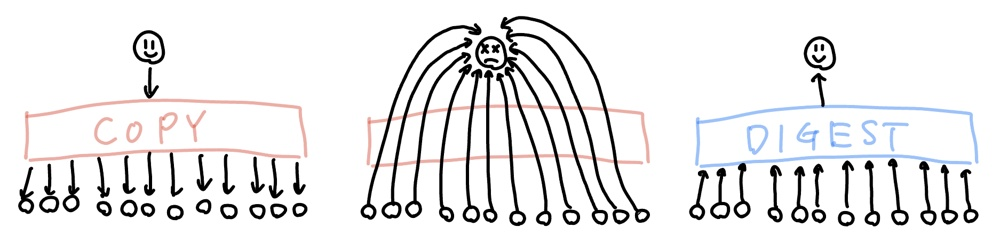

# 第1章 ブロードリスニングとは何か？

@tokorotenが書く

## ブロードリスニングとは何か？

本書は2024年から2025年の選挙活動や政治活動において新しく登場した「ブロードリスニング」という概念について解説していきます。

ブロードリスニングとは、デジタル民主主義の一連の流れの中で生まれてきた一つの考え方であり、いきなりポッと出てきたテクニカルタームというわけではありません。デジタル民主主義とブロードリスニングの関係性については3章で詳しく解説します。

ブロードリスニング（Broad listening）はブロードキャスト（Broadcast）と対になることで生まれた言葉です。ブロードキャストは、当初は畑に広く種蒔きをするという言葉でしたが、現代では、ラジオやテレビなどの放送によって情報を広く届けることを意味する言葉になっています。

## ブロードリスニングの日本での広まり

2024年4月、ブロードリスニングという言葉が日本で広がりました。
安野貴博が東京都知事選に出馬する際にああだこうだ

https://takahiroanno.com/directvote
https://note.com/nishiohirokazu/n/n15a60978113d

この言葉は Andrew Trask† のことばでああだこうだ
† DeepMind のシニアリサーチサイエンティスト、OpenMined の設立者

ブロードリスニングそのものの歴史は10章で行う

ブロードリスニングは

## ブロードリスニングの大まかな歴史

詳細は10章で語る。

アラブの春→ウォール街占拠→ひまわり学生運動→vTaiwan

## 2022年11月の革命、ChatGPT、意味を理解するAIの登場

ブロードリスニングは、Andrew Traskの提唱と、西尾の書いた絵によって完成した。

そして、2022年11月にOpenAIがChatGPTをリリースしたことは、ブロードキャストの歴史における革命的な出来事であった。
この革命は、単に技術的な進歩だけでなく、社会的な影響も大きい。ChatGPTの登場により、情報の収集と分析の方法が劇的に変化し、多くの人々が自分の意見を広く共有し、他者の意見を容易に理解できるようになった。
みたいな話を書いていく

memo:
https://openmined.org/blog/what-is-broad-listening/
https://scrapbox.io/nishio/%E3%83%96%E3%83%AD%E3%83%BC%E3%83%89%E3%83%AA%E3%82%B9%E3%83%8B%E3%83%B3%E3%82%B0

## 広義のブロードリスニング

## 狭義のブロードリスニング
Talk To The Cityと広聴AI

## Talk To The Cityや広聴AIで見えてくるインサイト
見落としが分かるよ

## 様々なブロードリスニング
西尾のかいた例の図を入れる

https://scrapbox.io/nishio/%E3%83%96%E3%83%AD%E3%83%BC%E3%83%89%E3%83%AA%E3%82%B9%E3%83%8B%E3%83%B3%E3%82%B0%E3%81%AE4%E3%81%A4%E3%81%AE%E3%83%87%E3%83%BC%E3%82%BF%E5%9E%8B

この本ではTTTC、広聴AIを対象とするよ

いどばた、熟議、polis、Jigsaw、などはそれぞれ異なるアプローチや技術を持っているけれど、共通して「広く聴く」ことを目指しているんだ。
