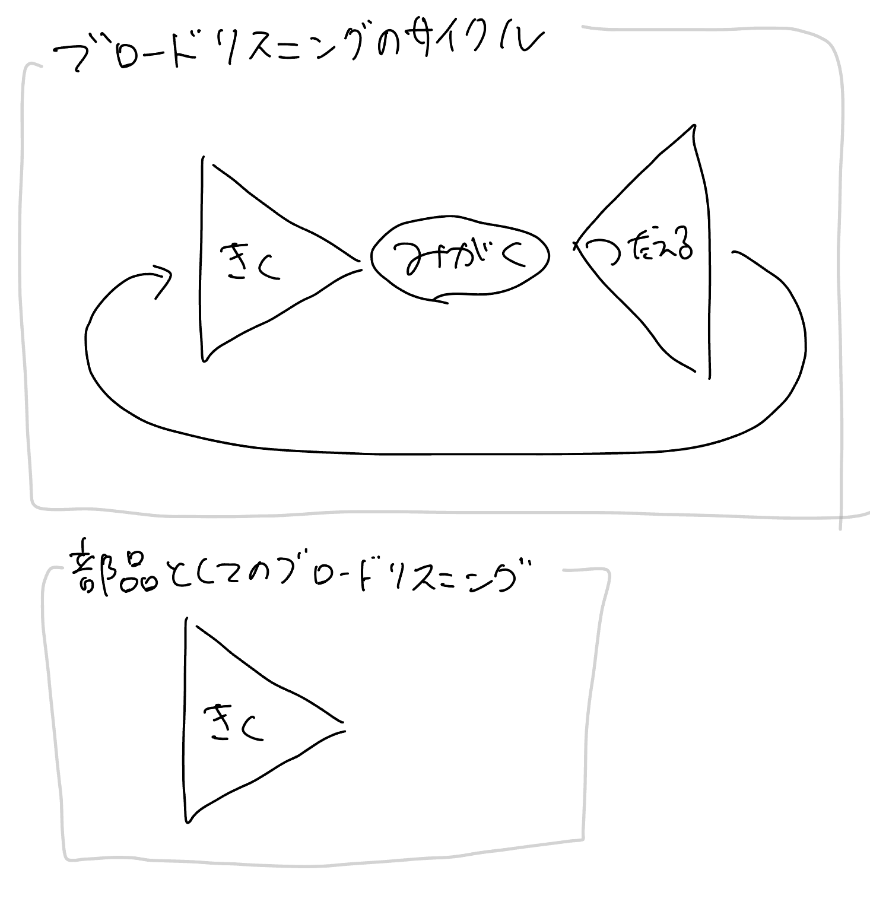
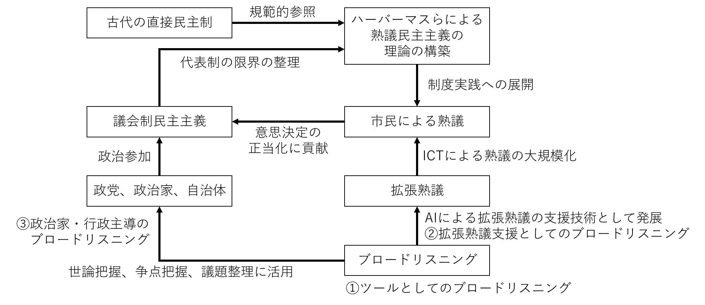
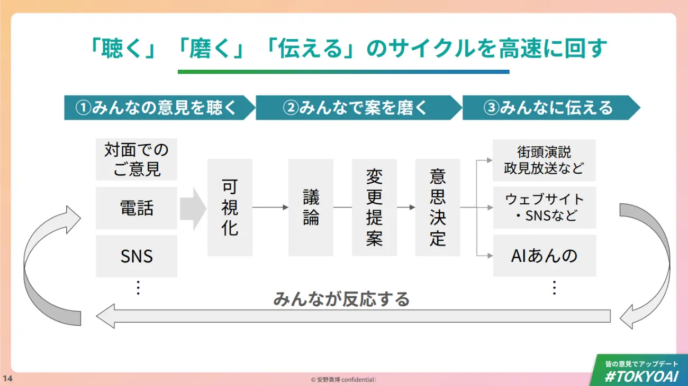

# 第1章 ブロードリスニングとは何か？

文責：@tokoroten

## 本書の目的

本書は、2024年から2025年にかけて日本の選挙や行政の現場で実践されてきた「ブロードリスニング」について解説します。序文で安野貴博が述べたように、ブロードリスニングはまだ産声を上げたばかりの技術であり、実践的活動です。本書では、その概念から技術的な仕組み、そして実際の活用事例までを体系的にまとめることで、読者がブロードリスニングを理解し、自ら実践できるようになることを目指します。

本書は、以下のような読者を想定しています。

- **行政職員・政策立案者**：市民の声をどう集め、どう政策に反映させるかに関心がある人
- **政治家・選挙関係者**：有権者との新しいコミュニケーション手法を模索している人
- **ブロードリスニングを推進する政党の党員**：支持政党が何をやっているのかを理解したい人
- **社会学・政治学を学ぶ学生や研究者**：民主主義や市民参加の新しい形態について学びたい人
- **市民**：社会参加の新しい形として、デジタル民主主義に関心がある人
- **エンジニア・データサイエンティスト**：ブロードリスニングを支える技術を理解し、実装したい人

## ブロードリスニングとは

### 「深さ」と「規模」のトレードオフ

民主主義には根本的なジレンマがあります。深い対話を重視すれば少人数に限られ、多くの人の参加を重視すれば対話は浅くなるというトレードオフです。

具体例で考えてみましょう。100万人の住民がいる都市で「まちづくりについて住民の意見を聴きたい」とします。

**選択肢A：深く聴く**
10人の住民と、各1時間ずつじっくり対話する。一人ひとりの思いや背景まで深く理解できる。しかし、100万人のうちたった10人。「うちの近所には公園がほしい」という声が、全体の意見なのか、たまたまその10人の意見なのか分からない。

**選択肢B：広く聴く**
100万人全員にアンケートを送り、「公園は必要ですか？ はい/いいえ」と聞く。統計的な代表性はある。しかし、「なぜ公園がほしいのか」「どんな公園を望んでいるのか」「そもそも公園より優先すべきことがあるのでは」といった文脈は分からない。

これが「深さと規模のトレードオフ」です。このトレードオフを乗り越える試みがブロードリスニングですが、そのアプローチは一つではありません。不特定多数から広く浅く集める方法もあれば、専門家や当事者に深く聞く方法もあります。本書では主に前者を中心に解説しますが、後者の事例についても適宜紹介します（序文および3章参照）。

オードリー・タンらが執筆した書籍『Plurality』では、ノーベル経済学賞受賞者ハーバート・サイモンの言葉を引いてこの問題を表現しています。

> 「情報の豊かさは、注意の貧困を生じさせる」

一人の人間が思慮深く消化できる視点の数には限りがあります。30人の議論でさえ、すべての参加者の意見を深く理解することは容易ではありません。ましてや数千人、数万人の声を「聴く」ことは、従来は不可能でした。

### ブロードリスニング：大勢の声を聴く技術

書籍『Plurality』では、このトレードオフを乗り越える方法として「ブロードリスニング」を位置づけています。

> 「統計学の進歩（多くの場合AIと関連）がブロードリスニングを可能にし、数百万人もの人々がそれぞれの意見から抽出された本質的な主張に目を向けることができる。この技術により、スケールの大きな民主的な熟議が可能になる」

ブロードリスニング（Broad Listening）は、ブロードキャスト（Broadcast）の対義語です。ブロードキャストが「一人が大勢に語りかける」技術（ラジオやテレビなどのマスメディア）であるのに対し、ブロードリスニングは「大勢の声を聴き、その集合知を理解可能な形に統合する」技術です。

## ブロードリスニングは「部品」か「サイクル」か

ブロードリスニングという言葉は、AIによる意見の構造化・可視化ツール（部品）を指す場合と、それを組み込んだ拡張熟議サイクル全体を指す場合の両方で使われます。

この図の上半分は「拡張熟議のサイクル」、下半分は「部品としてのブロードリスニングツール」を示しています。では、なぜ同じ「ブロードリスニング」という言葉が、部品とサイクルの両方を指すようになったのでしょうか。

### ブロードリスニングツール：汎用的な「部品」

下の図は、本書の共著者の一人である西尾泰和が2023年に発表した記事で示したものです。LLM（ChatGPT）の登場によって知的生産活動や組織構造、社会構造が変化すると予測した記事の中で、Pluralityにおける「ブロードリスニング」を引き合いに出し、AIが間に挟まることで情報要約が行われ、個人や組織における聞く力が強化されるだろうと述べました。

[^1]

[^1]: 西尾泰和「主観か客観かではなく，一人の主観から大勢の主観へ─ AI を活用した知識共創＝個々の視点を統合する─」情報処理 Vol.64 No.9, pp.e23 (Sep. 2023) https://ipsj.ixsq.nii.ac.jp/records/227307

この図はブロードリスニングを説明する際の定番となり、多くの場所で引用されました。しかし、その結果として「ブロードリスニング＝この図」という誤解も生まれました。たとえば「この図のどこにPolisが入るのですか？」という質問を受けることがあります。Polisは意見収集と可視化を同時に行うツールですが、この図は「AIによる情報要約」という一側面しか表現していないため、うまく当てはまりません。この図が示しているのは、あくまで「部品としてのブロードリスニングツール」なのです。

ブロードリスニングツールとは、大量の意見をAIで集約・構造化・可視化する「部品」としての技術です。部品である以上、様々な用途に使うことができます。

- **選挙での政策立案**：候補者が有権者の声を理解し、政策に反映させる
- **自治体の広聴業務**：パブリックコメントや市民意見を整理・分析する
- **企業のマーケティング**：顧客の声やSNS上の意見を構造化する
- **メディアの世論可視化**：選挙報道などで多様な意見を俯瞰的に見せる
- **NPOのステークホルダー分析**：支援対象者や関係者の声を把握する

このように、ブロードリスニングツールは特定の文脈に縛られない汎用的な技術です。

これに該当するツールは次の通りです。

| ツール名 | 概要 |
|----------|------|
| Talk to the City（TTTC） | AI Objectives Instituteが開発したオープンソースツール。大量の自然文をLLMでクラスタリングし、散布図として可視化する |
| 広聴AI | デジタル民主主義2030が開発した日本語特化のブロードリスニングツール。TTTCをベースとして開発され、ウェブシステム化することでプログラミングスキルが無くても利用可能にした |
| Sensemaker | Google Jigsawが開発したオープンソースツール。Geminiを活用し、大規模な意見をトピック分類・要約して合意点と対立点を抽出する |
| AffinityBubble | 韓国pxdAXが開発したツール。大量の定性データをAIで分析し、階層的ボロノイツリーマップで可視化する |
| Embedding Atlas | Appleが開発したオープンソースの可視化ツール。大規模なEmbeddingデータを2次元に射影し、自動クラスタリング・ラベリングでインタラクティブに探索できる |
| Nomic Atlas | Nomic AIが開発したクラウドベースの可視化プラットフォーム。大規模なテキストデータをEmbeddingで2次元に射影し、インタラクティブに探索できる |

本書では、主にTTTCと広聴AIを例に、ブロードリスニングツールの技術的仕組みと活用事例を解説していきますが、他のツールについても適宜言及します。なお、Embedding（文章を数値ベクトルに変換する技術）などの要素技術の詳細については12章で、実装方法については13章で解説します。

### 拡張熟議：ブロードリスニングツールをサイクルに組み込む

ブロードリスニングツールは「大勢の声をAIで集約・構造化・可視化する」汎用的な部品です。では、なぜこの部品が「ブロードリスニング」という独立した概念として注目されるようになったのでしょうか。

それは、この部品の特に重要な使い方の一つとして、「拡張熟議（augmented deliberation）」のサイクルに組み込むという実践が成功を収めたからです（拡張熟議の実践的な運用については3章で詳しく解説します）。台湾のg0vやvTaiwanでの実践、日本での安野貴博氏の都知事選での活用など、民主主義の文脈でブロードリスニングが注目を集めた結果、「ブロードリスニング」という言葉が部品そのものとサイクル全体の両方を指すようになりました。

書籍Pluralityでは、ブロードリスニングを「拡張熟議」を実現するための方法論として位置づけています。そのため、拡張熟議を理解するには、まず「熟議民主主義」という概念を知る必要があります。

熟議民主主義（deliberative democracy）とは、市民が十分な情報と時間を与えられた上で、対話と議論を通じて合意形成を目指す民主主義の形態です。ドイツの哲学者ユルゲン・ハーバーマスらが1980〜90年代に理論的基盤を整備し、「コミュニケーション的合理性」や「公共圏」の概念によって、単なる多数決を超えた民主主義の姿を描きました。単なる多数決ではなく、参加者が互いの意見を聴き、理由を述べ合い、時には自分の考えを変えながら、より良い結論に到達することを重視します。具体的には以下の特徴があります。

- **双方向の対話**：一方的な意見表明ではなく、相互に聴き合う
- **理由の提示**：「賛成/反対」だけでなく「なぜそう考えるか」を共有する
- **選好の変容**：議論を通じて参加者の意見が変わりうる
- **合意形成の志向**：対立の解消や共通点の発見を目指す

しかし、熟議民主主義には本質的な限界があります。深い対話には時間がかかり、一度に参加できる人数に限りがあるのです。10人の議論なら成立しても、1000人では発言機会すら確保できません。人数がn人になると平均発言時間は1/nになるのです。これが冒頭で述べた「深さと規模のトレードオフ」です。

この限界を乗り越えようと、インターネットなどの情報通信技術を活用して熟議を大規模化する試みが生まれました。これが「拡張熟議」です。従来は少人数でしか成立しなかった熟議を、**規模・頻度・形式の3つの側面から拡張**します。数千人・数万人規模での議論（規模の拡張）、年1回ではなく継続的な熟議（頻度の拡張）、対面だけでなくオンラインやテキストでの同期・非同期の議論（形式の拡張）を可能にします。そして、AIの登場によって拡張熟議をさらに大規模化する技術として誕生したのがブロードリスニングです。

ただし、ブロードリスニングの活用形態は完全な拡張熟議サイクルだけではありません。ここで、海外と日本の広がり方の違いに着目すると、両者のアプローチには顕著な差異が見られます。

台湾のvTaiwanやPolisを用いた市民参加プロセスは、市民同士が主体となって議論し合う「市民熟議型」として発展しました。オンライン意見集約ツールのPolisで幅広い意見を収集しつつ、ビデオ会議やオンラインフォーラムで市民が直接対話し、議論の結果をウェブ上でリアルタイムに可視化するなど、様々なITツールを組み合わせることでオンライン上に大規模な市民参加の場が生まれました。政府はあくまでプロセスのファシリテーターに徹し、市民が自律的に合意形成を進めるという拡張熟議の本来の姿に近い使われ方です。

一方、日本では「政治家主導型」の活用が先行しました。2024年の東京都知事選で安野貴博氏が市民の声の収集・分析に活用したことをきっかけに、政党や自治体が多様な市民の意見を収集・分析して政策立案に活かすスタイルが急速に広がったのです。国民民主党も独自のプロセスで支持者の声を政策に反映させています。市民同士が直接議論し合う拡張熟議とは形態が異なりますが、政治家が能動的に市民の声を聴いて応答するこのスタイルは熟議民主主義の精神に沿うものです。詳細は4章以降の事例編で解説します。

本章の図の上半分を改めて見てください。「きく」「みがく」「つたえる」という3つの要素が循環しています。これが拡張熟議のサイクルです。このサイクルが回ることで、意見を聞いて終わりではなく、分析結果を伝え、それがまた新たな意見収集につながる継続的な対話のループが生まれます。

たとえば安野貴博は自身の政策プロセスについて次のような図を示しています。

TODO: この図をブラッシュアップする https://codezine.jp/article/detail/21308

拡張熟議を支援するツールとしては、以下のようなものがあります。

| ツール名 | 概要 |
|----------|------|
| Polis | 台湾のvTaiwanで活用された意見集約ツール。参加者が意見を投稿し、他者の意見に賛成・反対・パスで投票する。投票パターンから意見グループを可視化し、グループ間の合意点を発見できる |
| JOIN | 台湾政府が運営する行政プラットフォーム。市民が政策提案を投稿し、60日以内に5,000人の賛同を得ると関連省庁が2ヶ月以内に回答する義務が生じる。2023年12月時点で登録者約129万人、累計訪問者数は約1,000万人を超える[^3] |
| Decidim | バルセロナ市が開発したオープンソースの市民参加プラットフォーム。市民提案、参加型予算、公開討論、市民発議など多機能を統合。世界中の都市や組織で採用されている |
| Loomio | ニュージーランド発のオープンソース熟議ツール。グループでの議論、提案、投票を一つのプラットフォームで行える。協同組合や自治体での意思決定に活用されている |
| Consider.it | 賛否両論を可視化する熟議ツール。参加者が意見をスライダーで表明し、賛成・反対それぞれの理由を書き込む。論点ごとに賛否の分布と理由が一覧できる |
| All Our Ideas | プリンストン大学が開発したオープンソースの意見収集ツール。二択の比較投票を繰り返すことで、多数の選択肢に対する集団の優先順位を効率的に把握できる |
| Stanford Online Deliberation Platform | スタンフォード大学が開発したビデオ討議プラットフォーム。AIによる自動モデレーターが発言機会の公平性を確保し、8〜15人の小グループでの構造化された熟議を支援する。50カ国以上で120以上の熟議を実施 |
| いどばた | デジタル民主主義2030が開発した日本語対応の熟議プラットフォーム。台湾のvTaiwanを参考に、AIを活用した意見整理・可視化機能を備え、大規模な市民参加型の政策議論を支援する |
| D-Agree | AGREEBIT社が開発したオンラインAI議論システム。AIとマルチエージェント技術を活用し、議論のファシリテーションや合意形成を支援する |
| Liqlid | Liquitous社が開発した市民参加プラットフォーム。AIによるコメントフィルタリングやクラスタリング機能を備え、日本国内の自治体に導入されている |

なお、これらのツールは機能面から見ると、大量テキスト分析、同期型討議支援、合意点発見、プロセス管理など、複数の軸で分類できます。実際のプロジェクトでは複数のツールを組み合わせて使うことが多く、その使い分けについては3章で詳しく解説します。

拡張熟議の実践的な運用方法については3章で詳しく解説します。海外での活用事例については10章で紹介します。

[^3]: 柏村祐「台湾行政プラットフォーム『ジョイン』の衝撃」第一生命経済研究所 https://www.dlri.co.jp/report/ld/159658.html および JOIN公式サイト https://join.gov.tw/

### 本書の目的：Pluralityの水割り

なお、書籍Pluralityにおいて「拡張熟議」の章はわずか19ページであり、「ブロードリスニング」という語はその章の中で3回しか登場しません[^2]。同章の中では、Talk to The Cityと2024年の東京都知事選における安野貴博の活動を例として挙げるにとどまっており、ブロードリスニングとは何かについての詳細な説明はありません。また、同書は極めて濃密であり、その内容を理解するには多大な前提知識を要します。

そのため、本書では改めてブロードリスニングの全体像を整理し、また2024年から2025年において日本で行われたブロードリスニングの実例を紹介することで、実例をもってブロードリスニングを理解できるようにしたいと考えています。

砕けた言い方をすると「Pluralityは天才たちの脳内で長年熟成された知的ウィスキーの原液であり、度数が強すぎて一般人には飲めない代物なので、水割りを作ろう」です。

[^2]: Plurality Book 拡張熟議の章（日本語版） https://www.plurality.net/v/chapters/5-4/jpn/

## なぜ「今」ブロードリスニングなのか

多くの人々の声を集めて意思決定に活かすという発想は以前から存在しましたが、「ブロードリスニング」が現実的な手法として注目されるようになったのは2020年代に入ってからです。インターネットの普及によってPolisのような拡張熟議ツールや、それを活用したvTaiwanのような取り組みはすでに存在していました。しかし、自由記述のテキストを大規模に読み解き構造化するという作業には、依然として多大な人手がかかっていました。ブロードリスニングは、単にAIが賢くなったから可能になったのではありません。以下の技術が同時期に成熟し、組み合わさったことで初めて実現しました。

- **Sentence-BERT**（2019年）：文章の意味をベクトル（数値の配列）に変換する技術
- **UMAP**（2018年）：高次元データを低次元（通常は2次元または3次元）に圧縮して可視化する技術
- **LLM**（2020年〜）：大量のテキストを理解し、要約・生成する技術

特に2022年11月にOpenAIがChatGPTを公開したことは、自然言語処理の歴史における転換点となりました。それまでコンピュータが苦手としていた「大量の自然言語を読み、理解し、構造化する」という作業が、現実的なコストと時間で可能になったのです。本書で中心的に取り扱うTalk to the Cityや広聴AIは、このChatGPTのAPIを活用して開発されました。数千、数万件の意見を集め、それをクラスタリングし、要約し、可視化するといった処理が、専門家チームを何ヶ月も動員せずとも実行できるようになったのです。

つまりブロードリスニングは、技術的に「やっと可能になった」ばかりの新しい手法です。LLMによってオープンクエッションの大規模解析がどのように実現されたかについては、2章で詳しく解説します。本書では2024年から2025年にかけての日本での実践例を中心に解説し、読者が最新のブロードリスニングを理解できるようにします。「最先端の技術が実際にどう使われているのか知りたい」というプログラマにとっても、本書は格好の題材となるでしょう。12章と13章では、これらの技術がどのように組み合わされて広聴AIを構成しているかを解説します。

## 本書の構成

本書は、以下の構成でブロードリスニングを解説します。

**第1部：概念編（1〜3章）**
- 第1章：ブロードリスニングとは何か（本章）
- 第2章：ブロードリスニングとアンケートの違い、定量分析から定性分析へ
- 第3章：デジタル民主主義とブロードリスニング、新しい民意の届け方

**第2部：事例編（4〜11章）**
- 第4章：日本国内におけるブロードリスニングの広がり
- 第5章：東京都、シン東京2050、ブロードリスニングによる政策転換
- 第6章：2025年参院選での活用事例
- 第7章：DD2030による広聴AIの開発活動
- 第8章：地方選挙・地方自治体での活用事例
- 第9章：企業・NPOでの活用
- 第10章：海外におけるブロードリスニング
- 第11章：支援組織

**第3部：技術編（12〜13章）**
- 第12章：広聴AIの要素技術解説
- 第13章：広聴AIの実装

読者の関心に応じて、以下のような読み方を推奨します。

- **概念を理解したい人**：1〜3章を読み、必要に応じて事例編へ
- **活用事例を知りたい人**：4〜11章を読み、技術的な疑問が生じたら技術編へ
- **実装に興味がある人**：12〜13章を中心に、必要に応じて概念編を参照

## 本書で扱う範囲

ブロードリスニングには様々なアプローチがあります。本書では、Talk to the City（TTTC）とそこから発展した「広聴AI」を中心に解説を行います。

Polis、いどばた、Jigsaw Sensemakerなど、他のツールについても必要に応じて言及しますが、本書の主軸はTTTCと広聴AIです。これらのツールを深く理解することで、ブロードリスニング全般に通じる考え方を身につけることができるでしょう。

## 次章への案内

本章では、ブロードリスニングの全体像（ツールとしてのブロードリスニング、拡張熟議サイクル、関連ツール、技術的背景）を紹介しました。続く2章と3章では、それぞれの側面について深掘りしていきます。

**第2章：ブロードリスニングとアンケートの違い、定量分析から定性分析へ**

「ブロードリスニングで集めた意見は、世論調査のように使えるのか？」という問いに答えます。AIによる意見の構造化・可視化という技術について、オープンクエッションとクローズドクエッション、定性分析と定量分析、代表性の有無といった観点から、その特性と限界を明らかにします。定性分析と定量分析を適切に組み合わせることで、多様な声を聴きつつ代表性を担保する方法を解説します。

**第3章：デジタル民主主義とブロードリスニング、新しい民意の届け方**

「なぜ今この技術が必要なのか？どう運用すればよいのか？」という問いに答えます。ブロードリスニングツールを組み込んだ拡張熟議について、選挙サイクルの限界、既存手段とのギャップ、運用フローの設計など、実際に活用する際の考え方を解説します。
