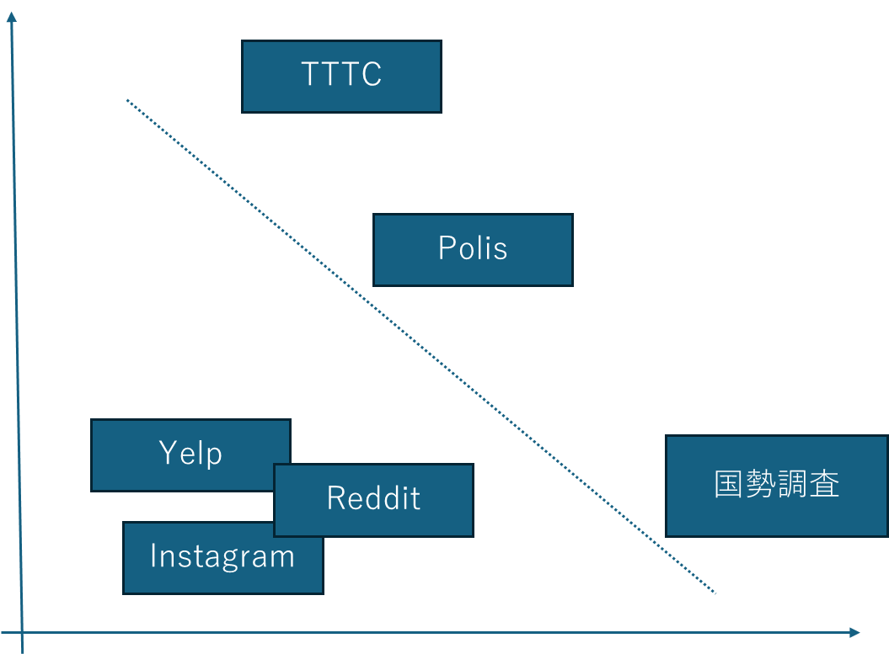

# 第1章 ブロードリスニングとは何か？

文責：@tokoroten

## 1.1 本書の目的

本書は、2024年から2025年にかけて日本の選挙や行政の現場で実践されてきた「ブロードリスニング」について解説します。序文で安野貴博が述べたように、ブロードリスニングはまだ産声を上げたばかりの技術であり、実践です。本書では、その概念から技術的な仕組み、そして実際の活用事例までを体系的にまとめることで、読者がブロードリスニングを理解し、自ら実践できるようになることを目指します。

本書は、以下のような読者を想定しています。

- **行政職員・政策立案者**：市民の声をどう集め、どう政策に反映させるかに関心がある人
- **エンジニア・データサイエンティスト**：ブロードリスニングを支える技術を理解し、実装したい人
- **政治家・選挙関係者**：有権者との新しいコミュニケーション手法を模索している人
- **社会学・政治学を学ぶ学生**：民主主義や市民参加の新しい形態について学びたい人
- **市民・研究者**：デジタル民主主義の最前線で何が起きているかを知りたい人

## 1.2 ブロードリスニングとは

ブロードリスニング（Broad Listening）は、ブロードキャスト（Broadcast）の対義語として生まれた言葉です。

ブロードキャストは、もともと畑に種を広く蒔くという意味でしたが、現代ではラジオやテレビなどの放送を通じて、一人の発信者が多数の受信者に情報を届けることを指します。私たちが慣れ親しんだマスメディアは、この「広く届ける」技術の上に成り立っています。

ブロードリスニングは、その逆です。多数の人々から声を集め、それを理解可能な形に構造化する技術と実践を指します。

この言葉の起源についてはしばしば誤解があります。台湾でブロードリスニングを実践したオードリー・タンが生みの親だと思われがちですが、彼女らの著書『Plurality』ではそれを否定しており、現在ではOpenMinedの創設者であるAndrew Traskが提唱者とされています。

Andrew Traskはブログ記事の中で、ブロードリスニングを次のように定義しています。

https://openmined.org/blog/what-is-broad-listening/

> ブロードリスニングとはブロードキャストの対極である。ブロードキャストが何百万人もの人々に語りかける能力であるのに対し、ブロードリスニングは何百万人もの人々から聴き取り、彼らの集合知を共有された一つの声へと統合する能力である。
>
> "Broad listening is the opposite of broadcasting. While broadcasting is the ability to speak to millions of people, broad listening is the ability to hear from millions and synthesize their collective wisdom into a shared voice."

## 1.3 強いブロードリスニングと弱いブロードリスニング

Andrew Traskは、ブロードリスニングには「強い例」と「弱い例」があると述べています。

**強い例**
- Talk to the City：大規模に集められた意見を分類、クラスタリング、可視化するサービス
- pol.is：個人の意見を投票によって集め、意見集団の構造を可視化するサービス。台湾の行政改革に活用された
- 米国国勢調査：10年に一度の大規模調査。選挙区の区割りなどに使われる

**弱い例**
- Yelp：レストランやカフェの口コミ評価サービス
- Reddit：テーマごとに分かれた大規模掲示板
- Instagramのコメント欄

この分類は、一見すると理解が難しいかもしれません。100年以上の歴史を持つ国勢調査と、最先端のAIツールであるTalk to the Cityが同じ「強い例」に分類されているからです。

両者を分ける基準は何でしょうか。Traskによれば、強いブロードリスニングには以下の特徴があります。

- 迅速でインタラクティブな対話が可能
- 多様な視点を体系的に統合・合成できる
- プライバシーを保護しながら認証された回答を得られる
- 代表性のある意見を集められる（偏りが少ない）

一方、弱いブロードリスニングには以下の問題があります。

- 声の大きい一部の人（例：レビューを書く5%の人）しか聞けない
- 情報過多で処理しきれない
- 真偽の検証が困難（フェイクレビュー、ステルスマーケティングなど）
- プライバシーの懸念から本音が共有されない

筆者（中山）は、この「強い/弱い」の違いを「データの規模と代表性」と「意見の深さ」という2つの軸で整理しました。

図の右上（規模が大きく代表性があり、かつ意見の深さもある領域）が「強いブロードリスニング」です。従来、この領域に到達することは困難でした。規模を追求すればアンケートのような浅い情報しか得られず、深さを追求すれば少人数のインタビューに限られます。このトレードオフを技術によって乗り越えようとするのが、ブロードリスニングの挑戦の一端です。

このトレードオフの詳細については、2章で解説します。

## 1.4 狭義のブロードリスニングと広義のブロードリスニング

ブロードリスニングには、「狭義」と「広義」の2つの捉え方があります。

### 狭義のブロードリスニング

下の図は、本書の共著者の一人である西尾泰和が2023年に発表した記事で示したものです。LLM（ChatGPT）の登場によって知的生産活動や組織構造、社会構造が変化すると予測した記事の中で、Pluralityにおける「ブロードリスニング」を引き合いに出し、AIが間に挟まることで情報削減が行われ、組織における聞く力が強化されるだろうと述べました。

https://ipsj.ixsq.nii.ac.jp/record/227309/files/IPSJ-O-MGN640901.pdf

この図はブロードリスニングを説明する際の定番となりましたが、その結果「ブロードリスニング＝この図」という誤解も生まれました。実際には、この図が示すAIによる情報集約は「狭義のブロードリスニング」です。大量の意見をAIが構造化・要約し、意思決定者が理解できる形に整理する——これが狭義のブロードリスニングの役割です。

### 広義のブロードリスニング：拡張熟議

書籍Pluralityでは、「ブロードリスニング」は「拡張熟議（augmented deliberation）」を実現するための方法論として位置づけられています。

「拡張熟議」とは、デジタル技術を活用して、従来は少人数でしか成立しなかった熟議（深い対話と相互理解に基づく合意形成）を、大規模な人数でも実現可能にする取り組みのことです。この「拡張熟議」こそが、広義のブロードリスニングに相当します。

拡張熟議は、「意見収集→構造化・可視化→熟議→意思決定→実行→フィードバック」というサイクルで構成されます。このうち、狭義のブロードリスニング（AIによる情報集約）が担うのは「意見収集→構造化・可視化」の部分です。集められた意見を人間が理解できる形に整理し、どのような意見がどれくらいあるのかを見える化します。その後の熟議や意思決定は人間が行うプロセスであり、ブロードリスニングはそのための土台を提供します。

たとえば安野貴博は自身の政策プロセスについて次のような図を示しています。狭義のブロードリスニングはこの図における「みんなの意見を聴く」に相当します。

TODO: この図をブラッシュアップする https://codezine.jp/article/detail/21308

広義のブロードリスニング（拡張熟議）については、10章で改めて解説します。

### Pluralityにおけるブロードリスニングの位置づけ

なお、書籍Pluralityにおいて「拡張熟議」はわずか5ページ程度しか触れられておらず、「ブロードリスニング」という語は本文中に3回しか登場しません。また、Talk to The Cityと2024年の東京都知事選における安野貴博の活動を例として挙げるにとどまっており、ブロードリスニングとは何かについての詳細な説明はありません。同書は極めて濃密であり、その内容を理解するには多大な前提知識を要します。

そのため、本書では改めてブロードリスニングの全体像を整理し、また2024年から2025年において日本で行われたブロードリスニングの実例を紹介することで、実例をもってブロードリスニングを理解できるようにしたいと考えています。

砕けた言い方をすると「Pluralityは原液すぎて飲めないので、水割りを作ろう」です。

TODO:ページ数を確認して正確な数字にする

## 1.5 なぜ「今」ブロードリスニングなのか

ブロードリスニングという概念自体は以前から存在しましたが、それが現実的な手法として注目されるようになったのは2020年代に入ってからです。その背景には、大規模言語モデル（LLM）の急速な発展があります。

2022年11月、OpenAIがChatGPTを公開しました。この出来事は、自然言語処理の歴史における転換点となりました。それまでコンピュータが苦手としていた「大量の自然言語を読み、理解し、構造化する」という作業が、現実的なコストと時間で可能になったのです。

Talk to the Cityは、このChatGPTのAPIを活用して開発されたツールの一つです。数千、数万件の意見を集め、それをクラスタリングし、要約し、可視化する——こうした処理が、専門家チームを何ヶ月も動員せずとも実行できるようになりました。

技術的な詳細は11章で解説しますが、ここでは一点だけ強調しておきたいと思います。ブロードリスニングは、単にAIが賢くなったから可能になったのではありません。以下の技術が同時期に成熟し、組み合わさったことで初めて実現しました。

- **BERT**（2018年）：文章の意味をベクトル（数値の配列）に変換する技術
- **UMAP**（2018年）：高次元データを2次元に圧縮して可視化する技術
- **LLM**（2020年〜）：大量のテキストを理解し、要約・生成する技術

これらの技術が出揃ったのは、ほんの数年前のことです。つまりブロードリスニングは、技術的に「やっと可能になった」ばかりの新しい手法なのです。

## 1.6 本書の構成

本書は、以下の構成でブロードリスニングを解説します。

**第1部：概念編（1〜4章）**
- 第1章：ブロードリスニングとは何か（本章）
- 第2章：ブロードリスニングとアンケートの違い——定量分析から定性分析へ
- 第3章：デジタル民主主義とブロードリスニング、新しい民意の届け方
- 第4章：DD2030による広聴AIの開発活動

**第2部：事例編（5〜9章）**
- 第5章：東京都知事選2024における実践
- 第6章：東京都、シン東京2050、ブロードリスニングによる政策転換
- 第7章：2025年参院選での活用事例
- 第8章：地方選挙・地方自治体での活用事例
- 第9章：企業・NPOでの活用
- 第10章：TODO:あとで書き換える

**第3部：技術編（10〜13章）**
- 第11章：広聴AIの要素技術解説
- 第12章：広聴AIの実装
- 第13章：ブロードリスニングの未来

読者の関心に応じて、以下のような読み方を推奨します。

- **概念を理解したい人**：1〜4章を読み、必要に応じて事例編へ
- **実装に興味がある人**：11〜12章を中心に、必要に応じて概念編を参照
- **活用事例を知りたい人**：5〜9章を読み、技術的な疑問が生じたら技術編へ

## 1.7 本書で扱う範囲

ブロードリスニングには様々なアプローチがあります。本書では、Talk to the City（TTTC）とそこから発展した「広聴AI」を中心に解説を行います。

pol.is、いどばた、Jigsawなど、他のツールについても必要に応じて言及しますが、本書の主軸はTTTCと広聴AIです。これらのツールを深く理解することで、ブロードリスニング全般に通じる考え方を身につけることができるでしょう。
