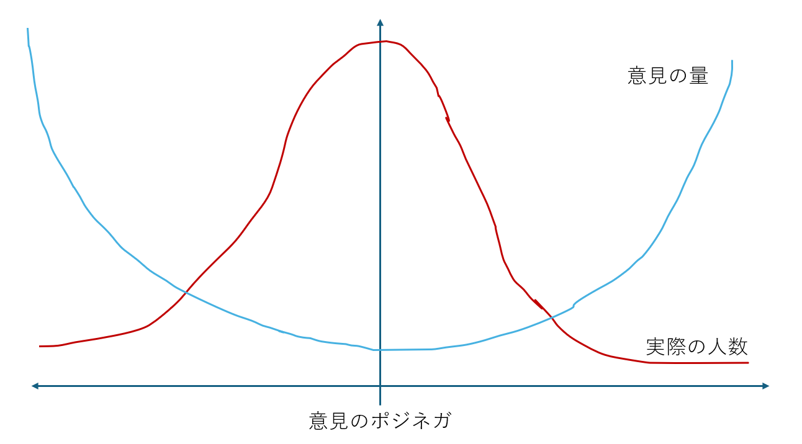

# 第2章 ブロードリスニングとアンケートの違い、定量分析から定性分析へ

文責：@tokoroten

## クローズドクエッションとオープンクエッションの違い

前章で述べたように、ブロードリスニングは「規模を追求すれば意見の深さが犠牲になり、深さを追求すれば規模が限られる」というトレードオフを乗り越えようとする試みです。本章では、このトレードオフがなぜ生じるのかを、クローズドクエッションとオープンクエッションの違いから解き明かします。

なお、本章で扱うのは**狭義のブロードリスニング**——AIによる意見の構造化・可視化——の特性です。熟議や意思決定を含む広義のブロードリスニング（拡張熟議）については、3章で解説します。

ブロードリスニングが従来のアンケートと比べて優れているのは、オープンクエッションを対象に解析・調査が行えるということにあります。

従来のアンケートは「○○についてどう思いますか？」という質問に対して「強く賛成」「賛成」「わからない」「反対」「強く反対」といった、限られた選択肢の中から回答させるというものでした。このような形態の質問をクローズドクエッションといいます。

一方でブロードリスニングでは、前述のクローズドクエッションだけでなく「○○についてご意見をお聞かせください」といった自由回答を対象として取り扱うことが可能です。このような自由回答は、実質的に無限の選択肢から回答を行わせるものであり、このようなものをオープンクエッションと言います。

オープンクエッションとクローズドクエッションにはそれぞれ一長一短があります。以下の表にその違いをまとめます。

|  | オープンクエッション | クローズドクエッション |
|:--|:--|:--|
| 質問形態 | 自由記述 | 選択肢 |
| 質問設定 | 回答者が自由に設定 | 事前に課題設定 |
| 回答者の負荷 | 高い | 低い |
| 解析者の負荷 | 高い | 低い |
| 民意の再現性 | 低い | 高い |
| 分析の種類 | 定性分析 | 定量分析 |

クローズドクエッションは回答者の負荷が低いため大量の回答を集めやすく、解析も効率的に行えます。選択肢から選ぶだけなので数秒で回答でき、途中離脱も起きにくくなります。解析する側も、回答が数値データとして得られるため、集計や統計処理を自動化できます。さらに、年齢・性別・職業・居住地・学歴などの属性情報と組み合わせて分析することで、民意の再現性も高まります。

例えば、「30代女性でこの政策に賛成する人は何パーセントか」「都市部と地方で意見の傾向に違いはあるか」といった分析が可能になります。適切なサンプリングを行えば、調査対象者の回答から社会全体の傾向を推定することもできます。つまり、ある考えを持つ人が社会全体にどれくらいいるのか、といった定量的な分析が可能になるのです。

ここで「民意」という言葉を定義しておきましょう。民意という言葉は多様な意味で使われますが、本書における民意とは、代表性のあるデータによって把握される、社会全体の意見分布のことです。無作為抽出によって偏りなくサンプリングされたデータから、「賛成が○○％、反対が△△％」といった形で全体の分布を再現できる——これが民意を測定するということです。クローズドクエッションによる量的調査の目的は、まさにこの民意を知ることにあります。そのため、従来の世論調査や市場調査やアンケートはクローズドクエッションを中心に設計されてきました。

一方で、オープンクエッションの課題は、回答者の負荷が極めて高いことです。自分の考えを文章にまとめるには時間と労力がかかるため、回答の途中で離脱してしまう人が多くなります。そもそも人は、特定のトピックに関して明確な意見を持っていないことが多く、その場合は「わからない」としか答えられないため、有効な回答率が低下します。また、自然文で書かれた回答からインサイトを得るには解析者の負荷も高く、従来の技術では大量のオープンクエッションを解析することは困難でした。

オープンクエッションには大きな利点もあります。回答者は選択肢に縛られず、自分の言葉で考えを表現できるため、調査設計者が想定していなかった視点や論点が浮かび上がることがあります。つまり、オープンクエッションは「何人がそう思っているか」という定量的な結果ではなく、「人々はどのようなことを考えているか」という定性的な結果を得るのに適した手法なのです。

### ブロードリスニングをすれば意見が集まるという誤解

ここで一点、よくある誤解を解いておきます。「ブロードリスニングをすれば、市民からの意見がたくさん集まるはずだ」という勘違いです。これは明確に誤りです。

自由記述アンケートは通常の選択式のアンケートと比べて回答のハードルが高いため、自治体が普通にアンケートを実施しても大した件数は集まりません。本書で紹介する事例では多くの意見が集まっていますが、それはブロードリスニングの力ではありません。

2024年の東京都知事選挙で安野貴博が多くの意見を集めたのは、AIエンジニアとして話題性のある安野貴博がブロードリスニングを行ったからです。6章で紹介する東京都の事例では約2万7000件以上の意見が集まりましたが、これも東京都が大々的に広報活動を行い、市民に参加を呼びかけ、さらにSNS上の意見を収集した結果です。

ブロードリスニングはあくまで「集まった意見を効率的に解析・可視化する」ためのツールであり、「意見を集める」ためのツールではありません。ブロードリスニングを実施するのであれば、どのようにして回答を収集するのか——広報の方法、参加へのインセンティブ設計、既存の市民参加の仕組みとの連携など——というアプローチも含めて検討する必要があります。


## 自由記述がアジェンダ設定の権限を人々に開放する

従来のアンケート調査がクローズドクエッションを中心に設計されてきたのは、前述のとおり、回答者・解析者双方の負荷が低く、定量的な分析が可能だからです。しかし、クローズドクエッションには本質的な限界があります。それは、調査設計者があらかじめ用意した選択肢の中からしか回答を得られないということです。

例えば「この政策に賛成ですか、反対ですか」という質問では、「条件付きで賛成」「別の政策の方がよい」「そもそも問題の立て方が間違っている」といった回答は拾えません。選択肢を設計する時点で、調査設計者の想像力の範囲内に回答が限定されてしまいます。

これは言い換えれば、「何を議題にするか」というアジェンダ設定の権限を、行政や調査設計者が独占してきたということです。従来の世論調査では「何を聞くか」を決めるのは常に政府やマスコミであり、市民は与えられた選択肢の中から選ぶことしかできませんでした。市民が本当に気にしていること、困っていることがあっても、それが選択肢になければ声を上げる手段がなかったのです。

台湾のデジタル担当大臣を務めたオードリー・タンは、この問題に対するブロードリスニングの意義を民主主義の進化を語るインタビューで次のように表現しています。

> "If we open the agenda-setting power up to the crowd, we can reflect back to people what they agree or disagree on. Public servants no longer have exclusive ownership of the agenda."
> （アジェンダ設定の権限を人々に開放すれば、行政は市民が何に賛成し何に反対しているのかを知ることができる。もはや行政だけが議題を決める時代ではない。）

ブロードリスニングが従来のアンケートと異なるのは、オープンクエッションを大規模に扱えるようになった点にあります。自由記述を通じて市民自身が議題を提起でき、「この問題について話し合いたい」「こんなことで困っている」という声を起点に、議論のテーマが形作られていきます。そこから共通するテーマや予想外の論点を抽出することで、調査設計者が見落としていた課題を発見できるようになりました。

「そんなことを気にしている人がいたのか」という発見こそが、ブロードリスニングの醍醐味です。調査する側が思いもよらなかった声を拾い上げることで、より多くの人の関心に応える政策づくりが可能になります。これが「アジェンダ設定の権限を人々に開放する」ということの意味なのです。


## LLMがオープンクエッションの大規模解析を可能にした

オープンクエッションには大きな可能性がある一方で、先の表で述べたとおり「解析者の負荷が高い」という課題がありました。数百件、数千件の自由記述を人間が一つひとつ読み、分類し、共通するテーマを見出す作業は膨大な時間と労力を要します。そのため、オープンクエッションは「集めたはいいが分析しきれない」という状況に陥りがちでした。

この状況を一変させたのが、2022年11月にOpenAI社がリリースしたChatGPTに代表される大規模言語モデル（LLM）です。

ChatGPTというと「AIとおしゃべりするサービス」というイメージを持つ方が多いかもしれません。しかしプログラマの視点から見ると、LLMの本質は「自然言語を入力として受け取り、自然言語を出力するAPI」です。つまり、人間が書いた文章を入力すると、その内容を理解した上で要約したり、分類したり、特定の観点で評価したりした結果を返してくれる、プログラムから呼び出せる部品なのです。

従来、プログラムは文字列を扱えても、その「意味」を理解することはできませんでした。自由記述のテキストを読み、何が書かれているかを判断するのは、人間にしかできない仕事でした。しかしLLMをプログラムの部品として組み込めるようになったことで、プログラミングで解決可能な問題の幅が飛躍的に広がりました。「この意見は何について述べているか」「賛成か反対か」「どんな感情が込められているか」——こうした問いに対して、プログラムが答えを返せるようになったのです。

これをオープンクエッションの解析に応用すると、数千件の自由記述を自動的に処理できるようになります。人間が一件ずつ読む必要がなくなり、解析者の負荷は劇的に下がりました。

TODO: もうちょっと良い例を作成する

具体的にどのようなことができるのか、簡単なコード例で見てみましょう。

```python
from openai import OpenAI
client = OpenAI()

response = client.chat.completions.create(
    model="gpt-4o-mini",
    messages=[{"role": "user", "content": 
        """
        この発言のテーマを単語1語で表して。
        「共働きなのに保育園に入れない！」
        """
        }]
)
print(response.choices[0].message.content)
```

このプログラムを実行すると以下のような応答が返ってきます。

> この発言のテーマを単語1語で表すと、**「待機児童」**です。

このように、国語の問題を解くように、LLMは自由記述から論点を抽出できます。これをループで回せば、数千件の意見も自動処理できます。

ここでは単純な例を示しましたが、実際にはもっと複雑な処理も可能です。複数の意見を比較して共通点を見つけたり、意見をカテゴリ別に分類したり、感情の強さを数値化したりすることもできます。技術的な詳細は11章で解説します。

このように、LLMの登場により、オープンクエッションは「集めるのは簡単だが分析が難しい」ものから「集めることさえできれば分析もできる」ものへと変わったのです。ブロードリスニングという概念が実現可能になった背景には、このLLM技術の進歩があります。

これにより、前章で述べた「規模と深さのトレードオフ」——規模を追求すれば浅い情報しか得られず、深さを追求すれば少人数に限られる——を技術的に乗り越える道が開かれたのです。

### 規模とコストのトレードオフ——国勢調査はなぜ5年に一度なのか

規模と深さのトレードオフに加えて、もう一つ重要な軸があります。それが「コスト」です。

規模と代表性を兼ね備えた調査の代表例が、国勢調査（センサス）です。国勢調査は国民全員を対象とするため、サンプリングの偏りがなく、完全な代表性を持ちます。しかし、そのコストは膨大です。日本では5年に一度、アメリカでは10年に一度しか実施できません。日本の国勢調査は毎回約700億円規模の予算が投じられます。アメリカの2020年国勢調査には約137億ドル（約2兆円）がかかりました。

しかも、これだけのコストをかけても、国勢調査で聞ける内容は限られています。2020年の日本の国勢調査の質問項目は全部で19項目です。世帯員に関する事項として、氏名、男女の別、出生の年月、世帯主との続柄、配偶の関係、国籍、現住居での居住期間、5年前の住居の所在地、教育の状況、就業状態、勤務先の名称と事業内容、仕事の種類、従業上の地位、従業地または通学地、利用交通手段。世帯に関する事項として、世帯の種類、世帯員の数、住居の種類、住宅の建て方。これがすべてです。

「あなたは現在の生活に満足していますか」「政府に望む政策は何ですか」といった意見を問う質問は含まれていません。全国民から回答を得るためには、質問を極限まで簡素化し、誰でも短時間で回答できる形式にせざるを得ないのです。つまり国勢調査は、規模と代表性を極限まで追求した結果、深さを完全に犠牲にした調査だと言えます。

なぜこれほどのコストがかかるのでしょうか。全世帯に調査票を届け、回収し、未回答者には調査員が訪問し、膨大なデータを集計・検証する——この一連のプロセスには、数十万人規模の調査員と数年にわたる準備期間が必要です。規模と代表性を追求すればするほど、コストは増大します。

通常の世論調査やアンケートは、このコスト問題を「サンプリング」で解決します。全員に聞く代わりに、統計的に代表性のある少数のサンプルを抽出して調査するのです。しかしサンプリング調査でも、調査員の人件費、データ入力・集計の手間は残ります。特にオープンクエッションを含めると、自由記述を一件ずつ読んで分類する作業が必要になり、コストは跳ね上がります。

つまり、従来の調査手法には「規模・深さ・コスト」という三すくみの関係がありました。規模と代表性を求めれば莫大なコストがかかり、コストを抑えれば規模か深さを犠牲にせざるを得ない。この制約の中で、クローズドクエッション中心の調査設計は「深さを犠牲にしてコストを下げる」という選択をしてきたのです。

LLMの登場は、この三すくみの構造を変えました。オープンクエッションの解析コストが劇的に下がったことで、「深さを保ちながらコストを抑える」という選択肢が生まれたのです。もちろん、ブロードリスニングには代表性の問題が残りますが、それは次節以降で詳しく論じます。

### 余談：LLM以前のブロードリスニング「Polis」

LLMが登場する以前から、大規模な意見集約を実現していたシステムがあります。台湾のvTaiwanで活用されたPolisです。

MEMO: このへんにPolisのスクリーンショットを入れる

Polisの画面を開くと、まず他の参加者が投稿した意見が一つ表示されます。例えば「UberやLyftのようなライドシェアサービスを合法化すべきだ」という意見が出てきたとしましょう。参加者はこれに対して「賛成」「反対」「パス」の三択で回答します。回答すると次の意見が表示され、また三択で答える。これを繰り返していきます。

一方で、参加者は自分の意見を自由に投稿することもできます。「タクシー業界の既得権益を守るべきではない」「安全基準が不明確なサービスを認めるべきではない」など、新しい論点を提起できるのです。投稿された意見は他の参加者の画面に表示され、同じように賛成・反対の投票を受けます。

Polisが賢かったのは、このオープンクエッション（自由な意見投稿）とクローズドクエッション（三択の投票）を組み合わせたハイブリッド設計にあります。自由記述の「内容」を直接解析するのではなく、それに対する「投票パターン」を分析するのです。

具体的には、似たような投票傾向を持つ参加者をグループ化し、二次元の散布図上に可視化します。すると「この意見には賛成派と反対派がくっきり分かれている」「この意見は意外にも両グループから支持されている」といったことが一目でわかるようになります。対立点だけでなく、合意できる点も浮かび上がってくるのです。

Polisの特徴的な点は、参加者が投票を続けるにつれて、散布図上で自分を表すアイコンが移動していくことです。自分がどのような意見集団に属しているのかがリアルタイムで可視化され、「自分とは異なる考え方の人々がいる」ということが目に見える形で示されます。これにより、普段はSNSのフィルターバブルの中で同質的な意見ばかり目にしている人も、社会には多様な意見が存在することを実感できるのです。

台湾では2015年のUberX規制問題でPolisが活用され、タクシー業界とライドシェア支持者という対立する二つのグループが、実は「保険加入の義務化」という点では合意できることが発見されました。この合意点を起点に政策が形作られていったのです。

当時の技術的制約の中で、Polisは巧みにオープンクエッションの利点（市民が自由に論点を提起できる）を活かしつつ、投票データという数値に落とし込むことで解析の負荷を下げる工夫をしていました。LLMの登場により、このような工夫をしなくても自由記述を直接解析できるようになりましたが、Polisの設計思想はブロードリスニングの歴史において重要な一歩だったと言えるでしょう。

## 旧来のワードクラウドは何をやっていたのか？

「オープンクエッションの解析なら、これまでもやってきたじゃないか」という声が聞こえてきそうです。確かに、自由記述を可視化する手法として「ワードクラウド」は広く使われてきました。


上の図は、架空の自由記述アンケートから作成したワードクラウドです。「政策」「市民」「必要」「問題」「対策」といった単語が並んでいます。見栄えはよく、なんとなく「分析した感じ」がするかもしれません。

しかし、このワードクラウドから何がわかるでしょうか？市民はこの政策に賛成なのか反対なのか？何が問題だと言っているのか？どんな対策を求めているのか？——何も読み取れません。

ワードクラウドがやっていることは極めて単純です。テキストを単語に分解し、各単語の出現回数をカウントし、頻度が高い単語ほど大きなフォントで表示する。それだけです。そのため「どのような話題があるか」は分かりますが「どのような意見があるのか」は分かりません。


これをよりわかりやすく示したのが上の図です。芥川龍之介の「羅生門」を形態素解析し、名詞・動詞・形容詞を抽出してワードクラウド（左）と単語頻度リスト（右）を並べました。

右側のリストを見てください。ワードクラウドがやっていることは、この単語頻度リストをフォントサイズに変換しているだけなのです。「下人」が44回、「老婆」が28回、「死骸」が28回……。

これは「解析」と呼べるでしょうか？「下人」「老婆」「死骸」「髪」という単語が並んでいても、老婆が死骸から髪を抜いていたこと、それを見た下人が最終的に老婆の着物を剥ぎ取って逃げたこと、そしてこの物語が人間の利己主義をテーマにしていること——そういった文脈は完全に失われています。

さらに厄介なのは、ワードクラウドが「わかった気」にさせてしまうことです。カラフルで見栄えのする図が出力されるので、なんとなく分析した感じがする。でも実際には、単語の頻度という表層的な情報しか得られていません。

つまりワードクラウドとは、自然文の解析が技術的に困難だった時代に、「とりあえず何か出力しておこう」とお茶を濁すために使われてきた手法だったのです。「市民の声を聞きました」というアリバイ作りには使えても、そこから政策に活かせるインサイトを得ることは困難でした。

ワードクラウドは、オープンクエッションの「解析」ではなく、単なる「頻度の可視化」に過ぎなかったのです。

## ブロードリスニングは質的調査であり、量的調査ではない

ブロードリスニングの最大の特徴は、オープンクエッションの自然文を大規模に解析できる点にあります。自然文を入力として扱えるようになったことで、既存の多様なコミュニケーションチャネルからデータを収集でき、それらを統合して取り扱えるようになりました。ブロードリスニングの入力ソースには、X(旧Twitter)やFacebookでの発言、YouTubeのコメント、LINE、メール、電話の書き起こし、ウェブサイトへの投稿、政党が実施するアンケートへの回答、AIヒアリングシステムへの入力などがあります。人々が日常的に使っているチャネルから意見を収集できるため、「アンケートに答える」という特別な行動を求めなくても、自然に発せられた声を拾い上げることが可能になったのです。

しかし、これらの情報チャネルには「明確に言いたいことがある人」の声が集まりやすいという重要な特徴があります。自由記述で意見を書くには、時間と労力がかかります。そのハードルを乗り越えてまで意見を投稿する人は、そのトピックに対して強い関心や明確な意見を持っている人に偏ります。逆に言えば、特に意見がない人は投稿するモチベーションがないため、そういった人の情報は集まりません。

そして、世の中の大半の人は、特定のトピックに関して明確な意見を持っていないものです。例えば東京に住む私が「諫早湾の干拓事業についてどう思うか？」と問われたとしても「よくわからない」としか答えようがありません。このような「サイレントマジョリティ」はブロードリスニングには現れてこないのです。

一方、クローズドクエッションのアンケートであれば、「賛成・反対・わからない」の三択で無作為抽出した回答者に答えさせることで、「この問題について、賛成の意見を持っている人が○○％、反対が△△％、わからないが□□％」といった形で情報を定量的に把握できます。「わからない」という回答も立派なデータなのです。そして、このように無作為抽出で得られたデータは、社会全体の意見分布を再現する代表性を持ち、「民意」と言えるものになります。

自然文を対象にしたブロードリスニングでは、意見のある人の意見だけ集まるため、こうした「意見を持たない多数派」の存在が見えなくなってしまいます。つまり、ブロードリスニングで集まる声は「ノイジーマイノリティ」——声の大きな少数派——に偏りやすいという特性があります。これは欠点というよりも、ブロードリスニングが質的調査であることの必然的な帰結です。



上の図は、この現象を模式的に表したものです。横軸は意見の強さ（ポジティブ・ネガティブの度合い）、縦軸は人数または意見の量を表しています。赤い曲線が「実際の人数」の分布で、大多数の人は中立的な立場にいます。一方、水色の曲線が「意見の量」で、極端な意見を持つ人ほど多くの意見を投稿します。ブロードリスニングで集まるのは水色の曲線の形になり、実際の人数分布とは大きく異なるのです。

質的調査とは、あらかじめ信頼できる尺度を設定できないときに使う手法です。「人々がどのようなことを考えているか」「どのような論点があるか」を探索的に明らかにするためのものであり、「それぞれの意見を持つ人が何パーセントいるか」を測定するものではありません。ブロードリスニングで得られる価値は、正確な比率ではなく、「こんな視点があったのか」という新しい発見そのものにあります。想定外の論点、見落とされていた課題、少数だが重要な声——これらを拾い上げることがブロードリスニングの本領です。

### 質的調査と量的調査の使い分け

では、ブロードリスニングはどのように使うべきなのでしょうか。

正しい活用法は、ブロードリスニングを「仮説生成」のフェーズに位置づけることです。まずブロードリスニングで「どのような意見があるか」「どのような論点が存在するか」を把握する。そこで得られた知見をもとに質問項目を設計し、無作為抽出による量的調査で「各意見を持つ人がどれくらいいるか」を検証する。この二段構えで初めて、質的な深さと量的な代表性を両立できます。

例えば、ある政策についてブロードリスニングを実施したところ、「子育て世代の負担」「高齢者の移動手段」「環境への影響」という三つの論点が浮かび上がったとします。この段階では、どの論点が最も多くの市民に共有されているかはわかりません。そこで、この三つを選択肢としたアンケートを無作為抽出で実施し、「最も重視する論点はどれですか」と問うことで、定量的な裏付けを得るのです。

ブロードリスニングだけで政策を決めるのではなく、ブロードリスニングで見つけた論点を量的調査で検証する——この組み合わせが、多様な声を聴きつつも代表性を担保する方法なのです。

ブロードリスニングは民意を測る手法ではありません。民意の中にある多様な視点を発見する手法です。質的調査と量的調査の役割を正しく理解し、適切に使い分けることが重要です。

「ブロードリスニングの結果は、民意ではないから駄目だ」という批判を耳にすることがあります。しかし、これは誤解に基づいています。ブロードリスニングの目的を「今まで気づいていなかった視点からの気づきを得ること」と定義した場合、そもそも代表性は必要ありません。気づきが得られなければ収穫はゼロですが、一つでも新しい視点が得られればそれはプラスです。民意を測ることと、新しい視点を発見することは、異なる目的なのです。

### ブロードリスニングの「サイエンス風」の見た目がもたらす誤解

ブロードリスニングの結果は、しばしば「サイエンス風」の見た目で提示されます。意見が自動的にクラスタリングされ、散布図上に可視化され、各クラスタには件数が表示される。この見た目が「謎の説得力」を持ってしまいます。

TODO: クラスタリングの散布図の例

散布図を見ると、人は無意識のうちに縦軸と横軸に意味があると思い込んでしまいます。通常のグラフであれば、横軸が時間、縦軸が売上といった具合に、軸には明確な意味があります。しかしブロードリスニングの散布図における位置は、高次元の意見ベクトルを人間が見やすいように2次元に圧縮した結果に過ぎません。「右上にあるから良い意見」「左下にあるから悪い意見」といった解釈は完全に誤りです。点の位置が示すのは「意見同士の相対的な類似度」だけであり、縦軸・横軸そのものには何の意味もないのです。

数字やグラフがあると、人はそれを定量データだと思い込みやすい。「クラスタAには500件、クラスタBには200件の意見があります」と言われると、「Aの意見がBの2.5倍多い」と解釈したくなります。しかしこれは、そもそも参加者が偏っているデータの内訳に過ぎません。AやBに意見を言いたくて言いたくて仕方がない人達が回答しているのです。実際の社会でAとBの意見がどのような比率で存在するかとは、まったく別の話なのです。

過去に定量分析レポートを見慣れてきた人ほど、この罠に陥りやすい傾向があります。見慣れないものを既知の枠組みで解釈しようとするためです。しかしブロードリスニングの結果を従来の世論調査と同じように読んではいけません。ブロードリスニングが示すのは「こういう意見を持っている人がいる」ということであり、「この意見が社会全体でどれくらい支持されているか」ではありません。クラスタの大きさは「投稿された意見の件数」であって、「その意見を持つ人の社会における割合」ではないのです。

意見のある人からの意見を集めて分析している以上、ブロードリスニングの結果には代表性がありません。しかしそのような意見があることを発見できることが重要なのです。

### ブロードリスニングの限界とガードレール

ブロードリスニングの結果を適切に活用するためには、その技術的な限界を理解し、適切なガードレールを設けることが不可欠です。AIを活用するツールである以上、いくつかの注意点があります。

**プライバシーと個人情報**

市民から収集した意見には、個人を特定できる情報や機微な内容が含まれる可能性があります。

- **収集時の同意**：どのような目的で意見を収集し、どのように利用するかを明示し、同意を得る必要があります
- **匿名化**：公開する際には、個人が特定されないよう適切な匿名化処理が必要です
- **再識別リスク**：複数の情報を組み合わせることで個人が特定されるリスクにも注意が必要です

**LLMによる誤要約・偏り**

ブロードリスニングで使われるLLM（大規模言語モデル）には、以下のような限界があります。

- **ハルシネーション（幻覚）**：LLMは、入力に含まれていない情報を「もっともらしく」生成してしまうことがあります。要約文に、元の意見には書かれていなかった内容が含まれる可能性があります。
- **少数意見の圧縮**：要約の過程で、少数だが重要な意見が省略されたり、多数派の意見に吸収されたりする可能性があります。クラスタの「代表的な意見」として表示されるものが、そのクラスタ内の多様性を適切に反映していないことがあります。
- **埋め込みの偏り**：意見をベクトル化する際に使用する埋め込みモデルには、学習データに由来する偏りがあります。特定の表現や立場が過大・過小に評価される可能性があります。
- **政治的バイアス**：主要なLLMは欧米で開発され、英語圏のデータで学習されているため、リベラル寄りの価値観を持つ傾向があることが指摘されています。要約や分類の過程で、保守的な意見が過小評価されたり、表現がリベラル寄りに言い換えられたりするリスクがあります。

**クラスタリングの恣意性**

クラスタリングの結果は、使用するアルゴリズム、パラメータ、埋め込みモデルによって変わります。「何個のクラスタに分けるか」という設定一つで、結果の見え方は大きく異なります。

同じデータでも、パラメータを変えれば異なるクラスタ構造が生まれます。これは「正解」があるわけではなく、分析者の判断が介在することを意味します。ブロードリスニングの結果を見る際には、「これが唯一の分類方法ではない」という認識が必要です。

**誘導投稿・操作**

オンラインで意見を収集する以上、悪意ある利用のリスクがあります。

- **組織的投稿**：特定の立場の意見を大量に投稿し、クラスタの大きさを操作しようとする試み
- **誘導的な投稿**：AIの分類を意図的に歪めようとする投稿
- **スパム・ボット**：自動生成された意見による汚染

これらへの対策（投稿の検証、異常検知、人間によるレビュー）が必要です。

**透明性・監査可能性**

ブロードリスニングの結果を政策に活用する場合、そのプロセスの透明性が求められます。

- どのような方法で意見を収集したか
- どのようなアルゴリズム・パラメータで分析したか
- 結果をどのように解釈し、政策にどう反映したか

これらを記録し、必要に応じて説明できるようにしておくことが、民主的な説明責任を果たすために重要です。また、分析の再現可能性を担保するため、使用したツールのバージョンや設定を記録しておくことも推奨されます。

**ガードレールのまとめ：守るなら使える／守れないなら危ない**

ブロードリスニングを適切に運用するためのガードレールをまとめると、以下のようになります。

1. **結果の位置づけを明示する**：「論点の探索」であり「民意の測定」ではないことを、結果を公表する際に必ず明記する
2. **人間によるレビューを行う**：AIの出力をそのまま使うのではなく、人間が確認・検証するプロセスを設ける
3. **少数意見に注意を払う**：要約やクラスタの「代表意見」だけでなく、元の意見にも目を通し、少数だが重要な視点を見落とさないようにする
4. **プロセスを記録・公開する**：分析方法、パラメータ、判断の根拠を記録し、透明性を確保する
5. **悪用対策を講じる**：組織的投稿やスパムへの対策を実施する

これらのガードレールを守るなら、ブロードリスニングは有用な質的調査ツールとして機能します。守れないなら、むしろ危険なツールになりかねません。

## まとめ

本章では、ブロードリスニングとアンケートの違いについて解説しました。

**オープンクエッションとクローズドクエッション**

従来のアンケートはクローズドクエッション（選択式）を中心に設計されてきました。回答者・解析者双方の負荷が低く、定量的な分析が可能だからです。一方、ブロードリスニングはオープンクエッション（自由記述）を大規模に扱えるようになった点に特徴があります。自由記述を通じて、調査設計者が想定していなかった論点を発見できます。

**LLMによる解析の実現**

オープンクエッションの解析が可能になったのは、2022年以降のLLM（大規模言語モデル）の発展によるものです。数千件の自由記述を自動的に処理し、論点を抽出できるようになりました。

**質的調査としての位置づけ**

ブロードリスニングは質的調査であり、量的調査ではありません。集まる意見は「声を上げた人」の意見であり、サイレントマジョリティの意見は含まれません。ブロードリスニングの価値は「こんな視点があったのか」という発見にあり、「何パーセントの人がそう思っているか」を測定するものではありません。

**使い分けの重要性**

ブロードリスニングは「仮説生成」のフェーズに位置づけ、発見した論点を必要に応じて量的調査（世論調査）で検証する——この二段構えで使うことが重要です。

**限界とガードレール**

AIを活用するツールである以上、ハルシネーション、少数意見の圧縮、クラスタリングの恣意性などの限界があります。結果の位置づけを明示し、人間によるレビューを行い、プロセスを記録・公開することで、リスクを最小化しながらブロードリスニングの利点を活かすことができます。
