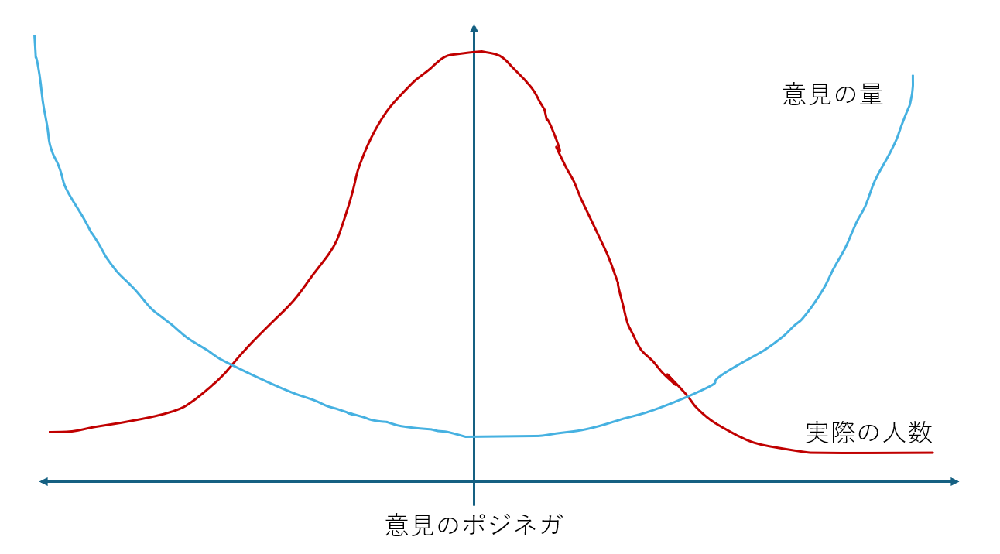
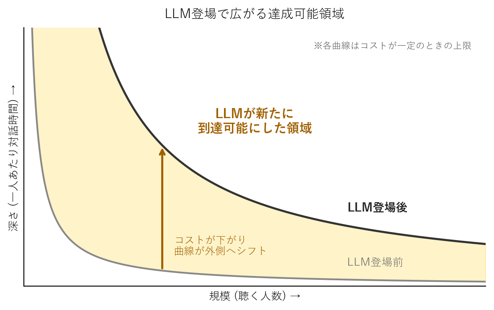
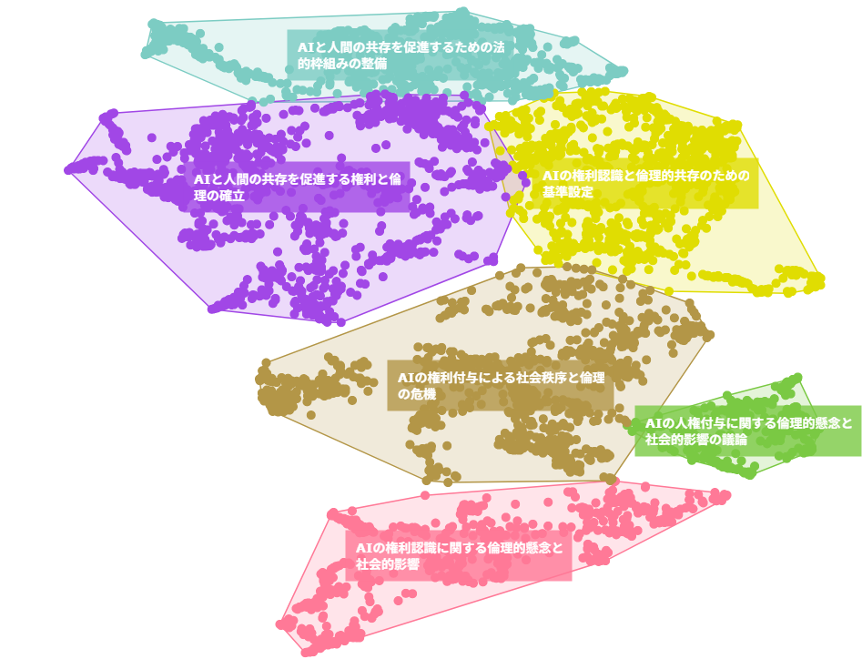

# 第2章 ブロードリスニングとアンケートの違い、定量分析から定性分析へ

文責：@tokoroten

前章で述べたように、ブロードリスニングは「規模を追求すれば意見の深さが犠牲になり、深さを追求すれば規模が限られる」というトレードオフを乗り越えようとする試みです。本章では、このトレードオフがなぜ生じるのかを、クローズドクエスチョンとオープンクエスチョンの違いから解き明かします。

なお、本章で扱うのは**ツールとしてのブロードリスニング**（AIによる意見の構造化・可視化）の特性です。ツールを組み込んだ拡張熟議の運用や政治家・行政主導による運用については、3章で解説します。

## 「民意」と「統計的世論」を区別する

本章を読み進める前に、繰り返し登場する「民意」と「統計的世論」という二つの用語を最初に整理しておきます。

「民意」という言葉は本書を含めて多様な意味で使われます。本書では辞書的な広い意味、すなわち**社会の構成員が抱く考え・意見・関心の総体**として「民意」を用います。本書のサブタイトル「民意の可視化と分析」や、3章タイトル「新しい民意の届け方」での「民意」はこの意味です。

民意の中でも特に**世論調査が測定対象とするもの**は、性質が大きく異なります。それは「賛成○○％、反対△△％」のように数字で語れる種類のもので、無作為抽出など代表性のあるサンプリングによって、社会全体の意見分布として定量的に把握されるものです。本書ではこれを **「統計的世論」** と呼んで、民意一般と区別します。

本章の主張は、**ブロードリスニングは民意（声の発見）を捉えるのには適しているが、統計的世論（代表性のある分布の測定）には向かない**ということです。両者を混同すると、ブロードリスニングの結果を「世論調査の代替」として誤読してしまいます。本章で「定量分析」「再現性」「代表性」を論じる際は、この統計的世論を念頭に置いて議論します。

## クローズドクエスチョンとオープンクエスチョンの違い

ブロードリスニングの最大の特徴は、オープンクエスチョンを対象に解析・調査が行えるということにあります。

従来のアンケートは「○○についてどう思いますか？」という質問に対して「強く賛成」「賛成」「わからない」「反対」「強く反対」といった、限られた選択肢の中から回答させるというものでした。このような形態の質問をクローズドクエスチョンといいます。

一方でブロードリスニングでは、前述のクローズドクエスチョンだけでなく「○○についてご意見をお聞かせください」といった自由回答を対象として取り扱うことが可能です。このような自由回答は、実質的に無限の選択肢から回答を行わせるものであり、このようなものをオープンクエスチョンと言います。

オープンクエスチョンとクローズドクエスチョンにはそれぞれ一長一短があります。以下の表にその違いをまとめます。

|  | オープンクエスチョン | クローズドクエスチョン |
|:--|:--|:--|
| 質問形態 | 自由記述 | 選択肢 |
| 議題設定 | 回答者が自由に提起 | 調査設計者が事前に設定 |
| 回答者の負荷 | 高い | 低い |
| 解析者の負荷 | 高い | 低い |
| コスト | 高い（従来）／低い（LLM登場後） | 低い |
| 統計的世論の再現性 | 低い | 高い |
| 分析の種類 | 定性分析（何があるか） | 定量分析（何がどれくらいあるか） |

### クローズドクエスチョンのメリット

クローズドクエスチョンは回答者の負荷が低いため大量の回答を集めやすく、解析も効率的に行えます。選択肢から選ぶだけなので数秒で回答でき、途中離脱も起きにくくなります。解析する側も、回答が数値データとして得られるため、集計や統計処理を自動化できます。さらに、年齢・性別・職業・居住地・学歴などの属性情報と組み合わせて分析することで、統計的世論の再現性も高まります。

例えば、「30代女性でこの政策に賛成する人は何パーセントか」「都市部と地方で意見の傾向に違いはあるか」といった分析が可能になります。適切なサンプリングを行えば、調査対象者の回答から社会全体の傾向を推定することもできます。ある考えを持つ人が社会全体にどれくらいいるのか、といった定量的な分析が可能になります。

これらの特性が組み合わさった結果、クローズドクエスチョンは低コストで大量のデータを集められる調査手法として、長らく世論調査の主流であり続けてきました。

### クローズドクエスチョンのデメリット

一方で、クローズドクエスチョンには本質的な限界もあります。回答は事前に用意された選択肢の中からしか得られないため、調査設計者の想像が届かない論点は最初から拾えません。「条件付きで賛成」「もっと優先すべき問題がある」「そもそも問題の立て方が間違っている」といった声は、選択肢になければ存在しなかったことになってしまいます。さらに、質問の文言や選択肢の順序、提示順によって回答が誘導されうるという問題もあります。これらの限界が持つ意味については、次節「自由記述がアジェンダ設定の権限を人々に開放する」で改めて掘り下げます。

### オープンクエスチョンのメリット

対照的に、オープンクエスチョンには大きな利点があります。回答者は選択肢に縛られず、自分の言葉で考えを表現できるため、調査設計者が想定していなかった視点や論点が浮かび上がることがあります。つまり、オープンクエスチョンは「何人がそう思っているか」という定量的な結果ではなく、「どのような意見があるのか」という定性的な結果を得るのに適した手法です。

### オープンクエスチョンのデメリット

ただし、オープンクエスチョンにも、回答者・解析者の双方に大きな負荷がかかるという課題があります。回答する側は自分の考えを文章にまとめるのに時間と労力が必要で、回答の途中で離脱してしまう人が多くなります。そもそも特定のトピックについて明確な意見を持っていない人も多く、その場合は「わからない」としか答えられないため、有効な回答率も低下します。

そして決定的だったのが解析側のコストです。自然文で書かれた回答からインサイトを得るには、人間の読み手が一件ずつ目を通し、内容を理解し、分類し、要約するという労働集約的な作業が必要でした。数千件の自由記述を整理するだけでも数十人日規模の人手がかかり、これがオープンクエスチョンを大規模に活用することを事実上不可能にしていた最大の理由です。回答者負荷の高さが「集めにくさ」を生み、解析者負荷の高さが「使えなさ」を生む、という二重の壁があったわけです。

## 自由記述がアジェンダ設定の権限を人々に開放する

オープンクエスチョンを扱えることの意義は、回答の深さだけにとどまりません。台湾のデジタル担当大臣を務めたオードリー・タンは、「インターネットの集合知は政治にどう影響するか」という問いに対して、次のように答えています。

> "If we open the agenda-setting power up to the crowd, we can reflect back to people what they agree or disagree on. Public servants no longer have exclusive ownership of the agenda."
> （アジェンダ設定の権限を人々に開放すれば、市民が何に賛成し何に反対しているのかを映し出すことができる。もはや行政だけが議題を決める時代ではない。）
https://web.archive.org/web/20201011031722/https://www.vodafone-institut.de/aiandi/democracy-needs-to-evolve-into-a-real-time-system/

「アジェンダ（議題）設定の権限を人々に開放する」。これこそが、ブロードリスニングの本質的な意義です。

前節で述べたように、クローズドクエスチョンには「調査設計者があらかじめ用意した選択肢の中からしか回答を得られない」という本質的な限界があります。さらに、質問の文言や選択肢の順序しだいで、調査設計者のスキル不足によって、あるいは意図的に、結果が変わってしまうという問題もあります。

これらの問題は言い換えれば、「何を議題にするか」「どのような選択肢を提示するか」というアジェンダ設定の権限を、行政や調査設計者が独占してきたということです。従来の世論調査では「何を聞くか」を決めるのは常に政府やマスコミであり、市民は与えられた選択肢の中から選ぶことしかできませんでした。市民が本当に気にしていること、困っていることがあっても、それが選択肢になければ声を上げる手段がなかったのです。

ブロードリスニングは、オープンクエスチョンを大規模に扱えるようにすることで、この状況を変えます。自由記述を通じて市民自身が議題を提起でき、「この問題について話し合いたい」「こんなことで困っている」という声を起点に、議論のテーマが形作られていきます。そこから共通するテーマや予想外の論点を抽出することで、調査設計者が見落としていた課題を発見できるようになりました。

「そんなことを気にしている人がいたのか」という発見が、ブロードリスニングの醍醐味です。調査する側が思いもよらなかった声を拾い上げることで、より多くの人の関心に応える政策づくりが可能になります。タンが言う「市民が何に賛成し何に反対しているのかを映し出す」とは、このことです。

## ブロードリスニングは定性分析であり、定量分析ではない

冒頭の表で「統計的世論の再現性」と「分析の種類」について触れました。この2つの項目は、ブロードリスニングを理解する上で極めて重要なので、ここで詳しく説明します。

### 統計的世論を支える「代表性」

章の冒頭で述べたように、統計的世論は代表性のあるサンプリングによって測定される、社会全体の意見分布のことです。代表性とは、調査対象者（サンプル）の回答から、社会全体の傾向を正しく推定できる性質のことです。例えば、日本国民1億2000万人全員に「この政策に賛成ですか？」と聞くことは現実的ではありません。そこで、1000人や2000人といったサンプルを抽出して調査を行います。このとき、サンプルが社会全体の縮図になっていれば（年齢構成、性別比、地域分布などが社会全体と同じ割合であれば）、サンプルの回答結果は社会全体の傾向を反映していると言えます。これが「代表性がある」ということです。

代表性を確保するための基本的な方法が「無作為抽出（ランダムサンプリング）」です。住民基本台帳や電話番号リストなどから、くじ引きのように偏りなく対象者を選ぶ。こうすることで、特定の属性や意見を持つ人だけが選ばれることを防ぎ、社会全体を縮小したようなサンプルを得ることができます。

無作為抽出によって偏りなくサンプリングされたデータから、「賛成が○○％、反対が△△％」といった形で全体の分布を再現できます。これが統計的世論を測定するということです。クローズドクエスチョンによる定量分析の目的は、この統計的世論を知ることにあります。そのため、従来の世論調査や市場調査やアンケートはクローズドクエスチョンを中心に設計されてきました。

### ノイジーマイノリティの問題

ブロードリスニングの最大の特徴は、オープンクエスチョンの自然文を大規模に解析できる点にあります。自然文を入力として扱えるようになったことで、既存の多様なコミュニケーションチャネルからデータを収集でき、それらを統合して取り扱えるようになりました。

ブロードリスニングの入力ソースには、X（旧Twitter）やFacebookでの発言、YouTubeのコメント、LINE、メール、電話の書き起こし、ウェブサイトへの投稿、政党が実施するアンケートへの回答、AIヒアリングシステムへの入力などがあります。人々が日常的に使っているチャネルから意見を収集できるため、「アンケートに答える」という特別な行動を求めなくても、自然に発せられた声を拾い上げることが可能になりました。

しかし、これらの情報チャネルには「明確に言いたいことがある人」の声が集まりやすいという重要な特徴があります。自由記述で意見を書くには、時間と労力がかかります。そのハードルを乗り越えてまで意見を投稿する人は、そのトピックに対して強い関心や明確な意見を持っている人に偏ります。逆に言えば、特に意見がない人は投稿するモチベーションがないため、そういった人の情報は集まりません。

そして、世の中の大半の人は、特定のトピックに関して明確な意見を持っていないものです。例えば東京に住む筆者が「諫早湾の干拓事業[^isahaya]についてどう思うか？」と問われたとしても「よくわからない」としか答えようがありませんし、そもそも積極的に「私は諫早湾の干拓事業は、よくわからないと思っています！」と意見表明することもありません。このような「**サイレントマジョリティ**」はブロードリスニングには現れません。

一方、クローズドクエスチョンのアンケートであれば、「賛成・反対・わからない」の三択で無作為抽出した回答者に答えさせることで、「この問題について、賛成の意見を持っている人が○○％、反対が△△％、わからないが□□％」といった形で情報を定量的に把握できます。サイレントマジョリティの「わからない」という回答も、立派な統計的世論のデータになるのです。

自然文を対象にしたブロードリスニングでは、意見のある人の声だけが集まるため、こうした「意見を持たない多数派」の存在が見えなくなってしまいます。つまり、ブロードリスニングで集まる声は「**ノイジーマイノリティ**」（声の大きな少数派）に偏りやすいという特性があります。これは欠点というよりも、ブロードリスニングが定性分析であることの必然的な帰結です。

Pew Research Centerの2019年の調査では、Twitter（現X）上の政治関連ツイートの73%が、全ユーザーのわずか6%によって生み出されていました[^1]。SNS上で目にする「世論」は、ごく少数の活発な発信者によって形作られていることに注意してください。

上の図は、この現象を模式的に表したものです。横軸は意見の強さ（ポジティブ・ネガティブの度合い）を表しています。赤い曲線の縦軸は「人数の分布」で、大多数の人は中立的な立場にいます。一方、水色の曲線の縦軸は「意見の量」で、極端な意見を持つ人ほど多くの意見を投稿します。ブロードリスニングで集まるのは水色の曲線の形になり、人数の分布とは大きく異なるのです。

### 参加格差：誰が「自分の言葉で書ける」か

ノイジーマイノリティの偏りは「意見の強さ」から生じるものでしたが、ブロードリスニングにはもう一つ別の偏りもあります。**自由記述で意見を書くという行為そのものが、文化的・言語的な資源を要する**ことです。意見を持っていても、次のような立場の人々の声はブロードリスニングに現れにくくなります。

- 読み書きに自信がない、文章で考えを表現するのが苦手な人
- 母語が日本語でない人。日本語の口語と書き言葉のギャップに苦しむ人
- 専門用語が分からず、議題そのものに参加しづらい人
- 仕事・育児・介護などで時間や認知的余裕がない人
- スマートフォンやPCの操作に習熟していない人
- 自分の意見を「公の場」に出すこと自体に強い心理的ハードルを感じる人

社会学者ピエール・ブルデューは、こうした「文章を書ける／書きにくい」の差を「**文化資本**」と呼びました。文化資本は、家庭環境・教育機会・職業経験などを通じて時間をかけて蓄積されるもので、人によって偏りがあります。ブロードリスニングが集める声は、原理的に「自分の言葉で書ける文化資本を持つ人々の声」に傾くことになります。

実務的には、この参加格差を完全に解消することはできませんが、補完する工夫はできます。

- **入力チャネルを多様化する**：テキスト入力に加えて、音声入力、AIヒアリング（4章で紹介する安野貴博の取り組みなど）、対面の場（8章の太田市自分ごと化会議など）、絵や写真での投稿を組み合わせる
- **届きにくい層に明示的に届ける**：特定の層（高齢者・外国人・障がい者・低所得層など）の声がほとんど含まれていないと判明したら、出張ヒアリング、団体経由の聞き取りなど、能動的に補う
- **解釈の段階で偏りを意識する**：分析結果を見るとき、「この声を上げられなかった人がどこにいるか」を必ず問う

ブロードリスニングは「広く聞いた」と思わせる説得力がある分、「届かなかった声」を見落とすリスクも高まります。集まった声を読むときには、その背後にある「集まらなかった声」の存在を常に意識することが大切です。

### 定性分析と定量分析の使い分け

定性分析とは、「そもそも何を測るべきかが分からない」ときに使う手法です。選択肢を作る前に、まず「人々がどのようなことを考えているか」「どのような論点があるか」を探索的に明らかにする。そのための調査であり、「それぞれの意見を持つ人が何パーセントいるか」という定量的な尺度を測定するものではありません。ブロードリスニングで得られる価値は、正確な比率ではなく、「こんな視点があったのか」という新しい発見そのものにあります。想定外の論点、見落とされていた課題、少数だが重要な声を拾い上げるのが、ブロードリスニングの役割です。

では、ブロードリスニングはどのように使うべきなのでしょうか。

正しい活用法は、ブロードリスニングを「仮説生成」のフェーズに位置づけることです。まずブロードリスニングで「どのような意見があるか」「どのような論点が存在するか」を把握する。そこで得られた知見をもとに質問項目を設計し、無作為抽出による定量分析で「各意見を持つ人がどれくらいいるか」を検証する。この二段構えで初めて、定性的な深さと定量的な代表性を両立できます。

例えば、ある政策についてブロードリスニングを実施したところ、「子育て世代の負担」「高齢者の移動手段」「環境への影響」という三つの論点が浮かび上がったとします。この段階では、どの論点が最も多くの市民に共有されているかはわかりません。そこで、この三つを選択肢としたアンケートを無作為抽出で実施し、「最も重視する論点はどれですか」と問うことで、定量的な裏付けを得るのです。

章の冒頭で述べたとおり、ブロードリスニングは統計的世論を測る手法ではなく、民意の中にある多様な視点を発見する手法です。「ブロードリスニングの結果は、（統計的）世論ではないから駄目だ」という批判を耳にすることがありますが、これは民意と統計的世論を混同しているか、ブロードリスニングの目的を取り違えているかのどちらかです。統計的世論を測ることと、民意の中にある新しい視点を発見することは、そもそも異なる目的なのです。

### ブロードリスニングをすれば意見が集まるという誤解

ここで一点、よくある誤解を解いておきます。「ブロードリスニングをすれば、市民からの意見がたくさん集まるはずだ」という勘違いです。これは明確に誤りです。

自由記述アンケートは通常の選択式のアンケートと比べて回答のハードルが高いため、自治体が普通にアンケートを実施しても大した件数は集まりません。本書で紹介する事例では多くの意見が集まっていますが、それはブロードリスニングの力ではありません。

2024年の東京都知事選挙で安野貴博が多くの意見を集めたのは、AIエンジニアとして話題性のある同氏がブロードリスニングを行ったからです。5章で紹介する東京都の事例では約2万7000件の意見が集まりましたが、これも東京都が大々的に広報活動を行い、市民に参加を呼びかけ、さらにSNS上の意見を収集した結果です。

ブロードリスニングはあくまで「集まった意見を効率的に解析・可視化する」ためのツールであり、「意見を集める」ためのツールではありません。ブロードリスニングを実施するのであれば、どのようにして回答を収集するのか（広報の方法、参加へのインセンティブ設計、既存の市民参加の仕組みとの連携など）というアプローチも含めて検討する必要があります。

ただし、自前でアンケートを実施しなくても意見を集める方法はあります。X（旧Twitter）やFacebook、掲示板、ニュースサイトのコメント欄など、すでにインターネット上で交わされている会話を収集・分析するという手段です。「アンケートで意見を集める」という発想から離れ、「すでに存在する意見を発見する」という視点を持つことで、広報力や組織力が限られた組織でも分析対象を確保できます。

ただし、SNSからの収集にはセレクションバイアスが伴います。たとえば「子育て支援」で検索すると、同じ問題意識を「保育園」「育休」「ワンオペ」と語る人々の声は漏れてしまいます。しかし、ブロードリスニングの目的が「気づきを得ること」であるならば、こうしたバイアスは致命的な欠点ではありません。バイアスの存在を認識した上で、複数のキーワードや多様なチャネルを組み合わせることで偏りを軽減できます。

### ブロードリスニング単独で政策判断・選挙判断をしてはいけない

これまで述べてきたノイジーマイノリティと参加格差の偏りは、特に**政策判断や選挙判断にブロードリスニングの結果をそのまま使うこと**の危うさにつながります。

例えば、ある政策についてブロードリスニングを実施したところ、「賛成の声が反対の3倍集まった」という結果が出たとします。これを根拠に「この政策は民意の支持を得ている」と結論づけて推進するのは、典型的な誤用です。集まった声は、その政策に強い意見を持つ人々に偏った標本であり、社会全体の支持率を反映するものではありません。本当は反対している多数派が「わざわざ書くほどでもない」と沈黙していた可能性は十分にあります。

選挙のように「多数派の意思」を問う場面では、この危険は特に大きくなります。声を上げた層に過剰に応答する公約や政策は、サイレントマジョリティを取り残し、結果として「ネット上では人気だが実際の選挙では支持されない」ものを生み出します。SNSでの盛り上がりと実際の投票結果が乖離することは珍しくありません。

正しい使い方は、ブロードリスニングを**判断のための材料の一つ**として位置づけることです。論点の発見、見落とされていた声の発掘、政策アジェンダの整理にはきわめて有効ですが、最終的な優先順位の判定や賛否の集計には、無作為抽出による世論調査や、対面の熟議、専門家による検討といった別の手段を組み合わせる必要があります。6章で紹介する政党のブロードリスニング活用事例も、ブロードリスニングだけで意思決定をしているわけではなく、既存の世論調査や党内の議論と組み合わせて使っていることに注目してください。

## LLMがオープンクエスチョンの大規模解析を可能にした

自由記述を可視化する手法としては「ワードクラウド」が広く使われてきましたが、これはテキストを単語に分解して出現頻度を数え、頻度の高い単語を大きく表示するだけのものです。「どのような話題があるか」は分かっても、「どのような意見があるのか」は分かりません。ワードクラウドはオープンクエスチョンの「解析」ではなく、「頻度の可視化」にとどまるものでした。この状況を変えたのが、1章で述べた大規模言語モデル（LLM）です。

ChatGPTを使ったことがある方なら、その能力を実感しているでしょう。試しに、ChatGPTに「この発言のテーマを単語1語で表して。『共働きなのに保育園に入れない！』」と入力してみてください。すると、こう返ってきます。

> **「待機児童」**

元の発言には「待機児童」という言葉は一切含まれていません。しかしLLMは、発言の意味を理解した上で、背景にある社会問題を特定できるのです。これは、国語の読解問題を解くような能力です。

ChatGPTは、「AIとおしゃべりするサービス」にとどまりません。LLMは、人間が書いた文章を入力すると、その内容を理解した上で要約・分類・評価を行い、結果を返してくれる**「プログラムから呼び出せる部品（API）」**です。

従来、プログラムは文字列を扱えても、その「意味」を理解することはできませんでした。自由記述のテキストを読み、何が書かれているかを判断するのは、人間にしかできない仕事でした。しかしLLMをプログラムの部品として組み込めるようになったことで、意味理解の壁を越えられるようになりました。「この意見は何について述べているか」「賛成か反対か」「どんな感情が込められているか」といった問いに対して、プログラムが答えを返せるようになったのです。

これが意味するのは、先ほどのChatGPTへの問いかけを、人間が一件ずつ手で入力する代わりに、プログラムで数千件、数万件と自動的に繰り返せるということです。解析者の負荷は劇的に下がりました。複数の意見を比較して共通点を見つけたり、意見をカテゴリ別に分類したり、感情の強さを数値化したりすることも可能です。技術的な詳細については12章で、実装方法については13章で解説します。

本書で主に扱う広聴AIや、その原型のTalk to the Cityでは、こうしたLLMの能力を複数のステップで組み合わせます。まず数千件の自由記述それぞれからテーマや論点を抽出し、次に似た意見同士をグルーピング（クラスタリング）し、最後に各グループの要約を生成します。こうした一連の処理をプログラムで自動化することで、人間が一件ずつ読んで整理するのと同等の作業を短時間で実現しています。

このように、LLMの登場により、オープンクエスチョンは「集めるのは簡単だが分析が難しい」ものから「集めることさえできれば分析もできる」ものへと変わりました。これにより、1章で述べた「規模と深さのトレードオフ」を技術的に乗り越える道が開かれました。

## 深さと規模とコストのトレードオフを、LLMで乗り越える

ここで、前述したオープンクエスチョンの「解析コストの高さ」を、より大きな構造の中に位置づけ直してみましょう。

第1章で示したように、深さと規模は片方を伸ばすともう片方が犠牲になるという反比例の関係にあります。あの曲線はあくまで「**コストが一定だとしたら**、どんな組み合わせが可能か」を示したものでした。コストを多くかければ曲線そのものが右上方向に押し出され、より広く × より深く聴ける領域が広がります。逆にコストを抑えれば、曲線は左下に縮みます。

日本では国勢調査は5年に一度しか実施されません。完全な代表性を持つ全数調査は、約700億円規模の予算が必要です。それだけのコストをかけても質問項目はわずか19項目に限られ、意見を問う質問は含まれていません。通常の世論調査はサンプリングでコストを抑えますが、オープンクエスチョンを含めると自由記述を一件ずつ読んで分類する作業が必要になり、コストが跳ね上がります。

つまり、従来の調査手法には「規模・深さ・コスト」という三すくみの関係がありました。規模と代表性を求めれば莫大なコストがかかり、コストを抑えれば規模か深さを犠牲にせざるを得ない。クローズドクエスチョン中心の調査設計は「深さを犠牲にしてコストを下げる」という選択をしてきました。

LLMの登場は、この三すくみの構造を変えました。13章で詳しく試算しますが、広聴AIで1万件の自由記述を解析するコストは約500円です。従来であれば数十人日の人手が必要だった作業が、ワンコイン程度で完了します。オープンクエスチョンの解析コストが事実上ゼロに近づいたことで、「深さを犠牲にしてコストを下げる」必要がなくなりました。

図のとおり、LLM登場前は内側の曲線（薄いグレー）に達成可能領域が制約されていました。LLMが解析コストを下げた結果、同じ予算で外側の曲線（黒）まで届くようになり、その間の黄色い領域が新たに到達可能になりました。これまで「コストの壁」によって閉ざされていた「広く × 深く」の組み合わせが、現実的な選択肢として開かれたのです。

## ブロードリスニングの「サイエンス風」の見た目がもたらす誤解

ブロードリスニングの結果は、しばしば「サイエンス風」の見た目で提示されます。意見が自動的にクラスタリングされ、散布図上に可視化され、各クラスタには件数が表示される。この見た目が「謎の説得力」を持ってしまいます。

図：広聴AIによるクラスタリング散布図の例

散布図を見ると、人は無意識のうちに縦軸と横軸に意味があると思い込んでしまいます。通常のグラフであれば、横軸が時間、縦軸が売上といった具合に、軸には明確な意味があります。しかしブロードリスニングの散布図における位置は、高次元の意見ベクトルを人間が見やすいように2次元に圧縮した結果に過ぎません。「右上にあるから良い意見」「左下にあるから悪い意見」といった解釈は完全に誤りです。点の位置が示すのは「意見同士の相対的な類似度」だけであり、縦軸・横軸そのものには何の意味もないのです。

次元圧縮（UMAP）による散布図の読み方は、12章12.5.6節「UMAPによる次元圧縮」で詳しく解説しています。

数字やグラフがあると、人はそれを定量データだと思い込みやすい。「クラスタAには500件、クラスタBには200件の意見があります」と言われると、「Aの意見がBの2.5倍多い」と解釈したくなります。しかしこれは、そもそも参加者が偏っているデータの内訳に過ぎません。AやBに意見を言いたくて言いたくて仕方がない人達が回答しているのです。実際の社会でAとBの意見がどのような比率で存在するかとは、まったく別の話なのです。

過去に定量分析レポートを見慣れてきた人ほど、この罠に陥りやすい傾向があります。見慣れないものを既知の枠組みで解釈しようとするためです。しかしブロードリスニングの結果を従来の世論調査と同じように読んではいけません。ブロードリスニングが示すのは「こういう意見を持っている人がいる」ということであり、「この意見が社会全体でどれくらい支持されているか」ではありません。クラスタの大きさは「投稿された意見の件数」であって、「その意見を持つ人の社会における割合」ではありません。

## まとめ

本章では、ブロードリスニングとアンケートの違いについて解説しました。

従来のアンケートがクローズドクエスチョン（選択式）を中心に設計されてきたのに対し、ブロードリスニングはオープンクエスチョン（自由記述）を大規模に扱える点に特徴があります。オープンクエスチョンを扱えることの本質的な意義は、アジェンダ設定の権限を市民に開放し、調査設計者が想定していなかった論点を発見できるようになることにあります。

ブロードリスニングは定性分析であり、「何パーセントの人がそう思っているか」を測定する定量分析ではありません。集まる意見は「声を上げた人」に偏るため、ブロードリスニングは「仮説生成」に位置づけ、発見した論点を必要に応じて定量分析で検証するという使い分けが重要です。

こうした解析を可能にしたのは、2022年以降のLLMの発展です。それ以前のワードクラウドでは単語の頻度しか可視化できませんでしたが、LLMの登場により数千件の自由記述から論点を自動抽出できるようになりました。

---

[^1]: Pew Research Center「National Politics on Twitter: Small Share of U.S. Adults Produce Majority of Tweets」2019年10月 https://www.pewresearch.org/data-labs/2019/10/23/national-politics-on-twitter-small-share-of-u-s-adults-produce-majority-of-tweets/

[^isahaya]: 諫早湾の干拓をめぐり、生態系の保全、農業開発、行政訴訟が絡み合って長期化している問題。
