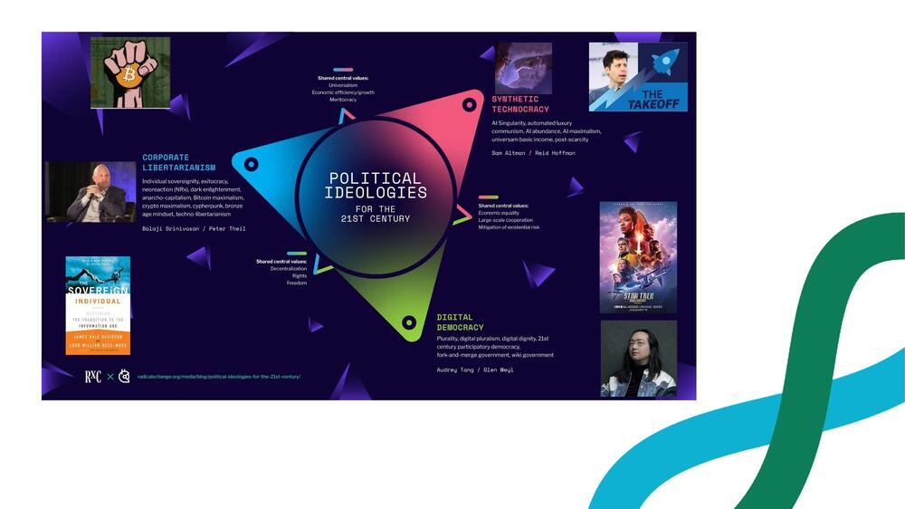
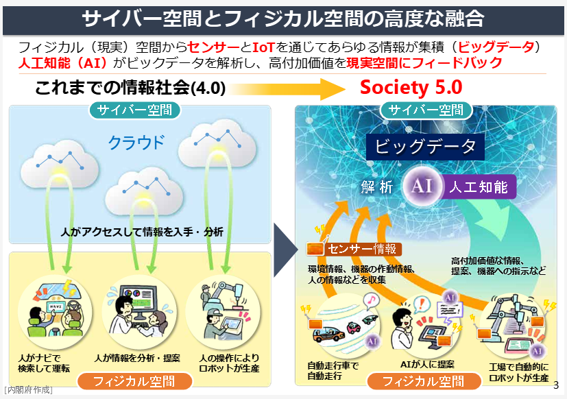

# 第3章 デジタル民主主義とブロードリスニング、新しい民意の届け方

文責：@tokoroten、@nishio

## 3.1 デジタル民主主義とは何か

デジタル民主主義（Digital Democracy）とは、デジタル技術を活用して民主主義のプロセスを強化・拡張する取り組みの総称です。オンライン投票、電子請願、市民参加プラットフォームなど、様々な技術や手法が含まれます。

「デジタル民主主義」という言葉を聞くと、「インターネット投票」を思い浮かべる人が多いかもしれません。確かにそれも一つの要素ですが、デジタル民主主義の射程はもっと広いものです。投票という「意思決定の瞬間」だけでなく、その前段階にある「議論」「意見形成」「情報共有」のプロセス全体をデジタル技術で強化しようとする試みなのです。

書籍『Plurality』では、デジタル民主主義を含む様々な技術群を体系的に整理しています。以下の図は、その階層構造を示したものです。

TODO: Pluralityの階層構造の図を入れる

この図が示すように、デジタル民主主義には様々なレイヤーがあります。本書で扱うブロードリスニングは、このうち「拡張熟議（Augmented Deliberation）」に位置づけられる技術です。

### 本書で紹介するツール：TTTCと広聴AI

本書で中心的に扱うブロードリスニングツールは、Talk to the City（TTTC）と、それから発展した広聴AIです。

**Talk to the City（TTTC）**

LLM（大規模言語モデル）を活用して大量の意見をクラスタリング・可視化するツールです。AI Objectives Instituteが開発し、オープンソースで公開されています。

TTTCの特徴は、自由記述形式の意見を扱えることです。後述するPolisが「短い意見文への投票」という形式を取るのに対し、TTTCは長文の自由記述をそのまま分析できます。数千件、数万件の意見をAIがクラスタリングし、各クラスタの要約を生成し、散布図上に可視化します。

**広聴AI**

TTTCから発展した日本発のブロードリスニングツールです。DD2030（デジタル民主主義2030プロジェクト）を中心に開発が進められています。TTTCをベースにしながら、日本語への最適化、UIの改善、機能の拡張などが行われています。詳細は4章で解説します。

### その他のデジタル民主主義ツール

TTTCや広聴AIのほかにも、デジタル民主主義を支えるツールには以下のようなものがあります。それぞれの特徴を見ていきましょう。

#### 熟議支援ツール

**Decidim（デシディム）**

バルセロナ発の市民参加プラットフォームです。「Decidim」はカタルーニャ語で「私たちが決める」という意味を持ちます。2016年にバルセロナ市が開発を開始し、現在はオープンソースとして世界中で利用されています。

Decidimの特徴は、政策立案プロセスの全体をカバーしていることです。市民による提案の投稿、その提案に対する討論、修正案の提示、そして最終的な投票までを一つのプラットフォーム上で行えます。日本でも加古川市などが導入し、市民参加型の政策立案に活用しています。

**Polis（ポリス）**

参加者の投票パターンを分析し、意見集団の構造を可視化するツールです。参加者は短い意見文に対して「賛成」「反対」「パス」で投票し、その投票パターンの類似性に基づいて参加者をグループ分けします。

Polisの画期的な点は、「対立を超えた合意点」を発見できることです。意見が二極化しているように見える議題でも、実は多くの人が同意できる点があることが多い。Polisはそうした「合意可能な領域」を可視化します。

台湾では、このPolisを活用した「vTaiwan」というプラットフォームが運用されています。Uber規制、オンラインアルコール販売、遠隔医療など、26以上の政策課題についてPolisを使った市民参加が行われ、その結果が実際の法制化につながりました。

2章で述べたように、Polisの特徴的な点は、参加者が投票を続けるにつれて、散布図上で自分を表すアイコンが移動していくことです。自分がどのような意見集団に属しているのかがリアルタイムで可視化され、「自分とは異なる考え方の人々がいる」ということが目に見える形で示されます。これにより、普段はSNSのフィルターバブルの中で同質的な意見ばかり目にしている人も、社会には多様な意見が存在することを実感できるのです。

日本では、JapanChoiceが運営する「世論地図」（https://japanchoice.jp/polis ）というサービスがPolisから派生して生まれています。共著者の一人である西尾がこのプロジェクトの開発に携わりました。

## 3.2 21世紀のイデオロギー

デジタル民主主義は極めて広汎な概念であるため、「これがデジタル民主主義である」ということは困難です。　しかし、「デジタル民主主義は何とは異なるのか」を理解することで、その特徴が浮かび上がってきます。

『Plurality』の著者であるオードリー・タンとグレン・ワイルは、21世紀のイデオロギーを以下の三極として整理しています。

todo: 画像差し替え

https://scrapbox.io/plurality-japanese/Glen_in_Japan_Keynote%E6%97%A5%E6%9C%AC%E8%AA%9E%E5%AD%97%E5%B9%95

興味深いことに、この三極構造は人気ストラテジーゲーム『Civilization VI』（2016年）の拡張パック「Gathering Storm」（2019年）で描かれた未来の社会体制から着想を得ています。同ゲームでは、技術ツリーの終着点として「Corporate Libertarianism（企業リバタリアニズム）」「Digital Democracy（デジタル民主主義）」「Synthetic Technocracy（統合テクノクラシー）」という3つの社会体制が提示されていました。

彼らはこれらとデジタル民主主義を対比させることで、デジタル民主主義の本質を浮かび上がらせようとしています。以下に、それぞれの立場の特徴を簡単に説明します。

**1. 統合テクノクラシー（Synthetic Technocracy）**

AIやアルゴリズムによる統治を志向する立場です。人間の認知能力には限界があり、複雑化する社会問題はAIに任せた方が効率的だという考え方に基づきます。

この立場の根底には、「人間の民主的な意思決定は非効率で、しばしば誤った判断を下す」という認識があります。感情に流されやすく、長期的な視点を持てず、複雑な問題を理解できない——そんな人間に重要な決定を任せるよりも、データに基づいて最適解を導き出すAIに任せた方がよい、という発想です。

中国の社会信用システムは、この方向性の一例として挙げられます。市民の行動をデータとして収集し、アルゴリズムによってスコアリングし、そのスコアに基づいて様々なサービスへのアクセスを制御する。これは「AIによる社会の最適化」の一形態です。

一言で言えば「政府がAIを使って社会を管理する」モデルです。

**2. 企業リバタリアニズム（Corporate Libertarianism）**

暗号技術やAIによって個人や企業をエンパワーし、国家の介入を最小化しようとする立場です。

ビットコインに代表される暗号通貨は、この思想を体現しています。国家が発行・管理する法定通貨に依存せず、暗号技術によって価値の交換を可能にする。国家の介入なしに、個人間で直接取引ができる世界を目指します。

分散型自律組織（DAO）もこの流れに位置づけられます。企業や組織を人間の管理者なしに、スマートコントラクト（自動実行されるプログラム）によって運営しようとする試みです。

シリコンバレーの一部で支持されているこの考え方は、「テクノロジーによって国家を迂回し、個人の自由を最大化する」ことを目指します。極端な形では、国家そのものが不要になり、テクノロジーによって自己統治する個人やコミュニティが主役になるという未来像を描きます。

一言でいえば「個人・企業が国家を超越して自己統治する」モデルです。

**3. デジタル民主主義（Digital Democracy）**

デジタル技術によって集団をエンパワーし、既存の民主主義プロセスを強化しようとする立場です。AIを「統治者」として使うのではなく、市民の熟議と合意形成を支援する「道具」として使います。

統合テクノクラシーが「AIに任せる」を志向し、企業リバタリアニズムが「個人をエンパワーする」を志向するのに対し、デジタル民主主義は「集団をエンパワーする」を志向します。

台湾のvTaiwan、エストニアの電子政府、バルセロナのDecidimなどは、この方向性の実践例です。テクノロジーを使って、より多くの市民が政策立案プロセスに参加できるようにする。市民同士の対話を促進し、合意形成を支援する。最終的な決定は人間が行うが、その決定に至るプロセスをテクノロジーで強化する——これがデジタル民主主義のアプローチです。

一言で言えば「市民がテクノロジーを使って民主主義を強化する」モデルです。

### デジタル民主主義の本質：AIによる統治ではない

ここで強調しておきたいのは、デジタル民主主義は「AIによる統治ではない」ということです。この点は、混同されやすいので注意が必要です。

統合テクノクラシーが目指すのは、AIが最適な政策を決定し、人間はそれに従うという構図です。一方、デジタル民主主義が目指すのは、AIの力を借りて人間同士の対話と合意形成を促進することです。最終的な意思決定は、あくまで人間が行います。

この違いは、「AIをどう位置づけるか」の違いです。

- 統合テクノクラシー：AIは「意思決定者」である
- 企業リバタリアニズム：AIは「個人の自由を拡大する手段」である
- デジタル民主主義：AIは「意思決定を支援する道具」である

ブロードリスニングで言えば、AIは大量の意見を構造化・可視化する役割を担いますが、その結果をどう解釈し、どのような政策を選択するかは人間が決めます。AIは熟議の土台を提供するのであって、熟議そのものを代替するわけではありません。

「AIが政策を決めてくれるなら楽でいいじゃないか」と思う人もいるかもしれません。しかし、民主主義の価値は「効率性」だけにあるのではありません。市民が自らの社会のあり方を決める——その参加のプロセス自体に価値があります。AIに任せてしまえば、市民は単なる「管理される対象」になってしまいます。

デジタル民主主義は、民主主義の本質——市民による自己統治——を守りながら、そのプロセスをテクノロジーで強化しようとする立場なのです。

### 余談：Society 5.0は「統合テクノクラシー」だった

ところで、日本にも統合テクノクラシー的なビジョンがありました。内閣府が推進してきた「Society 5.0」です。サイバー空間とフィジカル空間を高度に融合させ、IoTやAI、ビッグデータで社会全体を最適化する——このビジョンは、まさにテクノロジーによる統治の発想と親和性があります。

https://www8.cao.go.jp/cstp/society5_0/
https://www8.cao.go.jp/cstp/society5_0/society5_0-1.pdf

ただし、Society 5.0は事実上頓挫しました。2016年に提唱されて以降、スマートシティ構想やデータ連携基盤の整備が試みられましたが、縦割り行政の壁、個人情報保護への懸念、民間企業同士の連携の難しさなどに阻まれ、社会実装には至っていません。データを出せばだれかが勝手に解析して最適解を出してくれる、そんな単純な話ではなかったのです。「Society 5.0」という言葉自体、近年はあまり聞かれなくなっています。日本における統合テクノクラシーの試みは、少なくとも現時点では成功していないと言えるでしょう。

## 3.3 なぜ今、リアルタイムに民意を聴く必要があるのか

### 選挙サイクルの限界

代議制民主主義では、市民は選挙を通じて代表者を選び、その代表者が政策を決定します。日本の場合、衆議院議員の任期は4年、参議院議員は6年です。

この仕組みには理由があります。すべての政策について市民全員が判断するのは現実的ではありません。そこで、選挙の際に候補者は公約を掲げ、市民はその公約に基づいて代表者を選びます。当選した代表者は任期中にその公約を実行し、市民はその成果を見て次の選挙で判断する——これが代議制民主主義の基本的な設計思想です。

この仕組みは、社会変化が緩やかだった時代には機能していました。しかし、現代社会の変化のスピードは加速しています。

**技術革新のサイクルが短くなっている**

2022年11月にChatGPTが公開されてから、わずか2年でAIは社会のあり方を大きく変えつつあります。生成AIの規制、著作権の問題、雇用への影響——選挙の時点では争点になっていなかった問題が、任期中に重要な政策課題として浮上します。4年前の選挙公約は、AIについて何も語っていなかったかもしれません。

**グローバル化により、海外の出来事が即座に国内に影響する**

ウクライナ戦争によるエネルギー価格の高騰、中国のゼロコロナ政策によるサプライチェーンの混乱、アメリカの利上げによる円安——これらは日本の選挙で選ばれた政治家がコントロールできる問題ではありませんが、国内経済に大きな影響を与えます。

**SNSにより情報の拡散速度が劇的に上がった**

かつては、政策課題が社会問題として認識されるまでに時間がかかりました。メディアが報道し、専門家が議論し、徐々に世論が形成されていく。しかし今は、SNSによって一晩で「炎上」が起き、政治家は即座の対応を迫られます。

**パンデミックや気候変動など、予測困難な事態が頻発している**

COVID-19のパンデミックは、誰も予測していなかった形で社会を変えました。選挙の時点で公約に掲げていた政策は、パンデミックによって無意味になったり、逆に緊急の対応が必要になったりしました。

4年や6年という選挙サイクルの間、同じ政策を維持し続けることは、もはや合理的ではなくなっています。政治家は、任期中も細かく政策をアップデートし続ける必要があります。

しかし、そのためには民意の変化を把握する必要があります。選挙で得た「白紙委任」だけでは、任期中に生じた新しい課題に対して、市民がどのような意見を持っているのかわかりません。

### 従来のツールの限界

では、政治家はどうやって民意の変化を把握すればよいのでしょうか。

従来のツールには以下のようなものがありました。それぞれに利点がありますが、「リアルタイムに大量の多様な意見を把握する」という目的には限界があります。

**世論調査**

無作為抽出による世論調査は、代表性という点では最も信頼できる手法です。統計的に設計されたサンプリングにより、社会全体の意見分布を推定できます。

しかし、実施にコストと時間がかかります。調査の設計、サンプリング、実査、集計、分析——このプロセスには数週間から数ヶ月かかることも珍しくありません。頻繁には実施できないため、急速に変化する民意を追うことは困難です。

また、世論調査は「あらかじめ設定した質問」への回答しか得られません。調査設計者が想定していなかった論点、市民が自発的に提起したい意見は拾えません。

**パブリックコメント**

政策案に対して市民が直接意見を述べられる制度です。行政手続法に基づき、重要な政策については意見募集が行われます。

しかし、参加者は限られています。パブリックコメントの存在を知っている人、意見を文章にまとめる時間と能力がある人、制度に関心を持つ人——実際に参加するのはごく一部です。

また、集まった意見を処理するのも大変です。数百件、時には数千件の意見が集まると、それをすべて読み、分類し、検討するだけで膨大な時間がかかります。結果として、パブリックコメントが形骸化している例も少なくありません。

**陳情・請願**

業界団体、市民団体、地域の代表者などが、政治家に直接意見を伝える仕組みです。組織化された声は確実に届きます。

しかし、組織化されていない個人の声、組織に属さない人々の意見は拾いにくい。「サイレントマジョリティ」の声は、陳情・請願のルートには乗りません。

また、組織の利益と社会全体の利益が一致するとは限りません。声の大きい団体の意見が過度に反映され、声を上げない多数派の利益が無視されるリスクがあります。

**SNS**

Twitter（現X）やFacebookなどのSNSは、リアルタイムで大量の意見にアクセスできます。政治家の多くがSNSを使い、市民の反応を見ています。

しかし、2章で述べた「ノイジーマイノリティ」の問題があります。SNS上で声を上げるのは一部の人であり、その意見は社会全体を代表していません。むしろ、極端な意見ほど拡散されやすいというSNSの特性により、世論の実態から乖離した「疑似民意」が形成されることがあります。

また、ボットやフェイクアカウントによる世論操作のリスクもあります。外国政府やその他のアクターが、SNS上で偽の世論を作り出そうとする事例は多数報告されています。

### ブロードリスニングが埋めるギャップ

ブロードリスニングは、これらのツールの限界を補完する可能性を持っています。

**リアルタイム性**

オンラインで常時意見を収集でき、AIによる処理も高速です。世論調査のように数週間かけて実施する必要がなく、状況の変化に応じて迅速に意見を把握できます。

**スケーラビリティ**

数千、数万件の意見を構造化・可視化できます。パブリックコメントのように「集まった意見を読み切れない」という問題が解消されます。AIによる自動分類と要約により、大量の意見を俯瞰的に把握できます。

**多様性**

様々なチャネル（SNS、フォーム、チャットボット、メール、手紙など）から意見を収集し、一箇所で統合的に扱えます。SNSだけに依存しないことで、SNSを使わない層の意見も拾えます。

**自由記述**

あらかじめ設定した質問への回答だけでなく、市民が自発的に提起する意見を拾えます。調査設計者が想定していなかった論点を発見できる可能性があります。

もちろん、2章で述べたように、ブロードリスニングには代表性の問題があります。集まる意見は「声を上げた人」の意見であり、サイレントマジョリティの意見ではありません。ブロードリスニングの結果を「民意」として扱うことはできません。

しかし、「どのような論点が存在するか」「どのような視点が見落とされているか」を把握するには有効です。ブロードリスニングで発見した論点を、必要に応じて世論調査で検証する——このような使い分けが重要です。

政治家が民意に沿った政策を提案するためには、まず民意を知る必要があります。2章で述べたように、民意を正しく把握し、それに沿った政策を提案すれば選挙に勝てます。ブロードリスニングは、従来のツールでは把握できなかった「声」を拾い上げ、政策立案のインプットとして活用できるようにします。

## 3.4 ブロードリスニングとアンケートの違い（再掲）

ここで、2章で解説したブロードリスニングとアンケートの違いを、簡潔に振り返っておきましょう。この違いを理解することは、ブロードリスニングの適切な活用にとって極めて重要です。

### アンケート（量的調査）の特徴

- **無作為抽出**：統計的に設計されたサンプリングにより、社会全体を代表するデータを収集
- **固定質問**：あらかじめ設定した質問（主にクローズドクエスチョン）への回答を収集
- **強い意見がない人も回答**：無作為に選ばれた回答者は、関心がない問題についても回答する
- **クロス集計が容易**：年齢、性別、地域などの属性との相関を分析しやすい
- **目的**：民意（社会全体の意見分布）を測定すること

### ブロードリスニング（質的調査）の特徴

- **声を上げた人**：自発的に意見を投稿した人のデータを収集。代表性は保証されない
- **自由記述**：参加者が自分の言葉で意見を述べる
- **強い意見がある人が参加**：関心を持ち、意見を持つ人が主に参加する
- **様々なチャネル**：SNS、フォーム、チャットボットなど、複数のソースから意見を収集・統合
- **目的**：今まで気づいていなかった視点からの気づきを得ること

### 一長一短を理解する

どちらが優れているという話ではありません。目的に応じて使い分ける必要があります。

「この政策に賛成する人は何パーセントか」を知りたければ、無作為抽出のアンケートが必要です。

「この政策について、どのような論点があるか」を知りたければ、ブロードリスニングが有効です。

理想的には、ブロードリスニングで論点を発見し、アンケートでその論点についての民意を測定する——このような二段構えで使うことが、多様な声を聴きつつも代表性を担保する方法です。

## 3.5 直接民主制の復権？

### 代議制民主主義の歴史的背景

現代の民主主義の多くは「代議制民主主義」を採用しています。市民が直接政策を決めるのではなく、選挙で代表者（議員）を選び、その代表者が議会で政策を決定する仕組みです。

なぜ「直接民主制」ではなく「代議制」が主流になったのでしょうか。

古代アテネでは直接民主制が実践されていました。市民（ただし成人男性のみ）が民会に集まり、直接投票で政策を決定しました。しかし、これが可能だったのは、アテネの人口規模が限られていたからです。

近代国家は、アテネとは比較にならない人口を抱えています。数百万、数千万、場合によっては億単位の市民全員が一堂に会して議論することは物理的に不可能です。そこで、市民の中から代表者を選び、その代表者に政策決定を委ねる「代議制」が採用されました。

代議制にはもう一つの理由があります。政策課題は複雑であり、すべての市民がすべての問題について十分な情報を持って判断することは現実的ではない、という考え方です。専門家である代表者に判断を委ねた方が、より良い決定ができるという発想です。

### AIが可能にする新しい形

しかし、デジタル技術——特にAI——の発展により、直接民主制的な要素を取り入れることが技術的には可能になりつつあります。

**物理的な制約の克服**

インターネットにより、数百万人の市民が同時に議論に参加することが可能になりました。全員が同じ場所に集まる必要はありません。オンラインプラットフォーム上で、非同期に議論を進めることができます。

**情報処理の制約の克服**

大量の市民意見をAIが構造化し、論点を整理することが可能になりました。数万件の意見を人間が読んで分類することは不可能でしたが、AIならできます。市民はその結果を見て、全体像を把握した上で意見を述べることができます。

**専門知識の民主化**

インターネットにより、かつては専門家だけが持っていた情報に、一般市民もアクセスできるようになりました。政策の背景情報、データ、専門家の見解——これらを市民が直接参照できます。

これらの技術的条件が揃ったことで、以下のようなプロセスが可能になります。

1. 政策課題について、市民がオンラインで意見を投稿する
2. 大量の意見をAIが構造化し、論点を整理する
3. 市民は整理された論点を見て、議論を深める
4. 集約された意見を基に、市民投票で政策を決定する

台湾のvTaiwanは、この方向性を先駆的に実践した例です。Uber規制、オンラインアルコール販売、遠隔医療など、26以上の政策課題についてPolisを使った市民参加が行われ、その結果が実際の法制化につながりました。

オードリー・タンは、vTaiwanの成功について次のように語っています。「議題設定の権限を市民に開放すれば、行政は市民が何に賛成し何に反対しているのかを知ることができる。もはや行政だけが議題を決める時代ではない」

### 直接民主制への懸念

ただし、直接民主制への移行には慎重な議論が必要です。技術的に可能であることと、望ましいことは別です。

**ポピュリズムのリスク**

専門知識を要する政策判断を、十分な情報なしに市民が行うことへの懸念があります。金融政策、外交政策、科学技術政策など、高度な専門性を要する問題について、市民が適切な判断を下せるのか。感情的な反応や、短期的な利益に基づく判断が、長期的には社会に害をもたらす可能性があります。

イギリスのBrexit国民投票は、この懸念の一例として挙げられることがあります。EU離脱という複雑な問題について、十分な情報なしに投票が行われ、その後の混乱を招いたという批判があります。

**熟議の欠如**

単純な多数決では、少数派の権利が軽視される可能性があります。51%の多数派が49%の少数派の利益を無視する決定を下せてしまう。民主主義は「多数決」だけではなく、少数派の権利を保護し、対話によって合意を形成する「熟議」のプロセスを含むものです。

直接投票だけでは、この「熟議」のプロセスが省略されてしまう恐れがあります。

**操作の可能性**

世論操作やフェイクニュースによって、民意が歪められるリスクがあります。外国政府やその他のアクターが、SNSやオンラインプラットフォームを通じて偽の情報を拡散し、民意を操作しようとする事例は多数報告されています。

直接民主制が普及すれば、こうした操作のインセンティブはさらに高まります。操作された「民意」に基づいて政策が決定されることになりかねません。

**参加の不平等**

デジタルツールを使った市民参加は、デジタルデバイド（情報格差）の問題を抱えています。インターネットにアクセスできない人、デジタルツールを使いこなせない人は、参加から排除されます。高齢者、低所得者、障害者など、社会的に弱い立場にある人々の声が届きにくくなる可能性があります。

### ブロードリスニングの位置づけ：熟議の支援

これらの懸念を踏まえると、ブロードリスニングは、直接民主制を実現するツールというよりも、代議制民主主義における「熟議」を支援するツールとして位置づけるべきでしょう。

1章で述べた「拡張熟議」のサイクルを思い出してください。ブロードリスニングが担うのは「意見収集→構造化・可視化」の部分であり、その後の「熟議→意思決定」は人間が行います。

重要なのは、ブロードリスニングによって「どのような意見があるか」が可視化されることで、熟議の質が向上することです。従来は見落とされていた視点、少数だが重要な意見、対立の構造——これらが明らかになることで、より深い議論が可能になります。

代議制民主主義を置き換えるのではなく、代議制民主主義を補完し、強化する——これがブロードリスニングの適切な位置づけです。

## 3.6 ブロードリスニングの4つの機能

ブロードリスニングには、以下の4つの機能があります。

### 1. 自分の意見が大勢の中でどこに位置するのかを見る

ブロードリスニングの可視化によって、参加者は自分の意見が全体の中でどのような位置にあるのかを把握できます。

「自分と同じ考えの人がこんなにいるのか」という発見もあれば、「自分とは全く異なる考え方をする人たちがいる」という発見もあります。SNSのフィルターバブルの中では見えなかった多様性を自覚することは、民主主義において極めて重要です。

SNSのアルゴリズムは、ユーザーが「いいね」したコンテンツに基づいて、似たようなコンテンツを推薦します。その結果、自分と似た意見ばかりが目に入り、異なる意見を持つ人々の存在が見えなくなります。これが「フィルターバブル」や「エコーチェンバー」と呼ばれる現象です。

フィルターバブルの中にいると、「自分の意見が世の中の大多数だ」と錯覚してしまうことがあります。実際には少数派の意見であっても、同じ意見の人ばかりが周りにいるため、多数派だと思い込んでしまう。これは、民主主義における対話と合意形成を阻害します。

ブロードリスニングの可視化は、このフィルターバブルを破る可能性があります。全体の意見分布を見ることで、「自分とは異なる考え方をする人々がいる」ということ、そして「自分の意見は全体の中でこの位置にある」ということを知ることができます。

Polisでは、参加者が投票を続けるにつれて、散布図上で自分を表すアイコンが移動していきます。自分がどのような意見集団に属しているのかがリアルタイムで可視化され、「自分とは異なる考え方の人々がいる」ということが目に見える形で示されます。

この「多様性の自覚」は、民主主義の基盤です。異なる意見を持つ人々がいることを知り、その人々との対話を通じて合意を形成する——これが民主主義のプロセスです。ブロードリスニングは、そのプロセスの出発点となる「多様性の可視化」を提供します。

### 2. 全体像を短時間で把握する

数千件、数万件の意見を一つひとつ読むことは不可能です。しかし、ブロードリスニングのクラスタリングと要約機能を使えば、全体像を短時間で把握できます。

「どのような意見群があるか」「それぞれの意見群にどのような特徴があるか」「対立軸は何か」——これらを俯瞰することで、議論の出発点を効率的に設定できます。

これは、議論に参加するハードルを下げる効果もあります。ある政策課題について意見を述べようとしても、「今どのような議論が行われているのか」「どのような論点があるのか」がわからなければ、議論の輪の中に入ることは難しい。ブロードリスニングによる全体像の可視化は、後から参加する人に「今ここまで議論が進んでいる」「こういう論点がある」という地図を提供します。地図があれば、新たな参加者も議論に加わりやすくなります。

従来のパブリックコメントでは、集まった意見を担当者が一つひとつ読み、手作業で分類していました。この作業には膨大な時間がかかり、しかも担当者の主観が入り込む余地がありました。「どのようにカテゴリ分けするか」は、担当者の判断に委ねられていたのです。

ブロードリスニングでは、AIが自動的にクラスタリングを行います。意見のベクトル表現に基づいて、類似した意見を自動的にグループ化します。これにより、客観的かつ高速に全体像を把握できます。

ただし、2章で述べた注意点を忘れてはいけません。クラスタの大きさ（意見の件数）は、「その意見を持つ人が社会にどれくらいいるか」を示すものではありません。あくまで「投稿された意見の件数」です。ブロードリスニングの結果を見る際には、この点を常に意識する必要があります。

### 3. 行政職員の業務効率化

従来、パブリックコメントの分析は行政職員が手作業で行っていました。数百件、数千件の意見を読み、分類し、報告書にまとめる——この作業には膨大な時間がかかります。

ある自治体の担当者によると、パブリックコメントの分析に数週間かかることもあるそうです。その間、他の業務が滞ってしまいます。しかも、すべての意見に目を通せているかどうか、確信が持てないこともあります。

ブロードリスニングツールを使えば、この作業を大幅に効率化できます。AIによる自動分類と要約により、職員は「分析結果の確認と解釈」に集中できるようになります。

効率化によって生まれた時間は、より付加価値の高い業務——例えば、市民との対話や政策の検討——に充てることができます。ブロードリスニングは、行政のデジタルトランスフォーメーション（DX）の一環としても位置づけられます。

### 4. インサイト抽出

2章で述べたように、ブロードリスニングの真価は「今まで気づいていなかった視点からの気づきを得ること」にあります。

想定外の論点、見落とされていた課題、少数だが重要な声——これらを発見することが、ブロードリスニングの最も重要な機能です。代表性のある量的調査では見えない、質的な洞察を得ることができます。

政策立案者は、どうしても自分たちの視点から問題を捉えがちです。「こういう意見があるだろう」「こういう反対があるだろう」と予想し、それに基づいて政策を設計します。しかし、その予想が間違っていることもあります。

ブロードリスニングは、そうした「予想外の意見」を発見する機会を提供します。「こんな視点があったのか」「こんな問題を感じている人がいるのか」——そういった気づきが、より良い政策につながります。

## 3.7 本章のまとめ

本章では、デジタル民主主義の文脈におけるブロードリスニングの位置づけを解説しました。

**デジタル民主主義とは**

デジタル民主主義は、デジタル技術によって民主主義プロセスを強化する取り組みです。投票だけでなく、議論・意見形成・情報共有のプロセス全体をカバーします。主要なツールとして、Decidim、Polis、TTTC、広聴AI、Quadratic Voting、なめらかな投票などがあります。

**21世紀のイデオロギー**

21世紀のイデオロギーには「統合テクノクラシー」「企業リバタリアニズム」「デジタル民主主義」の三極があります。デジタル民主主義は「AIによる統治」ではなく「AIによる熟議の支援」であり、最終的な意思決定は人間が行います。

**なぜリアルタイムに民意を聴く必要があるのか**

社会変化の加速により、4〜6年の選挙サイクルだけでは民意を追えなくなっています。従来のツール（世論調査、パブリックコメント、陳情・請願、SNS）にはそれぞれ限界があり、ブロードリスニングはそのギャップを埋める可能性があります。

**直接民主制との関係**

ブロードリスニングは、直接民主制を実現するツールというよりも、代議制民主主義における「熟議」を支援するツールとして位置づけるべきです。代議制民主主義を置き換えるのではなく、補完し、強化するものです。

**ブロードリスニングの4つの機能**

1. 自分の意見が大勢の中でどこに位置するのかを見る（フィルターバブルを破る）
2. 全体像を短時間で把握する（大量の意見を俯瞰）
3. 行政職員の業務効率化（DXの一環）
4. インサイト抽出（想定外の論点を発見）

