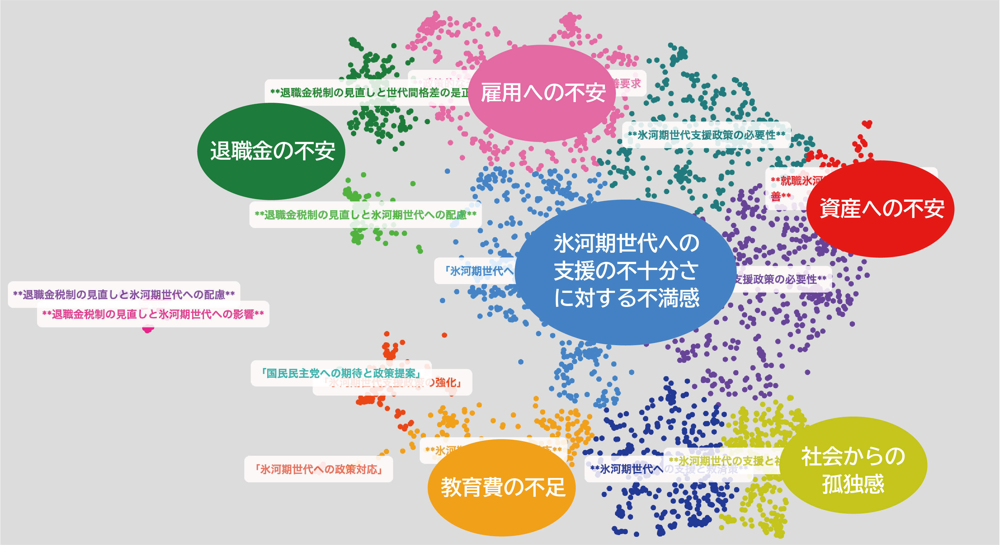

# 第4章 日本国内におけるブロードリスニングの広がり

文責: tokoroten

## 国民民主党、国会質問で「論点地図」を活用

### 就職氷河期世代の声を可視化し、政策の偏りを指摘

2025年3月7日、参議院予算委員会で画期的な出来事がありました。国民民主党の伊藤孝恵議員が、TTTCで作成した「論点地図」を資料として提示し、石破総理に質問を行ったのです。これは日本の国会で初めて、ブロードリスニングの結果が政府への質問の根拠として用いられた事例となりました。

伊藤議員が取り上げたのは、就職氷河期世代（40代）が抱える生活課題です。電話窓口「こくみん電話（5930）」、Googleフォーム、SNS、YouTube配信中のコメントなど、複数のチャネルから意見を収集し、TTTCで分析しました。その結果を散布図として可視化したものが、国会質疑の資料となったのです。

*図：伊藤孝恵議員が参議院予算委員会で提示したTTTCによる論点地図（出典：国民民主党、2025年3月7日）*

この散布図には、一つひとつの点が一人ひとりの意見を表しています。伊藤議員は資料を示しながら、こう質問しました。

> 「総理、資料をご覧ください。この1つ1つの点が一人ひとりの意見です。雇用、退職金、生涯賃金、年金、資産形成、住宅、団塊世代の親介護やダブルケア、孤独孤立。政府の政策は雇用に偏りすぎています。再検討が必要ではありませんか」

これに対して当時の石破総理は、「雇用が中核を占めると思っておりますので雇用というものに重点を置いてまいりましたが、今委員御指摘の雇用に偏っているという御指摘は……何をどのように改善していくべきとお考えなのか、また御指摘を承りながら必要に応じて答弁をいたしてまいります」と答弁しました。政府は雇用を重視してきたことを認めつつも、「雇用に偏っている」という指摘を受け止め、具体的な改善策を求める姿勢を示したのです。
https://kokkai.ndl.go.jp/txt/121715261X00420250307/304

### 「論点地図」が明らかにした政策の見落とし

この質問が示しているのは、まさに3章で説明した「論点地図」の機能です。ブロードリスニングによって以下が明らかになりました：

**論点の可視化**：就職氷河期世代が抱える課題は、雇用だけではありませんでした。退職金、生涯賃金、資産形成、住宅、親の介護、ダブルケア（育児と介護の同時進行）、孤独孤立など、多岐にわたる論点が存在していました。

**政策の偏りの発見**：政府の就職氷河期世代支援策は、雇用問題に重点が置かれていました。しかし、論点地図を見ると、住宅や介護、資産形成など、雇用以外の課題も同様に重要であることが分かります。これは政策立案者が想定していなかった「見落とし」です。

**具体的な政策提案**：伊藤議員は、可視化された論点に基づいて具体的な政策を提案しました。教員等の公務員の氷河期採用、企業の年齢別賃上げ率の可視化（人的資本情報開示義務）、確定拠出年金の運用支援、国民年金や厚生年金の追納制度の拡充、単身者の入院時の身元保証制度の再設計などです。

### ブロードリスニングが変えた質問の質

従来の国会質問では、議員や政党が「重要だと考える論点」について質問していました。しかし、それが実際に国民が困っている論点と一致しているかは分かりませんでした。世論調査を行うこともできますが、そもそも「何を聞くべきか」が分からなければ、適切な質問項目を設定できません。

ブロードリスニングは、この問題を解決します。市民が自由に意見を述べ、その中から浮かび上がってきた論点を基に質問することで、「国民が実際に困っていること」と「政府の政策」のギャップを明確に示すことができるのです。

伊藤議員の質問は、「何パーセントの人がこう思っている」という民意の測定ではありません。「こういう視点で困っている人たちがいる」という論点の提示です。そして、その論点が政府の政策から抜け落ちているのではないか、という問題提起なのです。

### 画期的な国会質問の裏側で何が起こっていたのか

日本の国会で初めて、ブロードリスニングの結果が政府への質問の根拠として用いられた2025年3月7日。この画期的な出来事は、突然生まれたわけではありません。

時計の針を約8ヶ月前に戻しましょう。

### 安野貴博氏の都知事選での実績とDD2030の立ち上げ

2024年7月の東京都知事選挙で、安野貴博氏はTTTCを活用した選挙戦を展開しました。SNS、電話、Googleフォームなど多様なチャネルから有権者の声を収集し、AIで分析・可視化することで、「ブロードリスニング」を選挙の中心に据えたのです。結果として15万票超を獲得し、30代候補者としては過去最多の得票となりました。この実績は、AIを活用した民主主義の可能性を示すものとして注目を集めました。

都知事選での経験を踏まえ、安野氏は2025年1月16日、「デジタル民主主義2030」プロジェクトを発表しました。TTTCや広聴AIなどのブロードリスニング技術をオープンソースで提供し、政党や自治体が誰でも利用できる仕組みを構築する。そして、AIを活用した政治・行政改革を日本全体に広げる。そんな壮大な構想でした。

### 発表から5日で参画を決めた国民民主党

この呼びかけに最も早く反応したのが、国民民主党でした。わずか5日後の2025年1月21日、榛葉賀津也幹事長が伊藤孝恵参議院議員に参入を指示したのです。榛葉幹事長はこの技術を「これこそAIの正しい使い方。目の前にはない声、隠れた声、声なき声、これらを集約できるというのは民主主義の救世主」と絶賛しました[^kokumin1]。

しかし、導入は簡単ではありませんでした。安野氏が出した条件は「ハイスペックなSEをフルタイムで用意すること」。伊藤議員は古巣のIT企業を訪ね、条件に合うSEを確保しました。GitHub、Python、TypeScriptなど高度なスキルを持つエンジニアの存在が、ブロードリスニング活用の鍵だったのです。

2025年1月24日には、国民民主党のYouTubeチャンネル「Go!Go!こくみんライブ」で安野氏を招いた特別配信を実施しました[^kokumin2]。配信では榛葉幹事長が「わけのわからない俺でもワクワクする」「安野さんをデジタル担当大臣にしたらいい」と興奮気味に語り、「日本の宝だよ、安野さんは」と絶賛する場面もありました。

[^kokumin1]: Japan In-depth「【伊藤孝恵参院議員に聞く】（上）国民民主党、AIで変わる政治の形」2025年1月、https://japan-indepth.jp/?p=86169

[^kokumin2]: 国民民主党YouTubeチャンネル「Go!Go!こくみんライブ特別編 安野貴博氏に聞く！デジタル民主主義」2025年1月24日、https://www.youtube.com/watch?v=iR0W7kyaV7c

[^kokumin3]: JBpress「参院選に向け「AIでファクトチェック」を準備、民主主義を守る国民民主党の取り組み」2025年5月22日、https://jbpress.ismedia.jp/articles/-/88434

[^kokumin4]: 日本経済新聞「参院選 国民民主が躍進、17議席獲得」2025年7月20日、https://www.nikkei.com/article/DGXZQOUA146GD0U5A710C2000000/

[^kokumin5]: 新国民党「榛葉幹事長 参院選後の臨時国会 記者会見」2025年8月1日、https://new-kokumin.jp/news/business/20250801_3

[^kokumin6]: 国民民主党「伊藤孝恵参議院議員、党コミュニケーション統括本部長に就任」2025年9月16日

[^kokumin10]: 東海テレビ「【特集】AIで民主主義は変わるのか デジタル民主主義2030の挑戦」2025年3月20日

### 実装の壁と対策

このYouTubeライブ配信で、伊藤議員は実際にTalk to the Cityを使ってみた経験から、5つの壁があると率直に報告しました：

1. **組織の意思決定の壁** - 「ブロードリスニングとは何か」を説明するところから必要。榛葉幹事長の指示から1.5日では足りず、実際には4日間かけてAIを教育した
2. **人材確保の壁** - GitHub、Python、TypeScriptなど高度なスキルを持つフルタイムSEが必須
3. **AIを育てる壁** - プロンプト調整は素人には困難。専門的なスキルが必要
4. **お金の壁** - 日本中の意見を集めるにはデータ収集・分析コストが膨大
5. **デジタルデバイドの壁** - ネットを使わない層へのアプローチが課題

これらの課題に対し、国民民主党は電話番号「5930（こくみん）」を取得し、電話の声もテキスト化してAIに取り込むという対策を講じました。また、郵送、メール、現地インタビューなど、多様なチャネルを活用することで、デジタルデバイドの克服を図りました。

### こくみんAIプロジェクトの始動

ブロードリスニングの本格活用に向けて、国民民主党は「こくみんAIプロジェクト」という専用プラットフォームを立ち上げました[^kokumin7]。このプラットフォームは党員のみが意見を投稿できる仕組みとなっており、党として取り組むべき政策課題について、党員の声を直接集めることができます。

特に就職氷河期世代の政策については、専用のページが設けられ、党員から具体的な生活課題や政策ニーズを収集しました[^kokumin8]。ここで集められた意見は、電話窓口やGoogleフォーム、SNSなどで収集された一般市民の声と合わせてTTTCで分析され、2025年3月7日の国会質問の根拠資料となったのです。

[^kokumin7]: こくみんAIプロジェクト、https://kokumin-ai.jp/

[^kokumin8]: こくみんAIプロジェクト「就職氷河期世代の方々への政策」https://kokumin-ai.jp/policy/cm7x46uoq00004b07tq7kfldf

### 党大会での実証実験

2025年2月11日の党大会では、リアルタイムでAIを活用する実証実験が行われました。会場とサテライト会場から意見を収集し、Googleフォームで約2000件（分割後4000弱）の意見を集めました。Talk to the Cityで分析した結果、最大のクラスタは「国民生活の向上と社会保障の強化」となり、党員が重視する論点が可視化されました。国民民主党は、有権者から集めた「意見」や「アイデア」の一部を党大会で紹介するという、これまでにない斬新な取り組みにチャレンジしたのです。

### そして、3月7日の国会質問へ

党大会から約1ヶ月後の2025年3月7日。伊藤孝恵議員は、こくみんAIプロジェクトや電話窓口、SNSなどから収集した就職氷河期世代の声をTTTCで分析した論点地図を手に、参議院予算委員会で石破総理に質問を行いました。冒頭で紹介したあの歴史的な場面です。

DD2030の発表からわずか50日。政党が新しい技術を政策決定プロセスに組み込む速度として異例のものでした。この国会質問は、2025年3月20日に東海テレビが「デジタル民主主義」特集として報道するなど[^kokumin10]、メディアでも注目を集めました。

### 参院選での全面活用と歴史的躍進

国会質問での成功を受け、国民民主党はブロードリスニングを参議院選挙の公約作成にも全面的に活用しました。

こくみんAIプロジェクトでは、参院選に向けて6万件を超える意見が寄せられました[^kokumin9]。国民民主党は、これらの意見すべてに対して政策草案が十分に応えられているかを確認するため、AIによるスコアリング判定を導入しました。この手法は、国会質問で使用したTTTCの散布図による可視化とは異なるアプローチで、政策と意見の対応度を数値化して評価するものです。具体的なアルゴリズムの詳細は公開されていませんが、大規模な意見を政策立案に反映させる新たな試みとして注目されました。

[^kokumin9]: こくみんAIプロジェクト「国民民主党は、第27回参議院議員選挙で掲げる政策各論を、党の仲間たちにチェックしてもらいます」https://kokumin-ai.jp/policy/cmap6lucv00007s0787qbbahw

選挙戦略の一環として、2025年5月22日にはAIを活用したファクトチェックの仕組みを導入することを発表。伊藤孝恵議員がYouTube番組で明らかにしたこの取り組みは、選挙期間中の誤情報がSNS空間で流布され選挙戦に悪影響を及ぼすのを防ぐ狙いがありました[^kokumin3]。

2025年7月の参院選前、伊藤孝恵広報委員長（当時）は日本経済新聞のインタビューで、「X（旧ツイッター）の投稿、YouTubeのコメント、Googleフォームのアンケート、政党の電話窓口」のデータを生成AIで分析し、参院選の公約に盛り込んだことを説明しました。

2025年7月20日の参院選投開票で、国民民主党は17議席を獲得。改選4議席から4倍超という歴史的な躍進を果たしました。比例代表では762万票超を獲得し、野党第1党の得票数となりました[^kokumin4]。

2025年8月1日の参院選後の臨時国会で、榛葉幹事長は会見で「改選4議席だった国民民主党は17人当選、非改選と合わせて22人、会派を含めると参議院で25名の勢力」と発表。予算を伴う法案を単独提出できる規模にまで成長したことを強調しました[^kokumin5]。

この結果を受け、2025年9月16日には伊藤孝恵議員が新設の「党コミュニケーション統括本部長」に就任[^kokumin6]。ブロードリスニングを含むデジタルコミュニケーション戦略を党全体で統括する体制が整備されました。ブロードリスニングは、もはや実験的な取り組みではなく、党の中核的な戦略として位置づけられたのです。

