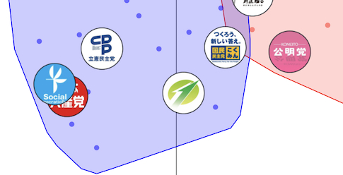
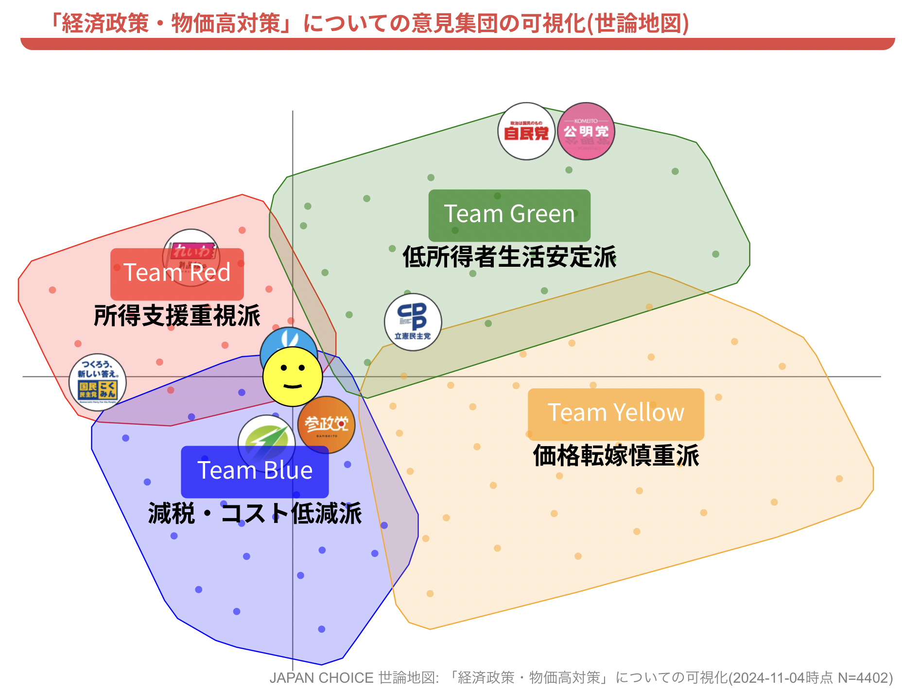

## 世論地図——Polisを核に、選挙の現場で世論を可視化する

文責: 西尾泰和

「世論」は、しばしば一本の軸に押し込められます。右／左、保守／リベラル、賛成／反対。けれど現実は、そんなに単純ではありません。

同じ人でも、ある争点ではあなたと同じ側に立ち、別の争点ではまったく反対の側に立つことがあります。人々の意見は一直線上に並ぶのではなく、多様な争点ごとに異なる立場を持ち、複雑に分布しています。この複雑な構造を「地図」として可視化できないか。それが私たちの問いでした。

その答えが、衆院選2024の期間に日本最大級の選挙情報サイトJAPAN CHOICEの一部としてリリースした「世論地図」です。2024年11月18日にリリースし、約2週間でユニークユーザ4,403名が投票しました。内部で部品としてPolisを使っているため、日本最大規模のPolisの応用事例と言えるでしょう。体験ページや解説記事、プレスリリースは脚注にまとめています[^beta][^note][^press]。

[^beta]: 世論地図（β版）体験ページ：`https://japanchoice.jp/polis`
[^note]: 解説記事（Mielka note）：`https://note.com/mielka/n/n54313c84a5e5`
[^press]: プレスリリース（JAPAN CHOICEアップデート/全機能公開）：`https://prtimes.jp/main/html/rd/p/000000013.000029162.html` / `https://prtimes.jp/main/html/rd/p/000000014.000029162.html`

筆者はこの開発にエンジニアとして関わりました。
この章で書きたいのは「Polisを使いました」という紹介ではありません。Polisという技術を核にしつつ、日本の選挙という現場で使うために何を変える必要があったかの記録です。

## きっかけ

きっかけは2024-01-13に遡ります。

2023年4月のPlurality Tokyoはスマートニュース社のオフィスで開催され、社長の鈴木健氏の周りに「なめらかな社会とその敵」を愛読する人たちが集結し、「なめらかな社会とその敵」をコアにして現代の技術や知見に接続していこうとする勉強会が立ち上がりました。これが後に「なめら会議」と呼ばれるようになります。2024-01-13に第3回のなめら会議が開催され、ここにJAPAN CHOICEを運営するNPO法人Mielkaの代表理事の結城東輝氏が参加されました。この場でPolisの面白さについて話が盛り上がり、2024年秋の衆院選に合わせてJAPAN CHOICEでPolisをやる計画が立ち上がりました。

筆者はPlurality Tokyoの発起人の一人でもある高木俊輔氏と共に議論に参加しました。この議論の結果、早い段階でPolisをそのまま使う路線を見切り、Polisを部品として使う路線に舵を切りました。

## なぜ「そのままのPolis」ではいけなかったのか

台湾のデジタル民主主義で10年以上使われてきたPolisは、各ユーザが主張に対する賛成反対を投票することで、ユーザの意見の分布図が作られる仕組みです。

このプロセスの前半の、「主張に対する賛否を集める」の部分は、従来型の投票マッチングと同じ仕組みです。従来の投票マッチングはその情報を集めた結果を「あなたの意見に近い政党はX党です」と一次元のランキングの形で表示していました。Polisを使うなら「みんなの意見の地図」の中に「あなたの意見」がプロットされ、その地図の中に「政党の意見」もプロットされていることで、二次元の地図として自分の意見がどの政党に近いのかがわかります。

しかし、Polisをそのまま使うことはできないと判断しました。

### 85%がモバイル、という前提から逆算する

JAPAN CHOICEは選挙情報サイトとして、モバイル比率が圧倒的に高いです。約300万ユニークユーザのうち85%がモバイル。当時のPolisをスマホ画面で確認したところ、満足いく水準には到達しないことがわかりました。

そこで、フロントエンドを日本の利用状況に合わせてフルスクラッチで作り直しました。いわゆるモバイルファーストの開発と呼ばれるもので、ユーザがスマートフォンの狭い画面で使うことを大前提とする設計です。

また、英語を読めない、英語が目に入るだけで拒絶反応を示して離脱してしまうユーザが多い日本の状況を鑑みて、UXに一切英語が出ないようにローカライズすることにしました。

この「フロントエンドを作り直す」という意思決定はエンジニアリングコストの高いものでしたが、結果として自由度の高い実験が可能になりました。

## 価値の中心は「政党アイコン」

世論地図でやりたかったのは、単に「市民の点群を可視化する」ことではありません。市民の意見分布の上に、政党を重ね合わせることでした。

投票対象の意見は、各政党のマニフェストから抽出しました。そして各党がその意見に対して賛成／反対／中立のどれに当たるかをデータ化し、散布図上に政党アイコンとして表示しました。これによって、ユーザは自分の意見がどの政党に近いのかや、世の中にどのような意見グループがあってどの政党がそのグループを代表しているのか、どのグループはどの政党にも代表されていないのかが可視化されます。

経済政策に関する意見集団の可視化です。右下に政党のアイコンがついていないクラスタがあることがわかります。

## 品質維持のために「自由投稿」を切る判断

そしてこの価値を成立させるために、避けられない設計判断が出てきます。

Polisでは、参加者が自由に主張文を投稿できます。熟議の理想から見れば、これは議題設定の権限を人々に開放することです。

可能であれば自由投稿ができる場にしたかったのですが、人々が自由登校した主張に対して、政党は賛成反対を投票してくれません。人々がどんどんと新しい意見を投稿していくと、政党アイコンは「ほとんどの質問に回答していないユーザ」として可視化されることになります。これは政党アイコン表示の価値を台無しにしてしまいます。

また、ユーザの投稿の中には、特定の党を持ち上げたり、貶したりする発言が含まれる可能性が高いです。これをそのまま他のユーザに見せることは、政党中立的な選挙情報サイトとしての価値を損ねてしまいます。モデレータが慎重にレビューしてから公開することが必要になるでしょう。これは高コストです。台湾のPolis運用事例でも、モデレータの負担が大きすぎるという議論が行われています。

世論地図の2024年のリリースでは、ユーザによる意見投稿を受け付けない設計にしました。参加者は、運営者が用意した主張文に投票するだけです。これは苦渋の決断でした。議題設定の権限を人々に開放した時に何が起こるか、いつか実験してみたいと思っています。

もちろん、大部分のユーザは投票マッチングサイトを自分の意見を投稿する場として認識していません。運営が整えたのではない、インターネット上の誰だかわからない人の主張文に対して賛成反対を投票する場を期待していません。つまり、投票マッチングサイトにくる人は、そこを熟議の場として期待していないのです。

これはPolisの中に、投票マッチングと相性の良い部分とそうでない部分があるということです。自由投稿ができる熟議プラットフォームとしての側面は、投票マッチングとは相性が良くありませんでした。最初から理想の全部入りを目指すのではなく、まずはやりやすいところから一歩進むことが大事なのです。

---

## ステートメント抽出は、人間がやった

世論地図の土台は「政党マニフェスト由来の主張文」という制約でできています。この主張分の抽出はどうやったのでしょうか。AIで簡単にできるのでしょうか。

選挙という環境では、ハルシネーションが致命傷になります。2024年衆院選、2025年参院選の段階で私たちは実験をしましたが、十分な品質ではないと判断して採用しませんでした。また、ここは2012年衆院選から投票マッチングを継続運営しているJAPAN CHOICEの長期的な運用経験が強みになる領域と言えます。

もちろん2030年までには、AIが瞬時に叩き台を作ってくれて、人間はそれが正しいかをしっかりレビューする、という分業体制になっていくかもしれません。

### 座標計算をクライアントで行う決断

世論地図では投票に応じて、自分の位置が散布図上で即座に動きます。これはPolisにもない体験です。自分の行動の結果が即座にフィードバックされることは体験の質を高めます。

これは、主成分分析（PCA）における射影行列をクライアント側にも持たせることで実現しています。ユーザの投票ベクトルをその射影で2次元へ落とし、サーバ問い合わせなしに位置を更新できるようにしています。

この設計には良い追加効果があります。Polis計算サーバを止めても、投票による位置の更新ができることです。選挙期間終了に伴って、現在Polis計算サーバを止めています。ユーザはそれでも自分の意見を投票して地図上での自分の位置が更新されていくことを体験できます。選挙が終わったあとに「動態展示」として残せるのは、公共性の観点でも利点でした。

### AIで意見グループの解説を作る

オリジナルのPolisのクラスター情報表示は、統計やデータ分析に慣れていない人には読み取りにくいものでした。そこで「クラスターを特徴付ける意見」をLLMに渡し、グループの説明文と短いラベルを生成して散布図の下に表示することにしました。これは筆者がTalk to the Cityの解説生成フェーズを参考にして作りました。

しかし、LLMは数字の読み方を間違えることがあります。たとえば「クラスタ内は70%賛成, 10%反対、クラスタ外は90%賛成, 3%反対」のような特徴の場合、そのクラスタの“他との違い”は「相対的に反対が多いこと」です。しかし、LLMは「賛成が多い」と要約してしまうことがあります。解説を作成して公開するところを全自動化すると、このような間違いが世に出てしまうことになります。

そこで選挙期間中の更新をリアルタイムではなく、人間レビューを経た上での更新をすることにしました。

## 可視化で浮かび上がった「政治の空白」

経済政策の地図では、政党アイコンが付かないクラスターが観察されました。つまり、そこにいる人々の意見は、既存政党によって十分に代表されていない可能性があります。これは「支持政党がない人がいる」という話とは違います。政党の側が世論を十分にカバーする多様性を持っていないのです。

再掲: 経済政策に関する意見の可視化

この図は経済政策に関する意見集団の可視化です。右下に政党のアイコンがついていないクラスタがあることがわかります。つまりこのグループの意見は既存の政党によってあまり代表されていません。間接民主制では民衆が自分たちの意見を代表している代議士を選びます。ここに暗黙の前提として「自分たちの意見を代表している代議士が選択肢の中に含まれている」という仮定があります。この仮定が正しくない可能性がデータによって示されました。

このグループのAIによる解説は以下の通りです:

>Team Yellow 価格転嫁慎重派
>🤖このチームは中小企業の価格転嫁支援による賃上げ実現に対して、他のグループと比較して相対的に慎重な姿勢を示しています。また、消費税の引き下げや廃止に明確に反対しており、低所得者世帯への給付金支給にも懐疑的です。

世論地図によって捉えられたこの政治の空白地帯は、民間企業の商品開発に例えるなら「顧客が存在することがわかっているのに、その顧客が求めている商品を競合他社が出していない」という状況です。このような調査がきっかけになって、新しい政党が生まれるかもしれませんね。

## 公共財としての結び：オープンデータと反復のために

2025-05-08、世論地図2024の投票データはオープンデータ化され、オープンソースになりました。CSVと画像はCC BY 4.0で提供されています[^opendata]。

[^opendata]: 世論地図2024オープンデータ： `https://github.com/mielka/yoronchizu2024-data`

これは「成果物を配る」以上の意味があると思っています。選挙のたびに、いろいろな出来事がありますが、選挙が終わったら忘れ去られて消えてしまう。そういうサイクルの外に、検証可能で再利用可能な“民主主義のインフラ”を作っていきたいのです。選挙のたびに少しずつ蓄積され、改善されていく仕組みが作りたいのです。

衆院選2024での世論地図リリースは、あくまで一回目の実験でした。今後、自由投稿を可能にするか、LLM支援をどう入れるか、主張文抽出をどう半自動化するか。課題は残っています。

ただ、一つだけ確信しています。
Polisをそのまま輸入してそのまま使ったのでは、今回の成果は得られなかったでしょう。現場の状況に合わせて、作り変え、改善していくことが大事です。その作り替えの記録こそが、次の実装者にとっての実践知になります。
