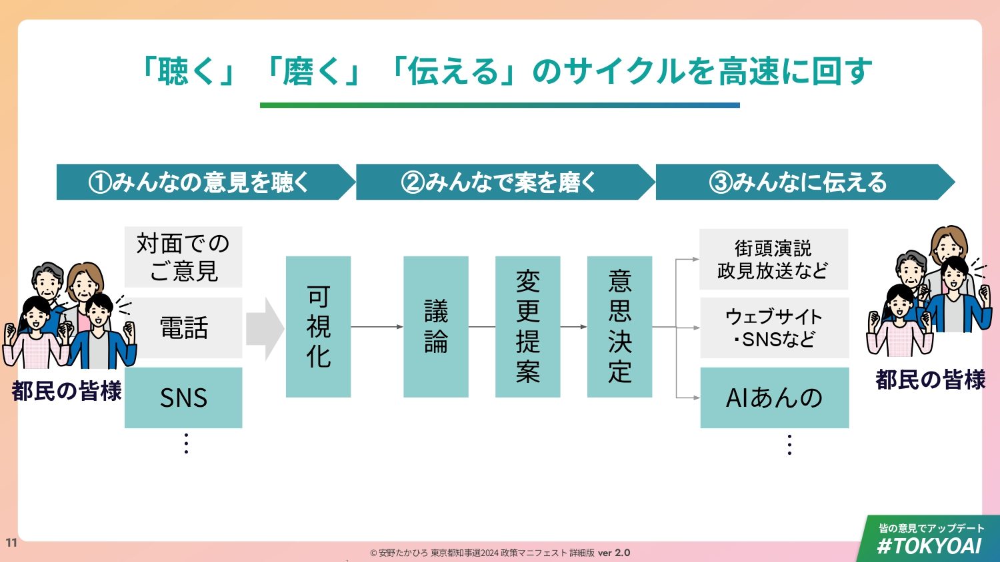

# 2024年 東京都知事選 安野貴博の取り組み

2024年7月の東京都知事選挙において、安野貴博候補の陣営は「デジタル民主主義」を掲げ、ブロードリスニング技術を選挙運動に本格的に導入した。筆者、西尾泰和は安野氏の技術サポーターとしてこの取り組みに参加した。本節ではその実践と得られた知見を報告する。

## Talk to the Cityとの出会い

この取り組みの始まりは、都知事選の約2ヶ月前に遡る。

筆者と安野氏は、一般社団法人未踏が運営する「未踏ジュニア」のメンターとして以前から面識があった[^mitou-jr]。未踏ジュニアのコミュニティでは、2023年4月に開催された「Plurality Tokyo」の発起人の一人である新美陸人氏が未踏ジュニアの修了生であったこともあり、2023年からPluralityが話題になっていた。筆者はPlurality本の日本語化プロジェクトのリーダーを務めており、安野氏がその詳しい話を聞きたいと連絡をくれたのが2024年5月13日のことである。

筆者は安野氏をPlurality Tokyoの発起人の一人であるCode for Japanの関治之さんに紹介した。5月23日、関さんと安野さんと西尾のミーティングが開かれ、この場で関さんが「Talk to the City」（TTTC）というツールを提案した。TTTCは、AI Objectives Instituteが開発したオープンソースツールで、大規模なテキストデータをAIでクラスタリングし、意見の分布を可視化する[^aoi-tttc]。

5月30日、筆者は早速TTTCを試した。題材としては、安野氏の提案でAI関連のパブリックコメント約2万件とした。翌31日には、関さんが2024年度人工知能学会全国大会のオーガナイズドセッション「AIとデモクラシー」で基調講演「シビックテックによる、社会と民主主義のアップデート」を行い、この分析結果を紹介した[^hal-sk-jsai]。

[^hal-sk-jsai]: 関治之「シビックテックによる、社会と民主主義のアップデート」2024年度人工知能学会全国大会 OS-8「AIとデモクラシー」基調講演, 2024年5月31日. https://speakerdeck.com/halsk/sibitukutetukuniyoru-she-hui-tomin-zhu-zhu-yi-noatupudeto （23ページ目に分析結果を掲載。分析レポートは https://github.com/nishio/tttc_aipubcom_japan で公開）

筆者がもともと情報処理学会の論文誌に掲載していた「ブロードリスニング」の手描き図を、このタイミングでCC0ライセンスとして公開した。この図は後に安野氏のマニフェストに採用され、テレビなど複数のメディアでも放映されることになる。

(図をここに入れる)

こうして都知事選の告示前に、TTTCを実際に動かし、その可能性を確認することができた。この経験を踏まえて安野氏は選挙期間中にTalk to the Cityを用いたブロードリスニングを実施することを決定した。分析チームには、筆者に加えて、安野氏と大学の研究室・サークルで同期だったSNS分析研究者のM氏が参加した[^m-note]。

この準備期間があったからこそ、選挙期間中に30件以上のレポートを作成するという運用が可能になったのである。

[^m-note]: M「SNS研究者から見た都知事選〜ここがすごいよTTTC〜」note, 2024年7月. https://note.com/m_datasci/n/n3a5f4b9cdee5

## なぜ選挙でブロードリスニングなのか

選挙において、候補者・陣営が有権者の関心を知ることは重要だが、従来の手段にはそれぞれ限界がある。街頭演説や集会には熱量の高い支持者が集まりやすい。アンケートは設問設計に左右される。SNSは声が大きい人が目立ち、炎上や組織的な書き込みの影響も受ける。

ブロードリスニングは、こうした偏りをゼロにするものではない。しかし、従来の手段とは異なる新たなチャネルを通じて多様な声を集めることで、既存の手法では見えにくかった意見の全体像を補足的に把握できるようになる。これが選挙において有益だと考えた。

## 声を集める仕組み

安野陣営では、複数のチャネルを通じて有権者の声を収集した。

**#TOKYOAIハッシュタグ**：X（旧Twitter）上でこのハッシュタグを付けて投稿することを呼びかけ、X APIを用いてハッシュタグ検索を行い、投稿を収集した。

**匿名意見箱**: Googleフォームを用いて、誰でも匿名で意見を投稿できる仕組みを追加した。SNS上で政治的な発言をすることを好まない人や、そもそもTwitterアカウントを持っていない人も少なくない。そうした人々の声を拾うために、匿名意見箱は重要な役割を果たした。

**AIあんのへの質問**: YouTube Liveを用いて人々の質問に答える「AIあんの」を提供した。このAIあんのに対する質問も、人々が何に関心を持っているのかを知ることができる有用な情報源となった。技術的にはYouTubeコメントの収集である。

**AI音声電話**：IP電話にリアルタイム性の高いSpeech-to-textを使うことで、電話とAIあんののシステムを接続した。電子的なテキスト入力に不慣れな層に対して慣れた音声でのアクセス手段として設計したものである。これもYouTubeでのAIあんの質問と同様に有用な情報源となった。

**マイナ投票**：POCKETSIGN社の電子投票実験アプリを活用し、マイナンバーカードで本人確認をした上で政策への賛否を表明できる仕組みも導入した。これは後述するPolis分析の入力データとなった。

**GitHub**: GitHub上でマニフェストに対する提案を投稿可能にした[^github-manifesto]。

前章で触れた狭義/広義のブロードリスニングという区別を用いて整理すると、#TOKYOAI／匿名意見箱／マイナ投票は主に情報の収集と分析・可視化のみを行う「狭義のブロードリスニング」の意味合いが強いものであった。
一方で、特に#TOKYOAIで収集されたデータのTalk to the Cityでの散布図としての可視化は、見た目のインパクトの強さから人々によく知られることになった。

GitHubでの意見募集やAIあんのへの質問の収集は、より大きなシステムの一部としての情報収集であった。これらは「広義のブロードリスニング」を構築しようとする試みの一部でした。都知事選のマニフェストでは "「聴く」「磨く」「伝える」のサイクル" と表現されていました。

「聴く」「磨く」「伝える」のサイクル(安野氏のマニフェストより引用)

## Talk to the Cityによる意見の可視化

#TOKYOAIハッシュタグの投稿と匿名意見箱から集まった意見は、TTTCで分析した。

TTTCの処理は大きく3段階に分かれる。

1. **前処理（抽出）**：生成AIが投稿から意見を抽出する
2. **クラスタリング**：テキストを数千次元のベクトルに変換し、類似した意見をグループ化する
3. **後処理（ラベリング・要約）**：生成AIが各クラスタにラベルを付け、代表的な意見を要約する

最終的に、意見の分布を2次元の散布図として可視化し、どのような意見群があるのかを俯瞰できるレポートが出力される。

選挙期間中、我々は30件以上のレポートを作成した。たとえば匿名意見箱からは951件の意見を可視化した。

## 分析結果のマニフェストへの反映

TTTCによる分析は、実際の政策形成に活用された。

匿名意見箱の分析で、子育て支援における所得制限の撤廃を求める声が複数の投稿から浮かび上がった。これを受けて、マニフェストをver1.0からver2.0に更新する際、この要望を反映した。マニフェストの変更履歴はGitHubで公開し、いつ・なぜ・どのように変更したかを透明化した。

このプロセスは「有権者の声を聞いて政策を作る」というブロードリスニングの理念を、選挙という場で実践したものである。

## Polisによる意見グループの可視化

マイナ投票で集めたデータは、台湾のデジタル民主主義で活用されているPolisの手法で分析した。Polisは、賛成・中立・反対の回答データから意見のグループを抽出・可視化する技術である。

都民に絞った匿名化データを分析した結果、4つの意見グループが抽出された[^polis-analysis]。

**グループ0（地方分散派）**：東京一極集中に反対（91.9%）、明治神宮外苑再開発に反対（75.7%）

**グループ1（都市開発重視派）**：東京一極集中に反対（97.2%）だが、明治神宮外苑再開発には賛成（94.4%）

**グループ2（都市保全・地域支援派）**：明治神宮外苑再開発に反対（83.9%）、多摩地区支援に賛成（83.9%）

**グループ3（都市機能強化派）**：明治神宮外苑再開発に賛成（83.9%）、地下シェルター整備に賛成（71.0%）

この分析から、単純な二項対立ではない意見の多様性が見えてきた。たとえば「東京一極集中への態度」と「再開発への態度」は必ずしも連動しない。また、複数のグループから支持される「橋渡しする意見」を見つけることで、対立を超えた議論の糸口を探ることができる。

## 技術的な課題と対応

選挙という時間的制約の中で、いくつかの技術的課題に直面した。

**Git LFS問題**：チーム内でGit LFSの有効化状況が統一されておらず、ファイル管理に混乱が生じた。最終的にGit LFSを無効化側に統一することで解決した。30件以上のレポートを作成してもデータサイズの問題は発生しなかった。

**プレビューサーバの構築**：非公開レポートをチーム内で共有するため、Netlifyでホスティング環境を構築した。GitHubにプッシュすると数分でパーマリンクが生成され、Slackで共有できるようになった。ただし、公開前のレポートを関係者のみで確認し、フィードバックを収集する仕組みには課題が残った。この経験が、後に「広聴AI」を開発するきっかけの一つとなった。

**日本語化対応**：TTTCは英語優先の設計だったため、日本語での利用には工夫が必要だった。初の試みなので最も低コストな方法で実験を繰り返すという方針のもと、LLM翻訳プロセスを省略し、UI日本語訳をコードに直接埋め込むパッチを作成・公開した。

**処理時間**：GPT-4oを使用した場合、1000テキストの処理に約20分、10000テキスト以上では1時間以上かかる。選挙期間中は継続的にレポートを更新する必要があり、この処理時間との戦いでもあった。

**ハルシネーション対策**：生成AIによる意見抽出では、ハルシネーション（事実に基づかない生成）を完全にゼロにすることはできない。プロンプトの工夫と複数回実行による確認で対応したが、最終的には分析者による目視確認が必要であった。

## 得られた知見

この取り組みから得られた知見をまとめる。

**分断の「隣接関係」が見える**：クラスタリングによって、意見の対立構造だけでなく、どの意見群が近いのかという「隣接関係」も見える。これにより、対話の設計がしやすくなる。

**説明の優先順位が変わる**：どの論点で誤解が生じやすいかが分かるため、説明の優先順位を調整できる。

**「安全な共感」の提供**：支持者が「自分と同じ意見の人がいる」と可視化されることで、安心感を得られる。これは参加のモチベーションにもつながる。

**技術とリーダーシップの関係**：一緒に分析を担当したM氏は「技術がわかる人間がリーダーでないと、良いツールを組織として活用するのは難しい」と指摘している。安野候補自身がAIエンジニアとしての経験を持っていたことが、この取り組みを可能にした一因であろう。

## 選挙結果と今後

安野たかひろ候補は154,638票（得票率2.3%）を獲得した[^tochiji-result]。これは30代候補としての最高得票数であり、政党の支援組織を持たない新人候補としても異例の結果であった。

この選挙でのブロードリスニングの実践は、日本の選挙におけるデジタル民主主義の可能性を示す先駆的な事例となった。技術的な課題は多く残るものの、「有権者の声を聞いて政策を作る」というプロセスを、短い選挙期間の中で実際に回すことができたことには意義がある。

この得票率2%以上という結果は、2025年に安野氏が政党「チームみらい」を立ち上げる後押しにもなった[^team-mirai]。都知事選で培った「デジタル民主主義」の理念とブロードリスニングの手法は、その後の政治活動においても中核的な位置を占めている。

なお、ブロードリスニングは選挙に限定された技術ではない。民間企業における顧客の声の分析、自治体における住民意見の収集、NPOにおける支援者との対話など、多様な場面で応用可能である。この点については本書の後半で詳しく扱う。

[^mitou-jr]: 未踏ジュニア メンター紹介. https://jr.mitou.org/mentors/
[^aoi-tttc]: AI Objectives Institute "Talk to the City". https://ai.objectives.institute/talk-to-the-city-1
[^github-manifesto]: 安野たかひろ 東京都知事選2024 マニフェストリポジトリ. https://github.com/takahiroanno2024/election2024
[^polis-analysis]: 西尾泰和「デジタル技術が民主主義にもたらす未来」note, 2024年7月. https://note.com/nishiohirokazu/n/n799c9818b33d
[^tochiji-result]: 東京都選挙管理委員会「東京都知事選挙（令和6年7月7日執行）開票結果」. https://www.senkyo.metro.tokyo.lg.jp/election/tochiji-all/tochiji-sokuhou2024/result
[^team-mirai]: ITmedia「AIエンジニアの安野貴博氏、新党『チームみらい』立ち上げ」2025年5月8日. https://www.itmedia.co.jp/aiplus/articles/2505/08/news146.html
