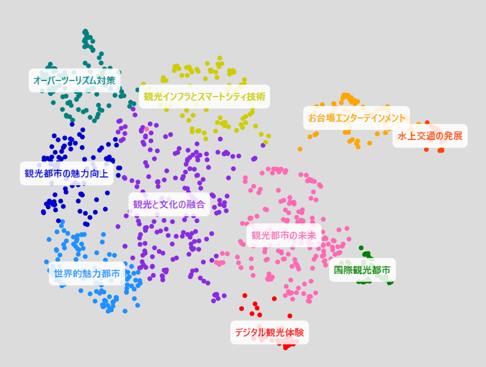
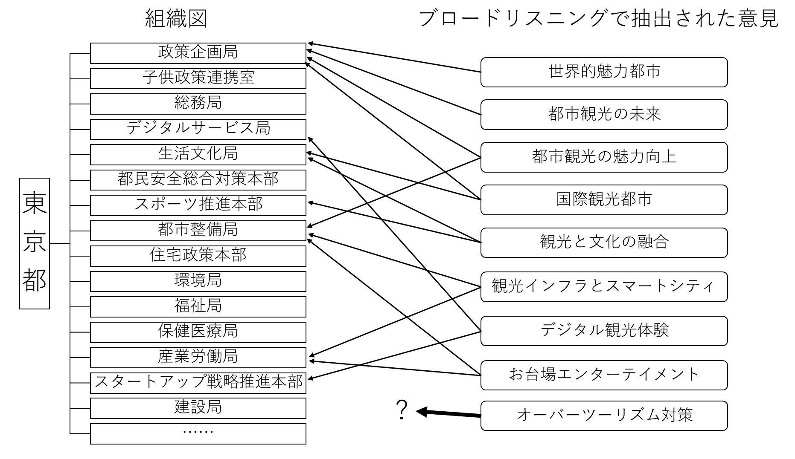

# 第5章 シン東京2050、ブロードリスニングは1400万都市を変えたか

文責：tokoroten

## 5.1 1400万人都市の挑戦：シン東京2050プロジェクト

2024年11月22日、東京都は「[みんなでつくる『シン東京2050』プロジェクト](https://www.seisakukikaku.metro.tokyo.lg.jp/basic-plan/choki-plan/ikenbosyu)」を開始した。2050年代を見据えた新たな長期戦略「2050東京戦略」の策定にあたり、都民の声を広く集めようという試みである。この戦略のキャッチコピーは「東京 もっとよくなる」。すべての人が輝き、一人ひとりが幸せを実感できる「世界で一番の都市・東京」の実現を目指すというビジョンのもとに策定された。

従来、行政が市民の意見を聞く手段といえばパブリックコメントが一般的だった。しかしパブリックコメントには限界がある。形式ばった意見募集に応じるのは一部の関心層に限られ、集まる意見は数百件程度にとどまることが多い。1400万人を超える人口を抱える東京都において、この規模で「民意」を把握することには無理がある。

シン東京2050プロジェクトでは、ブロードリスニングの手法を用いてこの課題に挑んだ。約1か月の募集期間（11月22日〜12月20日）で集まった意見は27,915件。従来のパブコメの数十倍から数百倍という規模である。

意見収集には6つのチャネルが用意された。

1. **専用Googleフォーム**: 最もオーソドックスな方法
2. **X（旧Twitter）**: ハッシュタグ「#シン東京2050」および「#百合子に言っといて」での投稿を収集
3. **YouTube**: 小池都知事の記者会見動画へのコメント
4. **メール**: 従来型のメールでの意見送付
5. **郵送**: デジタルに不慣れな層への配慮
6. **街頭インタビュー**: 街頭で都民の意見を聞き取り

特筆すべきは、SNSからの意見収集である。Xのハッシュタグ投稿やYouTubeコメントを分析対象とすることで、行政の意見募集に自ら応じることのない層の声も拾い上げようとした。

興味深いのは、インターネット経由での募集により、従来のパブリックコメントでは聞こえてこなかった若年層の声が多く集まったことである。行政の意見募集に応じるのは中高年層が中心という従来の傾向が、オンラインチャネルの活用によって変化した。

一方で、デジタルチャネルだけでは届かない声もある。東京都の職員は休日に上野動物園を訪れ、子供たちから直接意見を聞くという取り組みも行った。技術協力を行った安野貴博氏は「データソースを散らすのがひとつ大事なことだと思う」と述べており、オンラインとオフラインを組み合わせた多角的なアプローチが試みられた[^ntv_bl]。

[^ntv_bl]: 日テレNEWS「[AI技術で「民意を見える化」東京都 長期戦略づくりの舞台裏](https://www.youtube.com/watch?v=b8-zEjbZZfk)」（2025年）

技術面では、当時GovTech東京のアドバイザーを務めていた安野氏が協力し、オープンソースの意見分析ツール「[Talk to the City](https://github.com/AIObjectives/talk-to-the-city-reports)」を用いて約2万8千件の意見をAIでクラスタリング・可視化した。

収集された意見は2025年1月31日に[分析結果が公開](https://broadlistening.seisakukikaku.metro.tokyo.lg.jp/20250131/index.html)され、同年3月に策定された「[2050東京戦略](https://www.seisakukikaku.metro.tokyo.lg.jp/basic-plan/2050-tokyo/)」に反映されたとされている。

## 5.2 東京都の公式発表：20+1戦略から28戦略へ

東京都の公式発表によれば、ブロードリスニングの成果は政策体系の大幅な再編として結実した。[公式サイト](https://www.seisakukikaku.metro.tokyo.lg.jp/basic-plan/2050-tokyo/)には次のように記されている。

> AI分析により、都民の関心事項・課題を浮き彫りにし、戦略の政策体系を見直しました。

従来の「[未来の東京](https://www.seisakukikaku.metro.tokyo.lg.jp/basic-plan/choki-plan/)」戦略（2021年策定）では「20+1」の戦略体系だったものが、「2050東京戦略」では28の戦略に拡充された。戦略は「ダイバーシティ」「スマートシティ」「セーフシティ」の3つの柱と「その他（横断分野）」に整理された。

**ダイバーシティ**: 子供、子育て、教育、若者、女性活躍、働き方、長寿、コミュニティ、共生社会

**スマートシティ**: スタートアップ、デジタル、国際金融、産業、観光、文化・エンタメ、スポーツ、まちづくり・住まい、インフラ・交通、緑と水

**セーフシティ**: ゼロエミッション、都市の強靭化、防災、まちの安全・安心、医療

**その他（横断分野）**: 多摩・島しょ、構造改革、オールジャパン、未来共創

東京都はこの再編においてブロードリスニングが重要な役割を果たしたと説明している。特に強調されているのが「観光」の独立戦略化である。従来は「文化・エンターテインメント都市戦略」に含まれていた観光分野が、都民意見の分析によって独立した戦略として位置づけられたという。

東京都の説明を一言でまとめるなら、「東京という超大都市が『観光』というテーマを発見した。すなわちブロードリスニングが政策を変えたのだ」という物語である。この物語は本当か。次節で検証する。

## 5.3 成果の検証：何が変わり、何が変わらなかったのか

### 比較対象の問題

ここで立ち止まって、東京都の発表を検証してみたい。東京都の公式発表では、2021年策定の「未来の東京」戦略と2025年の「2050東京戦略」を比較している。確かにこの比較では、戦略体系は大きく変化しているように見える。

しかし、ブロードリスニングの効果を正しく評価するためには、適切な比較対象を選ぶ必要がある。

*図：2021年策定の「未来の東京」戦略。観光は「文化・エンターテインメント都市戦略」の中の一施策として位置づけられており、独立した戦略体系ではない。コロナ禍・インバウンド停止という時代背景が色濃く反映されている。*

「未来の東京」戦略は2021年3月に策定された。この時期を思い出してほしい。新型コロナウイルスの感染拡大の真っ只中であり、東京オリンピック・パラリンピックの開催すら危ぶまれていた時期である。インバウンド観光は事実上停止し、訪日外国人の統計調査すら中止されていた。

この文脈を踏まえれば、2021年版に「観光」が独立戦略として存在しなかったのは当然である。コロナ禍で観光産業が壊滅的な打撃を受けている最中に、観光振興を戦略の柱に据えることは現実的ではなかった。ただし、2021年版でも観光施策が皆無だったわけではない。多摩地域や島しょ部など、東京における過疎地域のツーリズム推進は盛り込まれていた。インバウンドが期待できない状況下で、都内の地域振興と結びつけた観光政策が採られていたのである。

実際、東京都は毎年「version up」として戦略を更新しており、2024年1月には「未来の東京」戦略 version up 2024が公開されている。この時点で観光施策の重点は大きく変化し、ナイトタイム観光、アニメツーリズム、アクセシブルツーリズムなど、都心部を中心とした都市観光に軸足が移っていた。インバウンド回復を見据えた施策への転換である。

*図：2024年1月公開のversion up。ナイトタイム観光・アニメツーリズム・アクセシブルツーリズムなどインバウンド回復を見据えた施策が大幅に拡充されている。この更新はブロードリスニング実施（2024年11月〜）より前のものだ。*

※出典：[「未来の東京」戦略](https://www.seisakukikaku.metro.tokyo.lg.jp/basic-plan/choki-plan/)（東京都政策企画局）

つまり、ブロードリスニングの実施（2024年11月〜12月）より前に、観光施策の拡充は進んでいたのである。

| 比較 | 印象 | 実態 |
|------|------|------|
| 2021年版 → 2050東京戦略 | 劇的な変化 | コロナ収束・五輪終了・インバウンド回復の4年分を含む |
| version up 2024 → 2050東京戦略 | 漸進的な更新 | ブロードリスニング後の実際の差分 |

また、戦略体系の変化の実態は「新発見」ではなく「分割」である。観光は「文化・エンタメ」から細分化された。「行政が見落としていた分野をAIが発見した」のではなく、「従来一括りにされていた分野を意見の分布に基づいて細分化した」というのが正確な表現だ。

### 消えた戦略の意味

一方で、2021年版から消えた戦略もある。

- **戦略0：感染症に打ち克つ** → コロナ収束により削除
- **戦略19：オリンピック・パラリンピックレガシー** → 五輪から4年経過、スポーツ等に統合

これらの変化はブロードリスニングの結果というより、時代の変化による自然な更新である。コロナが収束すれば感染症対策の優先度は下がり、五輪が終われば「レガシー」は各分野に統合されていく。どの自治体でも同様の更新が行われるはずだ。

以上の検証を踏まえると、東京都の「ブロードリスニングが政策を変えた」という物語は、少なくとも部分的には過大評価である。では、ブロードリスニングは何も貢献しなかったのか。そうではない。次節では、過大でも過小でもない正確な評価を試みる。

## 5.4 ブロードリスニングは何をもたらしたか

### 聞こえなかった声を拾い上げる

ブロードリスニングがもたらした価値の一つは、従来の仕組みでは聞こえなかった声を拾い上げたことにある。誰の意見が政策に届くかは、収集の仕組みそのものによって決まる。シン東京2050はその仕組みを意識的に設計し直そうとした試みとして位置づけられる。

ここで注目したいのが、「シルバーデモクラシー」の観点だ。選挙における世代別の政治的影響力は、おおむね「世代別人口×世代別投票率」で決まる。日本では少子高齢化により高齢者の世代人口自体が多く、さらに高齢者は若年層より投票率が高い。この二重の効果により、政策は高齢者の意向に引っ張られやすい構造にある。つまり、高齢者福祉を優先する政策が生まれやすい構造だ。

「すべての人が輝く東京」というビジョンが意味を持つためには、そのすべての人の声が政策に届く仕組みが必要だ。しかしシルバーデモクラシーの構造が残る限り、若者の声は届きにくい。投票を呼び掛けるだけでは不十分なのだ。さらに言えば、18歳未満には選挙権がない。2050年の未来に最も長く生きる子どもたちが、その社会のかたちを決める意思決定から制度的に排除されているのは、民主主義の根本的な矛盾といえる。

東京都がSNSハッシュタグの収集と上野動物園での子どもへのインタビューを組み合わせたことは、シルバーデモクラシーに対処しようとするアプローチだったと解釈できる。SNSや街頭インタビューを通じたブロードリスニングは、選挙制度では掬えなかった声を政策に届けるための工夫だったといえる。

別の言い方をすれば、若者が多いチャネルで声を集めることで、未来に対する政策の正統性を高める意図があったとも読める。

### 論点地図として機能する

もう一つの価値は、政策判断に構造的な根拠を与えることにある。ブロードリスニングが提供できる根拠は、件数ではない。意見をクラスタリングして構造化すること、すなわち「論点地図を描くこと」にある。感覚だけでは「なぜ観光を独立した戦略として位置づけるのか」を市民に説明できない。件数論拠も収集チャネルのバイアスに直接左右されるため脆弱だ。しかし意見の構造—どのサブテーマが存在し、どう配置されているか—は、政策判断の根拠として機能する。

実際に[観光カテゴリのTTTC可視化結果](https://broadlistening.seisakukikaku.metro.tokyo.lg.jp/20250131/tourism/index.html)を見ると、その構造が具体的に見えてくる。

10のクラスタには「国際観光都市」「世界的魅力都市」「デジタル観光体験」「観光都市の魅力向上」「観光と文化の融合」「お台場エンターテイメント」「水上交通の発展」といった都市観光の推進に関するものが並ぶ。さらに注目すべきは「オーバーツーリズム対策」が独立したクラスタとして出現したことだ。観光振興への期待と弊害への懸念が、観光というひとつのテーマの中に共存している。推進と懸念が混在するということは、観光が単純な賛否ではなく複数の政策論点を内包するテーマとして成立しているということだ。

こうした論点群を「文化・エンタメ」という括りの中に収めたままでは、オーバーツーリズム対策という政策的な意思が他の施策に埋もれてしまう。観光固有の課題に行政がどう向き合うかを示すためには、独立した戦略として可視化する必要がある。「なぜ観光を独立した戦略として位置づけたのか」への答えが、「件数が多かったから」ではなく「観光固有の論点群が、他の分野に包含しては見えにくくなる構造を持っていたから」になる。

この論点地図を政策過程に接続する作業が、ブロードリスニングの実際の貢献だ。シン東京2050プロジェクトでは「2050東京戦略」の[各戦略ページ](https://www.seisakukikaku.metro.tokyo.lg.jp/basic-plan/2050-tokyo/shinchoku)に「AIによる都民意見の要約」が掲載されており、どの都民の声がどの戦略に対応しているかが可視化されている。従来のパブリックコメントが「いただいた意見は今後の参考にさせていただきます」という定型文で終わっていたのと対照的だ。

### 独立に至った流れを推測する

では、東京都はなぜ「観光」を独立した戦略として位置づけるに至ったのか。東京都はワークフローの詳細を公開していないため以下は筆者の推測だが、ここには組織構造と戦略体系の関係が作用していると考える。

行政の戦略体系は、担当部局の管轄範囲と強く結びついている。どの分野をどの局・課が担当するかという組織構造が、戦略のカテゴリ体系に反映される。ソフトウェア工学の世界では「組織が作るシステムは、その組織のコミュニケーション構造を映す」という法則（コンウェイの法則）が知られているが、行政の戦略体系にも同じ力学が働く。「未来の東京」戦略のカテゴリ体系は、東京都の局・課の管轄範囲とほぼ対応していたと考えられる。

ブロードリスニングが行ったことは、この組織体系とは無関係に市民の声をクラスタリングすることだ。そのクラスタ群を既存の戦略体系に照らし合わせると、収まりきらないものが出てくる。

大半のクラスタは既存の部門と対応しており「やはり既知の話だ」という印象になる。しかし「文化・エンタメ」に観光関連の意見が大量に混在していると、マッピングが出来ないクラスタも出てくる。たとえば「オーバーツーリズム対策」はマッピングができなかったのだろう。

このズレを放置したままでは、都民の声に応えた戦略を作ったとは言えない。だから「観光」を独立させる。独立した戦略を設けることで、組織側もそれに対応した体制を整備する根拠が生まれる。戦略が変わることで、組織が変わる余地ができる。

AIが「観光を独立させるべき」と提案したわけではない。AIの分類結果と既存体系の摩擦を人間が解釈し、「このカテゴリは分割すべきではないか」という問いを立てる。ブロードリスニングの役割は「答えを出す」ことではなく、「問いを立てる材料を提供する」ことだ。

ただし、示せるのは「寄せられた意見の中での構造」であって「社会全体の意見分布」ではない。構造的根拠は感覚や件数よりも説明力があるが、民意の証明であるかのように語られるとき、根拠は誇張になる。

## 5.5 この事例が示すもの

シン東京2050プロジェクトは、日本の行政におけるブロードリスニング導入の初期事例として、今後の参照点になる。その意義と限界を整理しておきたい。

### 「論点地図」として機能したか

5.3節で検討したように、政策体系の変化の多くはブロードリスニング以前から進行していた変化の延長線上にある。「観光の独立」も、2024年のversion upで既に萌芽が見られた。ブロードリスニングが「劇的な発見」をもたらしたわけではない。

しかし、それでよい。2章で述べたように、ブロードリスニングの価値は「行政が知らなかった何かを発見すること」ではなく、「既存の認識を構造化し、意思決定の根拠を可視化すること」にある。既知の課題でも、市民の声として構造化されれば、政策体系の見直しを後押しする力になる。シン東京2050はその機能を一定程度果たしたと評価できる。

ワークフローを推測するなら、論点地図を既存の組織構造にマッピングし、そのズレを可視化することで、戦略変更や組織改編に対する正統性を与えていたと考えられる。「観光を独立させよう」という判断は担当者の感覚や政治的判断だけでなく、「市民の声の構造がそう示している」という根拠を持てる。論点地図はそのような正統性の土台として機能したのではないか。

### 「ブロードリスニングで変えた」という物語の危うさ

一方で懸念もある。東京都の公式発表は「AI分析により戦略の政策体系を見直した」と強調する。しかし5.3節で見たように、変化の大部分は時代の変化（コロナ収束、インバウンド回復）と既存の政策更新の蓄積によるものだ。

ブロードリスニングの貢献を過大に語る「物語」は、二つの意味で危険だ。一つは、技術への過剰な期待を生み出すこと。もう一つは、行政が既に進めていた方針転換の後付け正当化として使われるリスクだ。「市民の声を聞いてこう変えた」という説明が、実は変えるつもりだったことの追認にすぎないとすれば、透明性は高まるどころかかえって不誠実になる。

今後この技術を行政が活用する際、「ブロードリスニングの結果が政策を変えた」という因果関係を主張するなら、それを検証可能な形で示す必要がある。

### 問いを立てる道具として

ブロードリスニングの役割は「答えを出すこと」ではなく「問いを立てる材料を提供すること」だ。シン東京2050はその役割を、1400万人規模の都市政策で実証しようとした試みとして位置づけられる。

以下は筆者の推測だが、この規模だからこそ見えたものがあったはずだ。論点地図と組織構造のズレは、市民が感じている課題と行政の縦割り構造がかみ合っていないという問題を可視化したはずだ。シルバーデモクラシーについても、うすうすは分かっていたはずだが、表立って語りにくいこの構造的問題に対し、SNSや街頭インタビューというアプローチで是正を模索したと読める。

いずれも「知らなかった事実の発見」ではなく、「薄々わかっていたこと」に対するアプローチだ。「ブロードリスニングが政策を変えた」という物語は過大だが、「問いを構造化し、変化の正統性を支えた」という評価は成立する。その問いを1400万人規模で立てたことの意味は、後続の事例が引き継いでいく。

