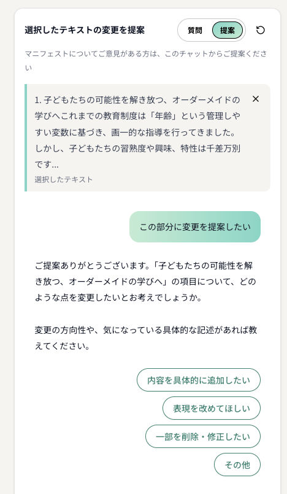
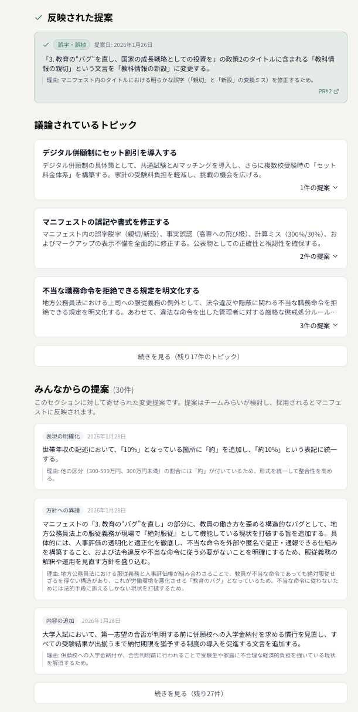
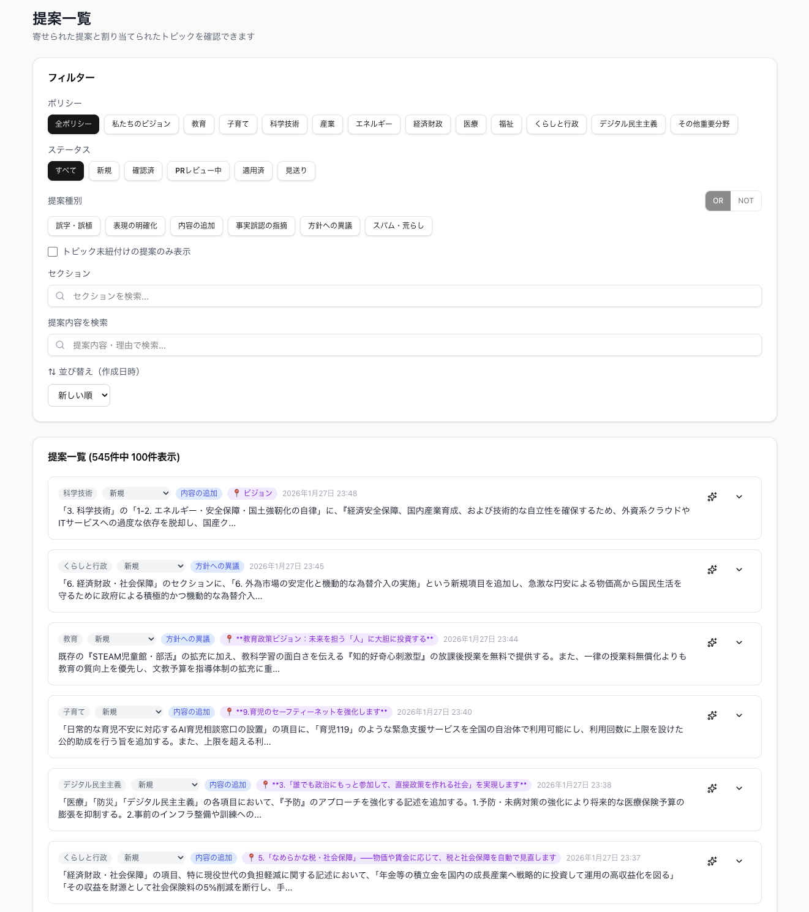

# 2026年衆院選 チームみらいの取り組み

文責: sumino

2026年の衆議院議員選挙においても、チームみらいはマニフェストサイトを公開し、有権者からの提案を受け付けた。前回の参院選での経験と反省を踏まえ、コンセプトは「しゃべれるマニフェスト」から「声が届くマニフェスト」へと変更された。有権者の声を集めるだけでなく、その声が政策担当者にきちんと届く仕組みを目指したものである。

この名称変更の背景には、参院選で浮かび上がった2つの課題があった。

1つ目は、有権者に声を届けてもらう体験設計の課題である。漠然とした不満や要望があっても、それをチャット上で文章として一から組み立てるのは容易ではない。自分の考えを言語化すること自体にハードルがある。この問題を解消し、有権者が自身の考えや課題をより自然に伝えられる体験を設計する必要があった。

2つ目は、届いた声を受け止める仕組みの課題である。参院選ではマニフェストに対して数多くの提案をいただいていたが、そのすべてに目を通すことが難しいという課題があった。いただいた提案を取りこぼさないために、限られた時間の中でより多様な意見を把握できる仕組みが求められていた。

これらの課題を解決するために、衆院選では3つのアップデートが行われた。

## チャット体験の進化

参院選の「しゃべれるマニフェスト」では、有権者がチャット欄に自由に文章を入力する形式であった。衆院選では有権者の負荷を極力減らすチャット設計へと刷新された。

まず、マニフェストの本文中のテキストをドラッグして選択し、表示される「質問」「提案」のアイコンを押すだけで、その箇所に対するチャットを開始できるようになった。参院選の「目次に変更提案が来る問題」で述べたように、どのページに対する意見なのかが曖昧になる問題があったが、この設計によって有権者の意図する対象箇所が明確になる。

チャット中も、AIが選択肢（クイックリプライ）を表示する設計になっている。自分で文章を入力することに負担を感じる有権者でも、選択肢をタップするだけで対話を進められる。想定する選択肢がない場合は自由入力も可能だ。

提案モードのチャット画面。AIが選択肢を提示し、有権者が負担を感じずに意図を伝えられるようになっている。

さらに、質問と提案を明確に区別できるようになった。参院選では提案を前提としたUIであったため、単に質問をしたい有権者に対しても無理に提案を作ってしまうことがあった。今回は質問モードと提案モードを使い分けられるようになり、質問をしているうちに提案したくなった場合にはシームレスに切り替わる。AIが有権者の意図を汲み取って、自動で提案モードに移行する仕組みである。

提案モードでは、AIが有権者の意図を深掘りする。提案がどのような対象に向けられているのか、なぜその提案が必要なのかを聞き取り、提案を具体化していく。参院選では、AIインタビュアーが話を聞いて変更提案を作成するところまでは実現していたが、衆院選ではその聞き取りの質が向上した。より具体的で、示唆に富んだ提案を聞けるようになった。

## AIによる意見解析の実装

2つ目のアップデートは、AIによる意見の解析である。大きく分けて、提案の分類・タグづけと、類似する提案のトピック集約という2つの機能が実装された。

まず、有権者から寄せられた提案をAIが自動で分類・タグづけする。たとえば「政策における実施内容の追加」「方針への異議」「誤字などの表現の指摘」といったカテゴリーに振り分けられる。参院選でも自動ラベルづけシステムは存在したが、衆院選ではこの仕組みがアプリケーション内に統合された。分類されることで、政策担当者は自身の関心や担当領域に沿って提案を確認できるようになる。

もう一つが、類似する提案をトピックとしてまとめる機能である。まとめられたトピックはアプリ上で可視化され、政策担当者はトピックを眺めて全体感を把握し、そこから詳細に掘り下げていくことができる。

マニフェストに寄せられた提案とトピックの画面。議論されているトピックが一覧で表示され、個々の提案に掘り下げることもできる。これにより、参院選で課題となっていた「大量の類似提案に埋もれて届かない声がある」という問題に対して、政策担当者がより多様な意見に目を通せるようになった。

## 政策担当者向けの管理画面

3つ目のアップデートは、政策担当者向けの管理画面の実装である。

参院選ではGitHub上で提案を取りまとめていたが、衆院選では専用の管理画面が用意された。マニフェストの種別、提案の反映状態、AIによる提案の分類に応じてフィルタリングでき、担当者は自分が担当する個別のマニフェストに集中して検討を進められる。

政策担当者向けの提案一覧画面。フィルター機能により、種別や分類に応じて提案を絞り込める。

さらに、有権者の提案内容に基づいてマニフェストの修正案をAIが生成する機能も実装された。AIが生成した修正案をそのまま採用することもできるし、必要に応じて人間が手を加えることもできる。AIの力を借りつつも最終的な判断は人間が行うことで、より多くの声を踏まえた政策づくりを可能にする仕組みである。

参院選の「具体的変更のコンフリクト」の節で述べた問題を振り返りたい。同じ場所を異なる形に変更する修正提案が数十件コンフリクトし、政策担当者が手作業で一つずつ解決していた。管理画面とAIによる修正案の生成は、この問題に対する一つの回答である。提案を集約した上でAIが修正案を提示し、人間がそれを判断するというHuman-in-the-Loopのワークフローによって、より多くの声に目を通し、それを政策に反映するための基盤が整った。

ただし、選挙期間中という制約の中では、この仕組みを十分に活かしきれたとは言い難い。党内部での政策検討は行われていたものの、選挙期間中にマニフェストを大幅にアップデートする余裕はなかった。声を収集し、分析し、政策に反映するまでの一連の仕組みは構築されたが、その運用を選挙のスピード感の中で回しきることは、今後に残された課題である。

## 参院選からの進化と残された課題

衆院選の取り組みを振り返ると、参院選で得られた知見がシステム設計に着実に反映されていることがわかる。

参院選で課題となった「入口の設計」は、テキスト選択からのチャット開始やクイックリプライの導入によって、さらに敷居の低い入口が実現された。また、AIによる分類・集約と管理画面によって、政策担当者が多様な意見を把握するための基盤が整った。

「しゃべれるマニフェスト」から「声が届くマニフェスト」へ。この変更が示すのは、有権者が声を発するところから、その声が政策づくりに届くところまでを一貫して支えようという方向性である。意見収集、構造化、熟議、意思決定、フィードバックというブロードリスニングのサイクルを、より途切れなくつないでいくための仕組みが構築された。

一方で、選挙期間中にこのサイクルを十分に回しきれなかったという現実もある。仕組みとしての進化と、それを実際の選挙運営の中で活かしきることの間には、まだギャップが存在する。このギャップをどう埋めていくかが、今後の取り組みにおける重要なテーマとなるだろう。
