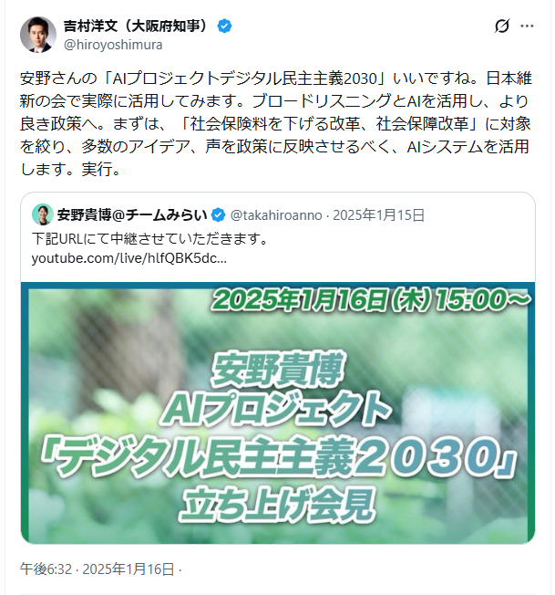

# 第6章 2025年参院選でのブロードリスニングの活用

文責: tokoroten

WIP、未精査

## 日本維新の会、「社会保険料」をテーマに30万件を分析

### DD2030発表当日、代表が即座に参入を表明

2025年1月16日、安野貴博氏がデジタル民主主義2030（DD2030）プロジェクトの立ち上げを発表した。ブロードリスニングの技術をオープンソースで提供し、政党や自治体が活用できる体制を整える。そんな宣言だった。

同じ日、吉村洋文・日本維新の会代表（大阪府知事）がXにこう投稿した。

> 「安野さんの『AIプロジェクトデジタル民主主義2030』いいですね。日本維新の会で実際に活用してみます。ブロードリスニングとAIを活用し、より良き政策へ。まずは、『社会保険料を下げる改革、社会保障改革』に対象を絞り、多数のアイデア、声を政策に反映させるべく、AIシステムを活用します。実行。」

DD2030の発表当日に代表自らが参入を表明した。発表からわずか数時間後の反応だった。こうして日本維新の会による「政策AI活用プロジェクト」が始動した[^ishin1]。

### 何か書く

前編
- 安野が選挙中の「維新」についての発言を収集して分析した

後編 2025/02/28 公開
- 「センターピンを定めたうえで広く意見を聞きたいと思っている」
- 「センターピンは社会保険料の改革、社会保障の改革だと思っている」
- 右肩上がりの国民医療費、社会保険料の負担が年々上がっている
- 単身350万円、所得税7万円、100万円が社会保険料に支払っている、会社分を含めて。
- 社会保険料改革は維新じゃなくてもいい他の政党がやってもいい、広く話を聞きたい
- システムを作って、社会保険料について聞いてみた
- Xから3000件の投稿をとってきて、5000件の意見を取ってきて可視化した
  - 社会保険を含んでいるXの投稿をとってきている

2025年2月28日には、吉村代表が安野貴博氏と対談動画を公開した。安野氏のYouTubeチャンネル（25分、前編）と吉村洋文チャンネル（29分、後編）の2本立てで、「そもそもブロードリスニングとは何か」「AIで本当に社会保障改革ができるのか」という疑問を扱う内容だった。政策AI活用プロジェクトの全貌を、広く国民に向けて解説する試みだった[^ishin3]。

前編の対談では、吉村代表がブロードリスニング参入に至った経緯を明かしている。2024年11月、都知事選後のリハック出演時にエレベーターで安野氏と偶然鉢合わせ、その場でLINEを交換した。吉村代表はそれを「ナンパ」と表現した。その後12月に2人きりで密談し、社会保険料改革へのブロードリスニング活用を具体化していった。

吉村代表はAIへの強い関心と行政での活用実績も語った。大阪府では2年以上前からChatGPTを全職員に導入しており、試験導入時に「使った職員の90%が便利と回答した」という結果を受けて全庁展開に踏み切った。健康管理アプリ「アスマイル」での生活習慣病リスク予測や、グーグル・松尾研究所との連携による雇用マッチングAIなど、行政DXを先行して進めてきた文脈の上にブロードリスニングを位置付けた。

フィルターバブルへの問題意識も対談の核心にあった。吉村代表はこう述べた。

> 「自分と意見の近い人の意見は見えるけど遠い人の意見は全く見えなくなっちゃうんですよ。政治家も近くにいる特定の人の意見がどうしても大きく見えてしまう」

とりわけ業界団体から資金支援を受けている場合、その声が政策判断を歪めるリスクがある。ブロードリスニングはそうしたバイアスを超えて「広い国民の声」を拾い上げる手段として、吉村代表の目に映った。

吉村代表は社会保険料改革を「センタピン」と位置付けた。一つの課題に絞って国民の声を集め、分析し、政策の根拠にする。それが維新のブロードリスニング活用の設計思想だった。前編は概要説明で締め、後編の吉村チャンネルで実際の分析結果を公開する2部構成となっていた。

後編では、吉村代表が本格的な意見収集の前に独自構築していた試作システムの分析結果を初公開した。社会保険料に関するX投稿を事前分析したもので、安野氏がその場でクラスターマップを解説した。「制度改革の必要性」「世代間の不均衡」「通勤手当への課税」など複数の論点が可視化されていた。安野氏はさらに、台湾のオンライン熟議プラットフォーム「V-Taiwan」の二段階議論モデルを紹介した。まず課題認識を共有し、次にソリューションを議論するという手法だ。「各政党のやり方に合った形で議論いただくといいのかなと思います」と述べ、ブロードリスニングを各政党が自由に活用できるツールとして位置付けた。後編の最後で吉村代表は宣言した。「システムは構築済み。これからテーマを発表して本格的に動かしていきたい」。

意見収集は3つのチャンネルで行われた。Xのハッシュタグ「#社会保険料のこれから」への投稿、専用のGoogleフォーム、そして日本維新の会の公式YouTubeチャンネルへのコメント。「誰でも、気軽に、参加できる」仕組みにこだわった。

2025年2月から6月にかけて、この3チャンネルから集まった投稿は約30万件に達した。そのすべてをAIで分析し、クラスタリングと可視化を行ったのが約3万件だ。分析にはTTTC（Talk to the City）のScatterが使われた。

吉村代表は東海テレビのインタビューでこう語っている[^ishin2]。

> 「みなさんの社会保険料を下げるという声を聞くプラットフォームを作ります。そしてその時、みなさんどしどし社会保険料下げる改革の意見をいただけたらなと思います」

### 「諦め」から「期待」へ。世論の変化を可視化する

ここまでの分析は安野氏が担っていた。しかしこのプロジェクトの狙いは、外部の専門家に依存し続けることではなかった。維新は独自に分析を実施できる体制を整え、DD2030の大木氏がその技術面を支援した。

ブロードリスニングが明らかにしたのは、政策論点の地図だけではなかった。世論の「変化」もまた、可視化できることが分かった。

2025年5月6日時点での分析では、最も多くの人が共鳴していたクラスターは「経済的自己防衛策」だった。「国を信用できない。自分で資産運用するしかない」。そんな諦めムードが、投稿全体の重心を占めていた。

画面にそのクラスター名が表示されると、藤田氏は思わず聞いた。「ちなみにこの表題、誰が決めてるの？」。大木氏が答えた。「AIが付けています」。AIは膨大な意見をグループにまとめるだけでなく、そのグループの内容を端的に表す名前まで自動で生成する。初めてブロードリスニングに触れた政治家がまず驚くのが、この仕組みだ。

しかし1か月後の6月19日、状況は変わっていた。最大クラスターは「社会保険料を下げる制度改革要望」に移行し、全体の約47%を占めるようになった。

2025年7月3日、参院選投開票（7月20日）を目前に控え、吉村代表と藤田副政調会長、そしてDD2030でブロードリスニングの開発に携わる大木氏が対談動画を公開した[^ishin4]。タイトルは「【AI分析】3万件の『社会保険料』に関する投稿から見えた国民の本音とは？」。意見収集から分析、公約策定、そして有権者への公開まで、参院選に向けた一連のサイクルを完結させる試みだった。

実はこの「変化」の発見は、動画の収録中に起きた。藤田氏は5月のデータをもとに準備をしていたが、収録当日に6月の最新データが新たに提示された。「これ5月でこっち6月……変わってるやん」「一ヶ月で」「防衛策どこ行った」。思いがけない発見がそのまま映像に収められた。

動画の中で藤田副政調会長はこう述べた。

> 「1か月で『諦め』から『期待』へ重心が移った」

この変化をどう解釈するか。維新が社会保険料改革を訴え続けることで、「どうせ政治は変わらない」という諦め感が薄れ、「本当に変えられるかもしれない」という期待に変わってきた。ブロードリスニングはその変化を、リアルタイムで数値として捉えた。

ただし、藤田副政調会長は一点を強調した。

> 「政策をAIで決めるのではない。意見いいよねと拾い上げていって、政策を横から補強していく」

AIが民意を決めるのではなく、見落としていた論点を発見し、政策の根拠を厚くするための道具として使う。これが維新のブロードリスニング活用の基本方針だった。

ここで大木氏が一言添えた。「解釈はそれぞれあると思います」。吉村代表が苦笑いした。「やんわりハシゴ外された感じですけど」。ブロードリスニングが示すのはデータであり、そこから何を読み取るかは政治家自身が判断する。ツールは答えを出さない。

個別の意見の中には、このような熱量の高いコメントもあった。「私はどちらかを選ぶなら、消費税減税よりも社会保険料削減を選びます」「政治生命をかけてやってくれ」。諦めではなく、政治家への具体的な期待として、改革を求める声が届いていた。

藤田氏はこうも語った。「制作責任者として、常に心の中で『これで合ってんのかな』という不安がある。これだけの皆さんの意見を持った状態で政策を練れるというのはめちゃくちゃ心強い」。データが政治家の決断の不安を和らげる。それもまたブロードリスニングが果たした役割だった。

### 1%の声が、政策を変えた

ブロードリスニングには、多数意見の可視化だけでなく、少数意見を「埋もれさせない」機能がある。維新の事例がそれを示した。

約3万件の分析の中で、OTC類似薬（市販薬と同等の医薬品が保険適用されている問題）への懸念を示す投稿は全体の約1%、300件程度に過ぎなかった。人力で意見を読んでいたら、見落とされていた可能性が高い分量だ。しかしAIによるクラスタリングは、この少数意見を明確に可視化した。

その結果、2025年6月に公表された「社会保険料を下げる改革提言」（37ページ）には、OTC類似薬の保険適用除外の検討が明記された[^ishin5]。ブロードリスニングが政策の細部に影響を与えた事例だ。

改革提言の目標は、国民医療費を年間4兆円以上削減し、現役世代1人当たりの社会保険料負担を年間6万円引き下げること。その根拠の一部に、30万件の国民の声があった。

### 参院選の公約へ、そして選挙戦へ

2025年6月30日、日本維新の会は参議院選挙の公約を発表した。その中心に「社会保険料を1人当たり年間6万円引き下げる」という数値目標が掲げられた[^ishin6]。ブロードリスニングで収集・分析した民意が、公約の土台となった。

阿部司総務会長は、日本経済新聞のインタビューでこう語った[^ishin7]。

> 「AIでSNSの声を拾う」

2025年7月20日の投開票で、日本維新の会は7議席を獲得した。改選6議席から1議席増、目標の議席数を確保した。ただし比例得票率は7.39%（約437万票）と、2022年参院選の14.8%から大幅に落ち込んだ。吉村代表は結果を「関西ではぎりぎり踏ん張った。全国的には厳しい結果だ」と評価した[^ishin8]。

党の総括はこうだった。「#社会保険料を下げる改革」は全国的なムーブメントには至らなかった。ブロードリスニングの取り組みそのものへの総括は記されなかった。

### 参院選後も続く「対話」の仕組み

参院選が終わっても、維新のブロードリスニングは止まらなかった。2025年10月8日、「町会・自治会・消防団の加入率が低いことについて」を第2弾テーマとして意見収集を開始した。ハッシュタグは「#維新ブロリス」に変わった。

2026年に向けた衆院選のコア・マニフェスト策定を見据えて、意見収集と分析、公開を繰り返すサイクルを定着させようとしている。政調会長に就いた斎藤アレックス氏と広報局長の藤田あきら氏がその推進役だ。2026年1月26日には第3弾として、維新が発表したマニフェスト（498項目の個別政策集）全体への意見募集を始めた[^ishin9]。

「この維新のマニフェストは今回これで終わりではありません」。藤田氏はそう宣言した。ハッシュタグを付けてもらう必要すらない。「SNS上で自然に議論していただいているやつをAIが取っていく」という方式で、有権者の日常会話から政策のヒントを拾い上げる試みが続いた。

2026年2月6日には中間報告動画を公開した。意見を分析すると、食料消費税ゼロ政策や選挙妨害対策への関心と並んで、意外なクラスターが浮かび上がった。「小児科医療の課題と期待」だ。全体の12%を占め、小児科の予約困難や地方での小児科閉院、診療報酬改定への懸念が集中していた。

斎藤アレックス氏は収穫と反省を語った。「本当に皆さんの日常会話みたいなところに、政策を作っていくヒントがたくさんある」。マニフェスト発表後に意見を募っても10日では間に合わない。次は日常的に継続的にやっていく必要があるという結論に至った。

吉村代表がプロジェクトへの参入を表明してから1年余り。30万件という大規模な意見収集から世論の変化を可視化し、少数意見を政策に拾い上げ、結果を動画で公開する。維新のブロードリスニングは、民意と政策をつなぐ新たな実験として継続している。

### 与党がブロードリスニングを活用する時代へ

2025年10月、政局が大きく動いた。同年7月の参院選で自公両党が衆参両院で過半数を割り込む中、公明党が約25年間続いた自民党との連立を離脱した[^ishin10]。自民党の高市早苗新総裁は、連立パートナーとして日本維新の会に接近。10月20日、自民・維新の連立政権が正式に発足した[^ishin11]。

当初は閣僚を出さない「閣外協力」の形態だったが、2026年2月の第51回衆院選で自民党が316議席の歴史的大勝を収めると、高市首相は維新に閣内協力を正式に要請した。吉村代表はこれを受け入れ、次期内閣改造での閣僚派遣が決まった[^ishin12]。

ブロードリスニングの観点から見ると、この連立には別の意味があった。日本維新の会は、DD2030の技術を活用してSNSから幅広く国民の声を収集・分析する体制をすでに構築していた。その維新が与党になったことで、はからずも「与党がブロードリスニングによって国民の声を政策に反映させる」という状態が生まれたのだ。

野党時代の維新にとって、ブロードリスニングは「国民の声を可視化し、政策提言の根拠にする」ツールだった。しかし与党になれば、その分析結果は政策提言ではなく、実際の政策決定に直結しうる。SNSから収集した30万件の声、そこから抽出された少数意見、世論の変化のリアルタイム把握。これらが、政権与党の意思決定プロセスに組み込まれる可能性が開けた。

[^ishin1]: 吉村洋文X投稿（2025年1月16日）、https://x.com/hiroyoshimura/status/1879824020406964591 ／ 日本維新の会「政策AI活用プロジェクトスタート」、https://o-ishin.jp/broad_listening/
[^ishin2]: 東海テレビNEWS「ネットやAI駆使し"今の声"を政策に…広がり見せる『デジタル民主主義』の現状と課題」2025年3月20日、https://www.tokai-tv.com/tokainews/feature/article_20250320_39427
[^ishin3]: 対談動画（安野チャンネル版）「【日本維新の会吉村洋文さん】政治家に聞く！AI・デジタルの可能性」2025年2月28日、https://youtu.be/UFIzG1ok5sA ／ 吉村チャンネル版「【初対談】社会保障改革のカギ"ブロードリスニング"とは？安野貴博×吉村洋文が徹底解説！」https://youtu.be/iZv0-nkKEFY
[^ishin4]: 吉村洋文チャンネル「【AI分析】3万件の『社会保険料』に関する投稿から見えた国民の本音とは？」2025年7月3日、https://www.youtube.com/watch?v=9WyZ-ybY_aw ／ 西尾泰和「日本維新の会のブロードリスニング事例」https://scrapbox.io/nishio/日本維新の会のブロードリスニング事例
[^ishin5]: 日本維新の会「社会保険料を下げる改革提言」2025年6月、https://o-ishin.jp/policy/2025_lower_social_insurance_premiums/
[^ishin6]: 日本経済新聞「社会保険料を年6万円減額 維新が参院選の公約発表、現役世代を意識」2025年6月30日、https://www.nikkei.com/article/DGXZQOUA27ACJ0X20C25A6000000/
[^ishin7]: 日本経済新聞「日本維新の会・阿部司総務会長『AIでSNSの声拾う』」2025年6月10日、https://www.nikkei.com/article/DGXZQOUE109D70Q5A610C2000000/
[^ishin8]: 日本経済新聞「吉村洋文氏『厳しい参院選結果』関西で地力、全国政党は遠く」2025年7月21日、https://www.nikkei.com/article/DGXZQOUF18BJM0Y5A710C2000000/
[^ishin9]: 日本維新の会YouTubeチャンネル「【募集】あなたの投稿で政策が動く！？ #ブロードリスニング で皆様の声を集めます」2026年1月26日、https://www.youtube.com/watch?v=yP8euIg8jq4 ／「【どんな声が集まった？】ブロードリスニングで集まった声を見てみよう」2026年2月6日、https://www.youtube.com/watch?v=nC_pDQPNmUs
[^ishin10]: 日本経済新聞「公明党、自公連立政権を離脱へ」2025年10月10日、https://www.nikkei.com/article/DGXZQOUA102WV0Q5A011C2000000/
[^ishin11]: 日本経済新聞「自民・維新『連立』で合意 閣外協力、高市政権が21日発足へ」2025年10月20日、https://www.nikkei.com/article/DGXZQOUA2020R0Q5A021C2000000/
[^ishin12]: 日本経済新聞「日本維新の会、閣内協力を受け入れ 高市早苗首相が『次の内閣改造時』と要請」2026年2月10日、https://www.nikkei.com/article/DGXZQOUA105RV0Q6A210C2000000/
