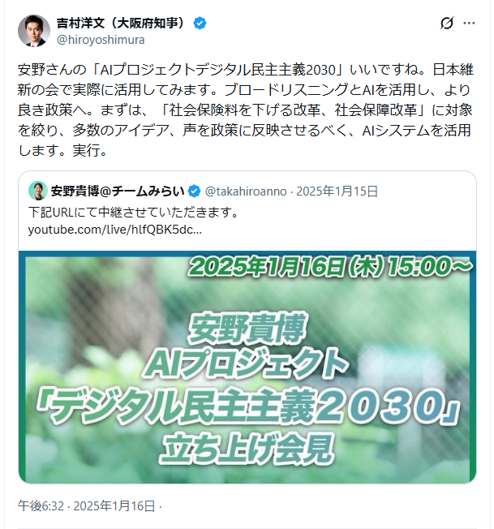
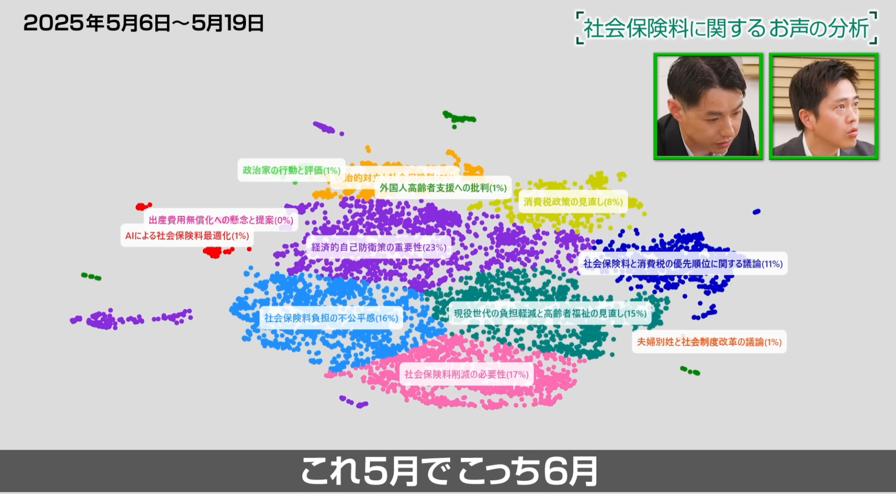
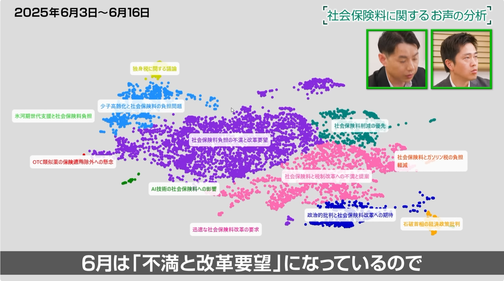

# 第6章 国政選挙でのブロードリスニングの活用

文責: tokoroten

## 日本維新の会、「社会保険料」をテーマに30万件を分析

### DD2030発表当日、代表が即座に参入を表明

2025年1月16日、安野貴博氏がデジタル民主主義2030（DD2030）プロジェクトの立ち上げを発表した。ブロードリスニングの技術をオープンソースで提供し、政党や自治体が活用できる体制を整える。そんな宣言だった。

同じ日、吉村洋文・日本維新の会代表（大阪府知事）がXにこう投稿した。

> 「安野さんの『AIプロジェクトデジタル民主主義2030』いいですね。日本維新の会で実際に活用してみます。ブロードリスニングとAIを活用し、より良き政策へ。まずは、『社会保険料を下げる改革、社会保障改革』に対象を絞り、多数のアイデア、声を政策に反映させるべく、AIシステムを活用します。実行。」

DD2030の発表当日に代表自らが参入を表明した。発表からわずか数時間後の反応だった。こうして日本維新の会による「政策AI活用プロジェクト」が始動した[^ishin1]。

### 独自システムの構築と「センターピン」戦略

2025年2月28日、吉村代表と安野貴博氏の対談動画が公開された[^ishin3]。注目すべきは、DD2030の発表からわずか1か月余りで、維新がTTTCをベースとした意見集約の仕組みを独自に構築していたことだ。後編では、社会保険料に関するX投稿約3,000件から約5,000件の意見を抽出した試作分析の結果が初公開された。「制度改革の必要性」「世代間の不均衡」「通勤手当への課税」など複数の論点が散布図として可視化されていた。

吉村代表は社会保険料改革を「センターピン」と位置付けた。年収350万円の単身者が所得税7万円に対し、会社負担分を含めると社会保険料に約100万円を支払っている。右肩上がりの国民医療費に歯止めをかけるため、一つの課題に絞って国民の声を集め、分析し、政策の根拠にする。それが維新のブロードリスニング活用の設計思想だった。後編の最後で吉村代表は宣言した。「システムは構築済み。これからテーマを発表して本格的に動かしていきたい」。

### 30万件の意見収集と、動画で明かされた世論の変化

2025年3月1日、「政策AI活用プロジェクト」の始動が正式に告知された[^ishin_project]。意見収集は3つのチャンネルで行われた。Xのハッシュタグ「#社会保険料のこれから」への投稿、専用のGoogleフォーム、そして日本維新の会の公式YouTubeチャンネルへのコメント。2025年2月から6月にかけて、この3チャンネルから集まった投稿は約30万件に達した。

2025年7月3日、参院選投開票（7月20日）を目前に控え、吉村代表と藤田あきら副政調会長、そしてDD2030でブロードリスニングの開発に携わる大木氏が対談動画を公開した[^ishin4]。タイトルは「【AI分析】3万件の『社会保険料』に関する投稿から見えた国民の本音とは？」。長期間、大量の意見を収集し続けた結果、維新の会では時系列による世論の変化を把握する体制を整えていたことが明らかになった。

動画では、5月と6月の分析結果を比較し、世論の変化を可視化する試みが行われた。5月の分析では、最も大きなクラスターは「経済的自己防衛策」で、国を信用できないという諦めムードが支配的だった。しかし6月の分析では、最大クラスターが「社会保険負担の不満と改革要望」に移行した。わずか1か月で、社会保障政策に対する世論は諦めから期待へと重心が大きく変化していたのだ。

藤田副政調会長はこう解釈した。「」

### 政策提案へのリアルタイムなフィードバック

ブロードリスニングが可視化するのは、既存の世論だけではない。政党が打ち出した政策提案に対する国民の反応を、リアルタイムで捉えることもできる。維新の事例がそれを示した。

6月の散布図には、5月にはなかった新たなクラスターが出現していた。OTC類似薬（市販薬と同等の医薬品が保険適用されている問題）の保険適用除外に関する投稿だ。全体の約1%、300件程度に過ぎないが、大木氏はこう指摘した。「今までこんなのなかった。我々が提案することによって広がってくるところもある」。維新が改革提言の中でOTC類似薬の適用除外を打ち出したことで、それに対する賛否や関心がSNS上に生まれ、ブロードリスニングがその反応を即座にクラスターとして可視化したのだ。

従来の世論調査では、政策提案に対する国民の反応を把握するまでに数週間を要した。ブロードリスニングはそのフィードバックループを劇的に短縮する。政治家は自らの提案が国民にどう受け止められているかを、ほぼリアルタイムで確認できるようになった。

2025年6月に公表された「社会保険料を下げる改革提言」（37ページ）の目標は、国民医療費を年間4兆円以上削減し、現役世代1人当たりの社会保険料負担を年間6万円引き下げること[^ishin5]。30万件の意見収集と、その分析から得られたフィードバックが、提言の土台となった。

### 参院選の公約へ、そして選挙戦へ

2025年6月30日、日本維新の会は参議院選挙の公約を発表した。その中心に「社会保険料を1人当たり年間6万円引き下げる」という数値目標が掲げられた[^ishin6]。ブロードリスニングで収集・分析した民意が、公約の土台となった。

阿部司総務会長は、日本経済新聞のインタビューでこう語った[^ishin7]。

> 「AIでSNSの声を拾う」

2025年7月20日の投開票で、日本維新の会は7議席を獲得した。改選6議席から1議席増ではあったが、比例得票率は7.39%（約437万票）と、2022年参院選の14.8%から大幅に落ち込んだ。吉村代表は結果を「関西ではぎりぎり踏ん張った。全国的には厳しい結果だ」と評価した[^ishin8]。

党の総括はこうだった。「#社会保険料を下げる改革」は全国的なムーブメントには至らなかった。ブロードリスニングの取り組みそのものへの総括は記されなかった。

### 参院選後も続く「対話」の仕組み

参院選が終わっても、維新のブロードリスニングは止まらなかった。2025年10月8日、「町会・自治会・消防団の加入率が低いことについて」を第2弾テーマとして意見収集を開始した。ハッシュタグは「#維新ブロリス」に変わった。

2026年に向けた衆院選のコア・マニフェスト策定を見据えて、意見収集と分析、公開を繰り返すサイクルを定着させようとしている。政調会長に就いた斎藤アレックス氏と広報局長の藤田あきら氏がその推進役だ。2026年1月26日には第3弾として、維新が発表したマニフェスト（498項目の個別政策集）全体への意見募集を始めた[^ishin9]。

「この維新のマニフェストは今回これで終わりではありません」。藤田氏はそう宣言した。ハッシュタグを付けてもらう必要すらない。「SNS上で自然に議論していただいているやつをAIが取っていく」という方式で、有権者の日常会話から政策のヒントを拾い上げる試みが続いた。

2026年2月6日には中間報告動画を公開した。意見を分析すると、食料消費税ゼロ政策や選挙妨害対策への関心と並んで、意外なクラスターが浮かび上がった。「小児科医療の課題と期待」だ。全体の12%を占め、小児科の予約困難や地方での小児科閉院、診療報酬改定への懸念が集中していた。

斎藤アレックス氏は収穫と反省を語った。「本当に皆さんの日常会話みたいなところに、政策を作っていくヒントがたくさんある」。一方で課題も明確になった。マニフェスト発表後に意見を募っても10日では間に合わない。「次は日常的に継続的にやっていく必要がある」という結論に至った。ブロードリスニングは一度やって終わりではなく、政策立案のサイクルに組み込んで初めて機能する。維新はその教訓を、実践を通じて学んでいった。

吉村代表がプロジェクトへの参入を表明してから1年余り。30万件という大規模な意見収集から世論の変化を可視化し、少数意見を政策に拾い上げ、結果を動画で公開する。維新のブロードリスニングは、民意と政策をつなぐ新たな実験として継続している。

### 与党がブロードリスニングを活用する時代へ

2025年10月、政局が大きく動いた。同年7月の参院選で自公両党が衆参両院で過半数を割り込む中、公明党が約26年間続いた自民党との連立を離脱した[^ishin10]。自民党の高市早苗新総裁は、連立パートナーとして日本維新の会に接近。10月20日に連立で合意し、翌21日に自民・維新の連立政権が発足した[^ishin11]。

当初は閣僚を出さない「閣外協力」の形態だったが、2026年2月の第51回衆院選で自民党が316議席の歴史的大勝を収めると、高市首相は維新に閣内協力を正式に要請した。吉村代表はこれを受け入れ、次期内閣改造での閣僚派遣が決まった[^ishin12]。

ブロードリスニングの観点から見ると、この連立には別の意味があった。日本維新の会は、DD2030の技術を活用してSNSから幅広く国民の声を収集・分析する体制をすでに構築していた。その維新が与党になったことで、はからずも「与党がブロードリスニングによって国民の声を政策に反映させる」という状態が生まれたのだ。

野党時代の維新にとって、ブロードリスニングは「国民の声を可視化し、政策提言の根拠にする」ツールだった。しかし与党になれば、その分析結果は政策提言ではなく、実際の政策決定に直結しうる。SNSから収集した30万件の声、そこから抽出された少数意見、世論の変化のリアルタイム把握。これらが、政権与党の意思決定プロセスに組み込まれる可能性が開けた。

[^ishin1]: 吉村洋文X投稿（2025年1月16日）、https://x.com/hiroyoshimura/status/1879824020406964591 ／ 日本維新の会「政策AI活用プロジェクトスタート」、https://o-ishin.jp/broad_listening/
[^ishin2]: 東海テレビNEWS「ネットやAI駆使し"今の声"を政策に…広がり見せる『デジタル民主主義』の現状と課題」2025年3月20日、https://www.tokai-tv.com/tokainews/feature/article_20250320_39427
[^ishin3]: 対談動画（安野チャンネル版）「【日本維新の会吉村洋文さん】政治家に聞く！AI・デジタルの可能性」2025年2月28日、https://youtu.be/UFIzG1ok5sA ／ 吉村チャンネル版「【初対談】社会保障改革のカギ"ブロードリスニング"とは？安野貴博×吉村洋文が徹底解説！」https://youtu.be/iZv0-nkKEFY
[^ishin4]: 吉村洋文チャンネル「【AI分析】3万件の『社会保険料』に関する投稿から見えた国民の本音とは？」2025年7月3日、https://www.youtube.com/watch?v=9WyZ-ybY_aw ／ 西尾泰和「日本維新の会のブロードリスニング事例」https://scrapbox.io/nishio/日本維新の会のブロードリスニング事例
[^ishin5]: 日本維新の会「社会保険料を下げる改革提言」2025年6月、https://o-ishin.jp/policy/2025_lower_social_insurance_premiums/
[^ishin6]: 日本経済新聞「社会保険料を年6万円減額 維新が参院選の公約発表、現役世代を意識」2025年6月30日、https://www.nikkei.com/article/DGXZQOUA27ACJ0X20C25A6000000/
[^ishin7]: 日本経済新聞「日本維新の会・阿部司総務会長『AIでSNSの声拾う』」2025年6月10日、https://www.nikkei.com/article/DGXZQOUE109D70Q5A610C2000000/
[^ishin8]: 日本経済新聞「吉村洋文氏『厳しい参院選結果』関西で地力、全国政党は遠く」2025年7月21日、https://www.nikkei.com/article/DGXZQOUF18BJM0Y5A710C2000000/
[^ishin9]: 日本維新の会YouTubeチャンネル「【募集】あなたの投稿で政策が動く！？ #ブロードリスニング で皆様の声を集めます」2026年1月26日、https://www.youtube.com/watch?v=yP8euIg8jq4 ／「【どんな声が集まった？】ブロードリスニングで集まった声を見てみよう」2026年2月6日、https://www.youtube.com/watch?v=nC_pDQPNmUs
[^ishin10]: 日本経済新聞「公明党、自公連立政権を離脱へ」2025年10月10日、https://www.nikkei.com/article/DGXZQOUA102WV0Q5A011C2000000/
[^ishin11]: 日本経済新聞「自民・維新『連立』で合意 閣外協力、高市政権が21日発足へ」2025年10月20日、https://www.nikkei.com/article/DGXZQOUA2020R0Q5A021C2000000/
[^ishin12]: 日本経済新聞「日本維新の会、閣内協力を受け入れ 高市早苗首相が『次の内閣改造時』と要請」2026年2月10日、https://www.nikkei.com/article/DGXZQOUA105RV0Q6A210C2000000/
[^ishin_project]: 日本維新の会「政策AI活用プロジェクトスタート」、https://o-ishin.jp/broad_listening/
