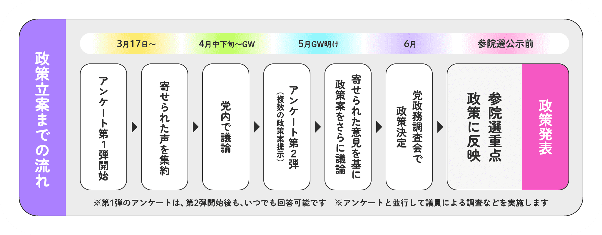
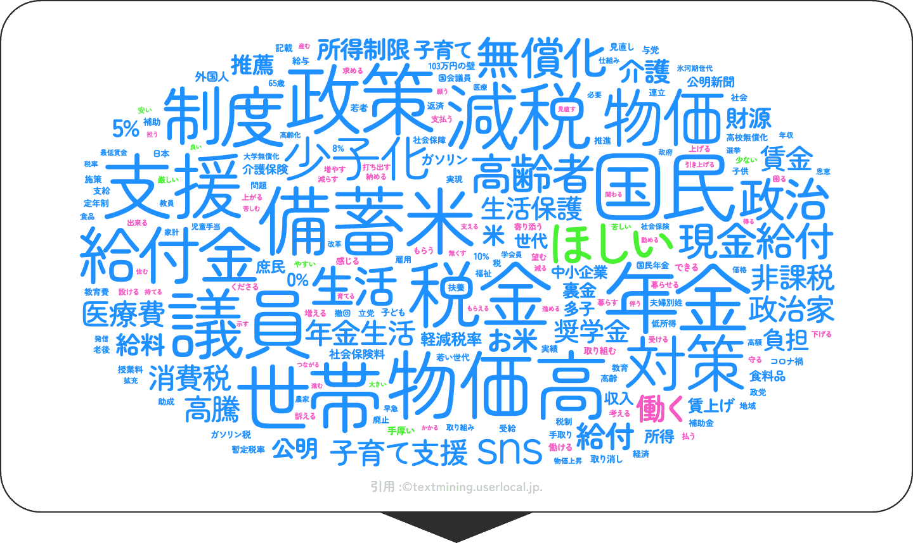
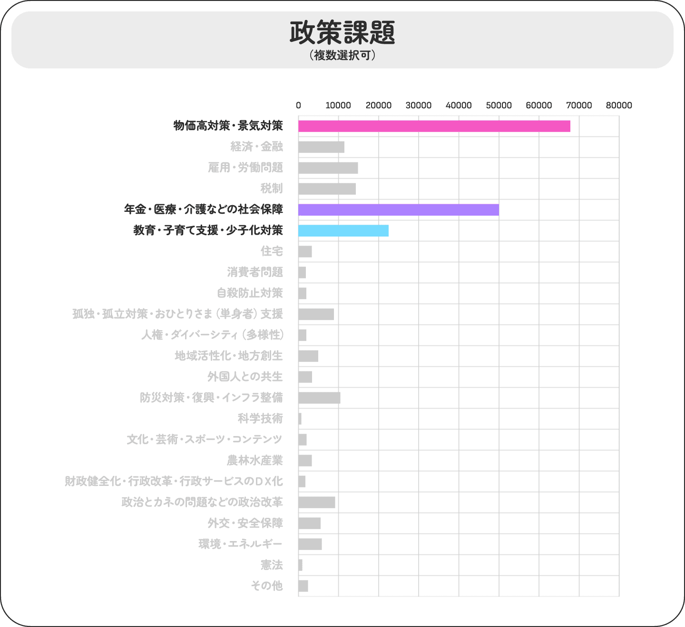
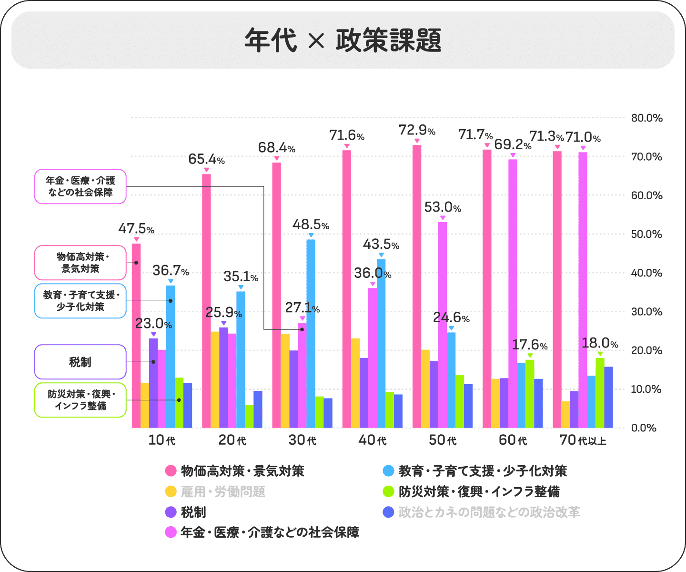

# 第6章 2025年参院選でのブロードリスニングの活用

文責: tokoroten

## 公明党：与党として取り組んだブロードリスニング

### 与党がブロードリスニングを始めた意味

2025年当時、公明党は自民党と連立を組む与党だった。本章でこれまで紹介してきたチームみらい・維新・国民民主はいずれも野党として民意を訴える立場でのブロードリスニング活用だったのに対し、公明党は実際に政策を実現できる与党の立場で国民の声を集めた。これは本章の中で際立った特徴だ。公明党は2025年10月に自公連立を離脱して野党となったが、WeConnectを実施した参院選当時はまだ与党だった。

2025年3月17日、公明党は政策立案アンケート「WeConnect（ウィーコネクト）」を開始した。参議院選挙（7月20日投開票）の重点政策に、若者や現役世代の「生の声」を反映させることを目的としたプロジェクトで、アンケート期間は6月26日まで、約3か月にわたった。

WeConnectの政策立案プロセスは、特設サイトで明示的に公開されていた（図）。単なるアンケートの一回収集ではなく、複数ラウンドのサイクルとして設計されていた点が特徴だ。

[^komei_flow]

まず3月17日にアンケート第1弾を開始し、4月中下旬からGWにかけて寄せられた声を集約して党内で議論する。5月のGW明けにはアンケート第2弾を実施し、第1弾で得られた声をもとに政策案をさらに議論する。第1弾のアンケートは第2弾開始後も引き続き回答可能で、アンケートと並行して議員による個別調査も行われた。こうして重ねた議論をもとに6月に党の政策調査会が政策を決定し、参院選公示前に重点政策として発表するという流れだ。

集まった声の分析にはAIを活用することが、特設サイトに明記されていた。

> 「アンケートでいただいた声やご要望を、**AIなどのデジタル技術を活用し**、どのような方（属性）から、どのような声やご要望が多いかなど、多角的に分析します。若者・現役世代などのニーズをとらえ、政策立案に繋げていきます。」

単に意見を集めるだけでなく、AIによって誰がどんな声を上げているかを属性ごとに把握し、政策に結びつけることが最初から意図されていた。与党としての公明党がAI活用を政策立案プロセスに組み込むと宣言したことは、ブロードリスニングの主流化を示す一つの指標といえる。

同日に公明党の公式YouTubeチャンネルに投稿されたショート動画では、プロジェクトの趣旨がこう説明されている[^komei1]。

> 「政治家だけで議論すると足元の課題だけに偏りがち」

> 「国民の皆さま、とりわけ若い世代の皆さまから、直接『こういうことを実現してほしい』『こういうことに困っている』（といった）お声を寄せていただいて、そのことを公明党の政策のど真ん中に据えて、必ず実現してまいります」

> 「皆さまから頂いたお声を（特設サイトやSNSで）共有させていただきたいと思っています。そのうえで『ここが足りていない』『もっとこういうこともすべきだ』（といった）さらに多くの声をいただきながら、最終的にそれをまとめたものを与党・責任政党・公明党として必ず実現していきたいと決意しています」

ここで注目したいのは、市民同士が直接オンライン空間で熟議を行う台湾のvTaiwan（第10章参照）などとは異なり、公明党のWeConnectは「市民の声を党が集約し、党が政策に翻訳して実現する」という形をとっている点だ。政党が仲介者として中心に立つ設計は、2010年代以降のスペイン・ポデモスやイタリア・五つ星運動など欧州の「デジタル政党」運動にも共通する発想だ。ただし欧州の多くの事例では収集した声の政策反映やフォローアップが不十分と批判されており、中間報告を挟みながら意見を重ねていく双方向サイクルの設計は、WeConnectの特徴として挙げられる。

### 収集の仕組み：Google FormとQRコードによる草の根の拡散

意見収集の窓口は、専用サイト「weconnect.jp」に設けられた入力フォームだ。実装はGoogle Formを埋め込む形で行われており、高度な独自システムではなく、既存のツールを活用したシンプルな構成だった。

設問は3部構成だった。まず性別・年齢・居住地域・職業・婚姻状況・子どもの有無という属性情報を収集し、次に「物価高対策」「雇用・労働問題」「教育・子育て支援」「住宅」「孤独・孤立対策」「外国人との共生」など22の政策分野から関心のあるものを最大3つ選択させる。最後に「今、課題に感じていることや、政治への意見、政策への要望・アイデアなど」を自由記述で入力する形だ。属性と関心分野をセットで取得する構造により、「30代・子育て中・雇用に関心」といったクロス分析が可能になっていた。党員でなくとも誰でも回答でき、メールアドレスも収集されなかった。

このフォームへの誘導は、複数の経路で行われた。公明党の公式SNS（X、YouTube、Instagramなど）への投稿、機関紙や「公明ハンドブック2025」などの紙媒体に掲載されたQRコード、そして全国の地方議員が街頭演説や地域活動を通じてQRコードを直接案内する草の根の呼びかけだ。SNSの役割はあくまでフォームへの誘導と中間報告の場に限定されており、XのハッシュタグからSNS投稿をスクレイピングするような手法は取られていなかった。

### 第一弾アンケートの結果、103,519件の意見から何が見えたか？

第一弾アンケートは2025年3月17日に開始され、4月30日時点で91,216件の回答が集まり、最終的には6月24日には103,519件に達した。集まった声は、AIを活用して意見をグループ分けして分析されたとされる。ただし、どのようなアルゴリズムで解析したのかは非公開であるため、ここでは分析の詳細には踏み込まず、公開された情報からわかる範囲で結果を紹介する。

WeConnectが始まった2025年3月は、CPIが前年比3%台で高止まりし、米価が前年比ほぼ2倍に達していた時期だ[^rice]。「令和の米騒動」の渦中で、政府は前例のない備蓄米放出の入札をWeConnect開始直前に行っていた。

こうした時代背景を反映して、集まった声のワードクラウドでは「備蓄米」「物価高」「税金」「減税」「政策」「議員」「世帯」「給付金」「支援」といった語が大きく浮かび上がる。

政策課題の選択結果（複数回答可）では、「物価高対策・景気対策」が約65,000件と断トツのトップで、「年金・医療・介護などの社会保障」（約50,000件）、「教育・子育て支援・少子化対策」（約25,000件）が続いた。

年代別のクロス集計では、「物価高対策・景気対策」は10代（47.5%）から70代以上（71.3%）まで全世代で最多だった。一方で関心の差が出たのは「年金・医療・介護」で、50代（53.0%）・60代（69.2%）・70代以上（71.0%）と高齢層ほど関心が高い反面、10代（23.0%）では相対的に低い。「教育・子育て支援」は30代（48.5%）・40代（43.5%）でピークを迎え、子育て世代の実態と一致している。

### 第二弾アンケートの結果、23,147件の意見から何が見えたか？

第二段アンケートでは、第一弾で得られた声をもとに、重点化するべき政策が次の6つに絞られた。

- 【物価高支援】米や食料品の負担軽減策・給付・ガソリン代引き下げ・電気・ガス代補助など
- 【社会保障】介護休職中の所得補償・介護施設の利用料の助成・住宅支援など
- 【教育】既卒者も対象の返済免除制度の拡充・給付型奨学金の拡大など
- 【子育て】子どもの医療費無償・公教育の質向上・子どもを取り巻く環境改善など
- 【雇用・労働】ライフステージに合わせた働き方の選択肢拡大・週休3日制など
- 【雇用・労働】保育士･介護士の賃金大幅増・職場環境改善など

### 政策への反映

期間終了後、公明党は「若者の声が参院選重点政策になりました」として、集まった声がどのように政策に結びついたかを動画で公開した[^komei3]。主な反映政策として以下が挙げられている。

- 最低賃金を2020年代に全国平均1500円まで引き上げ
- 奨学金返還支援の拡充（奨学金減税）
- 貸家に住む低所得者・子育て世帯向けの新たな「住宅手当」制度の創設
- 育児休業中の柔軟な働き方の推進

岡本三成政調会長は動画の中で「手取りが増えることに越したことはないが、家賃補助があればいいな」という声を具体的に取り上げ、公明党が推進する「アフォーダブル住宅（手頃な家賃の住宅）」との対応関係を説明した[^komei4]。意見の中間報告と「この声がこの政策になった」という対応関係の見せ方は、双方向のトレーサビリティを意識した設計といえる。

### 党組織とブロードリスニングの組み合わせ

本章の他の事例と比較すると、公明党のWeConnectはいくつかの点で異なる性格を持っている。

まず規模について。チームみらい（8,559件）や国民民主党（6万件）と比べ、12万6千件という回答数は本章で最大だ。ただしこの規模は、全国に広がる公明党の地方議員ネットワークが草の根でQRコードを配布したことによるところが大きい。SNS上の不特定多数から意見を収集した維新（30万件収集）とは収集構造が異なる。

次に収集手法について。維新はSNS投稿のスクレイピング、チームみらいはAIインタビューを経由したプルリクエスト、国民民主はオンライン・オフライン混合の複数チャネルと各党が工夫を凝らしたのに対し、公明党はGoogle Formというシンプルな手段を選んだ。技術的な複雑さではなく、既存の組織力と既存のツールを組み合わせることで大規模な意見収集を実現した点が特徴的だ。

公明党はかねてから「小さな声を聴く力」を党の強みとして掲げてきた。WeConnectはその伝統的な姿勢を、デジタルツールを用いて現代的な形にアップデートする試みだったといえる。

[^komei1]: 公明党チャンネル「政策立案アンケート『We connect』」2025年3月, https://www.youtube.com/shorts/ISu-QLloVyY
[^komei2]: 谷あい正明公式チャンネル「公明党政策立案アンケート『We connect』途中経過報告」2025年, https://www.youtube.com/watch?v=2E1o4h6dVy0
[^komei3]: 青野ひとしチャンネル「若者の声が参院選重点政策に！奨学金減税など」2025年, https://www.youtube.com/shorts/Ncrh_i8xxtQ
[^komei4]: 公明党チャンネル「政策立案アンケート『We connect』への声を紹介！② 岡本三成 政調会長」2025年, https://www.youtube.com/shorts/RkCpQpiv7PA
[^komei_flow]: WeConnect特設サイト（Internet Archiveによる2025年4月4日時点のアーカイブ）, https://web.archive.org/web/20250404212101/https://weconnect.jp/
[^rice]: シェアシマ「米高騰はいつまで続く？」https://shareshima.com/info/719745218 ／ 野村総研「備蓄米放出の運用見直し」https://www.nri.com/jp/media/column/kiuchi/20250131.html
