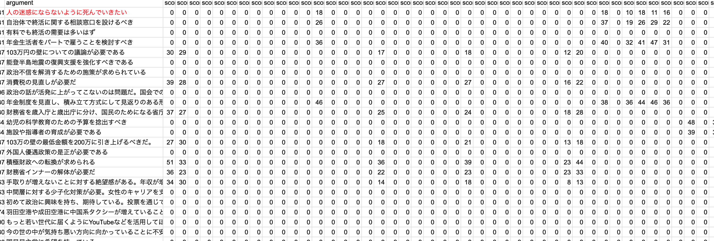
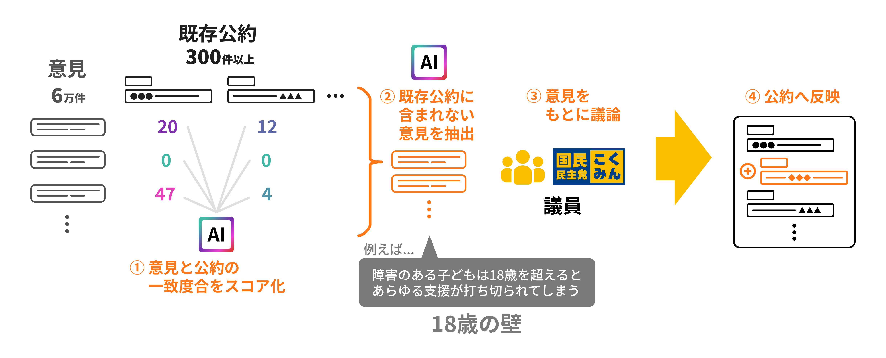
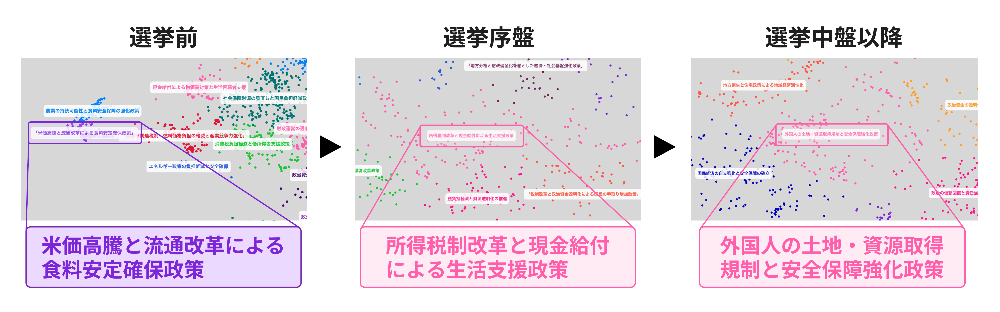

# 第6章 国政選挙でのブロードリスニングの利用

文責: tokoroten

## 国民民主党の選挙とブロードリスニング：伊藤孝恵議員に聞く

2026年3月、筆者は参議院議員会館にて伊藤孝恵議員と、AIシステムの設計・実装・運用支援を担当したIT企業である山藤総合企画の山田氏に取材を行いました。本節では、その取材をもとに、2025年7月の参院選と2026年2月の衆院選において、国民民主党がブロードリスニングをどのような流れで導入・運用したのかを整理します。

参院選に向けたブロードリスニングの取り組みは、意見の収集、AIによる分析、政策への反映という三段階で進められました。

### 意見収集：オンラインとオフラインの「ごった煮」

国民民主党は当初、X上の全投稿データを購入し、無意識のニーズまで拾い上げることを目指していました。しかし「収集コストに月額500万円かけられるのかという問題があり、この小さな政党で、それはなかなか難しかった」（伊藤議員）ため、断念せざるを得ませんでした。

代わりに採った戦略は、手の届くあらゆるチャネルからデータを集める「半径3メートル以内のデータを全部食べる」という方針でした。具体的には、Xのハッシュタグ「#国民民主党に伝えたい」の投稿、YouTubeのコメント、Googleフォームによるアンケート結果、電話（AI対応のコールセンター）、街頭演説で寄せられる声、座談会での意見、陳情や意見書、手紙など、オンライン・オフラインを問わずあらゆる声を収集しました。伊藤議員は「大海原に網を投じて政策を探すよりも、いま私たちが見落としている視点ってないですか？と問いかけた方が、結果として政策化できる意見がたくさん集まった」と振り返ります。

こうした「抜け漏れチェック」の重要性を痛感させる出来事が過去にありました。伊藤議員は2019年から生理や更年期障害の政策に取り組み、2023年には月経による体調不良が公立高校の追試対象となり、2024年には女性の健康総合センターが開所するなど、一定の成果を上げてきました。しかし、それらが実現したことから公約に特段の記述をしなかったところ、「私たちのことは忘れたのか、まだまだ道半ばなのに」と批判が相次いだのです。政策集のスペースは有限であり、実現した項目を外していくことは自然な判断でしたが、当事者にとってはそうではありませんでした。この苦い経験が、自分たちに寄せられた政策ニーズを再度AIで収集・分析し、公約の抜け漏れを発見するという発想の原点になっています。

### AIによるスコアリング：6万件と300政策の突合

2025年7月の参院選に向けて党が実施したのは、収集した6万件超の意見と、公約・提出法案などとの突合処理でした。照合基盤の設計・実装では、山藤総合企画がデータ整理とAI処理の技術面を担当しました。国民民主党の結党以来の300以上の公約、提出法案、さらには全議員の国会質疑を読み込ませ、寄せられた意見の一つ一つに対して、既存の政策がどの程度対応できているのかをAIにスコアリングさせたのです。この分析は、政策形成過程における意見把握を高度化することを目的として設計され、既存政策との対応関係の可視化も同時に行われました。

公約スコアリングの実例（伊藤孝恵議員事務所提供）

たとえば「103万円の壁についての議論が必要である」という意見は、賃上げ関連の政策と85点の一致度という形で突合されます。一方、「人の迷惑にならないように死んでいきたい」という切実な声は、既存の公約ではほとんど捉えられていないと判定されました。

300以上の政策と6万件の意見の組み合わせは、何十万、何百万というボリュームになります。「人間がやったら死んでしまう量」（山田氏）をAIに処理させることで、初めて可能になった作業でした。一つの投稿に複数の意見が含まれている場合はまず趣旨ごとに分解し、それぞれを個別の意見として定量的に分析しました。マッチスコアが低い、つまり既存の公約でカバーできていない意見を一覧化し、党側に提供するという流れです。

意見と公約のスコアリングから政策反映までのフロー（伊藤孝恵議員事務所提供）

AIの分析結果をそのまま党内に持ち込んでも、政策には反映されません。伊藤議員は自らを「翻訳家」と称し、党執行部や政調会長、所属議員との会話において、データを政治の言葉に変換する役割を担いました。「翻訳、命ですよ」と伊藤議員は語ります。

### 政策への反映：「18歳の壁」の発見

スコアリングの結果、浮き彫りになった政策課題の一つが「18歳の壁」でした。伊藤議員は「障がいのある子どもたちの『18歳以降の居場所』をもっと考える必要がある」と言います。問題は二つありました。

一つは、高等部を卒業した後の学びの場の問題です。特別支援学校の専攻科など、卒業後にさらに学べる場所は全国でわずか17校（国立3校・公立4校・私立10校）しかありません。

もう一つは、日中の居場所の問題です。18歳までの障がいを持つ子ども達は、放課後等デイサービスに通い、夕方まで友人らと過ごすことができます。しかし、これらは児童福祉法に基づく施設のため、18歳を超えると利用できなくなってしまいます。成人後は多くが就労継続支援（A型・B型）等で働くことになりますが、勤務は15時頃に終わってしまうため、ケアにあたる親は仕事を辞めたり、短時間勤務に切り替えたりせざるを得ません。「障がいのある子どもを育てる親たちは、親亡き後の我が子に、先立つものを少しでも多く残したいから、毎日一生懸命働いています。それなのに辞めなきゃいけないなんて、これはどう考えても制度の不備です」と伊藤議員は語ります。

伊藤議員自身も「娘の耳の障害をきっかけに政治家になった」という当事者です。「これまでも『18歳の壁』については、お手紙で教えてもらったことや、陳情に来ていただいたことがありました。でも、それらすべてを党の政策にできるわけではありません。今回、ブロードリスニングによって『18歳の壁』の解消を求める声が『塊』として可視化されました。定性データのみならず、定量データを手に入れたことが大きかった」と伊藤議員は振り返ります。

結果的に「18歳の壁」は、国民民主党の参院選の重要政策として位置づけられ、法案提出にまで至りました。この他にも、もしもの時、自分の望む医療やケアについて前もって家族等と話し合っておく「人生会議」といった政策も、同様のプロセスを経て公約に組み込まれました。これまでの国民民主党が全く対応できていないことがAIスコアリングによって可視化された、「人の迷惑にならないように死んでいきたい」という意見に対する一つの提案です。

これらAIスコアリングの結果を反映した公約草案は、メディア公開前に、こくみんAIプロジェクトを通じて党員・サポーターに事前共有されました。各項目へのYes/Noの投票と自由記述欄が設けられ、882人が投票に参加。結果は、全項目について9割以上の賛同が寄せられた一方で、自由記述には「踏み込み不足」といった意見もあり、具体的にどこまで踏み込めばいいのかなど建設的なフィードバックが寄せられたといいます。

### 選挙期間中の争点の可視化

参院選期間中のブロードリスニングでは、有権者の関心がリアルタイムで移り変わっていく様子が捉えられました。17日間の選挙戦の中で、争点は「コメ価格の高騰」から「2万円給付・減税」へ、そして最終的には「外国人問題」へと大きくシフトしていきました。特に、2年前（2023年5月）に国民民主党が単独で提出した「外国人土地取得規制法案」の成立を求める意見が、日を追うごとにTalk to the Cityの可視化上で勢力を増していく様子が確認できました。

参院選期間中の争点の時系列変化（伊藤孝恵議員事務所提供）

伊藤議員は「参院選は、選挙期間の17日間で、争点が日に日に移り変わる稀有な選挙だった」と語ります。続く衆院選ではこのような争点の変化はほとんど見られませんでしたが、いずれの選挙でもSNSや動画サイトが勝敗を大きく左右したのは間違いなく、ブロードリスニングでネット空間の変化を追い続けることの重要性を示す結果となりました。

### 政策ファクトチェックへの挑戦

意見と政策の突合システムは、もう一つのAI活用にもつながりました。SNS上で誤情報が拡散したときに、過去5年分の党の政策や所属議員の国会質疑を根拠に、2時間以内に党の見解として反論を発信する仕組みです[^kokumin3]。「一つ一つの誤情報に対して、きちんと政策意図を伝えたいが、人手が足りない」「コミュニティノートや第三者による検証を待っている間に選挙が終わってしまう」という積年の問題意識から生まれました。

参院選特設サイトでは、Q&A形式で誤情報に対する回答を計6件掲載しました[^kokumin10]。ただしこの時点では、誤情報と思われる投稿を直接引用する形式ではなかったため、拡散を止める効果は極めて限定的でした。

それでも、政党自身が「ファクトチェック」を名乗ること自体に批判が集まり、ファクトチェック・イニシアティブ（FIJ）も「政党による自己検証は国際原則に反し、言論弾圧や検閲の口実になりかねない」と公式に懸念を表明しました[^kokumin14]。「だいぶ燃えた」と伊藤議員は振り返ります。この経験が、衆院選での「こくみんファクト」へとつながっていきました。

### マーケットインを受け入れる政党文化とブロードリスニングの好サイクル

ブロードリスニングを党内で機能させるには、技術以上に重要な前提条件がありました。伊藤議員はそれを、マーケティング用語である「プロダクトアウト」と「マーケットイン」の対比で説明しました。プロダクトアウト型の政党とは、理念やイデオロギーを掲げて政策を立案し、国民に賛同を求めるアプローチです。一方、マーケットイン型の政党とは、国民が望んでいることを聞き取り、それをもとに政策を作っていくアプローチです。

伊藤議員は「従来の政党はプロダクトアウト。でもブロードリスニングはマーケットインのためにやるんでしょ？」と語り、「とはいえマーケットインを許容できる政党、政治家は実はとても少ない」と指摘します。

国民民主党でマーケットインのアプローチが可能だった理由として、伊藤議員はいくつかの要因を挙げました。理念は掲げてもイデオロギーに固執しない政党であったこと、民間出身の議員が多く「民間では当たり前の手法」という説得が通じること、そして玉木代表自身がデジタルやAIを積極的に取り入れていたことです。とりわけ、玉木代表が本会議の登壇前に「総理に何を質問してほしいか？」と支援者に問いかけて集めてきた膨大なデータは、国民民主党のAIにとって貴重な教師データとなりました。

加えて、プロジェクト開始時に「最初の握り」として、AIの分析結果を政策に反映させるという合意を党執行部から取り付けていたことも重要でした。伊藤議員は幹部らに対し、「結果が出ました、でも自分の考えとは違うから、全てなかったことにしましょうというのはやめてもらいたい。そうでなければこのリソースを使うことも、お金を使うことも、私の体力を使うことも、一切お断りします」と強い態度で臨みました。「AIをイメージ戦略のために使うような政党にはなりたくないし、実装に必要なのはテクノロジーを理解しているだけでなく、これまでの政治や政党の意思決定の手順に抗っていく、そこが肝だと認識していたからです」（伊藤議員）。

この伊藤議員の翻訳があったからこそ、形だけのブロードリスニングに終わらなかったといえます。「当然、党の政策を一定方向に引き寄せたいとする、意図を持った意見も多数寄せられました。そういったブロードリスニングの負の側面についても党内に共有しながら、最終的にはしっかり議員間討議をした上で決めました」と伊藤議員は振り返ります。

### 2026年2月の衆院選

2026年2月の衆院選は突然の解散で、参院選のような十分な準備期間はありませんでした。伊藤議員は、「新たな仕掛けはほとんどできなかった」と率直に振り返ります。限られた時間の中で実施したのは、主に以下の取り組みでした。

一つ目は、「こくみんクラブ（支援者向けプラットフォーム）」の活用です。従来の国民民主党の情報伝達は、「党本部→県連→地方自治体議員→党員・サポーター」というB2B2C型でした。「熱心な議員からはプッシュ型で情報が届くのに、そうでない議員や、手が回っていない県連からは情報が届かず、体験格差や不満が生まれる原因になっていました」（伊藤議員）。こくみんクラブは、「B2CないしC2Cで情報を伝達する」試みであり、選挙期間中を含む試験運用期間を経て、2026年秋口には正式版の提供を開始する予定です。

二つ目は、政策ファクトチェック「こくみんファクト」です。参院選での批判を経験しながらも、「これはやらないと」という判断で再び挑戦しました[^kokumin11]。しかし、参院選時のQ&A形式とは異なり、一般ユーザーのX投稿をスクリーンショット・アカウント名入りで特設サイトに掲載したことが問題視されました。「一般人を晒し上げている」「ネットリンチの助長」との批判が殺到し、掲載された個人に対して支持者からの攻撃的なDMが送られるケースも報告されました[^kokumin12]。投票日3日前の2月5日には各社が報じる大きな炎上となり、伊藤議員は「不適切な運用があったことを反省」として全投稿を削除、謝罪に至りました[^kokumin13]。政党自身がファクトチェックを行うことの難しさが、改めて浮き彫りになった出来事でした。

伊藤議員は政党によるファクトチェックの是非を次のように整理しています。「一般的なファクトチェックを政党や政治家がすることには反対です。しかし政策の内容に関しては、立案主旨も含めてそのファクトは政党や政治家にしか分からないというのも事実です。選挙というものは、極めて短期間で、有権者に各党の政策を見比べていただき、一票を投じていただく営みである以上、誰かがファクトを提示する必要があります。選挙期間中は自主規制をしているマスメディア。それらが特にないネットメディアやSNS。正しさとは『正義』のことではなく『正確』であるということ。正義は人によって違うからこそ、正確な情報を共有し公表し、熟議を尽くし、決まったことには従うのが民主主義のルールです。民主主義の最大の発露である選挙の際、虚偽情報に対して正確な情報を提供する第三者がいないことが日本のみならず世界中の課題になっており、『真実はどこにあるか』という社会の分断を生んでいます。」政策ファクトチェックは誰がやるべきかという問いは、まだ残されたままです。

加えて伊藤議員は、今回の衆院選に限っては、選挙戦略としてのブロードリスニングは無力だったと指摘します。「推し活（ファンダム）選挙」や「サナ活」と呼ばれるように、高市首相への熱狂的な支持が投票理由となる場では、政策の中身はさほど注目されません。さらに、そもそも選挙に無関心な人や、関心を抱く余裕すらない人にどう届けるか。その声なき声をどう聞くか。ブロードリスニングが前提とする「政策と意見の突合」というアプローチの限界が、ファンダム選挙の中で浮かび上がりました。

### ブロードリスニングの次のフェーズ

二つの選挙を経て、ブロードリスニングは新たな課題に直面していました。1年以上にわたってTalk to the Cityで意見を集め続けた結果、寄せられる声が収斂し、新しい視点が出にくくなっていたのです。技術支援の立場から山田氏は「収集されるデータの傾向が固定化しつつある」と分析しています。伊藤議員からも「次の使い方ってなんだと思います？」と問いかけがありました。

取材中の議論で見えてきたのは、二つの方向性でした。

一つは、蓄積データを活用したQ&Aシステムです。国民民主党には300以上の政策がありますが、熱心な党員であってもそのすべてを把握しているわけではありません。そのため、「この政策やってないんですか」「いや、やってます」「まだここが足りないんじゃないか」といったやり取りが頻発しています。参院選において、6万件の意見と政策を突合するマッチングシステムを構築する過程で、こうした問いに即座に答えられるシステムも生まれたといいます。そのため、将来的にはAIが党員・サポーターと政党がコミュニケーションする新たな回路になるかもしれません。

実はこの試みには先行事例があります。2024年7月、玉木代表の国会質疑やSNS発言を学習させた対話型AI「AIゆういちろう」が公開され、10日で10万件超の利用を記録しましたが、わずか24日で一時休止に追い込まれました。OpenAI社から、政治キャンペーンへの利用は規約違反に当たるとの指摘があった他、「利用者が増えると目に見えて、AI利用料のコストが増える」と山田氏が語るように、コスト面での課題も大きかったといいます。

もう一つは、AIによるディープインタビューです。ブロードリスニングで集まる声は「○○に困っている」「外国人がムカつく」といった表面的なものが多く、その背景にある原因までは掘り起こせません。AIが「なぜそう感じるのですか」「どんなことがきっかけですか」と対話を重ねることで、本人すら自覚していなかった問題の根本に迫れる可能性があります。取材の場では、これを「オンライン陳情」と捉え直す案も出ました。陳情に来た人の背景をAIが深掘りすれば、「陳情を政策にするため『足りないパーツ』を見つけることができるかもしれない」と、伊藤議員も前向きな反応を見せました。

意見を「集める」だけでなく、それを「届け」「深掘りする」ためにどうするか。これまでのブロードリスニングの蓄積が、新たなAI活用の可能性を広げています。

### オンラインとオフラインのシームレス化とブロードリスニング

二つの選挙を振り返り、伊藤議員はブロードリスニングの重要性が増した背景として、選挙におけるオンラインとオフラインのシームレス化を挙げています。

「2022年の参院選は、自分も候補者として街頭に立ち、毎日オンラインライブをやっていたので、オンラインとオフラインが確かにつながっている実感はありました。しかし完全にシームレス化したと言えるのは、2024年の衆院選だと思います」（伊藤議員）

シームレス化によって、政党の組織力を、SNSの影響力が上回る選挙も珍しくなくなりました。伊藤議員は「以前とはまるで違う選挙への備えが必要になった」といいます。政党や政治家個人など「ファーストパーティ」によるSNSやYouTubeでの発信量を増やし、ネット上で交流するなどエンゲージメントを高めることは勿論、それらを拡散する地方組織や支援者など「セカンドパーティ」を強化することが肝要だといいます。

「都知事選の石丸候補や、2024年衆院選の国民民主党、2025年参院選の参政党、2026年衆院選では高市総理に、いわゆる動画の再生数を生業とする『サードパーティ』の注目が集まりました。これらの拡散力は凄まじいものですが、そもそも『ファーストパーティ』『セカンドパーティ』の盛り上がりがなければ『サードパーティ』は見向きもしません。」（伊藤議員）

こうした世界では、SNS上で何が起きているかをリアルタイムに把握し、それに応じて発信を調整することが、企業のみならず政党にも求められます。参院選で争点のリアルタイムな変化を捉え、衆院選でファンダム選挙の壁に直面した二つの経験は、その可能性と課題の両面を浮き彫りにしました。

### 取材後記
取材を通じて筆者が強く印象を受けたのは、国民民主党のブロードリスニングが、本書の第4章で紹介した国会質問での活用から大きく進化していた点です。

従来のブロードリスニングは、大量の意見を要約・クラスタリングすることでマスのトレンドを把握し、選挙戦で何を訴えるべきかを判断するために使われてきました。今回の参院選でもこのトレンド把握型のブロードリスニングは活用されていますが、ある時点のスナップショットとして把握するのではなく、選挙期間中の争点の移り変わりを時系列でリアルタイムに追いかけるという進化を遂げていました。

ただし、クラスタリングによるトレンド把握には構造的な限界があります。多数派の意見は大きなクラスタとして可視化されますが、少数の声はクラスタとして成立せず、要約の過程で埋もれてしまうのです。

国民民主党の取り組みが特筆すべきなのは、全件突合という手法で少数者の埋もれた声を拾い上げるブロードリスニングを実践した点です。6万件の意見をクラスタリングで集約することなく、すべてを個別に300以上の政策と突合することで、たとえ一人しか声を上げていなくても、既存の政策でカバーできていなければ「マッチスコアが低い意見」として浮かび上がります。「18歳の壁」のように、陳情としては届いていたが政策化されていなかった課題が、この全件突合によって初めて政策化されました。

選挙に勝つためのトレンド把握にとどまらず、既存の政策で取りこぼされている声を発見する。ブロードリスニングの技術が、マジョリティの可視化だけでなく、マイノリティの可視化にも使えることを示した事例として、国民民主党の取り組みは特筆に値します。

----

[^kokumin3]: JBpress「【独自】国民民主、参院選でAIファクトチェック導入へ　誤ったSNS投稿に2時間以内に反論、偽情報の流布防ぐ狙い」2025年5月22日、https://jbpress.ismedia.jp/articles/-/88434
[^kokumin10]: 国民民主党 参院選特設サイト「政党ファクトチェック」https://election2025.new-kokumin.jp/factcheck/
[^kokumin11]: 国民民主党 衆院選特設サイト「こくみんファクト」https://election2026.new-kokumin.jp/kokumin-fact/
[^kokumin12]: J-CASTニュース「国民民主党、特設サイト『不適切な運用』を謝罪」2026年2月5日、https://www.j-cast.com/2026/02/05511721.html
[^kokumin13]: デイリースポーツ「伊藤孝恵氏『誠に申し訳ありませんでした』こくみんファクトで謝罪」2026年2月5日、https://www.daily.co.jp/gossip/2026/02/05/0019986859.shtml
[^kokumin14]: ファクトチェック・イニシアティブ（FIJ）「政党による「ファクトチェック」という言葉遣いは、国際的に確立した原則に反するものである ―FIJの見解―」https://fij.info/archives/13605
