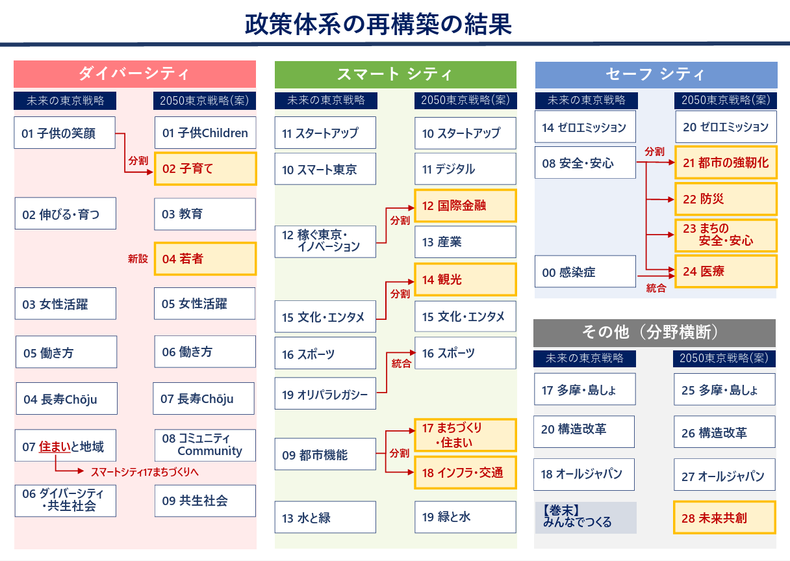
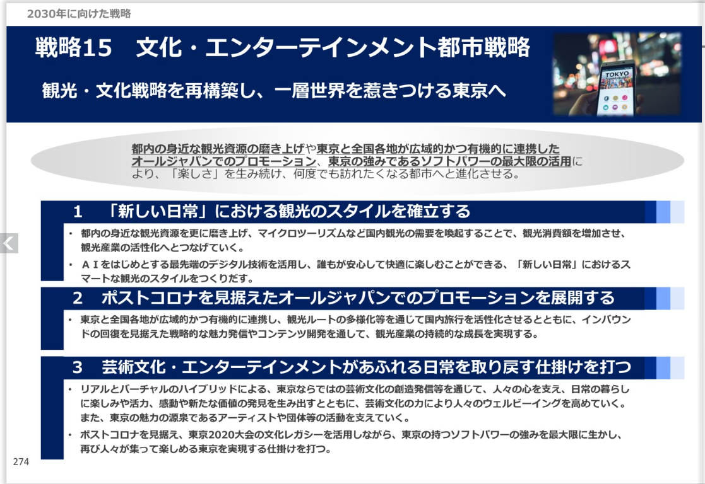
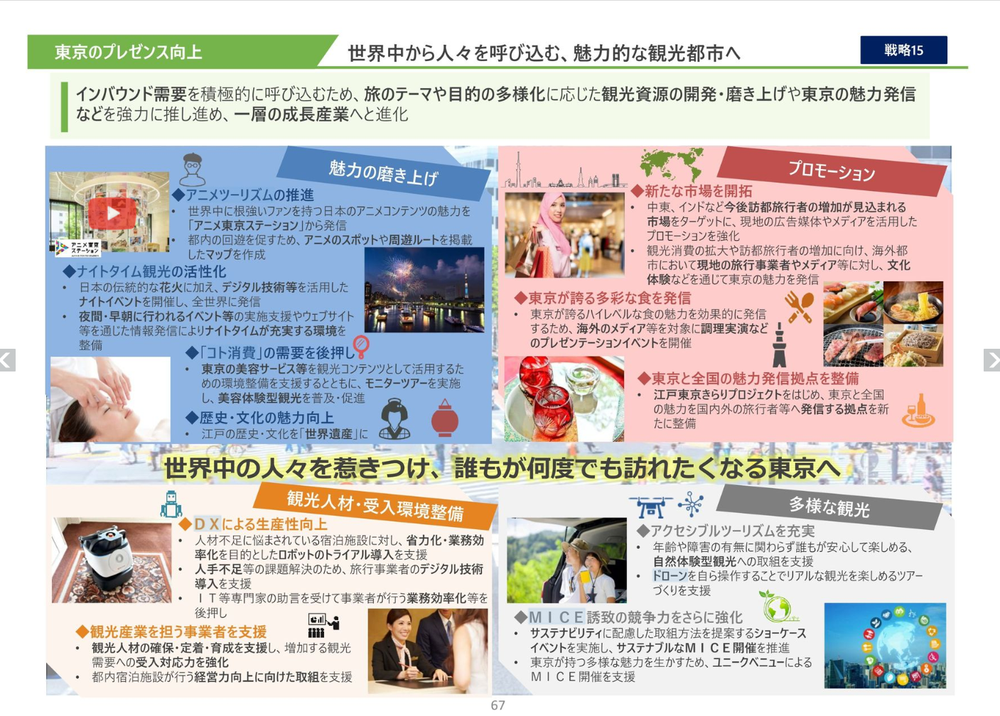

# 第6章 シン東京2050、1400万都市はブロードリスニングによる戦略転換に挑む

文責：tokoroten

## 6.1 1400万人都市の挑戦：シン東京2050プロジェクト

2024年11月22日、東京都は「[みんなでつくる『シン東京2050』プロジェクト](https://www.seisakukikaku.metro.tokyo.lg.jp/basic-plan/choki-plan/ikenbosyu)」を開始した。2050年代を見据えた新たな長期戦略「2050東京戦略」の策定にあたり、都民の声を広く集めようという試みである。

従来、行政が市民の意見を聞く手段といえばパブリックコメントが一般的だった。しかしパブリックコメントには限界がある。形式ばった意見募集に応じるのは一部の関心層に限られ、集まる意見は数百件程度にとどまることが多い。1400万人を超える人口を抱える東京都において、この規模で「民意」を把握することには無理がある。

シン東京2050プロジェクトでは、ブロードリスニングの手法を用いてこの課題に挑んだ。約1か月の募集期間（11月22日〜12月20日）で集まった意見は27,915件。従来のパブコメの数十倍から数百倍という規模である。

意見収集には5つのチャネルが用意された。

1. **専用Googleフォーム**: 最もオーソドックスな方法
2. **X（旧Twitter）**: ハッシュタグ「#シン東京2050」での投稿を収集
3. **YouTube**: 小池都知事の記者会見動画へのコメント
4. **メール**: 従来型のメールでの意見送付
5. **郵送**: デジタルに不慣れな層への配慮
6. **街頭インタビュー**: 街頭で都民の意見を聞き取り

特筆すべきは、SNSからの意見収集である。Xのハッシュタグ投稿やYouTubeコメントを分析対象とすることで、行政の意見募集に自ら応じることのない層の声も拾い上げようとした。

興味深いのは、インターネット経由での募集により、従来のパブリックコメントでは聞こえてこなかった若年層の声が多く集まったことである。行政の意見募集に応じるのは中高年層が中心という従来の傾向が、オンラインチャネルの活用によって変化した。

一方で、デジタルチャネルだけでは届かない声もある。東京都の職員は休日に上野動物園を訪れ、子供たちから直接意見を聞くという取り組みも行った。技術協力を行った安野貴博氏は「データソースを散らすことが重要」と提言しており、オンラインとオフラインを組み合わせた多角的なアプローチが試みられた。

技術面では、当時GovTech東京のアドバイザーを務めていた安野氏が協力し、オープンソースの意見分析ツール「[Talk to the City](https://github.com/AIObjectives/talk-to-the-city-reports)」を用いて約3万件の意見をAIでクラスタリング・可視化した。

収集された意見は2025年1月31日に[分析結果が公開](https://broadlistening.seisakukikaku.metro.tokyo.lg.jp/20250131/index.html)され、同年3月に策定された「[2050東京戦略](https://www.seisakukikaku.metro.tokyo.lg.jp/basic-plan/2050-tokyo/)」に反映されたとされている。

## 6.2 東京都の公式発表：20+1戦略から28戦略へ

東京都の公式発表によれば、ブロードリスニングの成果は政策体系の大幅な再編として結実した。[公式サイト](https://www.seisakukikaku.metro.tokyo.lg.jp/basic-plan/2050-tokyo/)には次のように記されている。

> AI分析により、都民の関心事項・課題を浮き彫りにし、戦略の政策体系を見直しました。

従来の「[未来の東京](https://www.seisakukikaku.metro.tokyo.lg.jp/basic-plan/choki-plan/)」戦略（2021年策定）では「20+1」の戦略体系だったものが、「2050東京戦略」では28の戦略に拡充された。戦略は「ダイバーシティ」「スマートシティ」「セーフシティ」の3つの柱と「その他（横断分野）」に整理された。

**ダイバーシティ**: 子供、子育て、教育、若者、女性活躍、働き方、長寿、コミュニティ、共生社会

**スマートシティ**: スタートアップ、デジタル、国際金融、産業、観光、文化・エンタメ、スポーツ、まちづくり・住まい、インフラ・交通、緑と水

**セーフシティ**: ゼロエミッション、都市の強靭化、防災、まちの安全・安心、医療

**その他（横断分野）**: 多摩・島しょ、構造改革、オールジャパン、未来共創

東京都はこの再編においてブロードリスニングが重要な役割を果たしたと説明している。特に強調されているのが「観光」の独立戦略化である。従来は「文化・エンターテインメント都市戦略」に含まれていた観光分野が、都民意見の分析によって独立した戦略として位置づけられたという。

また、各戦略には「AIによる都民意見の要約」が掲載されており、どのような都民の声が政策に反映されたのかが可視化されている。これは従来のパブリックコメントにはなかった透明性の向上といえる。

## 6.3 成果の検証：何が変わり、何が変わらなかったのか

ここで立ち止まって、東京都の発表を検証してみたい。

### 比較対象の問題

東京都の公式発表では、2021年策定の「未来の東京」戦略と2025年の「2050東京戦略」を比較している。確かにこの比較では、戦略体系は大きく変化しているように見える。

しかし、ブロードリスニングの効果を正しく評価するためには、適切な比較対象を選ぶ必要がある。

※出典：[「未来の東京」戦略 version up 2024](https://www.seisakukikaku.metro.tokyo.lg.jp/basic-plan/choki-plan/versionup2024)（東京都政策企画局）

「未来の東京」戦略は2021年3月に策定された。この時期を思い出してほしい。新型コロナウイルスの感染拡大の真っ只中であり、東京オリンピック・パラリンピックの開催すら危ぶまれていた時期である。インバウンド観光は事実上停止し、訪日外国人の統計調査すら中止されていた。

この文脈を踏まえれば、2021年版に「観光」が独立戦略として存在しなかったのは当然である。コロナ禍で観光産業が壊滅的な打撃を受けている最中に、観光振興を戦略の柱に据えることは現実的ではなかった。ただし、2021年版でも観光施策が皆無だったわけではない。多摩地域や島しょ部など、東京における過疎地域のツーリズム推進は盛り込まれていた。インバウンドが期待できない状況下で、都内の地域振興と結びつけた観光政策が採られていたのである。

実際、東京都は毎年「version up」として戦略を更新しており、2024年1月には「未来の東京」戦略 version up 2024が公開されている。この時点で観光施策の重点は大きく変化し、ナイトタイム観光、アニメツーリズム、アクセシブルツーリズムなど、都心部を中心とした都市観光に軸足が移っていた。インバウンド回復を見据えた施策への転換である。

つまり、ブロードリスニングの実施（2024年11月〜12月）より前に、観光施策の拡充は進んでいたのである。

| 比較 | 印象 | 実態 |
|------|------|------|
| 2021年版 → 2050東京戦略 | 劇的な変化 | コロナ収束・五輪終了・インバウンド回復の4年分を含む |
| version up 2024 → 2050東京戦略 | 漸進的な更新 | ブロードリスニング後の実際の差分 |

### 「発見」ではなく「分割」

東京都の公式文書「[2050東京戦略の策定に向けた考え方](https://www.seisakukikaku.metro.tokyo.lg.jp/documents/d/seisakukikaku/kangaekata3)」を詳しく見ると、興味深い事実がわかる。

「観光」は新たに発見されたカテゴリではない。従来の「文化・エンタメ」カテゴリから「分割」されたのである。

つまり、観光関連の施策は従来も「文化・エンターテインメント都市戦略」の中に含まれていた。ブロードリスニングで明らかになったのは、都民意見の中で観光関連の意見が多く、独立した戦略として扱う妥当性があるということだった。

同様の「分割」は他のカテゴリでも行われている。

- **子供** → 子供 + 子育て（子供本人の課題と子育て環境を区別）
- **都市機能** → まちづくり・住まい + インフラ・交通
- **安全・安心** → 都市の強靭化 + 防災 + まちの安全・安心 + 医療（4分割）

これは「行政が見落としていた分野をAIが発見した」という物語とは異なる。より正確には「従来一括りにされていた分野を、意見の分布に基づいて細分化した」というべきだろう。

### ワークフローの推測

実際の作業プロセスはどのようなものだったのだろうか。公開情報から推測すると、おそらく次のような流れだったと考えられる。

まず、Talk to the Cityによって27,915件の意見がクラスタリングされ、AIが自動的にカテゴリを生成した。このカテゴリは、都民の意見の分布を反映した「ボトムアップ」の分類である。

次に、このAIが生成した意見クラスタと、既存の戦略体系や既存の部門とのマッピングする作業が行われたはずだ。ここで注意すべきは、ブロードリスニングで出てくる意見の大半は「既に知っている話」だということである。行政の担当者にとっては、日々の業務で把握している課題や、審議会で議論されてきた論点がほとんどだ。一見すると「わざわざAIで分析しなくても分かっていた」と感じられ、ブロードリスニングは使えないように思えるかもしれない。

しかし、そうではない。大半の意見クラスタは既存戦略や部門とすんなり対応するが、対応付けに苦慮するような意見クラスタがちらほら出てくるはずだ。たとえば「文化・エンタメ」に対応づけようとした意見クラスタの中に、明らかに観光に関するものが大量に含まれている。あるいは「子供」に対応づけた意見の中に、子供本人の教育や遊びに関するものと、親の子育て支援に関するものが混在している、といった具合だ。

既存の枠に収まらない意見クラスタが一定量あるとき、それは既存の政策体系が市民の関心事項を適切に反映できていないサインとなる。こうした「違和感」を手がかりに、「この既存カテゴリは分割すべきではないか」という検討が進められたのだろう。

AIが直接「観光を独立させるべき」と提案したわけではない。AIの分類結果と既存体系の「ズレ」を人間が解釈し、政策体系の再編につなげたと考えるのが妥当である。つまり、ブロードリスニングの役割は「答えを出す」ことではなく、「問いを立てる材料を提供する」ことだったといえる。

### 消えた戦略の意味

一方で、2021年版から消えた戦略もある。

- **戦略0：感染症に打ち克つ** → コロナ収束により削除
- **戦略19：オリンピック・パラリンピックレガシー** → 五輪から4年経過、スポーツ等に統合

これらの変化はブロードリスニングの結果というより、時代の変化による自然な更新である。コロナが収束すれば感染症対策の優先度は下がり、五輪が終われば「レガシー」は各分野に統合されていく。どの自治体でも同様の更新が行われるはずだ。

## 6.4 ブロードリスニングの真の価値とは

では、シン東京2050プロジェクトにおけるブロードリスニングに価値はなかったのか。そうではない。

### 「発見」ではなく「定量的裏付け」

ブロードリスニングの価値は、行政の盲点を「発見」することではない。むしろ、政策判断に**定量的な裏付け**を与えることにある。

「観光への都民の関心が高い」ということは、おそらく行政担当者も感覚的には把握していただろう。インバウンドが過去最高を更新し、オーバーツーリズムが社会問題化している状況では、観光が重要課題であることは誰の目にも明らかだった。

しかし、27,915件の意見データがあれば、「都民の〇%が観光関連の意見を寄せた」「観光分野では特にオーバーツーリズム対策への要望が多かった」といった形で、政策判断の根拠を示すことができる。これは行政の説明責任という観点で大きな意味を持つ。

### 透明性の向上

「2050東京戦略」の[各戦略ページ](https://www.seisakukikaku.metro.tokyo.lg.jp/basic-plan/2050-tokyo/shinchoku)には「AIによる都民意見の要約」が掲載されている。政策と民意の対応関係が可視化されているのである。

従来のパブリックコメントでは、「いただいた意見は今後の参考にさせていただきます」という定型文で終わることが多かった。どの意見がどのように政策に反映されたのか、あるいは反映されなかったのか、市民には見えにくかった。

ブロードリスニングによる意見の可視化は、この透明性の課題に一定の回答を与えている。

### 多様なチャネルからの意見収集

6つの意見収集チャネル、特にXやYouTubeからの収集は、従来のパブコメでは届かなかった層の声を拾い上げる可能性を持つ。

行政の意見募集に自ら応じる市民は、どうしても「意識の高い層」に偏りがちである。SNSでの投稿を分析対象とすることで、日常的に行政に関心を向けることのない層の声も含めた分析が可能になる。

ただし、これには注意も必要だ。SNSの利用者層にも偏りがあり、デジタルデバイドの問題は解消されない。郵送や街頭インタビューで意見を募集したのはこの課題への配慮だろうが、それでも完全な代表性を確保することは難しい。

## 6.5 教訓：効果の適切な評価について

シン東京2050プロジェクトの事例から、私たちは何を学ぶべきだろうか。

### 行政発表を読み解くリテラシー

行政がブロードリスニングの成果をアピールする際、比較対象の選び方で印象は大きく変わる。2021年版との比較で「劇的な変化」を強調することは誤りではないが、ブロードリスニングの効果を過大に見せている可能性がある。

市民としては、「何と何を比較しているのか」「その間に他にどんな変化があったのか」を意識して発表を読み解く必要がある。

### 技術への過度な期待を避ける

ブロードリスニングは魔法の杖ではない。AIが市民の声を分析したからといって、行政が気づいていなかった画期的な政策課題が発見されるわけではない。

東京都のような巨大自治体には、すでに膨大な情報収集・分析の仕組みがある。各種審議会、区市町村との連携、業界団体へのヒアリング、各種統計調査。ブロードリスニングはこれらに新たなチャネルを追加するものであり、既存の仕組みを置き換えるものではない。

### それでも着実な一歩

批判的な検証をした上でなお、シン東京2050プロジェクトには意義があると考える。

27,915件という規模での意見収集、AIによる分析と可視化、政策への反映プロセスの透明化。これらは従来のパブリックコメントでは実現できなかったことである。

効果を過大に評価する必要はないが、過小に評価する必要もない。1400万人都市で民意を可視化しようという試みは、たとえ完璧でなくとも、民主主義のアップデートに向けた着実な一歩である。

重要なのは、この試みを「成功」として終わらせるのではなく、継続的に改善していくことだろう。比較対象の適切な設定、収集チャネルの偏りへの対処、分析手法の精緻化。課題は残されているが、だからこそ今後の発展に期待したい。
