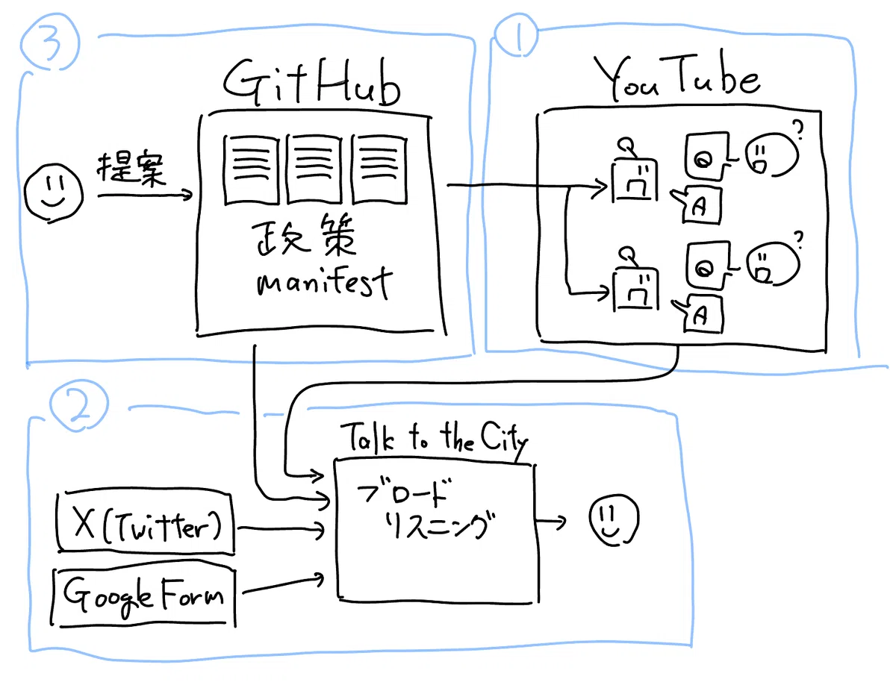
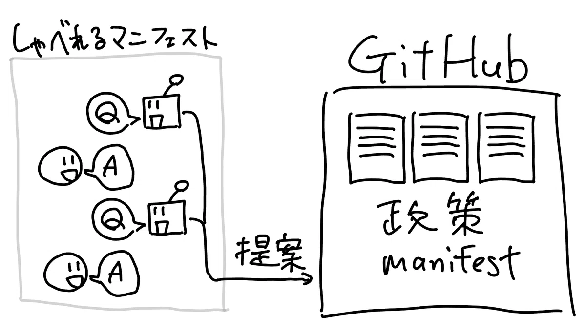

# 2025年参院選 チームみらいの取り組み

文責: 西尾泰和
(脚注: ブログ記事を紹介)

2025年5月、AIエンジニアの安野貴博氏が新党「チームみらい」を立ち上げ、参議院選挙に挑戦しました。7月20日の開票で、チームみらいは1議席・得票率約2.6%を獲得し、政党要件を満たして国政政党となりました。

本章では、この選挙期間中に運用された「しゃべれるマニフェスト」を中心に、ブロードリスニングのプロセスがどのように進化したのかを解説します。

## 都知事選から参院選へ：3つのプロジェクトの統合

前章で述べた2024年都知事選では、3つのプロジェクトが並行して動いていました。

1. **AIタウンミーティング**：AI YouTuber「AIあんの」が24時間質問に回答
2. **ブロードリスニング**：Talk to the Cityで民意を可視化
3. **オープンソースでの政策改善**：GitHubで政策を公開し、改善提案を受け付ける

都知事選2024における安野氏のマニフェスト

これらは相互に連携していました。GitHub上のマニフェストが最新のデータ(Single Source of Truth, SSoT)であり、AIあんのはそれを参照して質問に答え、多様なチャネルからの情報をTalk to the Cityで可視化して観察する、という構造でした。

3つのプロジェクトのつながり

ブロードリスニングに関しては5章1節で詳しく解説しました。都知事選の期間中（2024年6月21日〜7月6日）に、GitHubでの政策改善プロジェクトでは、232件の課題提起、104件の変更提案があり、85件が政策に取り入れられました。AIあんのは合計8,600回の質問に回答しました。

しかし、この仕組みには大きな問題点がありました。「多くの有権者はGitHubを使えない」という点です。

## しゃべれるマニフェスト：入口を対話にする

参議院選挙2025では、この問題を解決するために3つのプロジェクトが統合されました。

まず、AIが一人一人の有権者とチャットをします。従来のAIあんののようにAIが質問に答えることもできますが、今回は逆も可能です。AIがインタビュアーのように有権者の話を聞き、質問をして、言語化を促していきます。そして最終的にAIがGitHubを操作してGitHubに政策変更提案（プルリクエスト）を送ります。

これで有権者は直接GitHubを使う必要がなくなりました。

この「しゃべれるマニフェスト」は2025年5月16日にリリースされました。4日後の5月20日には、安野氏から嬉しい悲鳴が投稿されました[^anno-ureshii]。

> 皆さんからチームみらいのマニフェストに対して提案書を1,300件以上出していただいております。正直、想定の10倍以上の数が来ており嬉しい悲鳴です。

[^anno-ureshii]: 安野貴博 X投稿, 2025年5月20日. https://x.com/takahiroanno/status/1924760499729436716

都知事選の際に集まった変更提案は104件でした。たった数日で一桁多い提案が集まったわけです。これは、GitHubを直接使って投稿する専門的な入口から、対話UIという誰でも入れる入口へと切り替えたことの効果が、想定以上に大きかったことを示しています。

最終的には政策への提案だけで8,559件が届きました。

## 広聴AIでの可視化と観察

対外的にアナウンスはされていませんでしたが、5月22日には内部的にはブロードリスニングのツールにあたる「広聴AI」を使って可視化と観察ができる状態になっていました。

広聴AIは、都知事選の時に使っていたTalk to the Cityを改良して作ったものです。日本テレビと連携した2024年衆院選ブロードリスニングや、東京都と連携した「2050年代の東京」に向けた長期戦略策定のためのブロードリスニングなどの経験を踏まえ、より良いブロードリスニングのために必要だと感じた機能を追加しました。(TODO: ここは前の章ができてから削るか修正します)

都知事選の時にTalk to the Cityを使った際は、分析プログラムは分析者の手元のコンピュータで実行されていました。そのため、出力されたレポートをどうやって政策担当者やSNS担当者に共有するのかが課題でした。

広聴AIでは分析がサーバ上で行われ、レポート出力が完了すると即座に共有可能なURLが発行され、担当者はそのURLを開くだけでレポートを見ることができるようになりました。

今回、数十件のレポートが内部的には作成されましたが、そのほとんどは公開されませんでした。レポート作成自体は手軽になったものの、公開前には「公開して問題ない内容か」を担当者がレビューする必要があります。少ないスタッフで10人の候補者を擁立し、初めての国政選挙に挑戦するチームみらいにとって、レポートの公開前レビューは優先度高く実行する対象ではありませんでした。

(TODO: ここは1~3章にあわせて修正します)
ここで、狭義と広義のブロードリスニングの区別を思い出してください。広聴AIによる可視化・観察は「狭義のブロードリスニング」に該当します。しかし、しゃべれるマニフェスト全体としては、意見収集→構造化→熟議→意思決定→フィードバックまでを含む「広義のブロードリスニング」のサイクルを回そうとする試みでした。

## 分類の仕方の変更：ブロードリスニングがもたらす価値

マニフェストに集まった実際の声を観察することで、当初のセクション分割では各セクションに散らばってしまっている意見を新しいセクション「福祉」にまとめた方がわかりやすいのではないか、という議論と意思決定が行われました。

このような「分類の仕方の変更」は、広聴AIやTalk to the Cityのようなブロードリスニングのツールによって得られる重要な効果の一つです。X章の東京都の事例でも同様の政策体系の再構築が行われていました。

チームみらいの活動においてはカテゴリー追加に伴って、既存の変更提案を分析し、福祉カテゴリーに再割り当てすべきかどうかを判定することが必要になりました。そのため、当時2000件程度あった変更提案に対してGPT-4oで全件カテゴリーを分析し、1件あたりコスト$0.021、全体コスト$9.34で最分類が行われました[^welfare-label]。

[^welfare-label]: 福祉ラベル分析実験レポート. https://github.com/team-mirai-volunteer/policy-pr-hub/blob/99917864d079e432053c94a86765d6edad850e5b/docs/welfare_label_analysis_experiment.md

## 大規模提案処理の課題と対応

短期間にこの規模の変更提案を受けた組織は世界でも珍しいでしょう。どのような課題が生じ、どう対応したかを振り返ります。

**自動分類とAPIレートリミット**：GitHubに投稿された提案データを、GitHub API経由で収集し、提案対象ファイルごとに分類して書き出しをするシステムを作成していました。しかしGitHub APIには1時間に1000件の制限があり、提案が1000件を超えた時点でシステムが動かなくなりました。毎時で実行して差分だけを取得して更新するシステムへの変更が必要になりました。

**自動ラベルづけシステム**：提案の自動ラベルづけによって、GitHubのWebインターフェイス上でも特定のカテゴリに絞り込んで閲覧することが可能になりました。カテゴリは専門性のある担当者のチームと対応づいていて、担当者が自分の読むべきものを見つけやすくなりました。

**目次に変更提案が来る問題**：実際に届いた変更提案を対象ファイルごとに分類してみると、READMEファイル（目次ページ）に対する修正提案がたくさん来ていることにきづきました。ユーザは目次を見て興味のあるページをクリックして開いて読み、それからそのページに対しての質問や提案をする想定でしたが、チャット欄のついたシステムを見たユーザはしばしば即座にチャットを始めてしまいました。結果として、たとえば医療ページに書いてあることを目次ページに対して質問してしまったり、既に他のページに書いてある内容を新規に目次の変更として提案してしまったりしました。この問題の本質的解決にはチャットシステムの側の大幅変更が必要であり、選挙期間中に実行する余裕はありませんでした。

**具体的変更のコンフリクト**：しゃべれるマニフェストは具体的な修正差分を作りました。振り返ると、これは過度に具体的でした。同じ場所を違った形に変更する修正提案は、同時に取り入れることができません。この「コンフリクト」の解消は大変な作業で、多い場合には数十件の修正がコンフリクトしました。これは初めて経験する問題で、政策担当者がコンフリクトしている修正提案を全部読み、やりたい修正を汲み取って新しい修正提案を作る、という力技で解決しました。(TODO: ここはもうちょっと書く)

## 「受け止められた感」と両方向のトレーサビリティ

振り返って考えてみると、AIインタビュアーが話を聞いて提案が作られた「後」のユーザ体験の設計が不足していました。

しゃべれるマニフェストはGitHubにプルリクエストの形で変更提案を送って、そこで終了してしまいます。以降の処理がどうなっているのか、ユーザにはよくわかりませんでした。たとえば、すべての変更提案は10人以上の担当者が分担して読んでいるのですが、その「読み始めた」ことの情報フィードバックがありませんでした。

広聴AIの可視化では、まとめられた意見を掘り下げることで「どこから来たのか」を確認できます。一方で、ユーザにとっては自分の意見が「どこへ行ったのか」を確認できる手段が用意されていませんでした。これが満足度を下げていました。

**両方向のトレーサビリティが必要**という気づきが、今回の大きな学びの一つでした。

## GitHub上で議論が始まる現象

計画段階では、一般のユーザにGitHubを使わせることは想定していませんでした。ところがGitHubは公開されているので、直接使うことも可能でした。8,559件の変更提案のうちの1つに、236件もの大量のコメントがつきました（2番目に多い変更提案は10コメント）。

都知事選の際には誹謗中傷などをフィルターするAIを実装していましたが、今回はGitHub上での議論が盛り上がることを想定していなかったので入れていませんでした。結果的に、GitHubのコメント欄はただの古典的なWeb掲示板として振る舞うことになり、棘のある言葉の応酬などが行われてしまいました。

また、そのコメント欄では安野氏の顔アイコンを勝手に使う人が現れたり、党としての意見を語る立場にない人が党としての意見と誤認されうる発言をしたりしました。X（Twitter）上ではこの議論を「チームみらい内部の議論」と誤認したインフルエンサーによる誤情報の投稿もありました。

GitHubでのオープンソース開発に慣れているソフトウェアエンジニアであれば、GitHubが「アカウントさえ作れば誰でもコメントを書き込めるもの」だと知っていて、「内部の議論」などではないことを知っています。しかし、SNS投稿から直接リンクをたどって流入した人は、場の性質を説明されずにいきなり議論を目にしたのではないでしょうか。

## 得られた知見のまとめ

2025年夏の間に、デジタル民主主義を実現していく上で参考になる指針がいくつも言語化されました。

1. **入口設計の重要性**：GitHubから対話UIへの切り替えで、提案数が約80倍に増加しました
2. **分類の仕方の変更による価値**：実際の声を観察することで、政策体系の再構築が可能になります
3. **両方向のトレーサビリティの必要性**：「どこから来たのか」と「どこへ行ったのか」の両方が必要です
4. **場の設計の重要性**：議論の場には使い方の解説やモデレーションが必要です

部品としてのブロードリスニング（広聴AIでの可視化など）はこのサイクルの中のあちこちに存在しますが、それら単体が主役なのではありません。意見収集→構造化→熟議→意思決定→フィードバックというブロードリスニングのサイクル全体が、一つの社会実験として試みられたことに意義があります。

都知事選で安野氏が行った新しく技術的に可能になったもののデモンストレーションは1年後の社会に大きな影響を与えました。今回の参院選でチームみらいが行ったデモンストレーションも、未来の世界にさらに大きな影響を与えるでしょう。

## いどばたシステムについて

この出来事を世界に生み出した貢献が、一番目立つ「チームみらい」だけに帰属するのは好ましくないので、ここで誌面を割いてはっきりと解説しておきます。

今回の「しゃべれるマニフェスト」プロジェクトの部品の一つ、「人々とチャットをして、変更提案をGitHubに送る部分」は、X章で紹介したデジタル民主主義2030プロジェクトで開発されました。熟議支援システムとして作られた「いどばた」システムの派生系という位置付けです。このシステムは2025年中に他の政党でも導入のための追加開発が進んでいましたが、残念なことに先方で熱心に推進されていた方の人事異動に伴って立ち消えてしまいました。民間企業での利用例としてはX章サイボウズの事例で解説しています。このいどばたプロジェクトは「チームみらいの所有物」ではなく、公共の財産なのです。

この「いどばた」システムは少し複雑で、「しゃべれるマニフェスト」を構成する「いどばた政策」と、タウンミーティング的な「人々がAIとチャットして、その意見をまとめたレポートが生成される」という仕組みの「いどばたビジョン」が同一のリポジトリで開発され、それぞれ用途に合わせて利用されていました。

### 共通の概念
これらのシステムでは「人々が同じチャットにいる」のではなく「個別のチャットにいる」がAIを介してつながり合っています。これは新しいコミュニケーションの形であり、5年前には技術的に可能ですらなかったものです。

人々が同じ場所にいる、個別のAIチャット、AIを介して繋がり合う

図を見ながらもう少し掘り下げてみましょう。
Aは人々が同じコミュニケーションの場に存在しています。
コンピュータ以前の「人々が集まって話す」のもこの形です。
インターネット普及以降はオンライン掲示板システムやチャットとして技術に詳しい人の間で広まりました。
経験者が大きく増えたことには大震災とLINEの普及が影響しているでしょう。
(ここ定量的に確認したい)

BはAIチャットです。2022年のChatGPTのリリースによって広く知られるようになりました。
この仕組みでは個々人がAIと会話した内容は他人と共有されず、一人のユーザとAIとの閉じた世界になっています。

Cが新しい形です。人々がAIとチャットするところはBと同じですが、AI同士は情報を共有しています。実装方法としてはチャットログ自体を共有する方法と、チャットログから得られた知見だけを共有する方法があります。この図で人間とAIの間のチャットログ(四角)がAI同士の情報共有の輪(右の灰色の輪)に入っていないのは、チャットログを共有していないことを表現しています。

この図は新しく生まれつつある構造がわかりやすいようにかなりシンプルにしていて、実際には情報のやり取りを表現している双方向矢印をどう実装するかに細かい工夫の余地があります。たとえばいどばた政策ならAIが共有している四角に「今のマニフェスト」が入っており、人間とチャットをしたAIはマニフェストに対する更新案をGitHubに書きます。その後、人間が承認をしてマニフェストが更新され、それ以降のAIは最新の更新されたマニフェストを読んで新しいユーザと会話をします。この結構複雑な処理が「共有されている情報をAIが読み書きをする」という双方向矢印で表現されているわけです。
