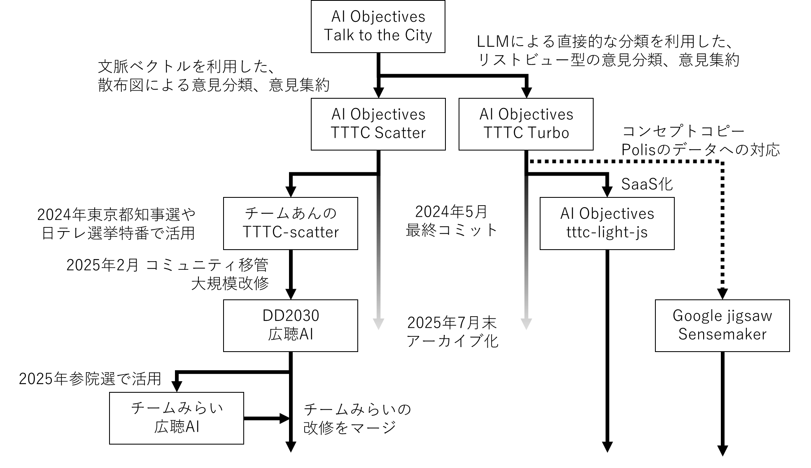

# 第7章 DD2030による広聴AIの開発活動

tokorotenとnishioとsuminoが書く

## デジタル民主主義2030 について

デジタル民主主義2030（DD2030）は、2025年1月にAIエンジニアの安野貴博と、スマートニュース取締役会長・東京大学特任研究員の鈴木健が共同で立ち上げた非営利のオープンソースプロジェクトである。鈴木健は『なめらかな社会とその敵』の著者として知られ、複雑系科学や自然哲学の観点からデジタル民主主義の可能性を長年探求してきた人物であり、DD2030の思想的な基盤に深く関わっている。

2024年の東京都知事選をきっかけに、安野はブロードリスニングの取り組みを進めてきた。その後、日本テレビの衆院選特番での意見分析や、東京都の長期戦略策定における活用など、実践の場は徐々に広がっていった。こうした活動を単発のプロジェクトにとどめず、自治体・政党・政治家など多様な主体が中立的に利用できる形で継続的に社会へ届けていくためのコミュニティとして、デジタル民主主義2030が組織された。

DD2030が一貫して重視するのが政治的中立性である。特定の政治家や政党に肩入れするのではなく、民主主義の土台となるインフラを整備するという立場を取ることで、与野党を問わず複数の政党や自治体を支援している。「2030年までに、情報技術によって民主主義のあり方がアップデートされ、一人ひとりの声が政治・行政に届く社会を当たり前にする」という目標のもと、広聴AIの開発・普及を軸に、熟議プラットフォーム「いどばた」や政治資金の透明化ツール「Polimoney」など、デジタル民主主義を支える複数のプロジェクトを推進している。

その後、2025年5月に安野がチームみらいを結党して2025年参院選に立候補したことに伴い、政治的中立性を保つためDD2030の代表を退任した。しかしコミュニティとしての開発活動は継続しており、安野の離脱後も広聴AIをはじめとする各プロジェクトの改善と普及活動は続いている。

なお本書はデジタル民主主義2030の活動の一環として有志により執筆されている。

## 広聴AIの技術的系譜

広聴AIはTTTC Scatterのフォーク（fork）として作られた。「フォークとスプーン」のフォークである。フォークには「分岐したもの」という意味があり、ソフトウェア開発の世界では、既存のプロジェクトからコードを引き継いで新しいプロジェクトを作ることをフォークと呼びます。

memo: suminoの記事に画像をマージする

## 広聴AI 開発の背景と目的

memo: suminoの記事へつなげる

## 2025年5月の転機

2025年5月は、広聴AIの開発にとって「減速と加速が同時に起こった」転換点となった。

### コミュニティの分散

2025年5月7日、DD2030を立ち上げた安野貴博はDD2030の理事を退任した。翌5月8日にはチームみらいを正式に結党し、2025年参院選に向けた政治活動を本格化させたためだ。政治的中立性を保つために自ら退任を決断したものだが、DD2030にとっては大きな転換点となった。

安野のリーダーシップを軸にコミュニティが形成されていたこともあり、多くのエンジニアやデザイナーが、DD2030からチームみらいのコミュニティへと活動の場を移した。さらに、広聴AIの主要開発者が、チームみらいから立候補を決断したことで、開発リソースは急激に減少した。

チームみらいに移るもの、DD2030に残るもの、両方のコミュニティを行き来するものなど、個人ごとに様々な動きがあった。広聴AIはオープンソースプロジェクトとして公開されていたため、開発者の入れ替わりはむしろコミュニティの特性とも言える。特定の個人に依存せず、誰でもコードに貢献できる構造があったからこそ、開発は完全には止まらず継続できた。

### チームみらい版の誕生

チームみらいは2025年参院選に向けた独自の要件に対応するため、広聴AIのリポジトリをフォークして独自開発を進めた。フォークすることで、DD2030側の承認を待たずにチームみらい側のエンジニアの判断だけで機能を追加・リリースできる。選挙という時間的制約の厳しい現場では、この機動力が大きな利点となった。

具体的には、いどばたシステムで集めた政策マニフェストへの大量の変更提案をGitHubのPRとして可視化する際に、散布図上の各データポイントから元のGitHub PRに一クリックで飛べる「ソースリンク機能」を実装した。どの意見がどのクラスタに分類されたかを市民自身が確認できるようにする機能で、透明性の観点から重要な改善だった。

https://github.com/team-mirai/policy/pulls

こうしてフォーク版で先行開発された機能群は、後にDD2030の本流にマージされた。自分たちに必要な機能を自由に開発し、汎用性があれば本流に還元する。チームみらいとDD2030の関係は、オープンソースが想定する健全な分岐と統合のサイクルを体現していた。

### AIプログラミングツールの台頭

広聴AIの開発では、DD2030設立当初からAIコーディングエージェント「Devin」を活用していた。安野がDevinの紹介動画をYouTubeで公開した結果、紹介料として多額のクレジット（AIを動かすためのポイント）が支払われたため、それを皆で使う形でDevinを活用していた。なお、安野が退任した後も、Devinは新たに契約し引き続きDD2030の各プロダクトの開発に活用されている。

プロジェクト全期間（2025年2月〜2026年2月）の総コミット数2,756件のうち、Devinによるものは210件（約7.6%）にのぼる。これはコントリビューターランキングで人間を含む24人中5位に相当し、主要開発者の角野（389件）、西尾（354件）に次ぐ存在感を示している。

また、2025年5月にGitHub Copilot AgentとClaude Codeが一般公開され、AIを活用した開発スタイルは広がった。ただし、これは直ちに開発全体の速度回復を意味したわけではない。実際には減速期の厳しさが続く中で、少人数でも開発を止め切らずに継続するための下支えとして、AIプログラミングツールの進化が機能した。

その具体例として、広聴AIの「属性フィルター機能」が挙げられる。年齢・性別・支持政党などの属性でデータを絞り込み、属性ごとの意見分布を可視化するこの機能は、2203行の追加を含む大規模な実装だったが、機能の大半がGitHub Copilot Agentによって開発された。

また、2025年9月には、GitHubのissueをAIにアサインするだけで自動的にコードが書かれるようになり、エディタを起動することなく、AIプログラミングが行えるようになり、AIを活用した開発はさらに加速している。

### 減速期の実態、開発の火を絶やさないための最小運用

OSS開発では、少人数での開発が続く中で、レビューや意思決定の往復が細り、進捗が厳しくなる時期が訪れることがある。広聴AIでも、コミュニティの分散をきっかけにその局面が表面化した。

2025年5月の転機以降、広聴AIの開発はしばらく厳しい局面が続いた。日々のやり取りの密度が下がり、PRレビューや意思決定に必要な往復が滞りがちになった。レビューが返りにくい状態が続くことで、変更が取り込まれずに止まりやすくなった。

この時期は、実質的に開発を継続できる人員が極端に限られる場面もあった。結果として、PR自体は作れてもレビューする人がいないためにマージできず、しばらく止まってしまうことがあった。長い場合は、レビューやマージまでに2.5か月程度空くこともあり、開発のテンポが落ちやすい状態だった。

だがコミュニティが分散する中でも、DD2030側にあえて残り、開発とコミュニティの連続性を保とうとする少数のメンバーがいた。

具体的には、明確な議題がない回も含めて開発定例を可能な限り継続し、参加者が少ない日でも状況共有や雑談ができる「いま何が起きているかを知れる場所」を残すことを重視した。進捗がないなら開催しないという判断もあり得たが、このフェーズでは、火を絶やさないために入口そのものを維持することが必要だった。実際、この場をきっかけに状況を把握し、少人数ながら新しく開発に参加する人が生まれた。

### 普及活動としての現場接続

普及活動の面では、コンタクトの取れた自治体に対して「待つ」だけでなく、DD2030側から積極的に声をかけに行った。試行時のフィードバックを取りに行くことに加え、プロダクトに直接は現れない課題（データ準備、庁内調整、説明責任、広聴の業務フローなど）も含めてヒアリングし、現場の文脈を把握することを重視した。

ただし、導入は常に順調に進むわけではなかった。自治体側で新しい取り組みを優先して試すインセンティブが常に強いわけではなく、DD2030側だけで導入をドライブし切ることには限界があった。

例えば、首長の温度感が高くても、現場の業務負荷や体制が追いつかず、実装段階で失速することもあった。部署異動で担当者が変わり、前提共有をやり直すこともあった。さらに、導入を検討するユーザー側では、継続的なエンジニア体制を確保しにくく、試行から運用への移行が途切れやすいという課題もあった。

そのため、普及の初期段階では「十分に整った事例」が自然に生まれるのを待つのではなく、協力を得られる範囲で小さな試行を重ね、得られた学びを記録して事例として残すことを意識した。一方で、人手や時間の制約から、試行の設計・記録・共有までを継続的に回し切れない場面もあり、断片的な学びが個別のやり取りの中で消えてしまうこともあった。

現場接続を通じて得られた実務的な示唆として、ブロードリスニングでは「何のインサイトを得たいのか」を先に言語化しないと、意見を集めること自体が目的化しやすいことが繰り返し確認された。問いが曖昧なまま件数だけが増えると、多数の意見に埋もれてしまい、意思決定につながる示唆を取り出しにくくなる。

また、多くの自治体では、分析以前に意見を十分に集めること自体に課題があった。一部の自治体では、行政と住民のあいだの日常的な対話の蓄積が十分でないために、意見募集への参加が広がりにくい場面も見られた。
これは、パブリックコメントが形骸化しやすい背景とも重なる構造的課題だと考えられる。意見を「集める場」を設けるだけでは不十分で、参加の動機づけや継続的な信頼形成を含めた設計が重要になる。

それでも、こうした自治体との対話を通じて、現場で何が障壁になりやすいか、どの前提条件が重要かについての感触は蓄積された。この活動には、普及そのものに加えて、開発の方向性にユーザー側のフィードバックを取り込む意図もあった。現場の声を継続的に拾い、開発メンバーとの前提共有として戻すことで、開発成果がユーザー（政党・自治体・民間の導入検討者）から離れないようにした。あわせて、現場の事情に沿って「使い続けられる状態」を一緒につくることを目指した。

### 技術解説プレゼン資料の公開

2025年6月に広聴AIの技術解説プレゼン資料「広聴AI技術解説 ブロードリスニングを支える技術」が公開された。
この資料は大学での講義などを経て、本書の12章、13章の内容のベースとなった。
https://www.docswell.com/s/tokoroten/ZL1M88-2025-06-14-014546

-----

以下メモ、そのうち消す

-----

## 時系列メモ
2024都知事選　西尾＆M氏
2024衆院選(日テレ)　すみの
2024/11~ シン東京2050　西尾、すみの
2025/1~ DD2030設立
2025/1 Devinの投入、5月頃Github Copilot Agent、6月頃 Clude code
2025/3 ~OSS化
2025/5 安野がチームみらいを結党、立候補
2025メインエンジニアが立候補して、開発リソースが枯渇

## メジャーバージョンアップメモ

広聴AIは2025年2月の初回コミットから約1年で807本のPRがマージされ、急速に進化してきた。以下にメジャーバージョンごとの主な改修内容を示す。

### v1.0.0（2025年4月29日）初期リリース

PR約40本。APIサーバーの実装、Docker対応、クラスタリング結果の可視化UI、CSV処理機能、GitHub Actions CIの整備など、基盤となる機能が一通り揃った最初のリリースである。

### v2.0.0（2025年4月29日）大規模機能拡張

PR100本以上。Azure OpenAI対応とAzureデプロイ環境の整備により、企業や自治体での導入が容易になった。静的HTMLビルド・エクスポート機能によりGitHub Pagesでの公開が可能となり、Googleスプレッドシートからの入力やShift-JIS CSVへの対応など、日本の現場で求められるデータ入力形式を幅広くサポートした。LLMの出力安定化のためにStructured Outputを導入し、JSONフォーマットの確実な取得を実現した。レポートの公開/非公開切り替え、削除機能、OGPカード対応なども追加された。コード品質面では、Biomeによるlint導入、langchain依存の除去が行われた。

### v2.1.0（2025年5月15日）用語統一・ローカルLLM対応

PR約40本。UIの用語を「クラスタ」から「意見グループ」へ統一し、非技術者にもわかりやすい表現に改めた。ローカル環境での埋め込み処理に対応し、外部APIを使わずにテキストのベクトル化が可能になった。散布図のズーム・パン機能、属性フィルタ、CSVカラムの自動選択アルゴリズムを追加し、分析の操作性を向上させた。LLMプロバイダとしてOpenRouterやollamaを選択可能にし、OpenAI以外のモデルも利用できるようになった。APIキー検証UI、E2Eテスト基盤、トークン使用量の追跡機能も導入された。

### v3.0.0（2025年5月30日）セグメントビュー・フィルタ機能

PR約30本。OpenRouterサポートの正式化に加え、セグメントビュー（全体表示/強い意見/階層表示の切り替え）を実装し、大量の意見を多角的に閲覧できるようになった。文字列検索フィルタにより特定のキーワードを含む意見を素早く探せるようになり、意見グループのタイトル・説明文を手動で編集する機能も追加された。レポート生成のコスト見積もり表示機能を実装し、利用者がAPI費用を事前に把握できるようにした。チームみらいのフォークで先行開発された機能群のマージも行われた。

### v4.0.0（2025年12月27日）管理画面刷新・Gemini対応

PR約80本。管理画面をServer Functions/Server Componentsベースに全面移行し、デザインシステムのトークンとコンポーネントを刷新した。GoogleのGemini LLMをレポート生成に利用可能にし、LLMの選択肢をさらに拡大した。用語集ページとグローバルナビゲーションの追加、全画面ダイアログの実装、レポート単位でのHTML出力機能など、利用者向けの改善が多数含まれる。GitHub ActionsによるAzure CDパイプラインの構築、E2Eテストの拡充（管理画面、クライアント、静的HTML）により、開発・運用の自動化も大きく進んだ。

### v4.0.0以降（2026年1月〜）アーキテクチャ改善

安定したコア機能と実験的な拡張を分離するコア/プラグインアーキテクチャの導入が行われた。データ処理ライブラリをpandasからpolarsへ全面移行し、処理性能の向上を図った。Next.jsを15系から16系へアップグレードし、Dockerイメージの大幅な縮小（APIイメージが約34GBから約2.7GBへ）を実現した。散布図に「詳細クラスタ」タブと凸包表示オプションを追加し、可視化機能を強化した。MkDocs Materialによるドキュメントサイトの構築も進められている。

----

## 2025年5月のメモ

執筆したいことメモ
- 5月以降、広聴AIの開発は減速と加速が同時に起こった
- 安野がチームみらいの結党により、DD2030の理事から抜けて、1メンバーになった
  - 安野の強いリーダーシップが喪失
  - 多くの開発者がチームみらいのコミュニティに移動、DD2030に閑古鳥が鳴く
  - 主要開発者のsuminoが、チームみらいから立候補して、開発速度が急減
- 2025年5月Github Copilot Agentの一般公開、2025年6月Claude Codeの一般公開により、AIプログラミングが本格化
  - もとからDevinを使って開発を行っていたが、これらのツールの登場により、AIを活用した開発がさらに加速
  - Devinの利用料は、安野が紹介料で稼いだものを使っていた
- 西尾はチームみらいを支援しつつ、DD2030で開発を継続
- tokorotenによる広聴AIの技術解説のプレゼン資料が公開される
- 2025/06 https://www.docswell.com/s/tokoroten/ZL1M88-2025-06-14-014546
- これが本書が書かれるキッカケになる
- チームみらい版がfork、チームみらいが選挙に合わせて独自開発を行う
- チームみらい版がマージ
- フリーランスエンジニアの大木による、政党や自治体へのサポート業務
- 安野は離れたけど、DD2030とプロダクトは死んでないよ、細々とやってるよ
- github copilot agentも最近は使ってるよ
