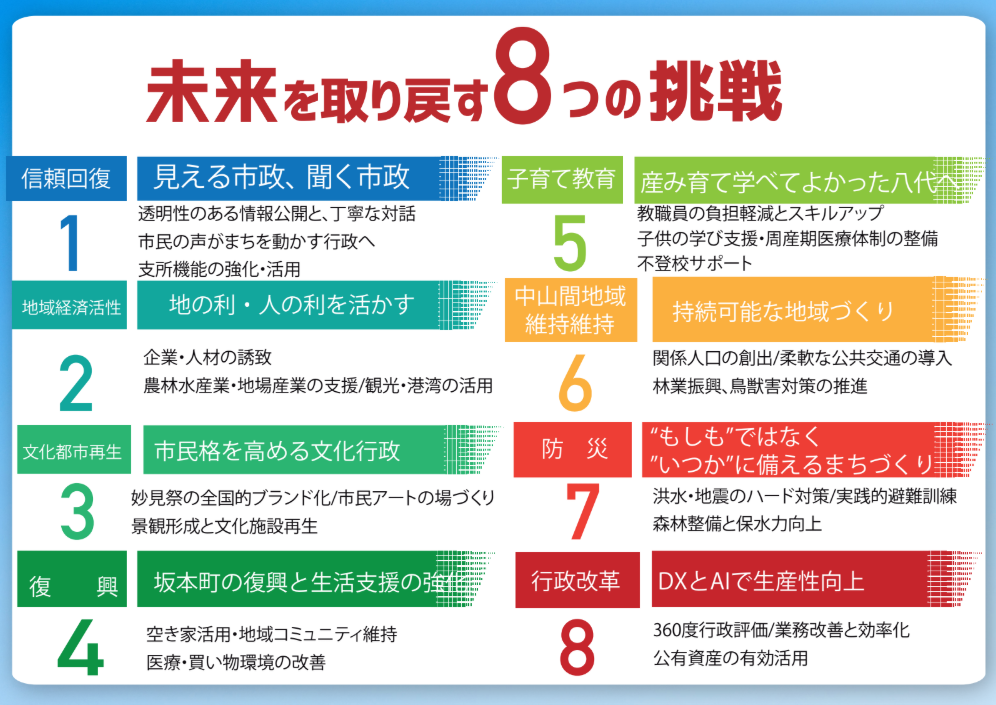

# 熊本県八代市長選 小野氏陣営のケース

2025年8月の八代市長選で、小野たいすけ候補は広聴AIを導入し、選挙戦略に活用した。結果は小野氏36,641票、現職の中村氏21,973票で、小野氏が当選した。
筆者・高手智基は小野氏陣営のIT担当スタッフとして、広聴AIの導入・運用に携わった。本節は、その経験と当選後の小野氏へのインタビューをもとに構成している。

## 小野たいすけ氏の経歴
小野氏は1974年4月20日生まれ、東京都出身。1999年に東京大学法学部を卒業後、アクセンチュア、衆議院議員公設秘書（自由党・藤島正之氏）を経て、大学時代の恩師である蒲島熊本県知事に請われて2008年に熊本県政策参与へ就任した。2012年から熊本県副知事を2期8年務め、県南地域の振興や農業振興など地域活性化に携わった。2020年に副知事を退職後、東京都知事選へ出馬し、3週間で61万票の支持を集めた。2021年からは衆議院議員を務め、2025年8月に八代市長に就任した。

[八代市公式プロフィール](https://www.city.yatsushiro.lg.jp/shicho/kiji00324866/)

## 選挙の背景

熊本県八代市は九州の中央に位置する熊本県南部の都市で、県内では熊本市に次ぐ第2の人口規模を持つ。人口は約12万人。西は不知火海に面し、内陸部には豊かな自然と里山が広がる。九州新幹線の停車駅があり、交通の利便性も高い。産業構造は第三次産業が約6割を占めるが、農業も盛んで、特にトマトやい草（畳表の原料）の生産地として知られる。また、日奈久温泉をはじめとする観光資源や、「八代妙見祭」などの伝統行事も地域の特色となっている。

この八代市で、2025年8月に市長選が行われた。候補は2人で、前述の小野たいすけ氏と、現職の中村ひろお氏である。中村氏は自民党の推薦を受けており、「保守王国」と呼ばれる熊本では自民党が圧倒的に強い。熊本出身じゃない人に首長は任せられないという声も多く､通常であれば現職有利の構図だ。
しかし選挙前、YouTubeやSNSでは市政への不信や汚職疑惑を示唆する投稿が相次ぎ､地元記者たちに聞くと「どちらが勝つか全く読めない」「接戦になるだろう」という声が多かった。
こうした状況を受け、小野氏陣営は「行政の透明性を高める方針」を前面に出すことにした。ただ、SNS上の投稿の真偽は判断しづらく、不信感の中身や、市民が本当に求めているものは掴みきれていなかった。
表に出にくい声をどう拾うか。そこにブロードリスニングを導入する意義があった。

## 導入の経緯

始まりは八代市長選の3か月前、熊本大学で筆者が主催したデジタル民主主義に関するイベントに、元熊本市長の幸山政史氏を招いたことだ。
筆者はAIエンジニアとして、デジタル民主主義の実践、とりわけ地方での実装に関心があった｡ 地方政治はメディアの監視も弱く､狭い密室の中で老人たちの手によって進んでいる､という印象を持っていたからだ｡ デジタル民主主義によって､少しでも市民の声を届けられないか｡ 地方自治体の首長を長く務めた幸山氏にその実現可能性を伺う形でイベントを開催した。
幸山氏も自らの経験から現在の民主主義の限界を感じており、テクノロジーでのアップデートに強い関心を示した。「市民の声を広く聞きたいと思っていても、これまではそれができなかった。テクノロジーで実現できるならぜひ活用したい」と語り、双方で実現を模索することになった。

その1か月後、幸山氏から八代市長選の候補者である元熊本県副知事の小野たいすけ氏を紹介された。小野氏は安野貴博氏の都知事選でブロードリスニングを知り、自らも試したいと考えていたという。
こうした巡り合わせから、筆者は知人のエンジニア2人とともに小野氏陣営のITスタッフとして参加し、選挙戦略にブロードリスニングを導入することになった。

このケースにおいて、ブロードリスニングは「どのような不満や期待が、どんな言葉や文脈で語られているか」「どんな少数意見や見落としていた論点が潜んでいるか」をあぶり出し、選挙戦略の方向性を調整するためのレーダーとして位置づけられた。

## 意見収集と分析

### 設問設計

広聴AIを有効に活用するには、できるだけ多くの意見を集めることが前提になる。Google Formで意見を集めたが、いちばん難しかったのは「何を聞くか」だった。
先行事例の奈良市長選では「私が奈良市長だったらこうしたい」という設問で、市民の主体的なアイデアを引き出していた。八代市長選では、参加のハードルを下げて裾野を広げる狙いから「八代市政に求めるもの」という問いを採用した。ただ、振り返ると、より良い聞き方があったかもしれないという感触がある。設問の磨き込みは今後の課題として残っている。

### 収集の経過

意見収集に大きく貢献したのは、候補者本人のSNSでの発信力と、座談会を繰り返し開催して直接協力を呼びかけたことだ。開始から1か月で約100件の意見が集まり、その後の活動を通じて最終的には358件のコメントが寄せられた。
週次の集計レポートを会議で共有し、SNS担当と投稿の切り口をすり合わせながら収集を進めた。ただ、現場の忙しさの中で連携のタイミングを作るのは容易ではなく、運用上の課題でもあった。

### 分析結果

集まった意見をAIで分析したところ、839件の意見が抽出され、7つの大きなクラスタに分類された。7つのクラスタは、八代市民が市政に求めるものをテーマ別に整理したものである。

1. 地域の未来を支える教育と共生の環境づくり（170件）：私立高校や大学の誘致、独自カリキュラムの導入、子どもが安心して学べる環境づくりに加え、若者・子育て世代の雇用創出や高齢者との共生など、教育を軸にした幅広い要望が集まった。
2. 市民参加を促進し透明性を確保した市政の実現（166件）：情報公開や公平な資源配分、議会の健全化や議員の質の向上など、信頼される市政への改革が強く求められていた。
3. 八代市の未来を見据えた地域活性化と市民参加の促進（122件）：若者が定住したくなる環境づくりや、市民の意見を政策に反映させる仕組みへの期待が示された。
4. 地域経済の持続的成長を支える産業誘致と観光振興（120件）：企業・スタートアップ誘致、人材育成、農業振興、厚生会館や日奈久温泉の利活用など、具体策の提案が多く挙がった。
5. 八代市の観光資源と地域活性化に向けた具体的施策の推進（98件）：新八代駅周辺の活性化、観光名所の整備、地域資源を活かしたまちづくりなど、訪れる価値を高める施策が求められた。
6. 市民に寄り添った行政改革と地域活性化の推進（86件）：市役所の機能向上や職員の意識改革、福祉改善、生活保護制度の見直し、ペット同伴避難など、実務的な提案が目立った。
7. 熊本県南部地域の持続可能な発展と地域活性化の推進（77件）：防災・インフラ整備、商店街の再生、自然環境の保護と地域振興の両立が重要課題として語られていた。

※分析結果の全体は [こちら](https://democracy-x.github.io/kouchou-ai-yatsushiro/47ae7bf4-e5de-4dbd-82ab-520160f373d6/) で公開されている。

## 得られたインサイトと活用

### 意外な発見

意見を広く集めてみると、事前の想定とは異なるインサイトが浮かび上がった。地域経済の活性化を求める声や、八代の文化・観光に対する意見がはっきりと見えてきたのだ。
会議でその旨を伝えると、陣営のメンバーも驚いた様子だった。「行政不信」に偏った想定を修正する必要があるという認識が共有された。
小野氏は振り返って以下のように語る。
「私は当初、行政不信や市政への不満の声が大きいだろうと予想していました。自分の支持者の声は、どうしても自分の耳に入りやすい。そこだけを聞いていると、『みんな行政不信なんだろうな』と思いがちですが、広聴AIを通じて広く声を集めると『実は違う』ということが分かる。これは非常に大きな気づきでした」

こうした発見が、選挙戦略の方向性を再検討するきっかけになった。行政不信への対応だけでなく、経済の活性化や、教育・若者の定着、文化・観光への投資といったテーマを打ち出す必要性が見えてきた。

### マニフェストへの反映

小野氏のマニフェストは8つの柱で構成され、ブロードリスニングで浮かび上がった論点が随所に反映された。

第1の柱「信頼回復」では、「見える市政、聞く市政」を掲げ、透明性の高い情報公開や、市民の声が届くための職員の意識改革を打ち出した。「市民参加を促進し透明性を確保した市政の実現」との対応関係が分かりやすい。

第2の柱「地域経済活性化」では、新八代駅前開発の推進、日奈久温泉の再生、中心市街アーケードのあり方検討など、ブロードリスニングで具体的に名前が挙がっていた地域課題が政策項目に落ちている。「地域経済の持続的成長を支える産業誘致と観光振興」に加え、「八代市の観光資源と地域活性化に向けた具体的施策の推進」の声とも重なる。

第3の柱「文化都市再生」は、厚生会館の利活用や妙見祭のブランド確立といった意見と接続している。文化資源の磨き上げが、観光・まちづくりの文脈でも重要な論点であることが示されている。

第5の柱「子育て教育」では、「産み育て学べてよかった八代へ」というビジョンのもと、教職員の負担軽減や不登校児支援、周産期医療体制の整備支援などが盛り込まれた。「地域の未来を支える教育と共生の環境づくり」との対応が読み取れる。

このように、マニフェストの8項目はブロードリスニングで可視化された市民の声と概ね対応しており、特に教育、経済、文化の領域で重なりが大きい。

表8-1：クラスタとマニフェストの対応

| クラスタ | 主な内容 | マニフェストでの対応 |
| --- | --- | --- |
| 地域の未来を支える教育と共生の環境づくり | 教育環境、子どもの学び、共生 | 第5の柱「子育て教育（産み育て学べてよかった八代へ）」 |
| 市民参加を促進し透明性を確保した市政の実現 | 情報公開、市民参加、議会改革 | 第1の柱「信頼回復（見える市政、聞く市政）」 |
| 八代市の未来を見据えた地域活性化と市民参加の促進 | 定住促進、市民の声の反映 | 第2の柱「地域経済活性化」＋第1の柱「信頼回復」 |
| 地域経済の持続的成長を支える産業誘致と観光振興 | 企業誘致、観光、産業振興 | 第2の柱「地域経済活性化（地の利・人の利を活かす）」 |
| 八代市の観光資源と地域活性化に向けた具体的施策の推進 | 観光名所整備、駅周辺活性化 | 第2の柱「地域経済活性化」＋第3の柱「文化都市再生」 |
| 市民に寄り添った行政改革と地域活性化の推進 | 行政改革、福祉改善、職員意識 | 第8の柱「行政改革（DXとAIで生産性向上）」＋第1の柱「信頼回復」 |
| 熊本県南部地域の持続可能な発展と地域活性化の推進 | 防災、インフラ、地域維持 | 第6の柱「中山間地域維持（持続可能な地域づくり）」＋第7の柱「防災」 |

### 街頭演説での活用

街頭演説では、地域ごとに話すテーマを変える判断材料としてブロードリスニングの結果を活用した。
小野氏は以下のように語った。
「『どういうテーマで街頭演説をすると皆さんの関心を呼べるか』を考えていたんです。例えば『日奈久温泉』『中心市街地』『鏡』『八代』など、場所ごとに演説で扱うテーマを変えるようにしました。そういう意味で、マニフェスト作成だけでなく、演説やSNSでの投稿内容、その方向性を決める上でも参考にしました。週次で集計レポートを出してもらっていましたが、あれを見て『もっと経済やまちづくりの話を増やしていこう』という判断をしました。そういう意味でも、とても役立ちました」

## 効果と評価

### 選挙結果

ブロードリスニングの効果について、小野氏はこう振り返る。「結果そのものが『広聴AIの効果でそのまま勝った』という感じではないと思っています。ただ、活動の中でAIによる集計や分析を活用しながら、『どういう話をすればいいのか』『どの層にどんなアプローチをすればいいのか』を考えました。直接的な効果というより、そのデータを参考にしながら活動の方法を決めていくという意味で、間接的にはかなり効果があったと思います」

### 小野氏の評価

ブロードリスニングへの評価を点数で聞くと、「6点くらいでしょうか。6〜7点の間という感じです」との回答だった。「理由としては、入力がネットに限られたことと、分析の仕方がまだ甘いと感じた部分があるからです。ただ、入力されたデータをすべて扱っている点はとても信頼できましたし、自分の演説内容や方向性を決める上では十分参考になりました。最初の導入段階としては『テスト的な位置づけ』でもありますし、今後、活用方法が洗練されて分析精度も上がってくれば、7点、8点と評価も上げられるだろうと思っています」

## 課題と改善点

### 拾いにくい声

実際に運用してみると、いくつかの課題も明らかになった。小野氏は以下のように語る。
「細かい地域の声は、どうしても拾いづらいところがあります。例えば『この道路のこのカーブが危ない』といった話は、入力しづらいですよね。また、高齢者の声はかなり拾いにくい。インターフェースがキーボードやスマホ入力前提なので、高齢者にはハードルが高い。だからこそ、リアルな場で音声入力を前提にした仕組みが必要だと思います。会場にAIのシステムを置いて、そこでの発言を録音・解析する、といった形です」
「本当はリアルな意見交換会や座談会で出た意見も録音して、それをAIにかけてデータに含める、というところまでできると良かったと思っています。そこまではできていなかった。今後は、ネット上だけではなく、リアルで会った人の声もAIで分類できるようにしていくと、住民の関心事により即した政策を提示したり、演説内容を組み立てたりできるようになると思います」

### AIの分類の粗さ

「AIならではの課題として、『分類の仕方が総花的になる』という点があります。一見、きれいに分類されているように見えても、実際にはA・B・Cのカテゴリがほとんど同じことを言っている、ということがあった。『全部同じじゃないか』という分類も見られたので、そのあたりは今後の工夫が必要です」

### 小規模自治体での可能性

小規模自治体での活用可能性についても聞いた。「ネットへの入力に頼ると、高齢者が多い地域ではどうしても限界があります。人口3万人くらいの街だと、ネット経由で十分な数を集めるのは難しいでしょう。だからこそ、『リアルな場で音声を取り込んでAIで分析する』やり方が、どこでも使える形になると良いと思います。ネットだけに頼らないAIの使い方が、これから重要になってくると感じています」

## 市政運営への展開

小野氏は、選挙後の市政運営でも同様の仕組みを活用する構想を持っている。

### 要望管理の見える化

「広聴AIそのものを使うかどうかは別として、『要望を拾って管理し、進捗状況を見える化する』仕組みは導入したいと考えています」
現在、八代市には「市長への手紙」（紙とフォーム）という仕組みがある。市民からの要望や意見を受け付ける窓口だが、寄せられた声がどのように分類され、どこまで対応されたかが見えにくいという課題がある。
「それをAIで解析する、という使い方もあり得ますが、ここで問題になるのは『回答』です。細かい地域課題などに対しては、かなり具体的な回答を出さなければいけない。そこをAIに任せるのは難しいと思っています。地域の実情を知らないと書けない内容が多いからです。ただ、回答までをAIに任せなくても、分類や整理の作業をAIにやらせることはできるかもしれません」

### 庁内での取り組み

具体的な取り組みについても聞いた。「今、庁内でそうした仕組みを作ろうとしていて、AIまでは使っていませんが、エクセルベースで『どの地域からどんな要望があり、どこまで対応したか』を管理しようとしています。要望の件数や完了状況、受益者の属性などをデータ項目として整理すると、『この地域はかなり対応が進んでいるが、この地域は全然手つかずだ』というようなことが見えるようになります」

### 届きにくい声を拾う

選挙時だけでなく、普段の行政においても「声が届きにくい地域」の声を拾い上げる仕組みが必要だという問題意識がある。「議員が持ってくる声も、もちろん住民の声ではありますが、ある程度は『票』を意識した声でもあります。一方で、票にはあまり結びつかないけれど、辺境の地域で道路の補修ができなくて困っている、といった声もある。大きな声にはなりにくいけれど、その人たちにとっては非常に重要な問題だということを、ちゃんと捉えられるようにしたい」

## 他候補・自治体への示唆

最後に、他の候補者や自治体に向けたアドバイスを聞いた。

### 活動量がすべての前提

「まず、活動量を増やさないと、せっかくの仕組みが生きてこない、ということです。リアルな場が得意でない人はリアルを頑張るべきですし、ネットが苦手な人はネットの活用に取り組む必要があります。今はどちらか片方だけでは足りない時代で、両方をやる必要があります」

### 意見を集めるための地道な努力

意見収集の前提となる活動についても語ってくれた。「SNSでの発信力がないと、なかなか数が集まりません。僕の場合はXのフォロワーが約3万人いるので、そこからある程度集まりますが、何もない状態だと苦労すると思います。SNSのフォロワーは、普段からコツコツ投稿しないと増えません。それともう1つは、リアルの活動量を増やすこと。支援者の皆さんにも広げてもらいながら、毎日のように座談会を開いたり、意見交換会をやったりしました。多い時は1日5件くらいで、かなりヘトヘトになりましたが、それだけやるからこそ、いろいろな声を拾えます。だから、『広聴AIを入れました。リンクをSNSに貼りました』だけでは多分声は来ません」

### オンラインとオフラインのバランス

「ネットだけに頼りがちな人も、それはそれで危うい。ネット上の声だけが世論とは限りません。やはりリアルな場にも出ていき、有権者と直接言葉を交わして意見をもらうことが必要です。オンラインとオフラインの両方をやることで、バランスのよい分析結果になるのだと思います」

### 高齢者層へのアプローチ

高齢者層へのアプローチについても触れた。「票の規模が小さい地域では、今でも『一人ひとりの投票行動まで読み込むような選挙』があります。そこではネットよりもリアルのつながりが重視されます。ただ、そういう地域でも、高齢者がYouTubeを見るようになってきている。コロナ以降、外出できない中で動画を見るようになった人が多いので、状況は変わりつつあります。今までネットと縁がなかった高齢の候補者にも、『こういうツールがあると結構使えるんだ』と気づいてほしいと思います」

## エンジニアが選挙に関わって思ったこと

最後に、筆者がIT担当スタッフとして選挙に関わった経験を書いておく。選挙経験のない人が選挙に関わっていく上で、少しでも参考になれば幸いである。

### 選挙現場のリアル

筆者はこれまで投票という形でしか選挙に関わったことがなかったので、選挙の裏側がどうなっているかの知識は全くなかった。選挙は日本の民主主義の重要な部分であり、緻密な計算に基づいて行われるものだと漠然と想像していた。世論調査や支持率分析に基づき、どの地域で何を訴えるかがデータをもとに判断されるのだと。また、きれいな事務所に潤沢なスタッフがいて、きちんと管理されているのだと思っていた。

実際は違った。後援会事務所は、かつて焼肉屋だった空き店舗をそのまま使っていた。普段は寂れている建物に､支援者がひっきりなしに出入りし、要望や相談が次々と飛び交う。整理された「事務所」というより、声が渦巻く臨時拠点という印象だった。

同日開催の市議会議員選挙の関係で、協力してくれる市議の事務所にも顔を出した。支援者の市議たちが集まり、弁当を食べながら会議をする｡ 「この地域ではこの話題がウケそうだ」「あの層にはこのメッセージが響くはずだ」 そうした判断の多くは、経験則や肌感覚に基づいていた。

一番戸惑ったのは､公職選挙法の「どこからがNGなのか」が感覚的に分かりづらいことだ。善意でやったことが違反になりかねない。現場では慎重さが優先され、判断が遅れる場面もあった。

### 経験者の「読み」

印象的だったのは、事務局長の予測だ。選挙を何度も経験してきた人で、序盤から「大差で勝つ」と言い切っていた。前述のように記者たちは「全く読めない」と言っていた。結果は事務局長の読み通りだった。現場で積み重ねた経験には、外から見えない精度がある。データやテクノロジーがそれに取って代わるわけではない。むしろ、こうした経験知をどう補い、どう拡張できるかが、ブロードリスニングの本当の役割なのだと感じた。

### ブロードリスニングがもたらした変化

ブロードリスニングを導入したことで、これまで拾われていなかった声を届けられるようになった。限られた体制でも、現場の感覚とデータの往復ができるようになり、意思決定の裏づけとして機能し始めた。

選挙現場は「勘と経験」で回っている部分が大きい。それは悪いことではないが、テクノロジーで補える余地は確実にある。エンジニアとして選挙に関わることで、民主主義の現場に技術がどう貢献できるかを肌で感じられた。それが、この経験から得た最大の学びだった。
