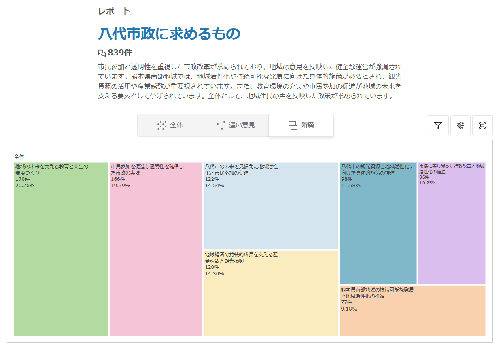

# 熊本県八代市長選 小野氏陣営のケース

2025年8月の八代市長選で､小野たいすけ候補は広聴AIを導入し､選挙戦略に活用し､結果として大差で勝利した｡
筆者､高手智基は小野氏陣営のIT担当スタッフとして、広聴AIの導入・運用に携わった。本節は、その経験と当選後の小野氏へのインタビューをもとに構成している。

## 小野たいすけ氏の経歴
八代市の公式プロフィールによれば、小野氏は1974年4月20日生まれ、東京都出身。1999年に東京大学法学部を卒業後、2008年に熊本県政策調整参与に就任し、2012年から熊本県副知事を2期8年務めた。県南地域の振興や農業振興など地域活性化に携わったとされる。2020年に東京都知事選へ出馬し、2021年から衆議院議員を務めた後、2025年に八代市長に就任した（[八代市公式プロフィール](https://www.city.yatsushiro.lg.jp/shicho/kiji00324866/)）。

## 導入の経緯
始まりは八代市長選の3ヶ月前､熊本大学で筆者が主催したデジタル民主主義に関するイベントに､元熊本市長である幸山政史氏を招いたことである｡
筆者は､AIエンジニアとして､デジタル民主主義の実践､特に地方での実践に興味があり､地方自治体の首長を長く務めておられた幸山氏にその実現可能性を伺う形でイベントを開催した｡
幸山氏も､自らの経験から現在の民主主義の限界を感じており､テクノロジーによってそれをアップデートすることに強い関心を示していた｡
幸山氏曰く､｢市民の声を広く聞きたい､と思っていても､これまではそれができなかった｡テクノロジーによってそれを実現できるのならぜひ活用したい｣とのことで､お互いに実現を模索していくことを約束した｡

その1ヶ月後､幸山氏から､八代市長選の候補者である､元熊本県副知事の小野たいすけ氏を紹介された｡幸山氏が約束を果たしてくれたのだ｡
小野氏は､安野貴博氏の都知事選でブロードリスニングを知り､その効果を感じ､自らも試してみたいと思っていたのだという｡
こうした巡り合わせから､筆者は小野氏陣営のITスタッフとして参加し､選挙戦略にブロードリスニングを導入することになった｡

## 選挙の背景

熊本県八代市は九州の中央である熊本県南部に位置し、県内では熊本市に次ぐ第2の人口規模を持つ都市である。人口は約12万人。西は不知火海に面し、内陸部には豊かな自然と里山が広がる。九州新幹線の停車駅があり、交通の利便性も高い。産業構造は第三次産業が約6割を占めるが、農業も盛んで、特にトマトやい草（畳表の原料）の生産地として知られる。また、日奈久温泉をはじめとする観光資源や、「八代妙見祭」などの伝統行事も地域の特色となっている。

この八代市で、2025年8月に市長選が行われた。候補は2人､前述の小野たいすけ氏と､現職の中村ひろお氏である｡
選挙前からYouTubeなどで市政の問題点や汚職疑惑が暴露されており、行政不信が主要な争点になると予想されていた。しかし、不信感の具体的な内容や、市民がその先に何を求めているのかは見えていなかった。こうした背景から、市民の声を広く聴くことの意義が明確だった。

このケースにおいて、ブロードリスニングは「どのような不満や期待が、どんな言葉や文脈で語られているか」「どんな少数意見や見落としていた論点が潜んでいるか」をあぶり出し、選挙戦略の方向性を調整するためのレーダーとして位置づけられた。

## 実施概要
広聴AIを有効に活用するためには､多くの意見を集める必要がある｡
我々はGoogle Formを使って意見を収集した。
難しかったのは､質問をどう設定するかだった｡
先行事例である奈良市長選では､｢私が奈良市長だったらこうしたい｣という質問を設定していた｡
しかし､その質問は強いコミットを示しているため､そこまで強い思いのない人は答えにくいだろうと考えた｡
結果として八代姿
意見収集に大きく貢献したのは、候補者本人の発信力と、座談会を繰り返し開催して直接協力を呼びかけたことだ。
開始から1ヶ月で約100件の意見が集まり、その後の活動を通じて最終的には358件のコメントが寄せられ､これをAIで分析したところ、839件の意見が抽出され、7つの大きなクラスタに分類された。

7つのクラスタは、八代市民が市政に求めるものを、テーマ別に整理したものである。以下は簡略版の要約だ。

1. 市民参加・透明性：市政の見える化、情報公開、相談や意見が届く仕組み。
2. 地域経済・観光：駅前開発、観光振興、中心市街地の再生、雇用の創出。
3. 文化・歴史資源：妙見祭や文化施設の活用、地域ブランドの再構築。
4. 子育て・教育：教育環境の改善、教職員負担の軽減、子育て支援。
5. 医療・福祉：周産期医療や高齢者支援、地域医療体制への要望。
6. 生活インフラ・防災：道路・交通・防災、暮らしの安全に直結する課題。
7. 農業・産業基盤：農業支援、地場産業の活性化、担い手不足への懸念。

## 得られた意外なインサイト
意見を広く集めてみると、事前の想定とは異なるインサイトが見えてきた。
地域経済の活性化を求める声や､八代の文化・観光に対する意見が見えてきたのだ｡
小野氏は以下のように語る｡
「私は当初、行政不信や市政への不満の声が大きいだろうと予想していました。自分の支持者の声は、どうしても自分の耳に入りやすい。そこだけを聞いていると、『みんな行政不信なんだろうな』と思いがちですが、広聴AIを通じて広く声を集めると『実は違う』ということが分かる。これは非常に大きな気づきでした」

※分析結果の全体は [こちら](https://democracy-x.github.io/kouchou-ai-yatsushiro/47ae7bf4-e5de-4dbd-82ab-520160f373d6/) で公開されている。

こうした発見が、選挙戦略の方向性を再検討するきっかけになった。行政不信への対応だけでなく、経済の活性化や､教育・若者の定着､文化・観光への投資といったテーマを打ち出す必要性が見えてきたのだ。

### 活用シーン（マニフェストから街頭・SNSまで）

ブロードリスニングで得られた知見は、選挙の様々な場面で活用された。

#### マニフェストへの反映

小野氏のマニフェストは8つの柱で構成され、ブロードリスニングで浮かび上がった論点が随所に反映された。

[小野氏のマニフェスト](https://www.youtube.com/watch?v=CKxN7W27yvE)

第1の柱「信頼回復」では、「見える市政、聞く市政」を掲げ、透明性の高いデジタルでの情報公開や、市長にまで声が届くための職員の意識改革を打ち出した。これは「市民参加を促進し透明性を確保した市政の実現」クラスタの声を直接反映したものだ。

第2の柱「地域経済活性化」では、新八代駅前開発の推進、日奈久温泉の再生、中心市街アーケードのあり方検討など、ブロードリスニングで具体的に名前が挙がっていた地域課題がそのまま政策項目になった。「地域経済の持続的成長を支える産業誘致と観光振興」クラスタで寄せられた声との対応が明確だ。

第3の柱「文化都市再生」では、厚生会館問題の再検証や妙見祭のブランド確立、日奈久温泉を芸術家の集う場にするといった施策を掲げた。これもブロードリスニングで「八代厚生会館の保存と利活用」への関心が高かったことを踏まえている。

第5の柱「子育て教育」では、「産み育て学べてよかった八代へ」というビジョンのもと、教職員の負担軽減や不登校児のサポート、周産期医療体制の整備支援などを盛り込んだ。「地域の未来を支える教育と共生の環境づくり」への回答となっている。

このように、マニフェストの8項目はブロードリスニングで可視化された市民の声と高い整合性を持っている。

表8-1：クラスタとマニフェストの対応（要約）

| クラスタ | 主な内容 | マニフェストでの対応 |
| --- | --- | --- |
| 市民参加・透明性 | 情報公開、声が届く仕組み | 第1の柱「信頼回復」 |
| 地域経済・観光 | 駅前開発、観光、中心市街地 | 第2の柱「地域経済活性化」 |
| 文化・歴史資源 | 厚生会館、妙見祭、地域ブランド | 第3の柱「文化都市再生」 |
| 子育て・教育 | 教育環境、子育て支援 | 第5の柱「子育て教育」 |
| 医療・福祉 | 医療体制、高齢者支援 | 第5の柱「子育て教育」周辺施策 |
| 生活インフラ・防災 | 道路、交通、防災 | 地域課題対応の施策全般 |
| 農業・産業基盤 | 農業支援、産業の担い手 | 第2の柱「地域経済活性化」 |

#### 街頭演説でのテーマ選定

街頭演説では、地域ごとに話すテーマを変える判断材料としてブロードリスニングの結果を活用した。
小野氏は以下のように語った｡
「『どういうテーマで街頭演説をすると皆さんの関心を呼べるか』を考えていたんです｡例えば『日奈久温泉』『中心市街地』『鏡』『八代』など場所ごとに、演説で扱うテーマを変えるようにしました。そういう意味で、マニフェスト作成だけではなく、演説やSNSでの投稿内容、その方向性を決める上でも参考にしました｡週次で集計レポートを出してもらっていましたが、あれを見て『もっと経済やまちづくりの話を増やしていこう』という判断をしました。そういう意味でも、とても役立ちました」

### 運用で見えた課題と改善アイデア

実際に運用してみると、いくつかの課題も明らかになった。小野氏が感じた問題点は､以下の通りだ｡

#### 拾いにくい声

「細かい地域の声は、どうしても拾いづらいところがあります。例えば『この道路のこのカーブが危ない』といった話は、入力しづらいですよね。また、高齢者の声はかなり拾いにくい。インターフェースがキーボードやスマホ入力前提なので、高齢者にはハードルが高い｡だからこそ、リアルな場で音声入力を前提にした仕組みが必要だと思います。会場にAIのシステムを置いて、そこでの発言を録音・解析する、といった形です」

「本当はリアルな意見交換会や座談会で出た意見も録音して、それをAIにかけてデータに含める、というところまでできると良かったと思っています。そこまではできていなかった。今後は、ネット上だけではなく、リアルで会った人の声もAIで分類できるようにしていくと、住民の関心事により即した政策を提示したり、演説内容を組み立てたりできるようになると思います」

#### AIの分類の粗さ

「AIならではの課題として、『分類の仕方が総花的になる』という点があります。一見、きれいに分類されているように見えても、実際にはA・B・Cのカテゴリがほとんど同じことを言っている、ということがあった。『全部同じじゃないか』という分類も見られたので、そのあたりは今後の工夫が必要です」

### 効果と評価

2025年8月の八代市長選で、小野氏は現職を大差で破って当選した。

ブロードリスニングの効果について、小野氏はこう振り返る。「結果そのものが『広聴AIの効果でそのまま勝った』という感じではないと思っています。ただ、活動の中でAIによる集計や分析を活用しながら、『どういう話をすればいいのか』『どの層にどんなアプローチをすればいいのか』を考えました。直接的な効果というより、そのデータを参考にしながら活動の方法を決めていくという意味で、間接的にはかなり効果があったと思います」

ブロードリスニングへの評価を点数で聞くと、「6点くらいでしょうか。6〜7点の間という感じです」との回答だった。「理由としては、入力がネットに限られたことと、分析の仕方がまだ甘いと感じた部分があるからです。ただ、入力されたデータをすべて扱っている点はとても信頼できましたし、自分の演説内容や方向性を決める上では十分参考になりました。最初の導入段階としては『テスト的な位置づけ』でもありますし、今後、活用方法が洗練されて分析精度も上がってくれば、7点、8点と評価も上げられるだろうと思っています」

小規模自治体での活用可能性についても聞いた。「ネットへの入力に頼ると、高齢者が多い地域ではどうしても限界があります。人口3万人くらいの街だと、ネット経由で十分な数を集めるのは難しいでしょう。だからこそ、『リアルな場で音声を取り込んでAIで分析する』やり方が、どこでも使える形になると良いと思います。ネットだけに頼らないAIの使い方が、これから重要になってくると感じています」

### 市政運営への展開

小野氏は、選挙後の市政運営でも同様の仕組みを活用する構想を持っている。

「広聴AIそのものを使うかどうかは別として、『要望を拾って管理し、進捗状況を見える化する』仕組みは導入したいと考えています」

現在、八代市には「市長への手紙」（紙とフォーム）という仕組みがある。市民からの要望や意見を受け付ける窓口だが、寄せられた声がどのように分類され、どこまで対応されたかが見えにくいという課題がある。

「それをAIで解析する、という使い方もあり得ますが、ここで問題になるのは『回答』です。細かい地域課題などに対しては、かなり具体的な回答を出さなければいけない。そこをAIに任せるのは難しいと思っています。地域の実情を知らないと書けない内容が多いからです。ただ、回答までをAIに任せなくても、分類や整理の作業をAIにやらせることはできるかもしれません」

具体的な取り組みについても聞いた。「今、庁内でそうした仕組みを作ろうとしていて、AIまでは使っていませんが、エクセルベースで『どの地域からどんな要望があり、どこまで対応したか』を管理しようとしています。要望の件数や完了状況、受益者の属性などをデータ項目として整理すると、『この地域はかなり対応が進んでいるが、この地域は全然手つかずだ』というようなことが見えるようになります」

選挙時だけでなく、普段の行政においても「声が届きにくい地域」の声を拾い上げる仕組みが必要だという問題意識がある。「議員が持ってくる声も、もちろん住民の声ではありますが、ある程度は『票』を意識した声でもあります。一方で、票にはあまり結びつかないけれど、辺境の地域で道路の補修ができなくて困っている、といった声もある。大きな声にはなりにくいけれど、その人たちにとっては非常に重要な問題だということを、ちゃんと捉えられるようにしたい」

### 他候補・自治体への示唆

最後に、他の候補者や自治体に向けたアドバイスを聞いた。

「まず、活動量を増やさないと、せっかくの仕組みが生きてこない、ということです。リアルな場が得意でない人はリアルを頑張るべきですし、ネットが苦手な人はネットの活用に取り組む必要があります。今はどちらか片方だけでは足りない時代で、両方をやる必要があります」

意見収集の前提となる活動についても語ってくれた。「SNSでの発信力がないと、なかなか数が集まりません。僕の場合はXのフォロワーが約3万人いるので、そこからある程度集まりますが、何もない状態だと苦労すると思います。SNSのフォロワーは、普段からコツコツ投稿しないと増えません。それともう1つは、リアルの活動量を増やすこと。支援者の皆さんにも広げてもらいながら、毎日のように座談会を開いたり、意見交換会をやったりしました。多い時は1日5件くらいで、かなりヘトヘトになりましたが、それだけやるからこそ、いろいろな声を拾えます。だから、『広聴AIを入れました。リンクをSNSに貼りました』だけでは多分声は来ません」

「ネットだけに頼りがちな人も、それはそれで危うい。ネット上の声だけが世論とは限りません。やはりリアルな場にも出ていき、有権者と直接言葉を交わして意見をもらうことが必要です。オンラインとオフラインの両方をやることで、バランスのよい分析結果になるのだと思います」

高齢者層へのアプローチについても触れた。「票の規模が小さい地域では、今でも『一人ひとりの投票行動まで読み込むような選挙』があります。そこではネットよりもリアルのつながりが重視されます。ただ、そういう地域でも、高齢者がYouTubeを見るようになってきている。コロナ以降、外出できない中で動画を見るようになった人が多いので、状況は変わりつつあります。今までネットと縁がなかった高齢の候補者にも、『こういうツールがあると結構使えるんだ』と気づいてほしいと思います」

### エンジニアが選挙に関わって思ったこと

最後に､筆者がIT担当スタッフとして選挙に関わった経験を書いておく｡
選挙経験のない人が選挙に関わっていく上で､少しでも参考になれば幸いである｡

筆者はこれまで投票という形でしか選挙に関わったことがなかったので､選挙の裏側がどうなっているかの知識は全くなかった｡
選挙は日本という国家の民主主義の重要な部分であり､緻密な計算に基づいて行われるものだと､漠然と想像していた｡
世論調査や支持率分析に基づき､どの地域で何を訴えるかがデータを基に判断されているのだと｡
また､潤沢なスタッフがいて､官僚主義的にきちんと管理されているのだと思っていた｡

ところが実際に現場に入ってみると、想定とはいろいろ違っていた。実際に活動できるスタッフは限られていて、戦略も驚くほど「雰囲気」で決まっていた。「この地域ではこの話題がウケそうだ」「あの層にはこのメッセージが響くはずだ」——そうした判断の多くは、経験則や肌感覚に基づいていた。

そこにブロードリスニングを導入したことで、これまで拾われていなかった声を届けることができるようになった｡

##TODO 
もう少し経験部分を書く

## 2025年東京都議選 再生の道 尾花山候補
尾花山さんに執筆依頼済み
