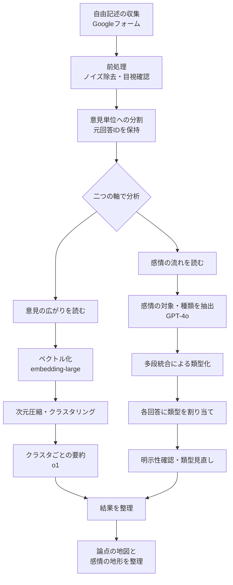

# 企業勤めのデータサイエンティスト、選挙に出る。低予算で挑むブロードリスニング

## はじめに：企業勤めのデータサイエンティスト、選挙に出ます
　2025年東京都議会議員選挙・武蔵野市選挙区に、政治団体「再生の道」から公認を受けて出馬した、尾花山和哉と申します。
　私は2025年の春に、偶然のきっかけから政治の世界に飛び込むことになりました。YouTubeで政党の公募を知り、まずは政治を学ぶ入口になればという気持ちで応募したところ、予想外にも公認をいただくことになったのです。日中は会社員として働きながら、大慌てで行政や議会の基礎を学び、取り組むべき課題を自分の言葉で落とし込む怒涛の日々が始まりました。
　その中で、私が必ず取り上げようと考えていたのが「医療」に関する領域です。私は製薬企業に勤めており、医療や医薬品に関わる業界で仕事をしてきました。そのため、医療費の問題は、制度の持続可能性という意味でも、現場の実務という意味でも、常に視界の中心にありました。医療の効率化が求められていることは明らかです。けれども同時に、医療は単なるコストの最適化としてだけ語れるものではありません。
　医療は人の生き方、尊厳に関わる分野であり、合理性だけで整理できるものではありません。制度設計において、何を優先し、どこまでを社会として支え合うのかという価値判断は避けて通れず、そこには人々の意思が必ず含まれます。そのため、これまでよりも広く人々の意見を取り入れて政策を言葉にしようと考えました。
　そこで目を向けたのが、当時話題となっていた「ブロードリスニング」です。しかし、私のような「企業に勤めながら限られた予算と時間で選挙に挑む新人候補」にとって、多額の調査費用をかけることは現実的ではありません。そこで、本業であるデータ分析の知見を活かし、無料ツールと生成AIを組み合わせた「低予算でのブロードリスニング」を実践することにしました。本稿では、その試行錯誤のプロセスや実践の様子をご紹介したいと思います。

## 1. なぜ医療費の声を聞こうと思ったか
　私が医療費の問題を政策テーマとして正面から扱おうと考えたきっかけの一つは、吉祥寺南病院の診療休止でした。吉祥寺は、住みたい街として名前が挙がることも多く、人通りも多い、東京近郊でも比較的活気のある地域です。その吉祥寺で、救急医療を支えてきた病院が経営難に陥り、2024年10月から診療を休止するという事態が起きました。地域の医療体制にとって、二次救急の受け口に穴が開く、非常に重い出来事でした。

　私がこの出来事を重く受け止めたのは、単に一つの病院の経営が厳しいという話ではなかったからです。医療はもともと、経済合理性だけで割り切れる領域ではありません。社会から「必要なもの」として求められ、公的な力で支えられている部分があります。その一方で、現実の医療機関が経営面で厳しい状況に置かれていることも、全体のトレンドとしては以前から認識していました。ただ、それが地方の財政難の自治体ではなく、都市部のど真ん中で、しかも多くの人に見える形で表れたことに強い衝撃を受けました。都市圏であっても、地域医療の基盤は揺らぎ得る。そう感じたことで、私はこの問題を、武蔵野市だけの個別事例ではなく、日本全体の医療提供体制の持続可能性に関わる問題として捉えるようになりました。

　医療費の増大と、それに伴う医療提供体制の持続可能性は、日本だけの課題ではありません。高齢化の進行や医療技術の高度化に伴い、多くの国で医療の必要性は高まり続けています。その中で、無駄や重複を減らしながら、医療の質とアクセスをどう守るかが大きな課題になっています。各国では、診療情報の電子化やデータ連携、オンラインを含む新しい提供形態など、デジタル技術を前提とした効率化が進められてきました。日本でも、地域連携ネットワークをはじめ、医療情報を共有し、重複検査や重複処方を減らそうとする取り組みは積み重ねられてきました。しかし現実には、データ規格の統一、運用費の負担、関係主体の調整といった壁にぶつかり、十分に普及したとは言いがたい状況があります。

　この点を考える上で印象的だったのが、台湾のように、単一保険者を軸に医療機関をまたいだ情報参照の仕組みを比較的統一的に整え、医療の効率化に成功してきた事例です。要素技術だけを見れば、日本と大きく変わるものではありません。にもかかわらず、実際の成果には大きな差が出ていました。そこから見えてくるのは、問題が単なる技術不足ではなく、技術を活かす社会の制度や運用の設計にある、ということです。とくに近年はAIの進歩によって、技術が先に進み、制度や運用が後から追いかける状況がますます目立つようになっており、この傾向はさらに加速すると思われます。

　けれども、医療をどう支え、何を優先し、効率化のために何を変えるのかという問いには、正解が一つあるわけではありません。経済合理性を高めるべきだという考えにももっともな理由がある一方で、医療は単なるコストではなく、人の生や尊厳に関わる営みでもあります。だからこそ、制度の持続可能性だけを見て結論を出すこともできませんし、逆に理念だけで議論することもできません。必要なのは、人々が何に不安を感じ、どこに不公平感を覚え、何を守るべきだと考えているのかを、できるだけ広く捉えることだと思いました。そこで私は、まず医療費の問題について、人々の声を聞いてみようと考えたのです。

## 2. 何を目指し、何を諦めたか
　今回のブロードリスニングに取り組むにあたって、私が最初に決めたのは、**「代表性のある定量調査」を目指さない**ということでした。もちろん、本来であれば、地域全体の意見分布をできるだけ偏りなく把握できる方が望ましいです。しかし、今回の条件では、それを無理に目指すとかえって中途半端になると考えました。そこで私は、量的な意見の分布を考察することよりも、どのような論点が存在し、どのような言葉で語られているのかを把握することに目的を絞ることにしました。

　その背景には、現実的な制約がありました。私は企業に勤めながら選挙に挑んでおり、使える時間も予算も限られていました。加えて、今回の取り組みにはもう一つ副次的な問題意識がありました。私のような企業勤めの立場の人間でも、過大な資金や専業体制がなくても、政治参加のための情報収集や対話の仕組みをある程度実装できないかを試したかったのです。そう考えると、多額の調査費用を前提とした方法は、たとえ実施できたとしても再現性が低く、今回の試みの趣旨には合いませんでした。

　当初、意見収集の手段として真っ先に思い浮かんだのは、XのようなSNS上の投稿を分析する方法でした。すでに多くの人が日々の不満や提案を書き込んでおり、検索の導線も比較的わかりやすいからです。実際、うまく扱えれば、有益な素材が大量に得られる可能性があります。けれども、1候補者として実際にデータを収集・整理・解析しようとすると、データ取得に必要なライセンスコストは小さくありませんでした。限られた時間と予算の中で、十分な規模と精度で回すのは難しいと判断し、大規模なSNSデータ収集と解析は早い段階で断念しました。

　補足をすると、ここで重要なのは、SNS分析をやめればバイアスの問題がなくなるわけではない、ということです。どのような方法を選んでも、政治的意見の収集には偏りが避けられません。政治に関心の高い人ほど回答しやすく、SNSを導線にすれば支持者やアルゴリズムによって接触した人が集まりやすくなります。多重投稿の問題も、簡単に解決できるものではありません。つまり、手法を変えたところで、厳密な意味で「有権者の意見の縮図」を作るのは容易ではないのです。そうであるなら、無理に代表性を装うよりも、最初から目的を明確に絞った方が合理的だと考えました。

　そこで私は、得られた数字を地域全体の代表値として扱うことはせず、意見の空間を広げ、論点の地図を作ることを主目的に置くことにしました。自分のXやYouTubeからの流入であれば、支持者寄りに偏る可能性が高いことは明らかです。しかし、今回の目的が「賛否の割合を測ること」ではなく、「どのような論点が存在し、どのような言葉で語られているか」を把握することにあるなら、この偏りは致命的ではありません。むしろ、熱量を持って語られた意見の中から、論点の輪郭や言葉の選ばれ方を読み取ることには十分意味があると考えました。

　こうして私は、低予算で実施でき、すぐに運用を始められ、自由記述によって論点の幅を確保しやすい方法として、Googleフォームを用いることにしました。繰り返しますが、これは代表性を保証する手法ではありません。しかし今回の目的に照らせば、限られた条件の中で、何が語られているのかを広く拾うための現実的な選択だったと考えています。

## 3. どう集めて、どう整えたか
　ここでは、医療費に関する自由記述をどのように集め、どのように分析可能な形へ整えたのかを説明します。今回の意見収集には、Googleフォームを用いました。設問は自由記述で一問のみとし、「医療費が今後も増え続けると見込まれる中で、どのような対策が必要だと思いますか？」と設定しました。一問に絞ったのは、まず回答者の参加コストをできるだけ小さくしたかったからです。あわせて、設問を増やすことで論点を誘導してしまうことも避けたかった、という理由もあります。自由記述であれば、少なくとも「何を思いついたか」という入口をこちらで狭めずに済みます。

　もっとも、自由記述には難しさもあります。後日いただいた意見の中には、「答えようと思ったが、何を書いてよいかわからず諦めた」というものもありました。この反応は興味深いものでした。誘導は避けたい一方で、他者の意見や何らかの手がかりがあれば、自分の考えを言葉にしやすくなる人もいるのだとわかったからです。意見は、最初から完成した形で頭の中にあるとは限らず、場や補助線によって立ち上がる面がある。そのことを、この段階でも感じました。

　収集した自由記述は、そのままでは分析にかけにくいため、まず前処理を行いました。最初に行ったのはデータクレンジングです。自由記述で集める以上、ノイズは避けられません。「あああああ」のように明らかに意味を持たない回答や、入力ミスと思われる短すぎる回答については、文字数による閾値を設けたうえで、最終的には目視で確認し、除外しました。ここは自動化できる部分でもありますが、回答数がそこまで巨大でない以上、最初の段階で人間が一度目を通し、データの肌感を持つこと自体に意味があると考えました。実際、前処理の途中で回答の一部を読むだけでも、非常に高い熱量で意見を書いてくださる方がいることが伝わってきました。その熱量に触れたことは、この後の分析に責任を持つうえでも重要だったと思います。

　次に取り組んだのが、一つの回答に複数の意見が含まれる問題への対応です。自由記述では、一人の回答者が一度に複数の提案や論点を書き込むことが珍しくありません。むしろ、真剣に考えるほどその傾向は強くなります。こうした回答を一塊のまま扱うと、後段のクラスタリングや要約で論点が混ざり、結果の読み取りが難しくなります。そこで、TTTCのコードを参考にしつつ、前処理の段階で回答文を「意見の単位」に分割しました。ただし、分割するだけでは不十分です。分割後の意見だけを眺めると、元の文脈を失って読み違えることがあります。そのため、各意見には必ず元回答のIDを持たせ、必要に応じて元の文章へ戻れる形にしました。この「いつでも原文に戻れる」設計は、後の分析全体の土台になっています。

　こうして整えた自由記述を、この後私は二つの軸から読み解くことにしました。一つは、「意見・提案」としての広がりです。似た内容を束ねることで、どのような論点が存在するのかを俯瞰しようとしました。もう一つは、その背後にある「感情の対象」と「感情の種類」です。マーケティングなどで複数の意見を見てきた経験上、表に出ている主張だけでなく、その背後で何に対して、どのような感情が動いているのかを掘り起こすと、理解の解像度が上がることが多かったからです。たとえば同じ「負担を抑えるべき」という意見でも、それが制度への不信から来ているのか、将来への不安から来ているのか、不公平感から来ているのかによって、必要な説明や対話の仕方は変わってきます。

　なお、この後の解析にはOpenAI社のモデルを用いました。意見のベクトル化には embedding-large、テキストの解釈や補助には GPT-4o、意見要約には o1 を利用しています。モデルやパラメータは実装上変わり得るため、ここで重要なのは細部の固定ではなく、どの工程で何をさせたのかを明確にしておくことだと考えています。こうして私は、集まった自由記述を、論点の広がりと感情の流れの両方を読める形へと整えていきました。

### 3-1. 二次元化は試したか、なぜ主役にしなかったか
　ブロードリスニングの分析結果といえば、多数の意見を二次元空間上に散布図として配置し、意見の分布や対立構造を可視化する手法を思い浮かべる方も多いと思います。しかし、今回の取り組みでは、最終的に二次元化・三次元化した図を主たる解釈ツールとして用いることは見送りました。理由は大きく三つあります。

　第一に、今回の最初の設計段階で、私は「定量的な割合を推定することは目的にしない」と最初から決めていました。そのため、空間上の点の密集具合や分布の偏りを、主たる結果として示す必要性が高くありませんでした。今回知りたかったのは、どの意見が何割あるかということよりも、どのような論点が存在し、どのような言葉で語られているかだったからです。

　第二に、ある意見がどのまとまりに近いのか、あるいはクラスタの境界がどの程度自然かを確認するという実務上の目的であれば、必ずしも二次元の図に落とす必要がなかったことです。距離関係の確認そのものは、クラスタ中心からの距離や、実際の原文との対応を表形式で追うことで、私自身の作業としては十分に行うことができました。

　そして第三に、これが最も大きかったのですが、有権者や支援者と議論を深めるための道具としては、二次元化した図が思ったほど使いやすくなかったことです。実際、私は支援者が集まる場や一部の党員に向けて、試験的に二次元・三次元にプロットした意見分布図を見せてみました。しかし、多くの場合、「この点がこの意見を表していて、距離が近いと似た意見で…」という読み方そのものを理解していただくための説明コストが高く、本題に入る前にそこで躓いてしまうことが少なくありませんでした。さらに、図の意味を理解してもらえた後でも、それらの図があることで「どういう課題があるのか、どういう政策の打ち手が必要か」という具体的な議論にはなかなか繋がりませんでした。

　むしろ「誰が、何に対して、どういう感情で、どのような言葉を使って語っているのか」という、よりナラティブな意見の一覧を眺める方が仮説を立てたり、打ち手の議論に繋がったように思います。そのため今回は、私自身の解析においても、人々を巻き込んだ議論においてもクラスタごとの要約文や感情の類型を、言葉として読み解くことを重視しました。

## 4. 意見の広がりをどう読んだか
　意見の広がりを読むために、私は前処理で整えた「意見の単位」をベクトル化し、次元圧縮とクラスタリングを経て、まとまりごとに内容を要約する、という流れで分析を行いました。大まかに言えば、似た意見同士を近くに集め、そのまとまりごとに「何が語られているか」を俯瞰しようとした、ということです。

　ただし、この種の分析には最初から限界があります。ベクトル化は、文章の意味をそのまま正確に写し取るものではなく、あくまで類似性を測るための近似です。どのモデルを使うか、どのように前処理するかによって結果は変わり得ます。クラスタリングも同様で、アルゴリズムやパラメータの選び方で、できあがるまとまりは簡単に変わります。さらに、クラスタごとの要約はLLMが生成する文章である以上、同じ入力でも出力に揺らぎがあります。つまり、この分析から唯一の正解が機械的に得られるわけではありません。

　そのため、私が重視したのは、**厳密な唯一解を求めることではなく、今回の目的に照らして筋のよい見取り図を作れるかどうか**でした。今回知りたかったのは、回答全体の中にどのような論点の広がりがあるのかであって、クラスタリングそのものの美しさではありません。そこで、各クラスタの要約と、その元になっている回答群を実際に読み、自分の目で見て無理のないまとまりになっているかを確認しながら、試行錯誤を重ねました。多少条件を変えても論点の骨格が大きく崩れないか、要約が原文の集合と整合しているか、明らかに異質な意見が一つの塊に押し込まれていないか、といった点を重視して見ていきました。

　この作業は、次元圧縮の次元数、クラスタ数、クラスタリング手法、要約に渡す文書の切り方など、調整できる箇所が多く、解析者の判断に依存する部分が少なくありません。その意味で、手間のかかる作業でした。ただ、もともと集めた意見に目を通すこと自体が本来必要な作業でもありますし、元回答への紐付きを残しているため、違和感があればいつでも原文に戻って確認することができます。この「戻れる」設計があるからこそ、LLMを補助線として使いながらも、人間が責任を持って読み解く形を維持できると考えました。

　再現性についても、現実的な割り切りをしています。各試行錯誤で用いたパラメータや処理条件は保存し、どの設定でどのようなクラスタ構造が得られたかを追えるようにしました。一方で、要約文そのものについては、LLMが生成する以上、完全に同一の文面を再現することまでは求めていません。重要なのは、要約文が指している論点の中身が、原文の集合と整合しているかどうかです。要約は結論そのものではなく、人間が全体像を読むための目印として扱っています。こうして私は、条件を変えても繰り返し立ち上がってくる論点の骨格を、この後の解釈の対象としました。

## 5. 感情の流れをどう読んだか
　次に私は、集められた意見の背後にある感情を読むことで、価値観や葛藤をもう一段深く捉えられないかを考えました。ここで見たかったのは、表に出ている政策提案そのものだけではありません。同じ結論に見える主張でも、その背後にある感情が違えば、本当に必要な対話や解決の方向は変わってくるからです。たとえば「負担割合を上げるべき」という提案があったとしても、それが制度への不信から来ているのか、世代間の不公平感から来ているのか、あるいは医療現場への危機感から来ているのかによって、次に向き合うべき論点は変わります。政策的な意見の背後には、何を重視し、何に納得できず、何を守りたいのかという価値判断があり、それはしばしば感情と結びついています。そうであれば、主張だけを並べるより、その感情の流れまで読んだ方が、対象理解の解像度は上がるはずだと考えました。

　その際に意識したのが、「感情の種類」と「感情の対象」を分けて捉えることでした。単に怒りや不安があると見るだけでは粗すぎますし、逆に制度や負担といった対象だけを見ても、その人がどのような温度で語っているのかはわかりません。医療費の議論では、感情の矛先が制度設計そのものに向くこともあれば、保険料や税の負担に向くこともあります。あるいは、医療提供側、患者側、世代間、地域間、自分自身の将来といった形で対象が分散します。感情の種類と対象を組み合わせて捉えることで、単純な賛否集計では見えにくい衝突や葛藤の構造を整理できるのではないかと考えました。

　実装としては、まずLLMを用いて、自由記述の中から候補となる「感情の対象」と「感情の種類」を抽出しました。ただし、いきなり全データをまとめて読ませると、長文や論点の多い回答が混ざったときに精度が落ちやすくなります。そこで実際には、回答をいくつかのチャンクに分け、チャンクごとに候補を抽出し、それを多段で統合しながら類型を作っていく手順を取りました。ここで目指したのは、個別の文章にぴったり名前を付けることよりも、全体としてどのような感情の流れが現れているかを読める程度の粗さで、筋のよい類型を作ることでした。

　類型ができた後は、各回答に対してどの類型が当てはまるかを割り当てました。一つの回答の中に複数の対象や感情が含まれることは珍しくないため、ここでは複数類型の割り当てを許容しています。ただし、感情分析はどうしても読み込みすぎる危険があります。そのため、一度割り当てた後に、再度LLMを用いて、「文章として明示されているか」「言外の推測に踏み込みすぎていないか」を確認させました。ここで重視したのは、回答者の内面を断定することではなく、少なくとも文章として表れている範囲で、どのような感情の流れが読めるかにとどめることでした。

　また、初回の割り当てでは、既存の類型にうまく収まらない回答も出てきます。今回の目的は幅を見ることにあるため、そのような回答を目視で確認し、必要に応じて類型の定義を見直しました。最後には、各類型に分類された元の回答を実際に読み、割り当てが筋のよい説明になっているかを確認しました。全件を完全に検証できたわけではありませんが、少なくとも自分が責任を持って「この類型はこういう文章群を指している」と説明できる状態まで定義を整えることを重視しました。こうして私は、個々の回答者の感情を断定するのではなく、医療費という論点の背後で、どのような感情がどこへ向かって流れているのかを読むための地図を作ろうとしました。

## 6. 何が見えてきたか
　今回収集できた自由記述は、889件でした。ただし、ここで示すのは有権者全体の意見分布についての定量的な結論ではありません。あくまで、集められた自由記述からどのような論点が立ち上がり、その背後にどのような感情の流れが見えてきたかを整理したものです。この章では、まず結果そのものを示し、その意味や限界については次章で改めて考えます。

### 6-1. 意見の広がりから見えたこと
　まず、自由記述の中でどのような「意見・提案」が現れていたのかを整理しました。ここで見たいのは、どの論点が多かったかという厳密な順位ではなく、医療費の問題がどのような政策領域に分かれて語られていたかです。全体を眺めると、予防や検診のような上流側の対策、医療DXやデータ連携のような効率化、負担と給付の再設計、医療提供体制の改革、そして終末期やACP（アドバンス・ケア・プランニング、人生会議）のような価値判断を強く伴う領域まで、複数の方向から意見が出ていることがわかりました。

| id  | クラスタ名                                      | 概要                                                                                                                                                                                                                                             |
| --- | ----------------------------------------------- | ------------------------------------------------------------------------------------------------------------------------------------------------------------------------------------------------------------------------------------------------ |
| A   | 予防・健康増進（一次予防）                      | 健康教育（幼少期からの学びと実践）・運動・栄養・睡眠・禁煙・ワクチン・生活習慣病の重症化予防・メンタルヘルス等を通じて発症リスクを下げる。義務化よりもインセンティブ設計（保険料割引等）を含め、健康アウトカム改善と医療費の中長期抑制を狙う領域。 |
| B   | 検診・スクリーニング（早期発見設計）            | 人間ドックや各種検診の対象年齢・頻度・検査手法を設計し直し、早期発見による重症化回避を狙う。偽陽性・過剰診断・追加検査負担など不利益もあり、「利益＞不利益」と費用対効果が成り立つ範囲に限定することが論点。                                       |
| C   | 医療DX・データ連携（適正化＋質向上）            | 電子処方箋、服薬履歴連携、重複検査の抑制、資格確認（マイナ保険証等）を含む医療情報の共有・標準化を進め、医療の安全性/効率性/継続性を高める。現場負担、障害時運用、プライバシーといった実装論が争点になりやすい。                                 |
| D   | 負担と給付の再設計（財政・公平性）              | 窓口負担（高齢者・現役・生活保護等）、初診時定額負担、保険適用範囲、高額療養費の設計など、国民負担と給付のルールを見直し財政を持続可能にする。世代間公平・応能負担・必要医療へのアクセス確保のバランスが中心論点。                                 |
| E   | 医療提供体制の改革（供給側・地域最適化）        | 機能分化/集約、救急体制の再設計、医療従事者の偏在対策、過剰医療の抑制など供給側の構造を変える。地域医療構想や病床機能の最適化を通じ、限られた資源で医療の質とアクセスを維持することを狙う。                                                      |
| F   | 医療・介護の統合と人生の最終段階（終末期・ACP） | 在宅医療・看取り・緩和ケア・ACP（人生会議）・介護との連携を強化し、本人の意思を中心に医療とケアのあり方を整える。尊厳死・安楽死など倫理・法・合意形成が主要論点で、費用論とは分けて議論する方が整理しやすい。                                     |

　こうして整理してみると、医療費増大という一つの問いに対して、人々がかなり異なる入口から答えようとしていることが見えてきます。病気になる前の予防に力点を置く意見もあれば、制度のルールそのものを見直すべきだという意見もある。さらに、医療の供給体制や終末期のあり方のように、単なる費用削減とは別の価値判断を伴う論点もはっきり現れていました。少なくとも今回の自由記述からは、医療費の問題が単一の政策論点としてではなく、複数の論点群の束として捉えられていることが読み取れます。

### 6-2. 感情の流れから見えたこと
　次に、こうした意見の背後で、どのような感情がどこに向かっていたのかを整理しました。ここで扱っているのは、個々の回答者の内面を断定することではありません。自由記述の中で繰り返し現れていた感情の向き先と種類を、類型としてまとめたものです。全体としては、公平感の欠如や過剰利用への怒り、不信や警戒、終末期における尊厳への強い思い、予防や医療DXへの期待、そしてセーフティネットをめぐる葛藤といった流れが見えてきました。

| id    | 類型                                                             | 感情を向ける対象                                           | 感情の種類                     | 特徴                                                                                 | リスクと論点                                                                     |
| ----- | ---------------------------------------------------------------- | ---------------------------------------------------------- | ------------------------------ | ------------------------------------------------------------------------------------ | -------------------------------------------------------------------------------- |
| 類型1 | 世代間・負担公平の是正を求める（負担再配分型）                   | 高齢者1割、保険料・窓口負担の設計、現役世代                 | 不公平感、怒り、焦り           | 一律3割や高齢者2割/3割、所得・資産連動など「再配分ルール」に関心                     | 公平（納得）を上げる一方、受診抑制（必要医療のアクセス低下）とのトレードオフ     |
| 類型2 | モラルハザード（過剰利用）への憤り（需要抑制型）                 | 軽症受診、整形外科通い、湿布・痛み止め、生活保護無料        | 憤り、嫌悪、不信               | 「必要性の薄い医療が資源を食う」という直観的な怒り                                   | 線引きが粗いと、慢性痛やメンタル等“見えにくい苦痛”をこぼす                       |
| 類型3 | 終末期の尊厳と意思を守りたい（尊厳・境界設定型）                 | 延命治療、胃ろう、抗がん剤、透析、安楽死/尊厳死、指針      | 尊厳の希求、悲しみ、恐れ、怒り | 体験談が混ざると感情強度が上がりやすい／「本人意思」「明確な指針」「選べる権利」     | 倫理・法制・濫用防止、意思決定能力が低下した人への支援（意思決定支援）設計が核心 |
| 類型4 | 予防・教育へ投資し、そもそも病気を減らしたい（上流投資型）       | 健康教育、運動・食、健診高度化、義務化含む                 | 希望、責任感、自己反省         | 「ピンピンコロリ」「未病」「生活習慣」など、長期の“健康資本”志向                     | 義務化・ペナルティは反発も生む（自由とパターナリズムの緊張）                     |
| 類型5 | 供給側（現場・報酬・体制）の歪みへの不信（インセンティブ改革型） | 点数稼ぎ、過剰検査、診療報酬、医師会×政治、休日供給        | 不信、怒り、疑念               | 「儲かる治療」「説明責任」「救急が回らないのに費用だけ高い」                         | 提供体制の改革は“現場の疲弊”とも隣り合わせ（単純な締め付けは反動）               |
| 類型6 | 不正・資格・国籍など“境界管理”への関心（境界統制型）             | 本人確認、保険証貸借、外国人適用条件、在留/訪日            | 警戒、反感、怒り               | 制度への信頼回復を「境界の厳格化」で達成したい                                       | 事実検証が不可欠／差別・排除につながらない制度設計（目的と手段の整合）が難所     |
| 類型7 | データ連携・AIで効率化したい（テック解決期待型）                 | 服薬履歴連携、重複検査、残薬、AIトリアージ                 | 期待、合理性志向               | 「マイナ」「お薬手帳連動」「AIで軽症を捌く」など、運用設計への関心                   | 説明可能性（ログ）、誤判定時の責任、デジタル弱者対応                             |
| 類型8 | 国民への説明・選択肢提示を求める（合意形成要求型）               | 政治の先送り、期限、オプション提示（負担と水準の交換関係） | 苛立ち、焦り、不信             | 「どれだけ水準を下げればどれだけ負担が減るかを具体例で」＝社会的選択の“見える化”要求 | 提示の仕方次第で分断が深まる（価値対立が顕在化するため）                         |
| 類型9 | セーフティネット維持への配慮と葛藤（配慮・ジレンマ型）           | 小児医療、重病、必要な通院を諦めさせない                   | 感謝＋罪悪感＋不安             | 「無料はありがたいが軽症無料は申し訳ない」「受診抑制で手遅れが怖い」                 | 設計次第で合意形成の鍵になりうるが、単純な二項対立には乗りにくい                 |

　この結果からは、同じ医療費というテーマであっても、そこに込められている感情やその対象には実に様々なものが含まれることが読み取れました。何に対してどのような感情が向いているのかを分けて見ることで、表面的な賛否だけでは見えにくい意思の方向性が見えやすくなったと思います。

　以上が、今回の自由記述から見えてきた結果の概要です。次章では、これらの結果をどう受け止めるべきか、またデジタルで集まった声と街頭で実際に聞こえた声の違いをどう考えるべきかについて、もう少し踏み込んで整理したいと思います。

## 7. やってみてわかったこと
　ここでは、今回の試みを通じて何が言え、何が言えず、何が学びとして残ったのかを振り返りたいと思います。今回の取り組みは、冒頭からバイアスを前提としていました。SNS導線で集めた自由記述には、回答者の熱量の偏りや、アルゴリズムによる接触の偏り、多重投稿の可能性を排除できません。したがって、量的な違いは参考程度に扱うべきであり、ここでの主眼は、定性的に内容と構造を読み解き、政策検討の材料とすることにありました。

　その前提に立って振り返ると、今回の自由記述から、既存の議論にはない革新的な具体策が大量に掘り起こされた、というわけではありませんでした。むしろ価値があったのは、医療費増大という一つのテーマに対して、人々がどのような論点を思い浮かべ、どのような組み合わせで語っているのかを見渡せたことでした。予防、検診、医療DX、制度再設計、医療提供体制、終末期といった論点は、医療制度をめぐる議論として見れば、ある意味ではすでに社会の中で言語化されてきたものでもあります。一方で、どの論点とどの論点が近くに語られやすいのか、どこに強い感情が伴いやすいのかが見えたことには、十分な意味がありました。

　特に印象的だったのは、「感情の対象と種類」を整理したことで、主張の背後にある価値観や葛藤が、意見の整理だけの場合よりもはっきり見えてきたことです。政治に関する声を聞くと、怒りや不信といった陰性感情が現れやすいことは経験的にも感じていましたが、今回の分析では、それらが何に向けられているのかをある程度分けて捉えることができました。世代間の不公平感、制度への不信、終末期の尊厳への思い、セーフティネットに対する葛藤、そして予防や医療DXへの期待。医療費という一つのテーマの下に、こうした異なる感情の流れが折り重なっていたことは、私にとって非常に興味深い発見でした。

　もう一つ、今回の取り組みで特に大きな学びになったのは、デジタル経由で集めた意見の分布と、実際に街頭に立って有権者の方から直接聞いた声の分布に、かなりはっきりした違いがあったことです。デジタル側では、制度設計の是非や公平性、過剰利用への憤り、テックへの期待といった言葉が目立ちました。一方で街頭では、「福祉が薄くなるのではないか」という不安や、「効率化の必要性はわかるが、自分がデジタル前提の制度についていけるのかが不安だ」といった、より切実で生活に引き寄せられた声の方が強く印象に残りました。少なくとも今回の街頭での実感では、痛みを伴う大胆な制度改革を積極的に求める声は少数派でした。

　この違いは、単にデジタルリテラシーの差だけでは説明できないように思います。**意見は、最初から固定された形でそこにあるのではなく、置かれた場によって立ち上がり方が変わる**のだと思います。対面では、誰かを傷つけるかもしれない意見を口にしにくい人がいる一方で、会話の中で初めて自分の考えが整理され、言葉になっていく人もいます。逆にデジタルでは、制度批判や大胆な提案を言語化しやすい反面、そもそも言葉にするところで躓く人が取りこぼされやすいのかもしれません。この経験を通じて、ブロードリスニングは単一チャネルで完結する手法というより、複数のチャネルや複数のセグメントから得られた情報を重ね合わせ、そのズレも含めて読む営みとして捉える方が自然だと感じました。デジタルは論点を広げることに強く、街頭は切実さや躊躇い、言語化の過程を掬い上げることに強い。どちらか一方ではなく、その違い自体を解釈の対象にする必要があります。

　また、ブロードリスニングに関わる技術は、LLMの進化とともに変化し続けています。今回私が用いたやり方も、方向性としては今後も生きるかもしれませんが、具体的な実装はより良いものに置き換わっていくはずです。実際、データ収集のハードルは徐々に下がっており、関連するオープンソースソフトウェアも増えてきています。ただし、代表性をある程度担保しながら、誰でも気軽に使える形でブロードリスニングを実装できるようになるには、まだ少し時間がかかるとも感じています。とくに、街頭での対話を通じて意見の言語化そのものが支援される場面を見たことを踏まえると、デジタルにおいても、単に意見を集めるだけでなく、意見が言葉になるまでをどう支えるかが重要になるはずです。

　その意味で、今後のブロードリスニングには大きく二つの方向性があると考えています。一つは、今回のような「バイアスを前提とした活用」を、もう少し手続きとして整えていくことです。複数のチャネルや複数の結果を重ね合わせ、ズレの理由まで含めて読む枠組みを作ることが必要です。もう一つは、デジタルにおいても有権者の意見の言語化を支援する仕組みを作ることです。AIが意見そのものを代弁したり、決定したりするのではなく、意見が生まれ、言葉になり、届き、議論へ接続されるまでの摩擦を減らす。そのために技術を使っていきたいと考えています。

## 8. 選挙を終えて、これから
　私が挑戦した2025年東京都議会議員選挙は、結果としては落選に終わりました。しかし、初めて政治の世界に本格的に触れ、LLMも活用しながら挑んだこの選挙戦は、私にとって非常に大きな学びの機会になりました。有権者の方々の声に直接触れ、先人たちの工夫を知り、これまで仕事の中で考えてきた「技術と社会の接点」という問題意識を、現実の政治の場で問い直すことができたからです。

　無名の新人候補である私の呼びかけに応じて、Googleフォームを通じて真剣な思いやアイデアを寄せてくださった皆様。街頭や演説会場で直接声を届けてくださった有権者の皆様。そして、私に一票を託してくださった4,727名の方々に、改めて心より感謝申し上げます。皆様からいただいた意見や思いは、今も私の中で生き続けています。

　選挙後も、私は地域や社会について、有権者や政治家の方々とお会いしながら学びを深める活動を続けています。その中で強く感じるようになったのは、社会を変えるルートは、政治家という手段だけではない、ということでした。選挙を通じて得た問題意識や、人々の声に向き合う中で見えてきた課題を、一過性の経験で終わらせず、直接社会に還元していくこともできる。そう考え、私は選挙を共に戦った仲間と一般社団法人ろーかるぷらすを設立しました。民間で培ってきたデータサイエンスの知見を、行政や市民活動に還元しながら、社会課題の解決と市民の政治参加を後押ししていきたいと考えています。

　AI技術が進化し、機械にできることが増えていく時代だからこそ、人が何を良しとし、何を選ぶのかを言葉にすることは、ますます重要になるはずです。私は、ブロードリスニングを、人々の思いを言葉にし、社会の議論へ接続するための技術の一つだと考えています。これからも、技術と社会の接点に立ち、人々の思いを社会に届く言葉や制度設計へつないでいく活動を続けていきたいと思います。そして、今の自分にできる形で学びと実践を積み重ねながら、いつか再び政治の世界にも挑戦したいと考えています。