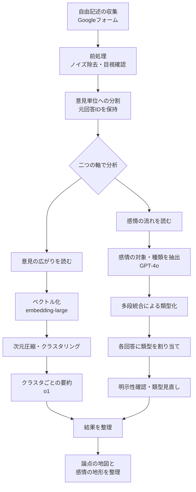

# 企業勤めのデータサイエンティスト、選挙に出る。低予算で挑むブロードリスニング

## はじめに：企業勤めのデータサイエンティスト、選挙に出ます
　2025年東京都議会議員選挙・武蔵野市選挙区に、政治団体「再生の道」から公認を受けて出馬した、尾花山和哉と申します。

　私は2025年の春に、偶然のきっかけから政治の世界に飛び込むことになりました。YouTubeで政党の公募を知り、政治を学ぶ入口になればと応募したところ、予想外にも公認をいただいたのです。日中は会社員として働きながら、大慌てで行政や議会の基礎を学ぶ怒涛の日々が始まりました。

　その中で必ず取り上げようと考えていたのが「医療」です。製薬企業に勤める私にとって、医療費の問題は常に視界の中心にありました。医療の効率化は急務ですが、同時に医療は人の尊厳に関わる分野であり、何を優先し、どこまでを社会として支え合うのかという価値判断には人々の意思が不可欠です。そこで、広く人々の意見を取り入れて政策を言葉にしようと考えました。

　目を向けたのが「ブロードリスニング」です。しかし、企業に勤めながら限られた予算で選挙に挑む新人候補にとって、多額の調査費用は現実的ではありません。そこで、本業であるデータ分析の知見を活かし、無料ツールと生成AIを組み合わせた「低予算でのブロードリスニング」を実践しました。本稿では、その試行錯誤のプロセスをご紹介します。

## 1. なぜ医療費の声を聞こうと思ったか
　きっかけの一つは、吉祥寺南病院の診療休止でした。住みたい街として名前が挙がることも多い吉祥寺で、救急医療を支えてきた病院が経営難に陥り、2024年10月から診療を休止したのです。地域の二次救急に穴が開く重い出来事でした。

　衝撃を受けたのは、医療機関の経営難が地方ではなく都市部のど真ん中で表れたことです。都市圏であっても地域医療の基盤は揺らぎ得る。私はこの問題を、武蔵野市の個別事例ではなく、日本全体の医療提供体制の持続可能性に関わる問題として捉えるようになりました。

　医療費の増大は日本だけの課題ではありません。各国でデジタル技術を前提とした効率化が進む中、日本ではデータ規格の統一や関係主体の調整といった壁に阻まれ、十分に普及したとは言いがたい状況があります。台湾のように単一保険者を軸に情報参照の仕組みを統一的に整えた事例と比べると、問題は技術不足ではなく、技術を活かす制度や運用の設計にあることが見えてきます。

　しかし、医療をどう支え、何を優先するかという問いに正解は一つではありません。必要なのは、人々が何に不安を感じ、どこに不公平感を覚え、何を守るべきだと考えているのかを広く捉えることです。そこで私は、医療費の問題について人々の声を聞いてみようと考えました。

## 2. 何を目指し、何を諦めたか
　最初に決めたのは、**「代表性のある定量調査」を目指さない**ということでした。企業に勤めながら限られた予算と時間で選挙に挑む以上、それを無理に目指すとかえって中途半端になります。目的を、量的な意見分布の把握ではなく、どのような論点が存在し、どのような言葉で語られているのかの把握に絞りました。副次的には、過大な資金がなくても政治参加のための情報収集を実装できるかを試したい、という問題意識もありました。

　当初はXなどSNS上の投稿分析を考えましたが、データ取得のライセンスコストが小さくなく、限られた予算では断念しました。もっとも、どの方法を選んでも政治的意見の収集には偏りが避けられません。関心の高い人ほど回答しやすく、SNS導線では支持者が集まりやすい。厳密な「有権者の意見の縮図」を作ることは容易ではないのです。

　そこで私は、代表性を装うのではなく、意見の空間を広げて論点の地図を作ることを主目的としました。熱量を持って語られた意見から論点の輪郭や言葉の選ばれ方を読み取ることには十分意味があります。こうして、低予算で実施でき、自由記述で論点の幅を確保しやすいGoogleフォームを用いることにしました。

## 3. どう集めて、どう整えたか
　Googleフォームで設問は自由記述一問のみとし、「医療費が今後も増え続けると見込まれる中で、どのような対策が必要だと思いますか？」と設定しました。一問に絞ったのは、回答者の参加コストを下げつつ、設問による論点の誘導を避けるためです。

　ただし自由記述には難しさもあります。「何を書いてよいかわからず諦めた」という声もいただきました。意見は最初から完成した形で頭の中にあるとは限らず、場や補助線によって立ち上がる面があることを感じました。

　収集した自由記述には前処理が必要です。まず、明らかに意味を持たない回答や短すぎる回答を、文字数による閾値と目視確認で除外しました。回答を実際に読む中で、非常に高い熱量で意見を書いてくださる方がいることが伝わり、分析に責任を持つうえで重要な経験でした。

　次に、一つの回答に複数の意見が含まれる問題に対応しました。TTTCのコードを参考に、回答文を「意見の単位」に分割し、各意見には元回答のIDを持たせて、いつでも原文に戻れる設計としました。

　整えた自由記述は二つの軸から読み解きました。一つは「意見・提案」としての広がり、もう一つはその背後にある「感情の対象」と「感情の種類」です。同じ「負担を抑えるべき」という意見でも、制度への不信から来ているのか、将来への不安からか、不公平感からかによって、必要な対話の仕方は変わります。

　解析にはOpenAI社のモデルを用い、ベクトル化にembedding-large、テキスト解釈にGPT-4o、意見要約にo1を利用しました。

### 3-1. 二次元化は試したか、なぜ主役にしなかったか
　ブロードリスニングといえば、意見を二次元空間上に散布図として配置する手法を思い浮かべる方も多いでしょう。しかし今回は、二次元化した図を主たる解釈ツールとしては用いませんでした。

　理由は三つあります。第一に、定量的な割合の推定が目的ではなかったため、空間上の密集具合を示す必要性が低かったこと。第二に、クラスタの妥当性確認は表形式で距離や原文との対応を追うことで十分だったこと。第三に、最も大きな理由として、有権者や支援者との議論の道具としては使いにくかったことです。試験的に意見分布図を見せてみましたが、読み方の説明コストが高く、本題の政策議論に繋がりにくいという問題がありました。

　むしろ、クラスタごとの要約文や感情の類型を言葉として読み解く方が、仮説の立案や打ち手の議論に繋がりました。

## 4. 意見の広がりをどう読んだか
　前処理で整えた「意見の単位」をベクトル化し、次元圧縮とクラスタリングを経て、まとまりごとに内容を要約しました。似た意見同士を近くに集め、そのまとまりごとに「何が語られているか」を俯瞰する流れです。

　この種の分析には限界があります。ベクトル化は類似性の近似であり、クラスタリングもパラメータで結果が変わります。要約もLLM生成である以上、出力に揺らぎがあります。そのため重視したのは、**厳密な唯一解を求めることではなく、今回の目的に照らして筋のよい見取り図を作れるかどうか**でした。各クラスタの要約と元の回答群を実際に読み、条件を変えても論点の骨格が崩れないか、要約が原文と整合しているかを確認しながら試行錯誤を重ねました。

　元回答への紐付きを残しているため、違和感があればいつでも原文に戻れます。この「戻れる」設計があるからこそ、LLMを補助線として使いながら、人間が責任を持って読み解く形を維持できました。パラメータや処理条件は保存して追跡可能にしつつ、要約文自体の完全再現は求めず、論点の中身が原文と整合しているかを重視しました。

## 5. 感情の流れをどう読んだか
　次に、意見の背後にある感情を読むことで、価値観や葛藤をもう一段深く捉えようとしました。同じ「負担割合を上げるべき」という提案でも、制度への不信から来ているのか、世代間の不公平感からか、医療現場への危機感からかによって、向き合うべき論点は変わります。主張だけを並べるより、感情の流れまで読んだ方が理解の解像度は上がるはずです。

　意識したのは「感情の種類」と「感情の対象」を分けて捉えることです。感情の矛先は制度設計、負担、医療提供側、世代間、自分自身の将来と多方向に分散します。種類と対象を組み合わせることで、賛否集計では見えにくい葛藤の構造を整理できると考えました。

　実装では、LLMを用いて自由記述から感情の対象と種類の候補を抽出しました。回答をチャンクに分けてチャンクごとに候補を抽出し、多段で統合しながら類型を作りました。類型ができた後は各回答への割り当てを行い、複数類型の割り当てを許容しています。感情分析は読み込みすぎる危険があるため、割り当て後にLLMで「文章として明示されているか」「推測に踏み込みすぎていないか」を確認しました。

　既存の類型に収まらない回答は目視で確認し、類型の定義を見直しました。個々の回答者の感情を断定するのではなく、医療費という論点の背後でどのような感情がどこへ向かって流れているかを読むための地図を作ることを目指しました。

## 6. 何が見えてきたか
　収集できた自由記述は889件でした。ここでは定量的な結論ではなく、どのような論点が立ち上がり、その背後にどのような感情の流れが見えたかを整理します。

### 6-1. 意見の広がりから見えたこと
　医療費の問題がどのような政策領域に分かれて語られていたかを整理しました。予防や検診のような上流側の対策から、医療DX、負担と給付の再設計、医療提供体制の改革、終末期やACP（アドバンス・ケア・プランニング、人生会議）まで、複数の方向から意見が出ていました。

| id  | クラスタ名                                      | 概要                                                                                                                                                                                                                                             |
| --- | ----------------------------------------------- | ------------------------------------------------------------------------------------------------------------------------------------------------------------------------------------------------------------------------------------------------ |
| A   | 予防・健康増進（一次予防）                      | 健康教育（幼少期からの学びと実践）・運動・栄養・睡眠・禁煙・ワクチン・生活習慣病の重症化予防・メンタルヘルス等を通じて発症リスクを下げる。義務化よりもインセンティブ設計（保険料割引等）を含め、健康アウトカム改善と医療費の中長期抑制を狙う領域。 |
| B   | 検診・スクリーニング（早期発見設計）            | 人間ドックや各種検診の対象年齢・頻度・検査手法を設計し直し、早期発見による重症化回避を狙う。偽陽性・過剰診断・追加検査負担など不利益もあり、「利益＞不利益」と費用対効果が成り立つ範囲に限定することが論点。                                       |
| C   | 医療DX・データ連携（適正化＋質向上）            | 電子処方箋、服薬履歴連携、重複検査の抑制、資格確認（マイナ保険証等）を含む医療情報の共有・標準化を進め、医療の安全性/効率性/継続性を高める。現場負担、障害時運用、プライバシーといった実装論が争点になりやすい。                                 |
| D   | 負担と給付の再設計（財政・公平性）              | 窓口負担（高齢者・現役・生活保護等）、初診時定額負担、保険適用範囲、高額療養費の設計など、国民負担と給付のルールを見直し財政を持続可能にする。世代間公平・応能負担・必要医療へのアクセス確保のバランスが中心論点。                                 |
| E   | 医療提供体制の改革（供給側・地域最適化）        | 機能分化/集約、救急体制の再設計、医療従事者の偏在対策、過剰医療の抑制など供給側の構造を変える。地域医療構想や病床機能の最適化を通じ、限られた資源で医療の質とアクセスを維持することを狙う。                                                      |
| F   | 医療・介護の統合と人生の最終段階（終末期・ACP） | 在宅医療・看取り・緩和ケア・ACP（人生会議）・介護との連携を強化し、本人の意思を中心に医療とケアのあり方を整える。尊厳死・安楽死など倫理・法・合意形成が主要論点で、費用論とは分けて議論する方が整理しやすい。                                     |

　医療費増大という一つの問いに対して、人々がかなり異なる入口から答えようとしていることが見えてきます。医療費の問題は単一の政策論点ではなく、複数の論点群の束として捉えられていました。

### 6-2. 感情の流れから見えたこと
　意見の背後でどのような感情がどこに向かっていたかを整理しました。公平感の欠如や過剰利用への怒り、不信や警戒、終末期における尊厳への思い、予防や医療DXへの期待、セーフティネットをめぐる葛藤といった流れが見えてきました。

| id    | 類型                                                             | 感情を向ける対象                                           | 感情の種類                     | 特徴                                                                                 | リスクと論点                                                                     |
| ----- | ---------------------------------------------------------------- | ---------------------------------------------------------- | ------------------------------ | ------------------------------------------------------------------------------------ | -------------------------------------------------------------------------------- |
| 類型1 | 世代間・負担公平の是正を求める（負担再配分型）                   | 高齢者1割、保険料・窓口負担の設計、現役世代                 | 不公平感、怒り、焦り           | 一律3割や高齢者2割/3割、所得・資産連動など「再配分ルール」に関心                     | 公平（納得）を上げる一方、受診抑制（必要医療のアクセス低下）とのトレードオフ     |
| 類型2 | モラルハザード（過剰利用）への憤り（需要抑制型）                 | 軽症受診、整形外科通い、湿布・痛み止め、生活保護無料        | 憤り、嫌悪、不信               | 「必要性の薄い医療が資源を食う」という直観的な怒り                                   | 線引きが粗いと、慢性痛やメンタル等“見えにくい苦痛”をこぼす                       |
| 類型3 | 終末期の尊厳と意思を守りたい（尊厳・境界設定型）                 | 延命治療、胃ろう、抗がん剤、透析、安楽死/尊厳死、指針      | 尊厳の希求、悲しみ、恐れ、怒り | 体験談が混ざると感情強度が上がりやすい／「本人意思」「明確な指針」「選べる権利」     | 倫理・法制・濫用防止、意思決定能力が低下した人への支援（意思決定支援）設計が核心 |
| 類型4 | 予防・教育へ投資し、そもそも病気を減らしたい（上流投資型）       | 健康教育、運動・食、健診高度化、義務化含む                 | 希望、責任感、自己反省         | 「ピンピンコロリ」「未病」「生活習慣」など、長期の“健康資本”志向                     | 義務化・ペナルティは反発も生む（自由とパターナリズムの緊張）                     |
| 類型5 | 供給側（現場・報酬・体制）の歪みへの不信（インセンティブ改革型） | 点数稼ぎ、過剰検査、診療報酬、医師会×政治、休日供給        | 不信、怒り、疑念               | 「儲かる治療」「説明責任」「救急が回らないのに費用だけ高い」                         | 提供体制の改革は“現場の疲弊”とも隣り合わせ（単純な締め付けは反動）               |
| 類型6 | 不正・資格・国籍など“境界管理”への関心（境界統制型）             | 本人確認、保険証貸借、外国人適用条件、在留/訪日            | 警戒、反感、怒り               | 制度への信頼回復を「境界の厳格化」で達成したい                                       | 事実検証が不可欠／差別・排除につながらない制度設計（目的と手段の整合）が難所     |
| 類型7 | データ連携・AIで効率化したい（テック解決期待型）                 | 服薬履歴連携、重複検査、残薬、AIトリアージ                 | 期待、合理性志向               | 「マイナ」「お薬手帳連動」「AIで軽症を捌く」など、運用設計への関心                   | 説明可能性（ログ）、誤判定時の責任、デジタル弱者対応                             |
| 類型8 | 国民への説明・選択肢提示を求める（合意形成要求型）               | 政治の先送り、期限、オプション提示（負担と水準の交換関係） | 苛立ち、焦り、不信             | 「どれだけ水準を下げればどれだけ負担が減るかを具体例で」＝社会的選択の“見える化”要求 | 提示の仕方次第で分断が深まる（価値対立が顕在化するため）                         |
| 類型9 | セーフティネット維持への配慮と葛藤（配慮・ジレンマ型）           | 小児医療、重病、必要な通院を諦めさせない                   | 感謝＋罪悪感＋不安             | 「無料はありがたいが軽症無料は申し訳ない」「受診抑制で手遅れが怖い」                 | 設計次第で合意形成の鍵になりうるが、単純な二項対立には乗りにくい                 |

　感情の対象と種類を分けて見ることで、表面的な賛否だけでは見えにくい意思の方向性が浮かび上がりました。

## 7. やってみてわかったこと
　今回の自由記述から、既存の議論にはない革新的な具体策が大量に掘り起こされたわけではありませんでした。むしろ価値があったのは、医療費増大というテーマに対して、人々がどのような論点をどのような組み合わせで語っているかを見渡せたことです。どの論点同士が近くに語られやすいのか、どこに強い感情が伴いやすいのかが見えたことには十分な意味がありました。

　特に印象的だったのは、感情の対象と種類を整理したことで、主張の背後にある価値観や葛藤がはっきり見えてきたことです。世代間の不公平感、制度への不信、終末期の尊厳への思い、セーフティネットに対する葛藤、予防や医療DXへの期待。医療費という一つのテーマの下に、異なる感情の流れが折り重なっていました。

　もう一つの大きな学びは、デジタル経由で集めた意見と街頭で直接聞いた声に、かなりはっきりした違いがあったことです。デジタル側では制度設計の是非や公平性、テックへの期待が目立ちました。一方で街頭では、「福祉が薄くなるのではないか」という不安や、「デジタル前提の制度についていけるか」といった切実で生活に引き寄せられた声が強く、大胆な制度改革を求める声は少数派でした。

　**意見は、最初から固定された形でそこにあるのではなく、置かれた場によって立ち上がり方が変わる**のだと思います。対面では会話の中で初めて考えが整理される人がいる一方、デジタルでは制度批判を言語化しやすい反面、言葉にすること自体で躓く人が取りこぼされやすい。ブロードリスニングは単一チャネルで完結するものではなく、複数チャネルから得られた情報を重ね合わせ、そのズレも含めて読む営みとして捉えるべきだと感じました。

　今後のブロードリスニングには二つの方向性があると考えています。一つは、バイアスを前提とした上で複数チャネルの結果を重ね合わせ、ズレの理由まで読む枠組みを整えること。もう一つは、デジタルにおいても意見の言語化を支援する仕組みを作ることです。AIが意見を代弁するのではなく、意見が生まれ、言葉になり、議論へ接続されるまでの摩擦を減らす。そのために技術を使っていきたいと考えています。

## 8. 選挙を終えて、これから
　2025年東京都議会議員選挙は落選に終わりました。しかし、LLMも活用しながら挑んだこの選挙戦は、「技術と社会の接点」という問題意識を現実の政治の場で問い直す、大きな学びの機会になりました。

　無名の新人候補の呼びかけに応じ、Googleフォームを通じて真剣な思いを寄せてくださった皆様、街頭で声を届けてくださった皆様、そして一票を託してくださった4,727名の方々に、心より感謝申し上げます。

　選挙後、社会を変えるルートは政治家だけではないと強く感じるようになりました。選挙を共に戦った仲間と一般社団法人ろーかるぷらすを設立し、データサイエンスの知見を行政や市民活動に還元しながら、社会課題の解決と市民の政治参加を後押ししています。

　AI技術が進化する時代だからこそ、人が何を良しとし、何を選ぶのかを言葉にすることはますます重要になります。技術と社会の接点に立ち、人々の思いを社会に届く言葉や制度設計へつないでいく活動を続けながら、いつか再び政治の世界にも挑戦したいと考えています。