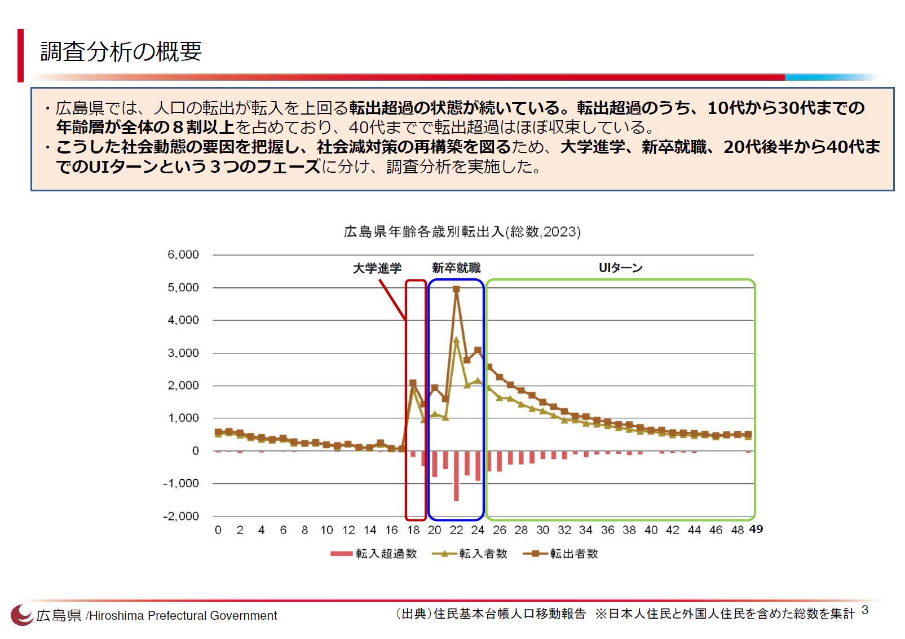
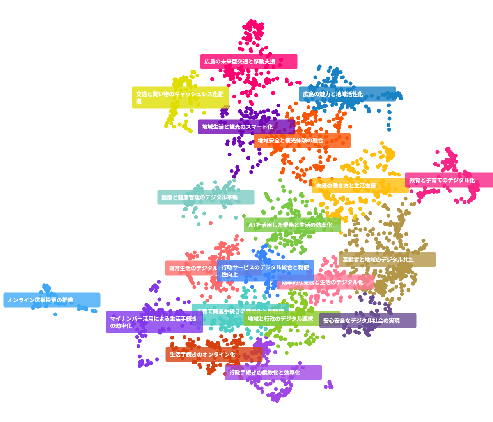

## 広島県：「失敗を生かそう」の県が、声を聴く仕組みに挑む

文責：@tokoroten

本節は、広島AIラボ年次報告書、広島県議会の答弁記録、県公式サイトの公開資料に加え、広島AIラボ職員への取材に基づいて構成している。

### 若者が「足で投票する」県

広島県は若者に選ばれていない。

広島県の転出超過は5年連続で全国最多を記録した[^hiroshima_jinko]。転出超過のうち10代から30代が8割以上を占め、20代だけで6割を超える。特に20代女性の流出が目立つ。県の調査によれば、新卒就職だけで約8,300人の若者が流出している[^hiroshima_wakamono]。そのうち「成長志向」の若者（約3,000人）は脱落率67%で、広島県のイメージは悪くないにもかかわらず、就職活動の序盤で東京や大阪の大企業に流れていく。

*出典：広島県「若年層の社会減少要因調査分析（概要資料）」*

3章で述べた「足による投票」は、まさにこの現象のことである。若者が出ていけば税収は減り、社会保障の負担は残った住民に集中し、さらなる流出を招く。広島県は令和7年度に若者減少対策として約98.5億円を投じているが、これだけの予算を投じてもなお、若者が何を求めているのかを直接聴く仕組みは十分ではなかった。

2024年9月、広島県は「AIで未来を切り開く」ひろしま宣言を発表し、県庁内にAI探索拠点「広島AIラボ」を設置した。スローガンは「HIROSHIMA AI TRIAL ～失敗を生かそう～」。知事は記者会見で「人口減少、少子高齢化」を背景に挙げており、日本経済新聞も県への取材に基づき「人口減対策」「若者の流出抑制」がAI施策の狙いだと報じている[^nikkei_ai]。広島AIラボの探索的活動の一つとして、DD2030が開発した広聴AIを用いたブロードリスニングの試行が行われた。

県民向けの意見募集に先立ち、広島AIラボは庁内で約20件の分析を重ねていた。重要施策の検討に向けた職員アンケートを広聴AIで分析し、部長級の研修でワークショップの題材に使う。移住希望者向けチャットボット「移住AIナビ」の問い合わせログを投げて傾向を把握する。若者向け地域イベントの参加者感想を「どう分類すればいいかわからない」まま広聴AIにかけてみたら、「こういう分け方もあるのか」という発見があった。こうした試行錯誤を経て、広島AIラボは県民向けのブロードリスニングに踏み出した。

### 「デジタル化で描く未来の広島は？」

2025年8月、広島県は県民意見募集「デジタル化で描く未来の広島は？」[^hiroshima_mirai]を開始した。設問は「あなたは、仕事や暮らしがデジタルでどうなってほしいですか？」。実現可能性は一旦置いておいて、未来に対するワクワクするような自由な発想を募るという趣旨だ。Webフォーム、X、メール、郵送、電話の5つのチャネルを用意し、約1か月の募集期間で自由記述を受け付けた。

最終的に集まった意見は2,953件。広聴AIで分析し、約15分で3,179件の意見が抽出された。募集期間中の9月3日には中間結果をHPで公表しており[^hiroshima_bl_site]、従来の手作業では不可能だった途中公表を実現した。

*出典：ブロードリスニング広島 可視化サイト*

ただし、シン東京2050（5章）が約2万8千件を集めたのと比べると規模の差は大きい。取材の中では、県庁職員からの投稿が約1,000件含まれていたことも明らかになった。

県職員も取材の中で「最初はSNSや若い人の意見を収集したかったが、あまり取れなかった」と振り返っている。結果として上位に並んだクラスタは「行政手続きのデジタル化」「マイナンバー活用」「生活手続きのオンライン化」といった行政効率化の要望だった。この意見募集はDX加速プランの改定に向けて、デジタル技術を活用した産業振興や新しい暮らしのビジョンを広く募る趣旨だったことを考えると、**誰に届いたかが、何が返ってくるかを決める**という教訓が見える。

2章で述べたように、ブロードリスニングは「意見を集める」ツールではなく「集まった意見を構造化する」ツールである。意見の収集自体は別の仕掛けが必要だ。シン東京2050では知事の記者会見動画、YouTubeコメント、さらには職員が休日に上野動物園で子供たちに直接聞くという泥臭い工夫まで行われていた。収集の設計こそがブロードリスニングの成否を分ける。

### 庁内での活用と意思決定への接続

分析結果は議会総務委員会への報告にとどまらなかった。局長級と知事が出席する「企画経営戦略会議」で結果が共有され、各局にはクラスターごとに「現在どう対応しているか」「今後どう取り組む予定か」という照会がかけられた。知事交代に伴い次期計画の策定時期が後ろ倒しになったことで、結果を計画に盛り込む時間が生まれたという。可視化サイトも公開するなど、結果の透明性を確保しようとする姿勢も評価できる。

議会答弁では、従来の手作業なら合計約500時間（約60人日）を要し、公開まで数か月から半年かかった可能性があるのに対し、広聴AIにより大幅に短縮されたことが説明された[^hiroshima_gikai]。寄せられた意見の中には、ある大学生からの「ゴミ回収の5分前にスマホで通知してもらえれば、もっと寝られる」という投稿もあった。答弁した職員は「ゴミ出しと寝るを掛け合わせた発想は持ち合わせていなかったが、視点を変えれば時間の有効活用として全員が恩恵を受けられる」と受け止めている。こうした予想外の声を拾い上げること自体が、ブロードリスニングの価値である。

### 収穫は「プロンプトの育て方」を学んだこと

広島県が積み上げた最大の収穫は、広聴AIの出力を自治体の実務に合わせて「育てる」ための知見である。広島県の職員たちは、2つの重要な調整ポイントを発見した。

**第一に、意見の「抽出」をどこまで行うかという問題。** 短い投稿をAIが文脈補完すると、もっともらしい意見が生成される。しかしそれは元の投稿者が言いたかったこととは限らない。標準プロンプトでは曖昧な投稿も「それらしい意見」に仕立て上げてしまうが、職員が作成したプロンプトでは「意見として成立していないものは除外する」という判断を組み込むことができた。

**第二に、クラスタのラベリングを「行政が使える言葉」に翻訳する問題。** 標準プロンプトは「デジタル技術の活用」「ICTインフラの整備」といった技術寄りのラベルを生成する。しかし庁内の会議で使われるのは「交通」「教育」「観光」「福祉」といった生活領域の言葉である。ラベルを技術語から生活領域語に寄せることで、分析結果が庁内の政策体系と接続し、議論の俎上に載せやすくなった。

これらは広島AIラボの年次報告書[^hiroshima_report]に、標準プロンプトと職員作成プロンプトの比較表として記録されている。議会答弁によれば、職員がプロンプトの整理・調整に要した時間は約10時間。一見地味だが、他の自治体が広聴AIを導入する際に最も役立つのはこの種の実践知である。

### 自分たちで回すからこそ意味がある

プロンプトを調整し、出力を確認し、「この束ね方は庁内で通じるか」「この抽出は元の意見を歪めていないか」と問い直す。このサイクルを回せるのは、分野の背景や行政内部の文脈を理解している職員自身だけである。外部に分析を委託してレポートを受け取るやり方では、こうした調整の蓄積は組織に残らない。

取材によれば、過去に広島県が人口減少の要因を探る県民アンケートで自由記述を分析した際には、職員がExcelで大量のデータを丸3〜4日かけて処理していたという。広聴AIによって読むコストが下がることで、職員は「どう読み替えるか」「何を深掘りするか」という、より本質的な問いに時間を使えるようになる。重要なのは、単にコストが下がったことではなく、**従来はコストが重すぎてそもそもできなかったことが、できるようになった**という点だ。

なお、意見やアンケートのデータを生成AIに投入する際には、収集時点での利用目的や二次利用の同意範囲に注意が必要である。広島AIラボが庁内で試行的に過去の調査データを分析した際にも、回答者からの事前了承がなかったため、分析結果を外部に公開することはできなかった。収集段階でデータの取扱い範囲を整理しておくことが、ブロードリスニングの実務では欠かせない。

### 広島AIラボの次の一手

広島県の今回の取り組みには、県職員自身も課題を感じている。取材の中でも「最初はSNSとか若い人の意見を収集したかったが、その辺の数はあまり取れていない。反省点としては正直なところあります」とこぼしていた。一方で、庁内での約20件の試行、プロンプトの調整ノウハウ、意思決定プロセスへの接続は着実に進んでいる。広島AIラボのスローガン「失敗を生かそう」の通り、今回の課題は次の実践で生きてくる知見でもある。

そして、広島県には心強い援軍がいる。2026年1月、広島県は東京都およびGovTech東京と「AI利活用の推進における連携・協力に関する基本協定」[^hiroshima_govtech]を締結した。GovTech東京は、5章で紹介した「シン東京2050」プロジェクトで約2万8千件の都民意見をブロードリスニングで分析した実績を持つ。広島県が今回課題として残した「収集の仕掛け」と「政策への接続」について、東京都には実践知が蓄積されている。

広島県横田知事は協定締結にあたり、「自治体の新たなモデルを地方から磨き上げ、全国に発信する」と語った。若者の声を直接聴く仕組みはまだ発展途上にある。だが、東京都の経験という参照点と、自らの試行錯誤で培った実践知を組み合わせれば、次の県民意見募集は今回とは異なるものになるだろう。「失敗を生かそう」という県のスローガンが、ブロードリスニングの文脈で試される番である。

---

[^hiroshima_jinko]: 広島県「5年連続全国最多？広島県の人口移動」 https://www.pref.hiroshima.lg.jp/soshiki/230/r7jinkouidoukaisetu.html
[^hiroshima_wakamono]: 広島県「若年層の社会減少要因調査分析（概要資料）」（令和6年10月） https://www.pref.hiroshima.lg.jp/uploaded/attachment/596563.pdf
[^nikkei_ai]: 日本経済新聞「広島県、地域課題解決へAIラボ 人口減対策や生産性向上」（2024年10月） https://www.nikkei.com/article/DGXZQOCC232T80T21C24A0000000/ 、「『広島発』AIで課題解決へ 県、地元企業と開発者結ぶ 若者の流出抑制につなぐ」（2025年7月） https://www.nikkei.com/article/DGXZQOCC0849J0Y5A700C2000000/
[^hiroshima_mirai]: 広島県「デジタル化で描く未来の広島は？」（意見募集ページ） https://www.pref.hiroshima.lg.jp/site/hiroshima-dx-torikumi/hiroshimanomirai.html
[^hiroshima_bl_site]: ブロードリスニング広島 可視化サイト https://www.broadlistening-hiroshima.com/
[^hiroshima_gikai]: 総務委員会（令和7年9月25日）での質疑（高田委員、動画 1:10:47〜） https://youtu.be/YquK7LzHGw0?t=4247
[^hiroshima_report]: 2025年度 広島AIラボ年次報告書 https://www.pref.hiroshima.lg.jp/uploaded/attachment/658524.pdf
[^hiroshima_govtech]: 広島県・東京都・GovTech東京「AI利活用の推進における連携・協力に関する基本協定」（2026年1月締結） https://www.pref.hiroshima.lg.jp/soshiki/265/aikyotei.html
