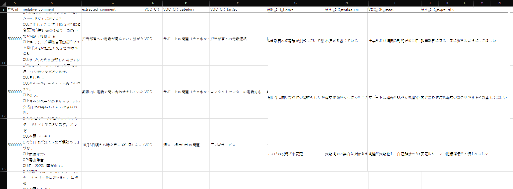
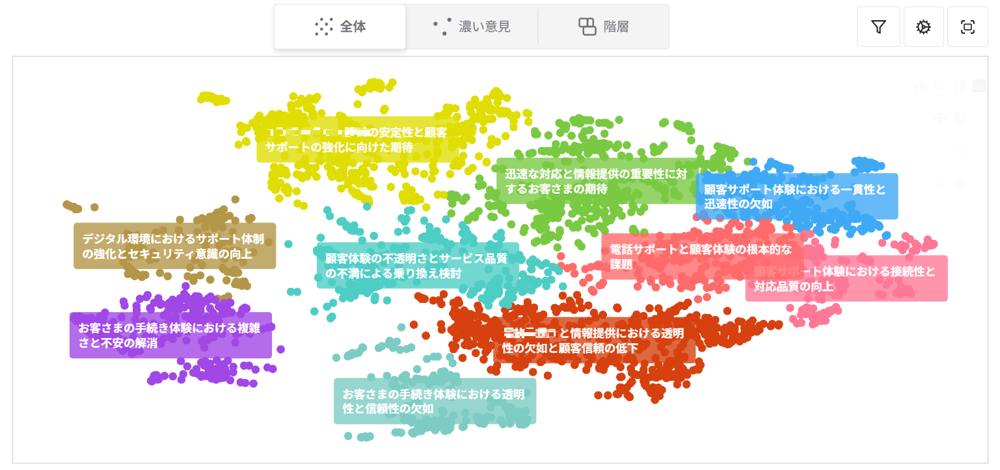
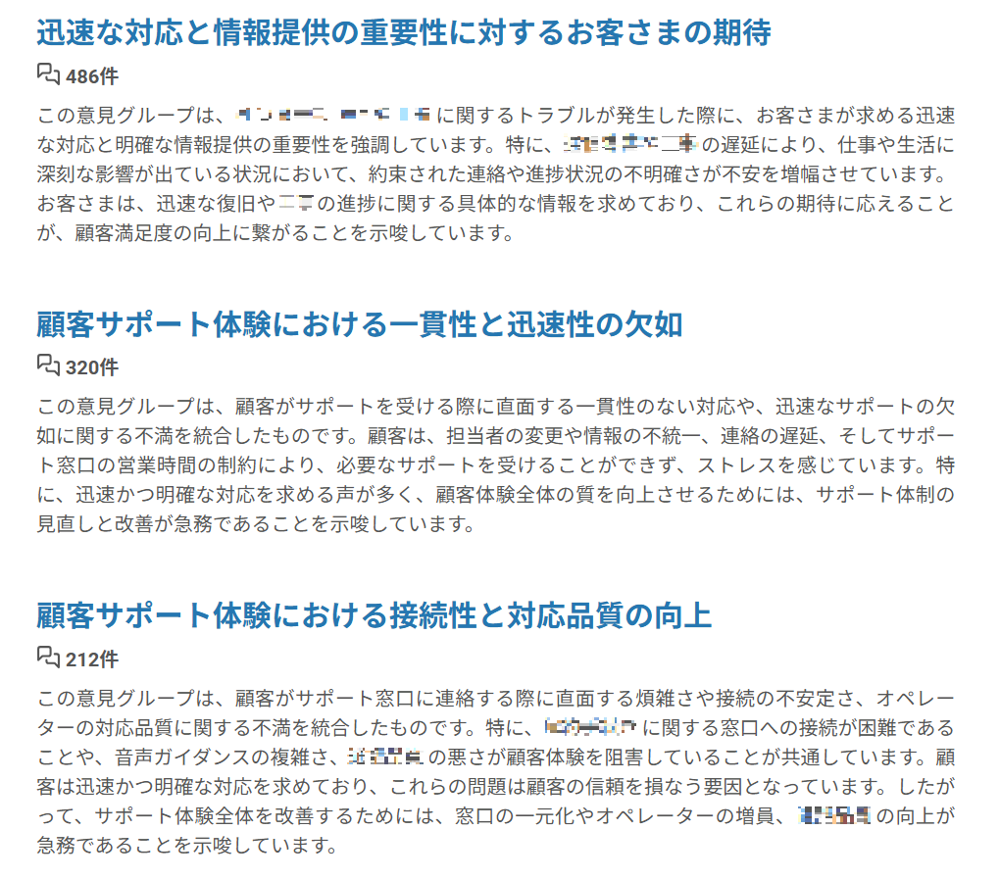
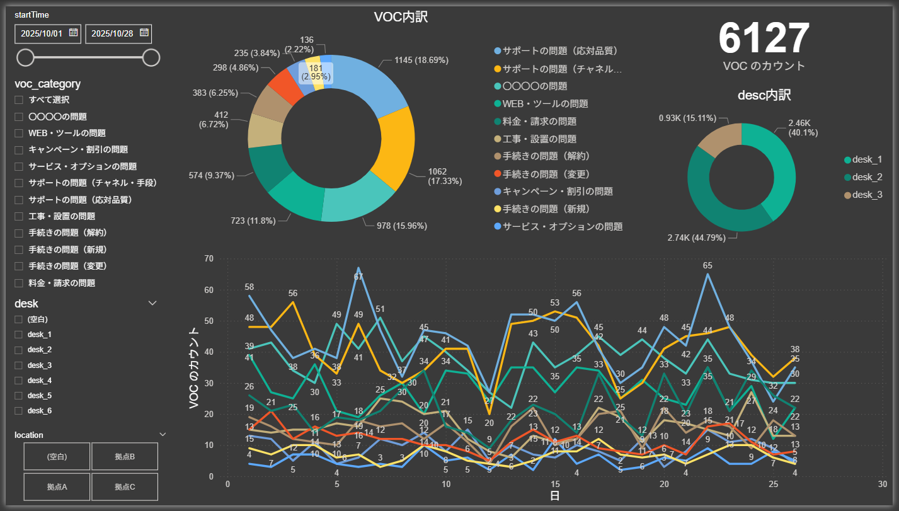

# コンタクトセンターのVOC分析における広聴AIの活用

ブロードリスニングとは聴く力の強化である。では多くの人の声を仕事として聴いているのはどこだろうか？その一つは顧客からの問い合わせを毎日受電するコンタクトセンター（コールセンター）である。コンタクトセンターがブロードリスニングツールである広聴AIを導入することでどのように変化したのだろうか。今回はその取り組みについてオンライン取材をさせていただいた。

## アルティウスリンク株式会社の取り組み

- 取材日： 2025年12月9日
- 取材先： アルティウスリンク株式会社
- お話を伺った方：
  - 本間洋介氏（事業企画統括本部 DXサービス開発本部 DXサービス開発部 データアナリティクスユニット ユニット長）
  - 田中良明氏（同ユニット 課長補佐）
  - 沢口貴仁氏（KDDI事業統括本部 CRM第1本部 CS広域6部 運用2ユニット ユニット長）

## 会社概要とコンタクトセンターの組織構成

アルティウスリンクは、KDDIと三井物産の共同出資の会社であり、コンタクトセンターを中心にBPOサービスを提供する企業である。対応チャネルは電話のほか、メール、チャット、SMS、ウェブフォーム、AIチャットボットなど多岐にわたる。クライアント企業は大手B2Cが中心で、サービス業、通信、金融、製造、官公庁など幅広い業界を担当している。

**本間：** 企業から業務を受託し、その業務を行う部門を当社では「デスク」と呼びます。KDDIの問い合わせ窓口を運営するデスク、〇〇銀行の問い合わせを受けるデスクというように、多数のデスクがあります。

デスクの人員構成は、電話を取るオペレーターがいて、その上にスーパーバイザー（SV）がいます。SVはオペレーターのサポートやエスカレーション対応などを行います。その上に複数のSVを束ねるマネージャーがいます。

基本的にオペレーターは電話対応が中心で、業務改善はSV以上の役割です。広聴AIの活用もSV以上が担います。

## コンタクトセンター業界の課題：VOCとは何か

**本間：** コンタクトセンター業界では、「コンタクトリーズン」と「VOC（Voice of Customer）」を区別して考えます。

コンタクトリーズンは、お客様が問い合わせてきた理由そのもの、例えば「解約をしたい」といった手続き的なものです。一方、VOCはその背景にある感情的な部分にフォーカスしたもので、解約したい場合の背景にある「使いづらい」「料金が高い」といった感情理由を指します。

コンタクトリーズンは履歴として蓄積されるため可視化しやすいですが、VOCは曖昧で、カテゴリー分けが難しく、言語化されていないケースもあります。そのため収集や分析が難しく、十分に活用されていないというのが業界の課題でした。

**田中：** 個人的な感覚ですが、コンタクトリーズンは現代文のテストで本文中に書かれているものを見つけ出す問題、VOCは「作者の気持ちを答えなさい」のような表面に出ていないものを求める問題、という違いがあります。

**本間：** 私の知る限り、真の意味でのVOC分析はコンタクトセンター業界で実現したことがないのではないかと思っています。テキストマイニングで形態素解析をしたり感情解析を試みたりといった取り組みはありましたが、乱暴に言えば「VOCとは何か」が定まらないまま、VOCっぽいものを感覚的に抽出してきたのが実情です。

## なぜ今、VOCが注目されているのか

**本間：** 5〜6年前は私も現場にいたのですが、当時はVOCレポートの要望はあまりなかったんです。どちらかというとコンタクトリーズン側を重視していました。VOCがホットになってきたのは本当にこの数年ぐらいの話です。

**沢口：** 成熟した業界で顧客の囲い込みや、LTV向上、ロイヤリティ向上が求められているフェーズのお客様企業の場合、VOCの収集・レポートの要望が多いです。

従来はオペレーターがCRMなどに顧客の声を"手動"で登録していましたが、慣れてくると「また同じ声か」「上げても仕方ない」と形骸化しがちです。"テクノロジー"で効率的に収集し、企業側が意思決定とリソース配分に集中できるのが理想です。

## 広聴AIを知ったきっかけ

**本間：** 2025年2月の展示会で安野さんの講演を見たのがきっかけです。都知事選後の講演で、Talk to the Cityを使って都民の声を集めてマニフェストに反映させる取り組みを紹介されていました。これがコンタクトセンターでVOCが集められない課題にそのまま応用できるのではないかと思ったんです。

当時はまだTalk to the Cityは日本語版にローカライズされておらず一旦は諦めました。しばらくして安野さんのチームが広聴AIをリリースしたことを田中から教えてもらい、改めてやってみようとなりました。

## 広聴AIへのデータ投入パイプライン

**田中：** 広聴AIをVOC可視化の目的で使用しているため、それに合わせた前処理を工夫しています。

1日あたり1,000〜2,000件の通話をSpeech to Textでテキスト化。まず第1段階として、留守電通話などデータとして価値のないものをLLMで弾きます。留守電っぽいものは「Yes」、そうでないものは「No」と分類し、全体の約5%がここで除外されます。

次にポジ・ネガ判定を行います。VOCは感情面が強く反映されるものと捉えているため、ネガティブ判定されたもののみを後続処理に回します。この時点で10〜15%程度に減ります。

ネガティブ判定された音声テキストをClaudeでStructured Outputとして構造化データで出力させます。コンタクトリーズンまたはVOCと思われる意見を抽出し、「何に対しての意見か」「どのような評価か」といったメタ情報も5〜6項目取得しています。プロンプトには沢口さんが担当しているデスクでのコンタクトリーズンとVOCの定義を入れています。

これらの情報を取得する理由は2つあります。1つは広聴AIのクロス属性として入力できること、もう1つはBIツールに構造化データを入力することで別の観点からも可視化できることです。

前処理は毎日、広聴AIへの投入は2週間に1回、約2,000件のVOC候補を分析しています。

**田中：** 個人情報のマスキングはSpeech to Textのシステム側で行っています。他のデスクでも同様の試みを相談されましたが、「個人情報があるものをLLMに流すなんてとんでもない」というところもありました。マスキングができていない場合、頓挫するケースが多いです。

## 前処理改善の試行錯誤

**沢口：** 最初はログをそのまま入れてみましたが、コンタクトリーズンとVOCが混同してしまいました。広聴AI内のプロンプトを工夫すれば何とかなるかと思いましたが、やればやるほど意図的な操作になりがちで、これは違うなと。

最初の頃はPDF化したレポートだけ渡したら「そんなの分かってる、知ってる」「もっと具体が欲しい」という反応でした。これが前処理を工夫するきっかけになりました。

広聴AIは可視化・発見するツールとして割り切り、プロンプトはシンプルなものにして、前処理でVOCとコンタクトリーズンを分離する方向に改善してきました。VOCっぽいものだけに厳選し、さらにネガティブなものに絞ることで、「ログインできない」だけでなく「ログインできずにお客様はこういうことに困っている」という部分まで拾えるようになりました。

## 広聴AIの価値は「触れること」にある

**沢口：** 正直なところ、初見ではそこまで価値を感じませんでした。理由は、広聴AIのレポートは動的に操作できるところが良さなのに、当初は田中さんが作成したものを画面共有やキャプチャで見ていたからです。

後から自分でレポートを生成したり操作できるようになって、良さが分かりました。階層で見たり、濃度の設定値をいじって抽出したお客様の声（VOC）の濃いクラスタを見に行くという動作自体に価値があると思いました。触れる環境がないと良さが伝わりにくい。

**田中：** 当初はスクリーンショットをPDFでお渡ししていました。しかし私はドメイン知識がないので、どこが深掘りすべきポイントか掴めませんでした。上司と相談し、沢口さんに直接触ってもらうよう調整しました。今回たまたまAWSのサーバー上で作っていたので、ネットワークさえ繋げれば沢口さんも見られる環境でした。実際にドメイン知識を持っている方が広聴AIを触った方が、ベストな解が得られると痛感しました。

**沢口：** VOC分析のアプローチとしては、分析結果から示唆・インサイトを得る分析と、得られた示唆から活動を変えて改善したかの変化を見る定点観測的な分析の2つがあると考えています。インサイトを得たいという部分では、広聴AIの手探りで探っていくアプローチは非常に良いと感じました。

**本間：** ただし、定点観測については課題があります。広聴AIのクラスタリングは毎回結果が変わりうるため、前回と同じクラスターが今回も出てくる保証がありません。時系列で変化を追いたいというニーズはあるのですが、広聴AIだけでは難しい。そこで定点観測用途にはPower BIを併用し、前処理段階で作成したカテゴリーで変動を追う形にしています。

## 深掘り分析の事例：「ログインできない」の裏にある真のニーズ

**沢口：** 従来のテキストマイニングとの違いは、ある程度解釈が入ってくることです。

例えば、ログイン関連の問い合わせをコンタクトリーズンで集計すると「ログインできません」「パスワード初期化」という分類になります。でも、お客さんの目的はログインではなく、ログインして何かしたかったはず。ログインが簡単になってもこの問い合わせは減らないのでは、という話になりました。

そこで「お客さんはなぜログインしたいのか」を拾えないかと考え、広聴AIを1回回してカテゴリー化された結果から、ログイン関連など深掘りしたい領域に絞り込んで、もう1回広聴AIに読み込ませました。

プロンプトに具体的な意図やフューショットの例を入れて「なぜそうしたいのか」まで拾うようにしたところ、「何割がお支払いが気になっている」「やりたかったのは明細の確認」といったところまで見えるようになりました。そうすると、ログインしなくても明細をメールで送ればいいのでは、という提案につながる可能性があります。

## 活用のコツ：絞り込みとBIツールの併用

新人が広聴AIを使い始める際、どのようなアドバイスをするか沢口氏に聞いた。

**沢口：** 2週間分のデータでもかなりの量になるので、最初にパッと出てくるものは一般化・抽象化された表現になります。それを見て「こういうことなんだね」と解釈するのはまだ早い。手探りでインサイトを探りに行く行為に価値があるので、その探るコツが大事です。

具体的には、前処理で構造化した属性カラムを広聴AI上の抽出条件として使うと、カテゴリー選択のように使えます。BIツールで集計した量が増えたカテゴリーをまず選択し、絞り込んで、濃さ20〜30%で見て、具体的なお客さんの意見を見に行くというのが絞り込みのコツですね。

Power BIで支配的な声のカテゴリーや変動があったものを確認し、その属性で広聴AIを絞り込んで内容を見に行く、という流れです。

広聴AIだけで答えを探しに行こうとすると難しい。ヒントを探しに行くという発想が大事です。答えがそこにあるはずだと思って、答えがないじゃんとがっかりするケースが多いんです。

## 人材育成の課題

**沢口：** 設計（前処理のデータ設計）と運用（ツールの操作）の両方ができる人材を作るのは非常に困難です。私の部下で広聴AIを使った人材を育成するなら、レポートの動的な操作・絞り込みに特化した部分での育成になると思います。

エンジニアにある程度要件を伝えられる、アウトプットに対して期待とのギャップをフィードバックできる、そのサイクルが回せる人材がまずは必要かもしれません。自分たちで何とかして声から宝を拾うという意思がないと、レポートを受け取るだけで終わってしまいます。

**田中：** 私も沢口さんが相手ですごくやりやすかったです。前処理の結果を出した時に、タイムリーに「こういった観点をもう少し深掘りして欲しい」「こういった観点を追加できる」とフィードバックいただけると、処理を追加したりプロンプトに組み込んだりできました。他のデスクの方だとフィードバックが来なくて、一般的なプロンプトで出したまま終わってしまうことが多いです。

沢口氏はなぜこのような協働ができるのか。バックグラウンドを聞いた。

**沢口：** 私は長い間運用畑でやってきましたが、テクノロジーは元々大好きで興味関心が強いです。直近で国内MBAの大学院に通っていて、データサイエンスやテクノロジー活用の領域を学んだことと今回の取り組みがマッチしたので入りやすかったと思います。あとは数学が好きで、ローデータを見るとワクワクするという性質もあります。

## 現場への展開と反応

**沢口：** 先日、福岡の運用拠点に行った時に見せてみたら、驚いていましたね。特に、VOCはSalesforceなどのCRMツールにオペレーターが直接入力しているのですが、「これがいらなくなるということですか？」という反応でした。その入力作業は結構手間なので、楽になるなと。

今は、音声認識データを通話終了後に要約してCRMに貼り付けることはできていますが、VOCをお客様企業の特性に合った定義で抽出するのは、汎用的なコールセンターのプロダクトでは難しい。現在導入している音声認識ソフトの開発会社と共同開発できるぐらいの気づきが得られたのではないかと思いました。VOCの定義ってこれなんじゃないかとか、プロダクト開発側が知らない知見が眠っているかもしれません。

**沢口：** オペレーターに見せるなら、収集した声そのものより、その声をどう改善に活かしたかをフィードバックする方が効果的です。「この声でこういう改善をしていきます」と見せることで、「もっと声を上げよう」と思ってもらえる。現場のモチベーションが上がるのはそちらの方が良いです。

## 導入効果と今後の展望

広聴AI導入による定量的な効果について聞いた。

**沢口：** 数字で見える改善にはまだ到達していません。定量的な効果としては…これをやる私の残業は増えましたね。無限にやれてしまうので、楽しくなってやっちゃうんです。

本来の目的はお客さんのロイヤリティを高める、解約を抑えるというところなので、そこまでの効果は今期待して動いているところですが、まだこれからです。

今後の広聴AIに期待する機能について、田中氏はこう語る。

**田中：** 音声ファイルそのままからブロードリスニングできるようになったらいいですね。Speech to Textでテキスト化すると情報が落ちてしまいます。感情面は声の抑揚などに現れますが、テキストでは単なる文字になってしまう。音声ファイルをそのまま入れてフーリエ変換のスペクトルをデータとしてVOCを出力できたら、すごいことになると思います。

**沢口：** 今回やって本当に良かったなと思うのは、音声認識ログがあまり有効活用されていないことに気づいたことです。「情報資産」と言われつつも活用されていなかったものが、「これだけの情報が得られるのだ」「実は宝の山なんじゃないか」という気づきをお客様企業にも持っていただけています。

第四次産業革命と言われる中で、顧客接点の情報も価値が上がってくると思います。そうしたデータを豊富に保有しているのが、国内最大規模のコンタクトセンターリソースを有するアルティウスリンクです。VOCを抽出する以外の活用方法も今、具体的に模索しています。非構造化テキストデータを活用する入り口・きっかけとして非常に良い機会でした。

## 取材後記：なぜ、私たちはコンタクトセンターのVOC分析を取材したのか

「ブロードリスニング（広く、聞く）」はもともとは政治や行政の文脈で育ってきた概念だが、その本質は特定の領域に閉じたものではない。私たちは、この考え方が「人の声」と向き合うあらゆる現場に通用するのかを確かめたいと考えてきた。

その問いに対して、極めて示唆的な実践が行われていたのが、コンタクトセンターにおけるVOC（Voice of Customer）分析の現場だった。

コンタクトセンターは、毎日膨大な「声」が集まる場所である。同時に、その多くが十分に活かされていない声でもある。問い合わせ理由（コンタクトリーズン）は記録され、集計される一方で、その裏にある感情や背景、すなわちVOCは、曖昧で、定義が難しく、「重要だとは分かっているが、扱いきれないもの」として長らく残されてきた。

これは、私たちが自治体や市民参加の現場で見てきた状況と、驚くほどよく似ている。意見は集まる。しかし、「何が言われているのかが分からない」「結局どう使えばいいのか分からない」。その結果、声そのものが形式化され、形骸化していく。

この事例に関心を持った理由は、「単に広聴AIを導入したらうまくいった」という話ではなかったからだ。むしろ、取材を通して浮かび上がってきたのは、

- VOCとは何かを定義する難しさ
- AIに任せすぎるとうまくいかないという試行錯誤
- 前処理や設計に多くの工夫と対話が必要だったこと
- 分析結果よりも「探索する行為」そのものに価値があったこと

といった、ブロードリスニングの"地味だが本質的な側面"だった。ここで行われているのは、答えを自動的に出すための分析ではない。また、熟達者の勘に頼るためのツール導入でもない。

ドメイン知識を持つ人が、自ら問いを持ち、AIを"考える補助線"として使いながら、声の塊を行き来し、仮説を育てていく。

このプロセスは、政治や行政の現場で私たちが目指してきた「市民の声と向き合うための実践」と、本質的に同じ構造を持っている。本事例を、単なる企業事例として読む必要はない。むしろ、ブロードリスニングが組織に根づくとはどういうことか、AIと人がどう役割分担すべきかを考えるための、等身大のケースとして読んでほしい。

答えは、あらかじめ用意されてはいない。しかし、問いを立て、声に触れ続けるための方法は、ここに確かに存在している。
