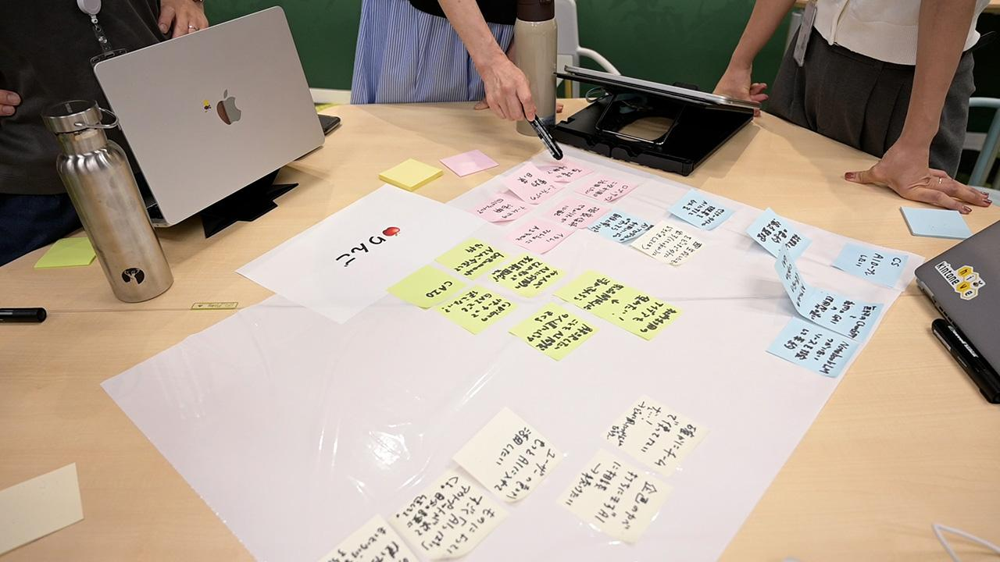
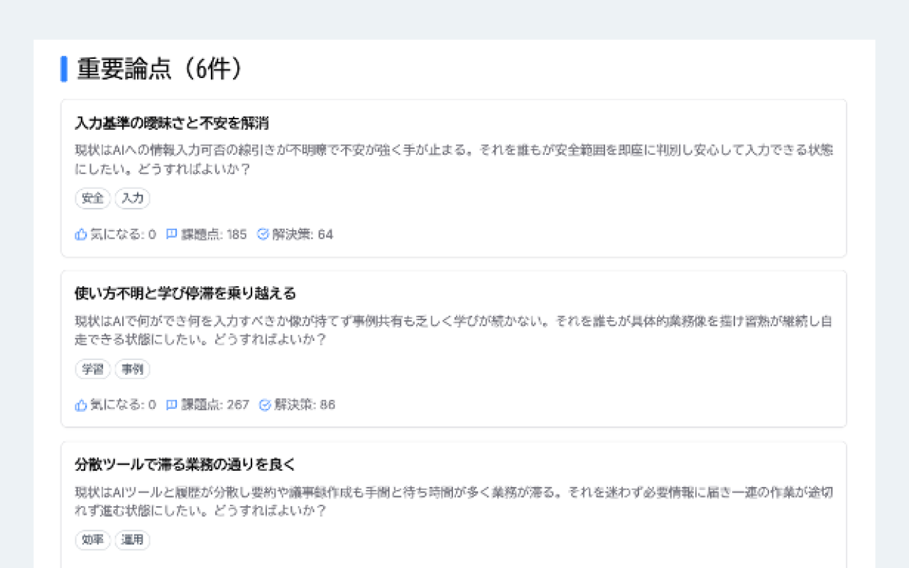

## サイボウズの取り組み --- 見えにくい声を、次の議論につなげる

会議をすると、みんなで話し合った気にはなる。けれども実際には、話すのが得意な人の意見ばかりが目立ってしまい、言いにくい不安や、まだ整理できていない迷いは共有されにくい。けれども、本当はそうした声の中にこそ、今見落とされている盲点に気づくきっかけがある。

ブロードリスニングを使うと、見えにくい声を、なるべく広く集めて、見落としを減らすことができる。大事なのは、いますぐ白黒をつけることではない。どこに共通点があり、どこに違いがあり、何がまだ論点として残っているのかを見えるようにすることだ。

サイボウズの事例は、この考え方がどのように企業内で活用できるのかをよく示している。ブロードリスニングが政治だけのものではなく、身近な組織やメディアの中でも役立つことが見えてくるだろう。

## AIを使った新しいワークショップの形

サイボウズは2025年8月にAIが参加者の議論を支援する社内ワークショップを行った。
この取り組みは、のちにWeb記事とYouTube動画として公開されている。

footnote:
「社員の本音」を5分で可視化。AIを使った新しいワークショップの形 | サイボウズ式
https://cybozushiki.cybozu.co.jp/articles/m006299.html

ここで使われたのはTODO章でも解説した「いどばたシステム」である。
これはデジタル民主主義2030コミュニティの中で開発された熟議支援ツールで、当時はチームみらいがオンライン環境を構築して、支持者とのオンライン講演会などに使っていた。このワークショップのためにサイボウズ向けの専用環境が構築された。この一連の作業はいどばたシステムの開発に関わった青山柊太朗氏にワークショップの開催を業務委託としてお願いし、サイボウズ側のエンジニアと連携しながら実現された。

ワークショップのテーマは「社内でのAI利用推進」。約50人の社員がオフライン・オンラインのハイブリッドで集まり、部署や職種、立場の違う人どうしで、このテーマをどう考えるかを話し合った。参加者には、情報システム部門、カスタマー部門、営業、開発、人事など、さまざまな立場の人が参加した。

### まずは付箋を使った書き出し法

このワークショップでは、最初からAIを使ったわけではない。まずは5人ずつのグループに分かれ、時間を区切って個々人が付箋に意見を書き出し、その後グループ内でそれを音声で共有する、よくある形式のワークショップが行われた。オンラインの参加者も同様にオンラインホワイトボードシステムのMiroを使って付箋に書き出し、オンライン会議システムZoomのブレイクアウトルーム機能でグループに分かれて会話をした。

これは、いきなり未知のシステムに入力をするよりも、使い慣れた方法を使うことによって書き出しの心理的ハードルを下げることが目的である。もちろん何が「使い慣れた方法」であるのかはワークショップ参加者によっても異なるだろう。MiroやZoomを使い慣れた方法と見なすことができたのは、企業内のワークショップであることで参加者のITリテラシーが担保されているからであり、自治体が市民に対して自由に参加できるワークショップを行う際には仮定できないだろう。

このセッションでは5分で書き出し、10分で共有をした。そこでは、「社内教育にもっと力を入れたほうがよいのではないか」「成功事例やコツをもっと共有したほうがよいのではないか」といった意見が出た。こうした方法でも、5分間考えることに専念することが強制されることで、考えを言葉にする機会にはなる。一方で、5分後にチームの他の人に話さなければいけないプレッシャーは、特に言語化に苦手意識のある人にとっては苦しいものだろう。

### 「いどばたシステム」でAIが掘り下げる

次に使われたのが、「いどばたシステム」だった。このシステムでは、参加者が書いたことに対してAIが質問を返してくれる。それに回答していくことによって会話をしながらどんどんと掘り下げていき、言語化が促される仕組みである。このシステムを使うことで「机に向かって一人で書く」というメンタルモデルから、「会話をする」というメンタルモデルに変化する。

会話の相手が生身の人間ではなくAIであることには価値がある。人間相手に話すときに「自分ばっかり話さないようにしなくちゃ」「こんなことを言ったらこの人はどう思うだろう」などと考える傾向の高い人と低い人がいる。この傾向の高い人は考えを話すことが低い人よりも抑制されてしまう。相手がAIであることによって、気兼ねなく一方的に自分の考えを話すことができる。

逆のパターンの害がわかりやすいだろう。複数人が聞いている会議の場で、聞き手がどう思うかおかまいなしに自分ばかり話す人がいると、その場は熟議の場ではなくその人の独演会になってしまう。特に音声しかコミュニケーションチャンネルがないような会議においては、一人が音声で演説している間、残りの参加者はコミュニケーション機会が奪われるので非効率なコミュニケーションになってしまう。ワークショップでしばしば書き出し法が使われるのも、音声とは異なる並列で情報をアウトプットできるチャンネルを作ることに価値があるからである。

### 全員の意見をまとめて合意点・相違点を出す

AIとの対話は、一人で悩むよりも言語化が促される。いどばたシステムでは、その結果の共有も支援される。50人の参加者が仮に自分の考えを1分で共有できるとしても全体で50分かかってしまう。実際には他の49人の考えを聞いて理解しながら自分の番に1分で自分の考えを述べることはほとんどの人にとって不可能なレベルで難しい。なので今までの方法ではワークショップ参加者の意見の大部分は共有されないままになってしまっていた。

いどばたシステムでは50人分のチャットログを読んだAIが数分で分析し、人々がどのような意見を持っているのかのレポートを生成する。よく言及されているテーマと、そのテーマに関する合意点・相違点をワークショップ参加者に共有して、さらに議論をすることができる。

たとえば今回のテーマである「社内でのAI利用推進」に関して、実はサイボウズ社内で2025年6月に実施した社内アンケートでは回答した1118人中80%が「AIを日常的に使っている」と答えています。一方で個々人は「全然使いこなせていない」「他社ではもっと活用している気がする」という漠然とした不安感を抱いている。

漠然とした不安感のままでは、改善のアクションを取ることができないが、今回の議論を経て「AIシステムに入れていい情報と入れてはいけない情報の区別が難しい」という点が不安感の一つの要因であることが明らかになった。

個々人では不安感を言語化して他人に伝えることが難しいが、一旦AIに対して感じていることを吐き出して、それをAIがまとめると「個人の気持ち」ではなく「大勢が共通して不安を感じている」という構造として扱いやすくなる。「意外と同じことを思っている人が多い」という気づきもありました。

### 垂直的ファシリテーションと水平的ファシリテーション

また、意見の相違点として「トップダウンで推進するべきか、ボトムアップで自律的に動くべきか」が見えてきたことは筆者にとって興味深いことであった。

アダム・カヘンの「共に変容するファシリテーション」ではファシリテーションに垂直型と水平型があると解説している。
垂直型はトップダウンでボスが意思決定をする形で、物事が進むが、反発や沈黙を生みやすい。
水平型はフラットで包摂的だが、何も決まらず停滞しやすい。
サイボウズは垂直型の意思決定を好ましくないと考え、水平型への移行を進めてきた。AI革命という有事に直面して、垂直型の強いリーダーシップを求める声が出てきている。

いどばたシステムは垂直的すぎる状況を水平的にすることに向いたシステムであり、疎外感を感じている人を包摂することには有益であろう。一方でこのシステム自体は意思決定をするものではない。アダム・カヘンは、垂直型と水平型のあいだを行き来することが有用だと主張している。

### 要約した方が少数意見の取りこぼしリスクが減る

このときにAI要約によってマイノリティの意見が取りこぼされるのではないか？という質問があった。この機会に解説しておこう。要約によって「大勢が似た意見を持っている意見グループ」ほど強く圧縮されるため、意見の理解に同程度の労力を掛けるならランダムに読むよりAI要約をした方がマイノリティ意見の取りこぼしリスクは減る。

1万人が意見を提出している状況で、うち100人=1%のマイノリティの意見に気付けるかを考えてみよう。ランダムに100件を選んで読むのでは約37%の確率でその少数意見は取りこぼされる。一方で似た意見をまとめてランキングにして上位から読んでいくなら、1%の意見は確実に100位以内に入るので取りこぼされない。意見の分布がZipf則に従うと仮定して計算すると、1%の意見は大体15位以内には入る。一方で15件ランダムに選んだのでは約86%の確率で取りこぼす。

現実にはランダムですらなく声の大きな人の意見だけが通ってしまったりする。だからこそ並列的な方法で全員に発言機会を与えた上で、それをランダムサンプリングではなくAI要約することで、より少数派の視点からの意見を目にしやすくなり、盲点に気づく確率を高められる。

## 背景にあったPlurality

こうした取り組みの背景には、Plurality という考え方がある。2024年5月にAudrey TangとGlen Weylが書いた書籍で、2025年5月には、サイボウズ式ブックスから日本語版『PLURALITY 対立を創造に変える、協働テクノロジーと民主主義の未来』が刊行された。

サイボウズは元々「チームワークあふれる社会を創る」を企業理念に掲げている会社であった。この書籍は技術によって人々がよりよく協働できるようにすることを目指す本であり、サイボウズの理念ともとても親和性が高い。

2025年8月に登録者28万人のYouTubeチャンネル「ゆるコンピュータ科学ラジオ」で公開されたこの書籍のプロモーション動画[^youtube]では、Polis が「世界を救うSNS」として紹介され、28万再生、1000件以上のコメントと大きな反響を呼んだ。この動画の中で、既存のSNSは個人に注目させるが、Polisは個人ではなく集団に注目させる、という言語化があった。筆者はこれをとても良い指摘だと考えている。

人は他人を個人として認識していると、せいぜい数十人までしか理解できない。個人ではなく集団の意見の分布として認識することによって、対個人の論争ではなく、集団意見のケアに意識を向けることができるようになる。筆者はブロードリスニングを人類の集団理解能力を強化する技術だと考えており、この技術によって強化された人類は今までと異なる組織や社会を作っていくだろうと考えている。

[^youtube]: https://www.youtube.com/watch?v=vz1BZzfK1lk

## 社外へ広がった「白黒つけない会議」

2025年8月のいどばたワークショップ以来、サイボウズ社内のあちこちの部署でいどばたシステムを使いたいという声が上がった。のちに作られた「倍速会議」なども社内で活用している。まだ社外に公開されていない興味深い出来事がいくつも起こっている。

一方で、こうした取り組みを社内だけに閉じず、社外にも広げていこうという試みも始まった。

2026年2月11日には、「ゆるコンピュータ科学ラジオ」を運営する pedantic 社とタイアップし、新しいYouTubeチャンネル「白黒つけない会議」を開始した。

1本目の動画のテーマは「リモートワークは生産性を上げるのか？下げるのか？」だった。3人の出演者がこのテーマについて議論しながら、それぞれの賛成度合いを 0%〜100% のレバーで示す仕組みになっている。

この形式の特徴は、「賛成か反対か」という二択に落とし込まない点にある。議論の途中で意見が変わればレバーの位置も変わるため、視聴者は 意見がどのように揺れ動き、更新されていくのか をリアルタイムに見ることができる。

2026年3月13日現在、この最初の動画は18万回以上再生され、950件以上のコメントが寄せられている。そしてこのコメントがAPIによって収集され、デジタル民主主義2030コミュニティで開発されている「広聴AI」を使って分析・可視化される。10章3節で紹介したボーリンググリーンの事例と同様に、分析結果のJSONデータをもとに、意見の多さを円の大きさで表す可視化を行っている。

YouTubeという大規模な公開インフラの上で、まず出演者が論点や背景知識を共有し、そのうえで視聴者がコメントを書く。
これは、SNS上で思いつきをそのままぶつけ合う議論とは異なる。参加者が一定の情報を受け取ったあとで意見を形成するという点で、熟議を動画メディア上に移した一つの変形として見ることができる。

## 以下旧バージョン

---

ここでは、私が所属するサイボウズで行ったワークショップ事例を紹介します。主催はサイボウズ式編集部で、私はサイボウズ・ラボの立場から、企画の壁打ちと「いどばた」導入のアドバイス（および専用環境の立ち上げ支援）として関わりました。

この事例は、ブロードリスニング（広く聴く）を「社内の意思決定に載せる」ための、比較的わかりやすい入り口になっています。

---

### 背景：利用率は高いのに、推進の論点がまとまらない

テーマは「社内でのAI利用推進」。参加者は東京オフィス＋オンラインで約50名、情シス・カスタマー部門・営業・開発・人事など、職種も職位もばらけた構成でした。

このテーマ設定が示しているのは、社内でAI活用が「ゼロからの普及」段階ではなく、「次の段階」に入っていることです。実際、2025年6月の社内アンケートでは、回答者1118人のうち80%が「AIを日常的に使っている」と答えています。にもかかわらず、個別に聞くと「全然使いこなせていない」「他社のほうが進んでいそうで不安」といった感覚も残っています。

つまり、数字だけ見ると“進んでいる”が、現場の手触りでは“足場が固まっていない”。このギャップがあると、議論はだいたい二つに割れます。

* リスクが怖いから慎重に進めたいです
* 取り残されるのが怖いから早く進めたいです

どちらも正しいです。だからこそ、いきなり「結論」を取りにいくと揉めます。先に必要なのは、論点の棚卸しです。

---

### 設計：まず「付箋ワーク」で限界を体感し、その後に「いどばた」

当日のプログラムは、比較が主目的でした。

最初に、従来型の付箋ワークを行いました。5人ずつのグループに分かれ、付箋に意見を書き出して共有し、短時間でまとめて発表しました。

結果は、よくも悪くも典型的でした。一定量の意見出しはできました。しかし15分程度では、せいぜい「モヤモヤの共有」が上限でした。まとめまで到達しようとすると、時間と認知負荷が足りませんでした。

この“限界を体感する”ことが、次に紹介する「いどばた」の効き方を理解する前提になります。

---

### いどばた：1対1の対話で素材を集め、後段で「共有できる形」に変換する

いどばたシステムは、デジタル民主主義2030の文脈で開発されてきた大規模熟議ツールで、これまでは主に政治の分野で使われてきました。
（社内向けの専用環境は、開発者の青山柊太朗さんと私で用意しました。）

開発者の青山柊太朗さんは「企業の現場で使うのは今回がはじめて。異なる背景を持つ人同士が互いの考えを理解したり、直接コミュニケーションしたりする機会を増やしたい」と語っています。

会議の見た目としては「AIチャットをするだけ」に近いです。参加者それぞれがAIと1対1で対話し、自分の経験や不安や要望を打ち込みます。ここでのポイントは二つあります。

1. **発言ハードルを下げる**
   会場の空気・上司の目・声の大きさ、といった要因から距離を置けます。自分のペースで書けます。

2. **個人の表現を“共有可能な粒度”に変換してから出す**
   個人のチャット内容そのものを晒すのではなく、AIが噛み砕いて共通点・相違点として整理したものが共有されます。

ブロードリスニングの観点で言えば、ここでやっているのは「個々の本音を守ったまま、全体の地図を描く」ことです。

---

### 5分で出たアウトプット：論点を先に出し、合意点と対立点に分ける

当日は、約50名が5分間チャットした後、数分で「重要論点」が6つ表示されました。

記事中で画面に見えていた論点例は、次のようなものです。

* 「入力基準の曖昧さと不安を解消」
* 「使い方不明と学びの停滞を乗り越える」
* 「分散ツールで滞る業務の流れを良く」

ここで重要なのは、**”結論”ではなく”論点”が出てくる**ことです。結論を早く作ると、どうしても「誰かの納得」を削って前に進むことになります。一方、論点が出るだけなら、まだ揉めません。揉める前に地図を共有できます。

さらに、いどばたは論点ごとに「合意点」と「対立点」を表示できます。私はこの点を次のように説明しました。

> すでに合意しているポイントがわかると、「この点はもう合意しているから、意見が違うこっちの議題に2時間をかけよう」という時間配分ができ、議論が濃くなります。

ブロードリスニングは、単に「たくさん集める」だけでは終わりません。集めた後に、対話の時間をどこに投下するか（＝意思決定コストをどこに払うか）を設計するところまで含みます。

---

### 「意外と自分だけじゃなかった」が生む効果

論点の中で象徴的だったのが、「文化か統率か、AI推進の舵取り」という論点です。サイボウズはボトムアップ文化が強いです。一方で世の中を見ると、トップがAI注力を宣言するなどトップダウン事例も多いです。ここで「このままでいいのか」という迷いが、個人の悩みではなく“論点”として立ち上がりました。

この種の話は、通常の会議では出にくいです。出たとしても「誰が言ったか」に引っ張られやすいです。しかし論点として提示されると、個人の発言ではなく“構造”として扱いやすくなります。社内の議論でこの差は大きいです。

---

### 少数意見は埋もれないのか：まず多数論点を高速化して時間を作る

この手の仕組みに対して必ず出る懸念があります。「関心が高い論点ばかりが注目され、少数意見が見つけにくくならないか？」という問いです。記事でもこの質問が投げられています。

ここでの私たちの回答は、設計上の割り切りです。

* 時間は有限なので、まず多数が関心を寄せる論点を効率化します
* 効率化で浮いた時間を、これまで「忙しいから無視しよう」となっていた少数論点に向けられるようにします

従来の会議で同等のことをやろうとすると「4時間の会議になってしまう」という比較も述べられています。いどばたシステムの大きな特徴は、発言ハードルの低さです。AIとの対話形式なので、「会場の空気」や「個人の声の大きさ」に左右されません。
さらに改善として、参加者傾向を散布図やグラフで示す、といった方向性も検討対象になっています。

ブロードリスニングの実装では、「少数意見を守る」は理念だけでは足りません。**時間配分と可視化の設計**に落とす必要があります。

---

## この事例から引ける、ブロードリスニングの要点

サイボウズのこのワークショップは、ブロードリスニングを社内に持ち込むときの最小構成になっています。

* **個別入力で“場の力学”を弱める**（言いにくさ・同調圧力・声量差を減らします）
* **AIで一次整理し、論点地図を先に出す**（結論ではなく争点を出します）
* **合意点／対立点に分け、議論のコストを適切に使う**（濃い議論を必要な場所に集中します）

私自身はこの仕組みを「会議を置き換えるもの」とは捉えていません。むしろ、会議や意思決定の前段で行う「論点の整地」です。整地が終わっていれば、少人数の会議も強くなりますし、決めるべきことがはっきりしていれば、トップダウン／ボトムアップといった進め方の議論も具体に降りてきます。

この章ではまず、ここまでを「導入の型」として押さえておきたいと思います。
