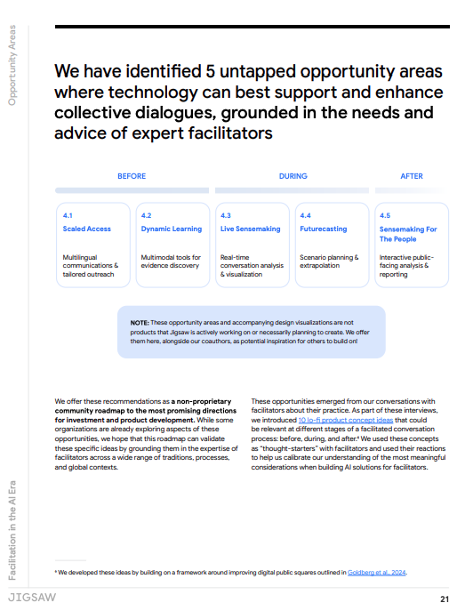
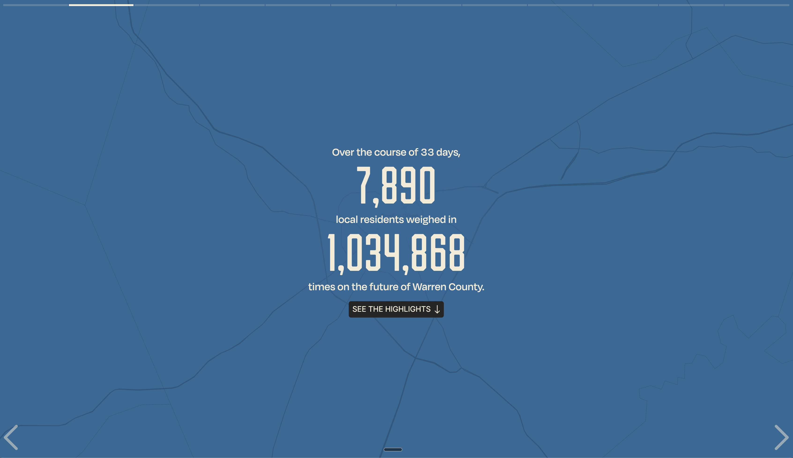
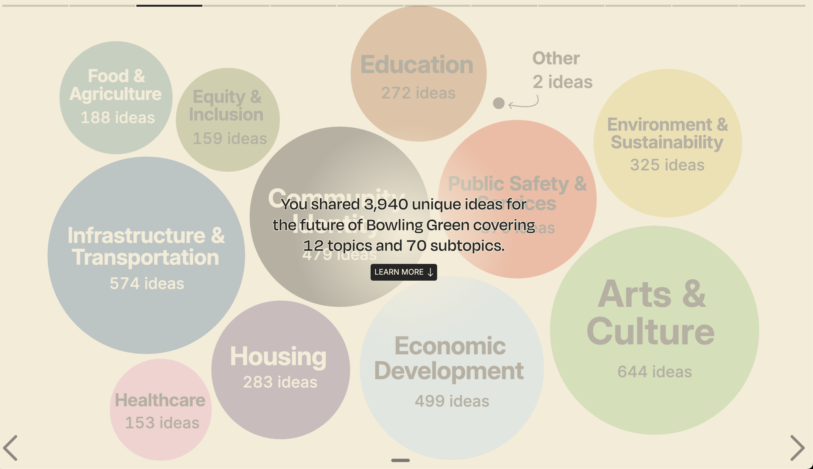
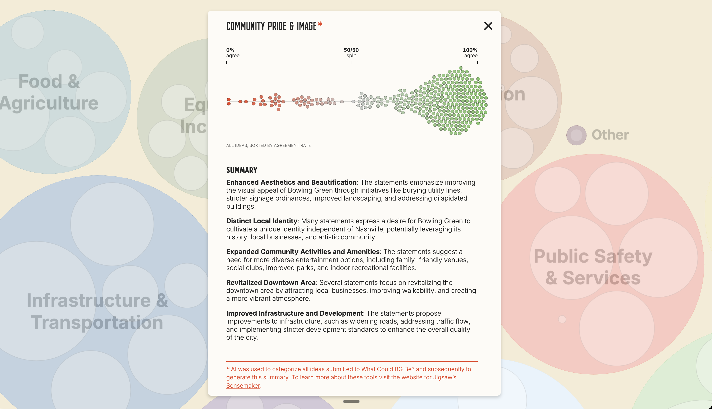
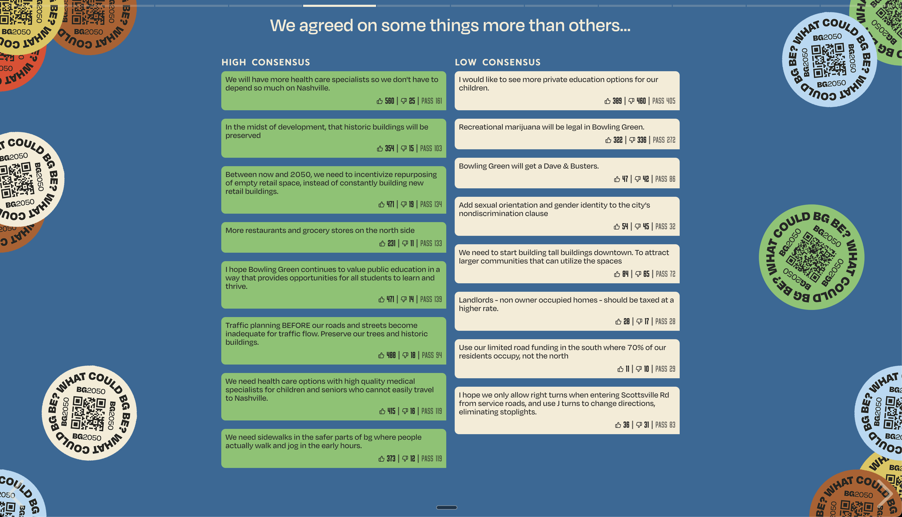

## 10.4　ボーリンググリーン：7,890人が参加した「アメリカ最大のタウンホール」

### 10.4.1　Jigsawと「AI時代のファシリテーション」

台湾のvTaiwanはPolisを用いた合意形成の先駆的事例であり、イスラエル・パレスチナの試みはLLMと橋渡しアルゴリズムを紛争下で活用した挑戦的事例だった。3つ目の事例として紹介するのは、アメリカの一地方都市で行われた大規模な市民対話プロジェクトである。

このプロジェクトの技術的な基盤を提供したのが、Googleのテクノロジーインキュベーターである[Jigsaw（ジグソー）](https://jigsaw.google/)だ。2011年にGoogle Ideasとして設立されたJigsawは、「開かれた社会への脅威にテクノロジーで対抗する」ことを使命としてきた。検閲回避VPNツール「Outline」、独立メディアをDDoS攻撃から守る「Project Shield」、有害コメントを検出する「Perspective API」など、市民社会を支えるインフラを数多く開発してきた組織である。

そのJigsawが2025年に公開したのが、「[Facilitation in the AI Era（AI時代のファシリテーション）](https://services.google.com/fh/files/blogs/jigsaw_facilitation_in_the_ai_era.pdf)」と題するレポートだ。世界各地の22人のプロのファシリテーターとの共同研究に基づき、AIが市民対話を支援できる5つの機会領域を提示した。

レポートの核心にあるメッセージは明快だ。AIはファシリテーターを「置き換える」ものではなく、人々の構造的主体性（structural agency）を強化するものだということ。「自分の声が社会に届く」という実感を、より多くの人に届けるための技術としてAIを位置づけている。

このビジョンを具現化するために、JigsawはSensemaker（センスメーカー）というオープンソースツールを開発した。

### 10.4.2　Sensemaker：Polisの出力をAIで読み解く

Sensemakerは、大規模なオンライン対話を構造化・要約するためのツールキットである。Apache-2.0ライセンスのもとGitHubで[公開](https://github.com/Jigsaw-Code/sensemaking-tools)されており、内部では3つの処理段階がある。

第一に、トピックの抽出だ。大量の意見文から主要な論点を自動的に発見する。トップレベルのトピックだけを抽出することも、サブトピックやテーマまで掘り下げることもでき、分析の粒度は自由に設定できる。

第二に、意見の分類だ。各意見文をトピックに振り分ける。一つの意見が複数のトピックにまたがる場合にも対応しており、意見の多面性を損なわない設計になっている。

第三に、要約の生成だ。意見と投票データを分析し、合意が得られている領域と対立が残る領域を明示した要約レポートを出力する。投票数が少ない意見を過大評価しないよう、最低投票数によるフィルタリングも組み込まれている。

AIモデルはGoogle Geminiを中心に、複数のモデルに対応しており、独自モデルの組み込みも可能な拡張性を持つ。

Sensemakerの設計で特筆すべきは、前節で紹介したPolisとの連携を前提としている点だ。Polisで収集された意見と投票データをCSVでエクスポートし、Sensemakerに入力することで、数千件の意見を構造化された分析レポートに変換できる。Polisの共同創設者であるChris Smallは、Jigsawのソフトウェアエンジニアでもあり、両プロジェクトは人的にも技術的にも深くつながっている。

つまり、vTaiwanで実証されたPolisの「意見収集と可視化」の強みに、Sensemakerの「AIによる大規模分析と構造化」を接続するパイプラインが、オープンソースとして整備されたのだ。

### 10.4.3　「What Could BG Be?」：33日間の実験

このパイプラインが大規模に実証されたのが、ケンタッキー州ボーリンググリーンで2025年に実施された「[What Could BG Be?（ボーリンググリーンはどうなれるか？）](https://report.whatcouldbgbe.com/)」プロジェクトである。

ボーリンググリーンは、ケンタッキー州南部に位置する人口約7万6,000人の都市だ。2050年までに人口が20万人を超えると予測されており、急速な成長に対応するための25年間の戦略計画「BG 2050」が立ち上がった。発案者はウォーレン郡のDoug Gorman判事で、2017年に人口倍増の予測を知ったことがきっかけだった。「この変化を自分たちに"降りかかるもの"にするのか、"自分たちのために起こすもの"にするのか。後者にするなら、計画が必要だ」と彼は語っている。

従来の計画策定プロセスでは、地域のリーダー約100人が関与するのが通例だった。しかし、BG 2050はそこに留まらなかった。地域住民全体の声を聴くために、PolisとSensemakerを組み合わせたオンライン対話を実施したのだ。

2025年2月14日から3月17日までの33日間、住民は[whatcouldbgbe.com](https://www.whatcouldbgbe.com/)にアクセスし、自分のアイデアを自由に投稿し、他の住民のアイデアに「賛成」「反対」「パス」で投票した。個人情報や属性データは一切収集しない設計だった。

結果は目覚ましいものだった。**7,890人**の住民が参加し、**3,940件**の独自のアイデアが提出され、**1,034,868票**の投票が行われた。Polisの運営団体であるComputational Democracy Projectの関係者は、「Polisの歴史上、最も活発な対話の一つ」と評している。Gorman判事はこれを「アメリカ最大のタウンホール」と表現した。

### 10.4.4　AIが明らかにした合意の地図

33日間で集まった3,940件のアイデアを、Sensemakerが分析した。人間が手作業で整理すれば数百時間を要する作業が、AIによって数分で処理された。

結果として、アイデアは12のトピックと70のサブトピックに自動分類された。芸術・文化（644件）、インフラ・交通（574件）、経済開発（499件）、コミュニティ・アイデンティティ（479件）など、住民の関心の全体像が可視化された。

各トピックを選択すると、個々のアイデアが合意率順にドットチャートで可視化され、AIが生成した要約が表示される。

最も注目すべきは合意率の分布だ。**全アイデアの半数以上にあたる2,370件で、80%以上の合意率**が記録された。Gorman判事によれば、約60%のアイデアが80%以上の合意を得たという。

住民の間で最も強い合意が得られた7つのテーマは、以下のとおりだ。

1. 家族向けアクティビティの充実
2. 郡全体の均衡ある開発
3. 食料品店の確保
4. ダウンタウンと河岸の接続
5. 歩道と歩きやすさの改善
6. Scottsville Road（幹線道路）の渋滞緩和
7. 洪水・災害への備え

特筆すべきは、政治的に対立する住民層の間でも高い合意が得られた分野があったことだ。公園と緑地、住宅の手頃さ、メンタルヘルスの資源確保、持続可能な開発、歴史的建造物の保全、新築よりも既存の商業スペースの活用。アメリカの地方都市において、政治的分断を越えた共通基盤が可視化された意義は大きい。

JigsawのScott Carpenter事業部長は「これは会話のGoogle Mapsのようなものだ」と表現している。地図が土地の形を見せるように、このツールは意見の地形を見せる。

### 10.4.5　声から政策へ：「接続」の設計

ここまでは「声を集めて可視化する」段階だ。vTaiwanの事例で見たように、この結果を政策に接続する設計がなければ、プロジェクトは「ガス抜き」で終わる。

ボーリンググリーンでは、レポート公開後、テーマごとに10〜12人のボランティアによる実行チーム（pillar groups）が組成され、ウォーレン郡指導部への政策提言を作成する工程に移行した。2025年夏には、すでにウォーレン郡財政裁判所が実行に移した施策がある。9つのボランティア消防団を統合する統一消防署の設立に、500万ドルの予算が承認されたのだ。

参加者の追跡調査では、**70%が「自分の声が重要な問題に影響を与えられるという自信が高まった」**と回答した。注目すべきは、このプロジェクト全体の予算が1万ドル未満だった点だ。Polisはオープンソースであり、Sensemakerも無償で利用できる。テクノロジーのコストが下がったことで、「市民の声を聴く」行為のハードルが劇的に下がっている。

2025年4月15日、プロジェクトの成果を収めたタイムカプセルが埋設された。25年後に開封される予定だ。

### 10.4.6　「We The People」：全米への展開

ボーリンググリーンの成功は、一地方都市の実験に留まらなかった。

2025年11月、シンクタンクのNapolitan Instituteが、Jigsawと連携して「We The People」という全米規模のイニシアティブを発表した。アメリカの全435選挙区から市民の声を集め、AIチャットボットを通じて「自由と平等についてどう考えるか」を深掘りするプロジェクトだ。通常のアンケートでは平均8語しか得られない回答が、AIとの対話を通じて平均**140語**にまで引き出されるという。

2026年7月4日、アメリカ建国250周年に合わせた最終レポートの公開が予定されている。ボーリンググリーンで実証されたPolis＋Sensemakerのパイプラインが、国家規模に拡張されようとしている。

### 10.4.7　3つの事例が示すもの

台湾、イスラエル・パレスチナ、そしてボーリンググリーン。3つの事例は、規模も文脈も大きく異なる。

台湾は、利害関係者間の対立を合意に導き、法改正という具体的な政策成果を出した。イスラエル・パレスチナは、信頼が崩壊した状況下でも90%超の合意形成が可能であることを示した。ボーリンググリーンは、日常的な都市計画において数千人の市民参加をAIが支えられることを実証した。

3つの事例に共通するのは、「Polisで集め、AIで構造化し、人間が文脈の中で解釈する」というワークフローだ。Polisの「橋渡し」アルゴリズムが対立を越える対話を促し、AIが大量の意見を構造化し、最終的に人間のファシリテーターや政策担当者がローカルな文脈の中で判断を下す。

しかし、3つの事例が示す限界にも目を向ける必要がある。前節で指摘した「具体性のジレンマ」は、ボーリンググリーンにも当てはまる。「家族向けアクティビティの充実」には80%以上が合意する。だが「どこに何を建てるか」「誰が費用を負担するか」という具体論に入った瞬間、合意は難しくなる。AIが抽出する合意は、具体性が上がるほど脆くなるのだ。

これは技術の欠陥ではない。人間の合意形成が本質的に持つ性質だ。だからこそ、ボーリンググリーンのpillar groupsのように、AIの出力を受け取った後に人間が具体化する工程が不可欠になる。AIは「合意の地図」を描く。その地図の上で、どこへ向かうかを決めるのは人間の仕事だ。

本書の第4章から第9章で紹介してきた日本国内の事例と比較すると、海外事例の特徴が浮かび上がる。日本では自治体や政党が主導する形でブロードリスニングが導入されてきた。一方、台湾ではシビックテックコミュニティが、ボーリンググリーンではテクノロジー企業と地域リーダーの協働が、それぞれ推進力となった。イスラエル・パレスチナでは平和構築NGOのネットワークが起点だった。

これらの多様な入口が示すのは、ブロードリスニングが特定の政治体制や文化に依存しない、汎用的な基盤であるということだ。しかし、推進主体の多様さよりも本質的な違いがある。それは、ブロードリスニングの「深さ」だ。

第4章から第9章で紹介した日本国内の事例の多くは、既に存在するテキストデータをAIで構造化・可視化するものだった。アンケートの自由記述、SNSの投稿、パブリックコメントといった既存の声を集め、AIが整理し、意思決定者が読む。情報の流れは市民から行政への一方通行だ。安野たかひろの都知事選での取り組みが大きなインパクトを持ったこともあり、日本のコミュニティでは「ブロードリスニング＝SNSの声をAIで分析すること」という理解が広まっている。

しかし、本章で見てきた海外事例は、その先に進んでいる。台湾のcollaborative meeting（協働型会議）では、Polisで可視化された意見の地図をもとに利害関係者がラウンドテーブルに集まり、AIが構造化した論点を踏まえて対面での熟議を繰り返した。ボーリンググリーンでは、Polisでの大規模な意見収集の後にpillar groupsが組成され、AIが明らかにした合意領域を出発点として具体的な政策へと練り上げた。「We The People」では、AIチャットボットとの対話を通じて通常8語の回答が140語にまで引き出されている。

これらに共通するのは、AIが単なる分析装置ではなく、人と人との対話を媒介する存在として機能している点だ。ブロードリスニングが「一人の意思決定者が大量の声を聴く」ための道具にとどまるなら、それはSNS分析の延長に過ぎない。しかし海外事例では、AIが参加者の意見を構造化し、合意点と対立点を可視化し、それを踏まえて当事者同士が再び対話する。このサイクルが回ることで、参加者自身の自己理解と他者理解が深まり、合意形成の質そのものが変わる。これは「AI媒介コミュニケーション（AI-mediated communication）」と呼ぶべきものであり、従来のSNS分析とは本質的に異なるアプローチだ。

Polisのようなオープンソースツールと、Sensemakerのような分析基盤が公共財として整備されたことで、誰でもこの「AI媒介コミュニケーション」のインフラを立ち上げられる時代が到来しつつある。

11章では、このアプローチを日本の現場で実装する試みを紹介する。合同会社多元現実は、構想日本が30年以上にわたって積み重ねてきた無作為抽出の住民会議に、AIによる事前ヒアリングやリアルタイムの論点構造化を組み込むことで、対面の熟議そのものをエンハンスしている。SNSの声を集めて分析するだけではない。AIが対話を支え、深め、接続する。海外で実証された設計思想が日本の自治体の現場でどのように根を下ろしつつあるのか、見ていこう。
