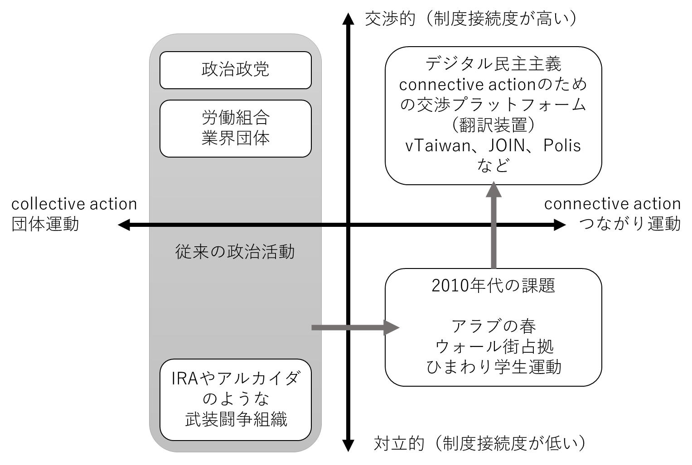

## Connective Actionと制度接続

本章では、Polisや台湾のvTaiwanなど、多様なブロードリスニングツールと実践を見てきました。これらは何を共通して解こうとしているのか。その問いを考察するフレームとして、政治学者のW. Lance BennettとAlexandra Segerbergが2012年の論文「The Logic of Connective Action」で提唱した二つの運動形態が有効です。[^1] CollectiveとConnectiveは響きが似ているため混同されがちです。本書ではCollective Actionには「団体運動」、Connective Actionには「つながり運動」という日本語訳を当てます。

Polisの開発者Colin Megillは、アラブの春やウォール街占拠運動を目撃してPolisを作りました。SNSを通じて膨大な人々が集まり、社会に大きなインパクトを与えた。それでもなぜ、制度的な変革には結びつかなかったのか。この問いは、PolisだけでなくvTaiwanなど本章で見てきた実践に共通する設計思想の根底にあります。SNSの炎上も同じ構造を持っています。多くの人が怒りを表明し問題提起が広がっても、具体的な解決につながることは稀です。Connective Actionという概念は、このギャップを明確にし、なぜブロードリスニングが流動的な民意を制度に接続する仕組みとして求められるのかを説明してくれます。

### 二つの運動形態

**Collective Action（団体運動）**は、労働組合や政党のような公式な組織が主導する運動です。人々はまず組織に所属し、組織は資金や人員を投入して集合的アイデンティティを形成します。

たとえば労働組合のストライキを考えてみましょう。個人が単独でストライキを行えば、その間は無収入になります。経済的な痛みに耐えられず、要求が通らないまま職場に戻らざるをえなくなるのが普通です。しかし労働組合は、組合費を積み立てた「ストライキ基金」によって、ストライキ中の組合員の生活を支援します。これにより、組合員は経済的な痛みを負うことなくストライキを継続できます。そして、労働組合は代表者が存在するためストライキを「始める」ことも「終わらせる」こともできる。このコントロール力があるからこそ。組織は経営側と交渉できます。「待遇改善の要求が通れば、ストライキを終わらせる」という取引が成立するのです。

極端な例として、IRA（アイルランド共和軍）を挙げることもできます。IRAは、北アイルランド（イギリス領）とアイルランド共和国の統一を目指した武装組織です。北アイルランドでは、イギリスへの帰属維持を望むプロテスタント系住民（多数派）と、アイルランドとの統一を求めるカトリック系住民（少数派）の対立が1960年代後半から激化し、「北アイルランド紛争」と呼ばれる事実上の内戦状態が約30年間続きました。IRAによるテロ、プロテスタント系武装組織による報復、イギリス軍による弾圧という三つ巴の暴力で、一般市民を含む3,500人以上が犠牲になっています。

重要なのは、これが遠い過去の話ではないという点です。紛争が本格的に終結したのは1998年のベルファスト合意であり、IRAが正式に武装闘争の終結を宣言したのは2005年のことです。西ヨーロッパの先進国であるイギリスで、つい20年前まで武装闘争が続いていたのです。IRAがCollective Actionの例として興味深いのは、組織として停戦を宣言し、武装解除に応じることができた点です。暴力的な活動であっても、組織化されていれば「終わらせる」ことができる。それゆえに「交渉力」になる。これがCollective Actionの本質的な特徴です。

**Connective Action（つながり運動）**はこれとは対照的な運動形態です。人々は組織に所属せず、SNS上で見聞きした内容をもとにそれぞれの判断で活動に参加します。共感ベースで一時的につながった緩やかなネットワークによって自己組織化される点が特徴です。

2010年代のアラブの春はその典型例です。チュニジアからエジプト、リビア、シリアへと連鎖した抗議運動はSNSを通じて瞬く間に広がり、エジプトとチュニジアでは政権交代を実現しました。しかし、運動を代表して政府と交渉できる組織が存在しなかったため、移行後の秩序を形成することができませんでした。エジプトでは軍によるクーデターが起き、リビアとシリアでは運動が内戦へと暴走しました。「終わらせる」能力を持たない運動は、制度変革につながる前に崩壊するか、誰もコントロールできない暴力へと変質してしまったのです。

2011年のニューヨーク・ウォール街占拠運動（Occupy Wall Street）も同様でした。格差への怒りを訴える数千人がズコッティ公園を占拠し、世界中に「We are the 99%」というメッセージを広めました。しかし運動はリーダーを持たず、政府や金融機関と交渉するチャネルを持てませんでした。最終的には警察による強制排除で幕を閉じ、具体的な政策変更には結びつきませんでした。

SNSで自発的に発生した緩やかなネットワークには主催者が存在しないため、活動をコントロールする能力がありません。怒りで集まった人々は、為政者やメディアに問題を認知させることはできても、問題を解決できるわけではありません。コントロール力がないということは交渉力がないということであり、すなわち「要求が通れば運動を終わらせる」という取引ができないのです。

### Connective Action（つながり運動）の構造的限界

SNSを通じたConnective Action（つながり運動）には、三つの本質的な機能不全があります。

第一に、「リーダー不在」が交渉を不可能にします。リーダーがいないということは、運動を代表して交渉する人がいないということです。要求を受け入れても、それで運動が終わる保証がない。これでは、相手も交渉のテーブルにつく動機を持てません。

第二に、運動が乗っ取られやすい点があります。組織化されていない運動は、すでに組織化された勢力にとって格好の「乗り物」になります。乗っ取りには二つのパターンがあります。

一つは、社会問題を飯の種にしている活動家やインフルエンサーによる乗っ取りです。彼らの影響力や収益基盤がその問題の存在に依存している場合、問題の解決よりも怒りの持続にインセンティブが働く構造になりえます。

もう一つは、既存の政治団体による乗っ取りです。ある社会問題に怒った人々がデモを始めたとき、そこに「反戦」や「反原発」、「憲法改正反対」といった別の主張を掲げる団体が合流し、運動の方向性を変えてしまうことがよく起きます。さらには、そうした組織の中には、「政府から弾圧されることで正統性を獲得する」という戦略をとるものもあります。運動が「解決」されるよりも、弾圧される方が都合がいいのです。

第三に、SNSプラットフォームが「解決」ではなく「炎上」にインセンティブを持っています。SNSのアルゴリズムは、エンゲージメント（いいね、リツイート、コメント）を最大化するように設計されています。怒りを煽る投稿ほど拡散され、解決策を提示する冷静な投稿は埋もれてしまいます。プラットフォームにとって、問題が「解決」されるよりも、炎上が「継続」する方が都合がいいのです。そして、私たちのスマホの画面には、いつ見ても炎上事件がレコメンドされ続けるのです。

こうして、Connective Actionは二重の袋小路に陥ります。オンラインにとどまる限り、「数は多いが交渉相手のいない声」として制度側から無視されます。怒りがデモや実力行使へと発展すれば、今度は「暴徒」として排除の口実を与え、問題の本質は棚上げされます。どちらの方向に転んでも、運動は制度変革に届かないまま消耗していく。これがConnective Actionの構造的な問題点です。

### 運動の地形を四象限で整理する

以下の図は、Collective Action（団体活動）とConnective Action（つながり活動）の関係を整理したものです。縦軸は「交渉的（制度接続度が高い）」から「対立的（制度接続度が低い）」、横軸は「Collective Action（団体運動）」から「Connective Action（つながり運動）」を示しています。

- **左上**（Collective Action＋交渉的）：政治政党や労働組合、業界団体がここに位置します。議会活動、団体交渉、請願といった公式の政治的手続きを通じて主張を実現します。

日本では春闘（春季労使交渉）が典型例です。連合（日本労働組合総連合会）が目標賃上げ率を設定し、傘下の各労働組合が経営側と賃金交渉を行い、妥結できなければストライキに突入する。このストライキを「始める」「終わらせる」コントロール力こそが交渉力の源泉です。労働者のストライキは一見対立的に見えますが、日本国憲法第28条が保障する「団体行動権」の行使であり、制度の内側に位置づけられた行動です。法律が認めた権利だからこそ、経営側もテーブルに着かざるをえないわけです。

業界団体も同じ構造で動いています。日本医師会は、2年ごとに改定される診療報酬（医療行為の価格表）の改定交渉において、厚生労働省の審議会である中央社会保険医療協議会（中医協）に委員を送り込み、点数設定に直接関与します。会員医師は地域の有権者でもあり、選挙時の組織票が政治家への影響力の源泉です。農協（JA）も同様で、TPP（環太平洋パートナーシップ協定）交渉では農業関税の撤廃・削減に強く反発し、農林族議員との連携によって交渉の行方に大きな影響を与えました。

- **左下**（Collective Action＋対立的）：組織化されたCollective Actionでありながら、対立的な手段を取る武装闘争型がここに位置します。IRAやアルカイダなどがその例です。

国内では、51年綱領（1951年）時代の日本共産党がここに当てはまります。武装闘争路線を採用し、山村工作隊の組織化や血のメーデー事件（1952年）などの実力行使を行いました。その後、1955年の六全協で路線を自己批判し議会主義に転換し、運動は左下から左上へ移行しました。

オウム真理教は、この共産党とちょうど逆の動きをした例です。1990年の衆院選に松本智津夫（麻原彰晃）ら幹部候補を擁立して全員落選した後、議会ルートを捨てて武装化を加速させました。サリンや爆発物を製造し、1994年の松本サリン事件、1995年の地下鉄サリン事件へと至った。共産党が左下から左上へと移行したのに対し、オウム真理教は左上（議会参加）を試みて失敗し、左下（武装闘争）へと転落していきました。

- **右下**（Connective Action＋対立的）：リーダーのいない自発的な運動がここに位置します。SNSでの炎上やハッシュタグ運動から始まり、アラブの春やウォール街占拠のようにデモや暴動へと発展することもあります。

前述の通り、この象限の運動は社会への問題提起力を持ちますが、交渉力を持てません。リーダーがいないため「要求が通れば運動を終わらせる」という取引が成立せず、制度変革への接続が難しいのです。#MeTooや#BlackLivesMatterは世論を大きく動かしながらも、制度変革への接続は国や文脈によって大きく異なりました。日本の旧統一教会問題（2022年）でも大規模なSNS世論が形成されましたが、具体的な立法につながるまでには既存政党という「左側」の組織が介在する必要がありました。

台湾のひまわり学生運動は、林飛帆らがリーダーとして浮上して政府との交渉チャネルを確立したことで、右下から右上に近い結果へと移行した例外的なケースです。

- **右上**（Connective Action＋交渉的）：組織化されていない流動的な民意を、制度に接続する領域です。図中では「翻訳装置」と表現されています。

ここに位置するのはツールではなく、**プロセスや制度設計**です。PolisやTTTC、広聴AIは意見の収集・可視化を担う道具であり、それ自体は右上を保証しません。vTaiwanがここに位置するのは、Polisで集めた意見の先に政府との交渉チャネルと立法への接続が設計されているからです。同様に、台湾JOINの「5,000賛同で政府回答義務」や、ミニ・パブリックスを経た詐欺広告規制法も、意見収集から立法までの接続が制度として組み込まれているから右上に届いた事例です。

つまり、ツールは「声を集める」機能を担い、制度設計が「声を受け取る」窓口を用意する。その両方が揃って初めて、右下の声は右上に到達します。広聴AIや各自治体・各政党のブロードリスニングの取り組みがここを目指しているとしても、受け取る制度側の設計が伴わなければ、可視化された意見は宙に浮いたままになります。

なお、憲法が保障する「結社の自由」は、右下から左上への移行、つまり同じ思いの民衆が組織を作り交渉力を持つことを可能にするための権利です。しかし組織化には時間とコストがかかります。組織化を経由せずとも流動的な民意を公式ルートに接続すること、すなわち右下から右上への移行を可能にすること。これがデジタル民主主義に期待される役割の一つだと筆者は考えます。

### Change.orgに見る請願ツールの構造的限界

「右上」を目指すデジタルツールとして、Change.orgは早期から注目されました。請願という公式ルートを使って流動的な民意を政治に接続する仕組みだからです。公式サイトによると5億7000万人以上のユーザーを抱え、「問題が起きたときに使いたくなるツール」として広く認知されています。

しかし設計上の問題から、Change.orgは実際には「数の力で圧倒する」対立的な手段（右下）に留まっています。さらには、プロモーション機能によって署名の露出を「買う」ことが可能であり、お金をかけるほど署名が集まりやすくなります。この構造では、署名数が必ずしも民意の強さを反映するとは限りません。また、1人1票という民主主義の原則は技術的に担保されておらず、複数アカウントでの署名も可能な設計になっています。

さらに、「〇〇万人が署名」という数字はニュースバリューになりやすく、メディアが報道することでさらに署名が集まります。そしてニュース記事がSNS上で「エビデンス」として共有され、炎上がさらに加速する。署名数の可視化が炎上の正のフィードバックループを生みやすく、しばしばキャンセルカルチャーの道具として使われる結果を招いています。

2023年には、映画『バービー』の日本公開中止を求める署名キャンペーンが展開されました。アメリカ公式アカウントが原爆をモチーフにしたファンアートに好意的な反応を示したことが発端でしたが、署名活動は謝罪を求めるにとどまらず、映画そのものの公開中止を求める方向に発展しました。

2024年には、ゲーム「アサシンクリード シャドウズ」の発売中止を求める署名キャンペーンが立ち上がり、10万人以上が署名しました。ゲーム内の歴史考証に対する不満が発端でしたが、署名活動は問題の解決（考証の修正）ではなく、製品そのものの排除を求める方向に発展しました。

これらの事例に共通するのは、署名活動が「問題の解決」ではなく「対象の排除」を目的としている点です。問題解決のためのツールだったはずが、分断を深めるツールになってしまっている。これがChange.orgの課題です。

ただし、この問題はChange.orgに固有のものではありません。「数を集めて圧力をかける」という構造を持つ請願ツール全般に共通する問題です。署名数の可視化とメディア報道の相互作用、プロモーションへの課金構造、1人1票の非担保。これらの設計上の特性は、プラットフォームが変わっても本質的には同じです。デジタル請願という仕組み自体が、「右上」ではなく「右下」に引き寄せられる力学を内包しています。

### 拡張熟議が接続メカニズムになる

Change.orgが「数の力」で相手を圧倒しようとするのに対し、vTaiwanやJOINが提示するのは「ここに合意点がある」という構造化された情報と、それを受け取る制度的な窓口です。政治家にとって、前者は「敵か味方か」の踏み絵ですが、後者は「解決可能な問題」として扱えます。

本章の四象限で整理した構造的な問題は、Connective Actionが生み出す大量のエネルギーには出口がないという問題でもあります。オンラインにとどまれば無視され、街頭に出れば排除される。この袋小路を突破するのが、右下から右上への接続設計です。

その接続の深さは三段階あります。ツールとしてのブロードリスニング（TTTC、広聴AI）は、声を構造化して「合意点がある」という情報を生み出しますが、接続の有無は使い手次第です。政治家・行政主導のブロードリスニングは、「聴いた人が応答する」という意志によって右上に近づきますが、制度化されていないため継続性は保証されません。拡張熟議支援（vTaiwanのサイクル、JOINの回答義務）は、応答が制度として組み込まれているため安定的に右上を実現します。

ブロードリスニングは、市民の声に応答するコストを劇的に下げます。これまで「声が届く政治家」は、大きな後援会を持つ地盤のある政治家か、カリスマ的に民意を読める例外的な人物に限られていました。広聴AIは、この応答能力を誰でも持てるものにします。

こうして、ブロードリスニングの三形態はそれぞれ異なる形で右下の声を右上に届けようとする試みとして位置づけられます。Connective Actionを特定の組織に乗っ取られることなく、流動的な民意を公式の政策プロセスに接続すること。これが、拡張熟議型ブロードリスニングが必要とされた理由です。LLMによって技術的障壁が消えた2020年代に、この仕組みが実現可能になった。SNS時代のConnective Actionが生み出す膨大なエネルギーの受け皿として、技術の成熟と社会的需要が重なったとき、ブロードリスニングは生まれるべくして生まれたのです。

---

[^1]: W. Lance Bennett, Alexandra Segerberg「The Logic of Connective Action: Digital media and the personalization of contentious politics」*Information, Communication & Society* Vol.15, No.5, pp.739-768, 2012 https://doi.org/10.1080/1369118X.2012.670661
