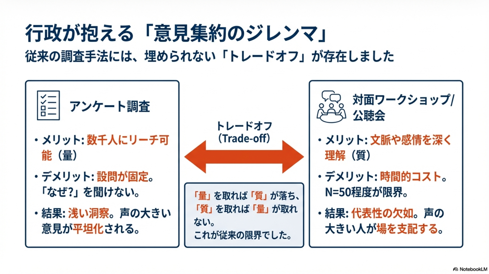
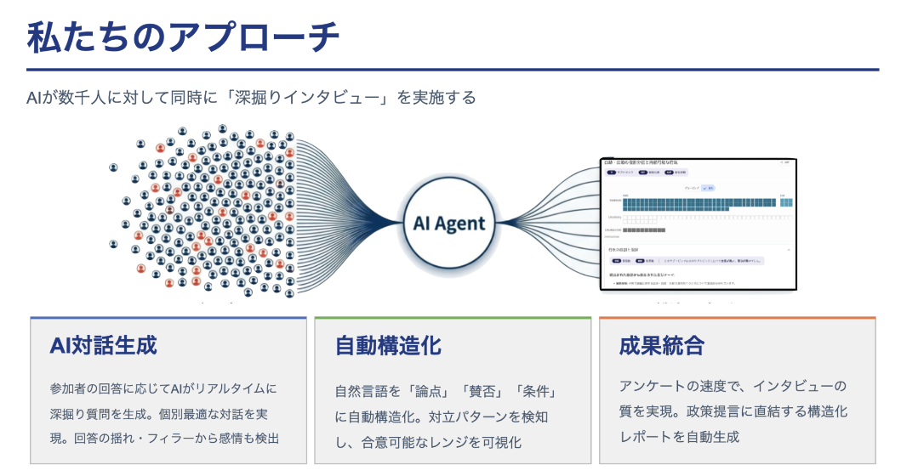
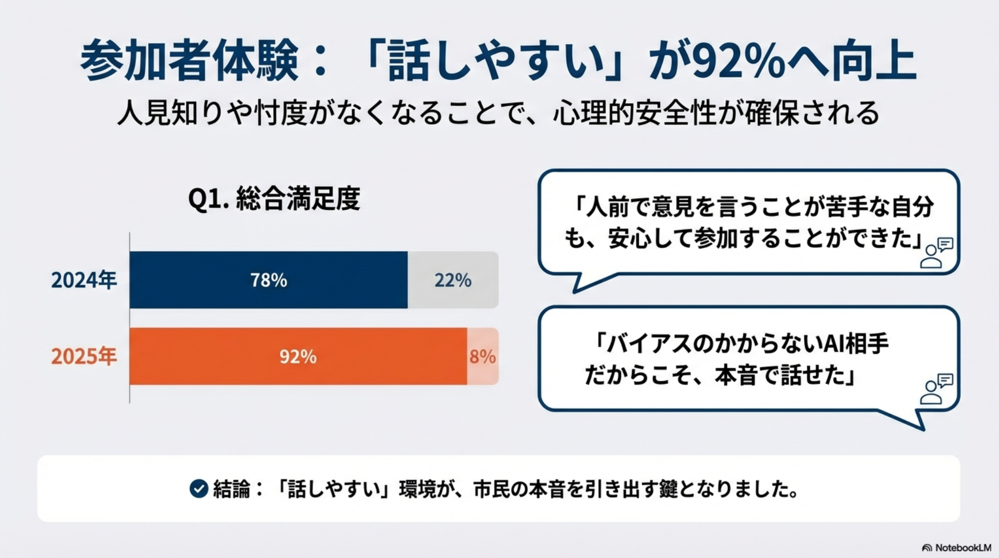

# 多元現実

高木俊輔（合同会社 多元現実 共同代表）

## はじめに

本稿では、日本のデジタル民主主義・Pluralityコミュニティの第一人者である高木俊輔・青山柊太朗らが立ち上げた、AI時代の新たな合意形成を設計する「多元現実」の支援実績について紹介します。特に、地方自治体における無作為抽出の住民会議での実装事例を中心に、ブロードリスニング技術がどのように対面会議の課題を解決しているかを説明します。
<!-- TODO: 事実関係の裏取り（設立年、主要メンバーの役職、会社概要）と一次情報の出典を追記する -->

## 多元現実の紹介

合同会社多元現実（代表者：高木俊輔・青山柊太朗）は、国内外のブロードリスニングに関する知見を実装するべく立ち上げられた、コンサルティング・ソフトウェア開発企業です。
<!-- TODO: 会社基本情報（設立年、所在地、従業員規模、事業領域）を箇条書きで簡潔に追記する -->

代表の青山柊太朗は、元々「デジタル民主主義2030」（DD2030）や「チームみらい」での活動を通じて、デジタル民主主義の実践に取り組んできました。その中で開発した「いどばた」などのツールは、オンライン対話の質を高める試みとして注目を集めました。もう一人の代表である高木俊輔は、スマートニュース メディア研究所 デジタル民主主義部門やPlurality Tokyoのメンバーとして、国内外のデジタル民主主義コミュニティに参画してきました。

私たちは、こうした活動を通じて、国内外におけるPluralityコミュニティに存在感を発揮し続けましたが、カンファレンスで言及されるようなアイディアと、実際に企業が投資できるソリューションとの間に大きな差分があることに悩んでいました。この本を執筆しているコミュニティである「デジタル民主主義2030」も素晴らしいコミュニティですが、最後までコミットメントを発揮し、責任を取る主体が必要だと感じました。「デジタル民主主義」という概念と、その実現に向けて人々がどのようにコミュニケーションを取るのかという知見を学んだ結果、それらを社会実装するために多元現実を創業しました。
<!-- TODO: 「カンファレンスのアイディア」と「投資可能なソリューション」のギャップを示す具体例（1〜2件）を追加する -->

顧客の現場に向き合い、必要とあれば枯れた技術も含めたあらゆる作業を厭わないというカスタマーサクセスこそが、日本にデジタル民主主義を定着させるのに必要だと信じています。

### 合意形成を世界で最後の問題と捉える

多元現実は、世界で最後の問題は「合意形成」であると考えています。木の棍棒で殴り合うことから始まり、領地問題において核兵器を使うことで人類の幕を閉じるかもしれません。これらはすべて、合意形成の失敗による課題です。

いくらテクノロジーが進化しても、人類における「認識のすり合わせ（合意形成）」、それらを介した『意思決定』という問題は残り続けます。多元現実は、人間の言葉を理解できる計算機であるLLMをベースに、現在の制度を作り替えることで、合意形成・意思決定の領域において、利害関係者全員がより利益を得られるような可能性を押し広げると信じています。

## 提供するソリューション

多元現実は、コンサルティングやソフトウェアプラットフォームの提供を通して、地方自治体における住民会議の現場や、企業において合意形成の手法を再設計しています。
<!-- TODO: 提供形態（SaaS/受託/伴走）と対象領域（自治体・企業・NPO）を具体名とともに補足する -->

私たちは、ありとあらゆる合意形成は以下のような構造を持つと考えています：

1. 参加者全員の利害を明確にする
2. それらを利害地図として同一のテーブルに置き、論点を抽出する
3. いくつかの選択肢を提示する（その際に、選択した場合の未来予想図を描く）
4. お互いにコミュニケーションを行い、妥協・行動変容を起こす
5. 意思決定を行う

これらを支えるためには、利害関係者を取り巻く制度・機関は、信頼できる中立性をもたらすものでなければなりません。特定の人を贔屓せず、透明性があり、シンプルで、非中央集権的で、違いを力に変えられるようなものが理想です。

多元現実が提供するソフトウェアプラットフォームは、AIを媒介させることで人間の認知能力を拡大させるものです。これらを組み合わせたコンサルティングサービスにより、ゼロから構築するよりも早く、一気通貫で設計・実装することが可能です。

### 倍速会議：AIによるアンケートとヒアリングの再設計

従来のアンケートと1対1のヒアリングは、トレードオフの両極端にありました。アンケートは多くの人に同じ質問しかできないstatic（静的）なものであり、1対1のヒアリングはそれぞれの人や背景に合わせた質問を動的に変えられますが、時間がかかります。意思決定者からすれば、時間がかからないアンケートと、時間がかかる1対1ヒアリングはトレードオフでした。

多元現実が提供する「倍速会議」は、AIをベースにアンケートやヒアリング、認識のすり合わせを再設計することで、このトレードオフを乗り越えます。

倍速会議は、青山が「いどばた」などのオンライン対話ツールを開発してきた経験をもとに、拡張熟議を実現するために設計されたツールです。拡張熟議とは、AIの力を借りて人間の熟議プロセスを拡張し、より多くの人が深い対話に参加できるようにする試みです。

倍速会議は、以下の機能を提供するAIアンケート・AIヒアリング・AIファシリテーション支援ツールです：

- **回答者の認識をすり合わせる**：参加者間の前提知識の差を可視化し、議論の出発点を揃える
- **回答の裏側にある微妙なニュアンスを把握する**：「各論賛成・総論反対」のような複雑な状況の解像度を上げる
- **言語化を支援する**：言語化できなかった自分の考え方について、AIとの対話を通じて明確にする

使い方は以下の通りです：

1. 「何を決めたいのか」を設定する
2. それについての背景情報を入力する
3. AIが質問を生成するので、その質問にそれぞれが回答する
4. AIが回答傾向をベースに、質問内容をそれぞれの意見を深掘りするべく変化させる
5. それぞれの回答者の認識をレポートとして表示する（合意点・相違点・誰もわかっていない点が含まれる）

このレポートをもとに意思決定者が判断することもできますし、認識の齟齬があれば参加者間で議論することも可能です。つまり、倍速会議はブロードリスニングそのものを実現するプラットフォームなのです。

<!-- TODO: ソフトウェアの主要機能（例：事前意見収集、論点抽出、議論可視化、レポート生成）を箇条書きで明示する -->

## 支援事例

### 構想日本との協働：無作為抽出会議の課題解決

多元現実のパートナー企業の一つに「構想日本」という会社があります。「自分ごと化会議」という名前で実施している無作為抽出の住民会議は、30年以上、全国156自治体で355回以上実施され、参加した住民はのべ1万2千人を超えます。
<!-- TODO: 数値（年数・自治体数・回数・参加者数）の出典を追記し、対象時点（例：2024年末時点）を明記する -->

多元現実は自治体と直接取引をしているわけではなく、構想日本を通じて自治体のフィールドで倍速会議などのツールが活用されています。構想日本が主催する住民会議において技術協力を提供することで、構想日本自体の業務効率化にも貢献しています。

第2章で言及されているように、無作為抽出会議を主催するコストと情報量はトレードオフの関係にありました。多元現実は、対面会議におけるデジタル民主主義技術の活用支援により、このトレードオフを押し上げることに成功しました。

#### 群馬県 太田市における実証

群馬県太田市では過去9年間、無作為抽出による「自分ごと化会議」を継続してきました。しかし、参加者の前提知識の差が大きく、すり合わせが難しいため、議論が深まらないという課題がありました。
<!-- TODO: 太田市での実施年度・テーマ・参加者規模を具体的に追記する -->

本取り組みは太田市が主催し、構想日本が協力して実施したもので、多元現実は技術協力としてAI支援を提供しました。

**無作為抽出会議における課題**

無作為抽出会議では、参加者間の前提知識や関心に大きなばらつきがあるため、以下のような課題が生じていました：

- **前提知識の非対称性：** 何が論点なのか共有されないまま議論が始まり、話が拡散してしまう
- **心理的安全性の不足：** 「的外れなことを言ったらどうしよう」という不安から、発言がためらわれる
- **議論の偏り：** 一部の知識がある人や、声の大きい人に発話が偏る

その結果、当たり障りのない表面的な感想会に終始し、議論が深まらないという問題がありました。

また、無作為抽出会議には以下のような本質的なトレードオフが存在していました：

- **議論の量 vs 質：** 多くの市民から意見を募ることと、一つの論点を深く掘り下げることの両立
- **参加者の多様性 vs 前提の非対称性：** 多様性を活かしつつ、知識や関心の差から生じる議論の停滞を克服すること
- **自由な討議 vs 政策への接続：** 市民の自由な意見表明を尊重しつつ、行政実務に活用可能な具体的情報へ落とし込むこと

**倍速会議による解決**

多元現実は、倍速会議というAIアンケート・AIファシリテーション支援ツールを活用することで、これらの課題に対処しました。倍速会議の特徴は、以下の通りです：
<!-- TODO: 倍速会議の位置づけ（プロダクト名/社内用語/一般名詞）と、利用フロー（事前→当日→事後）を図解または箇条書きで補足する -->

参加者は議論前に、AIが提示する質問にスマートフォンで回答します。その結果をAIが分析し、**合意点・相違点・誰も言及していない未知の論点**を取りまとめたレポートが生成されます。これにより、運営側も参加者も、議論の出発点を明確に認識した上で会議に臨めます。

**【議論冒頭】論点の共有**

ファシリテーターは事前レポートをスクリーンに投影し、今日特に議論すべき認識のズレを具体的に提示します。これにより、心理的安全性を確保しつつ、冒頭から本質的な議論に入ることが可能になります。漠然としたテーマから議論を始めるのではなく、データに基づいた明確な問いからスタートするため、議論の拡散を防ぎ、参加者の集中力を高めます。

**【議論中盤】深掘りと構造化**

倍速会議が議論を整理・可視化します。単なる意見の対立が、システム上では「AさんはXXに同意しているが、YYには反対している。これはどういうことか？」と新たな論点・質問として表示されます。これにより、参加者は誤った二項対立から脱却し、参加者本人の経験を語ることが容易になりました。ポストイットと模造紙では不可能だった、議論の構造的な関係性のリアルタイム把握が可能になりました。

**成果**

令和7年度の太田市「自分ごと化会議」では、以下のような成果が確認されました：
<!-- TODO: 成果の計測方法（誰が/どう測ったか）と比較対象（過去年度/他自治体）を明確にする -->

- **運営工数の削減：** 報告書ドラフトが従来の約1週間から約30秒で自動生成
- **アウトプットの質的転換：** 市民の意見が「一方的な要望」から「条件・根拠付きの具体的提案」へシフト
- **参加者体験の向上：** 声の大きい人に支配されがちな場から、口下手な人も安心して発言できる場へ変化

ある20代の女性参加者からは「倍速会議というシステムは大変画期的で、議論を進めやすかった。人前で意見を言うことが苦手な自分も安心して参加できた」という声が寄せられました。
<!-- TODO: 参加者コメントの引用元（アンケート/インタビュー）と使用許諾の有無を明記する -->

**ファシリテーターの声**

ファシリテーターである前田さんは、個人のfacebook投稿で以下のように述べています：
<!-- TODO: Facebook投稿の投稿日と引用許諾の確認を追記する（引用は短く） -->

> 全国初となるAIが論点を整理した上の合意形成の威力は抜群で、（多元現実のAIファシリテーション支援により）この度、私は参加者全員の想いを受け止めながら民主的にそれでいてロジカルに会議をすすめる力を手に入れました。全くもって他力なんですけどね。（笑）
>
> 何人もの話を同時に聞き分けたという聖徳太子はひょっとしたらAIをつかっていたのかもしれません。

この言葉が示すように、AIは人間の意思決定を代替するのではなく、その能力を拡張する存在として位置づけられました。AIが論点整理、構造化、可視化といった認知負荷の高い作業を担うことで、人間は情報処理から解放され、互いの意見の背景にある価値観を理解し合うような、より本質的な対話に集中できました。

**太田市での取り組みが示すこと**

太田市の事例が示すのは、**無作為抽出会議における最大の課題は「参加者間の前提知識の非対称性」であり、その解決には「議論前に認識を可視化し、論点を共有する」ことが有効**だということです。

倍速会議は、この課題に対して以下の方法で応えました：

1. **事前の認識可視化**により、参加者全員が「何が論点か」を理解した状態で議論を始められる
2. **合意点・相違点の明示**により、心理的安全性が確保され、発言のハードルが下がる
3. **議論の構造化**により、二項対立を超えて、より深い対話が可能になる

これは、第2章で述べた「規模と深さのトレードオフ」を、技術によって乗り越える試みです。無作為抽出という規模と代表性を保ちながら、倍速会議によって議論の深さも確保する。そして、そのプロセス全体を可視化することで、参加者・行政双方の納得感を高める。

太田市での取り組みは、無作為抽出会議の可能性を押し広げる、重要な一歩となりました。

#### 京都府与謝野町：総合計画策定に向けた住民会議の支援

京都府与謝野町では、令和7年度に「よさのみらい会議」が開催されました。この会議は、令和8年度で終了する「第2次与謝野町総合計画」に続く、「第3次与謝野町総合計画」の骨子を住民と共に作るための場です。人口減少や少子高齢化が進む中、行政だけで将来像を考えるのではなく、住民と正確な情報を共有し、対話を通じて10年後のまちの姿を描くことが目的でした。

参加者は、町内在住の16歳以上の住民から無作為に選ばれた5,000人に案内が送付され、応募者の中から選ばれました。会議は全4回（2025年9月〜12月）にわたって開催され、「しごとづくり」「くらしづくり」「ひとづくり」の3つのテーマに分かれて議論が行われました。構想日本が運営協力として全体の進行を担い、多元現実は技術協力としてAI支援を提供しました。

与謝野町の特徴は、議論の成果物を行政への提案書としてまとめるプロセスにおいて、倍速会議が大きな役割を果たした点です。各回の会議の文字起こしや参加者の意見提出シートを入力として、AIが提案書の素案を生成しました。これにより、住民の発言が「住民ができること」「地域ができること」「行政ができること」という構造化された提案に整理され、第3次総合計画の骨子として活用可能な形にまとめられました。

#### 大阪府東大阪市：地方創生ラウンドテーブルの支援

大阪府東大阪市では、令和7年度に「ひがしおおさか地方創生ラウンドテーブル」が全4回（2025年10月〜12月）にわたって開催されました。この取り組みは、構想日本が主催する「自分ごと化会議」の枠組みで実施され、地方創生に関する住民の意見を集約するものでした。

東大阪市では、倍速会議に加えて、公聴AI、いどばた（オンライン対話ツール）、NotebookLMなど、複数のAIツールを組み合わせた支援を行いました。特に「公聴AI」は、複数のグループディスカッションが同時に進行する場面で、会議の音声データを文字起こしし、AIが主要トピックを抽出・クラスタリングすることで、ファシリテーターの負担を軽減しました。

太田市での取り組みが「倍速会議による会議中のリアルタイム支援」に重点を置いたのに対し、東大阪市では「会議後のAIによる分析・集約」を中心としたアプローチが取られました。同じ構想日本との協働でありながら、各自治体の現場の状況やニーズに応じて、提供するソリューションの組み合わせを柔軟に変えている点も、多元現実のカスタマーサクセスの特徴です。

### DD2030におけるコアループプロジェクトでの活用

多元現実の倍速会議は、自治体の住民会議だけでなく、デジタル民主主義2030（DD2030）のプロジェクト内でも活用されています。DD2030の「コアループ」プロジェクトにおいて、政策議論の場で倍速会議が導入されました。

参加者からは、以下のような声が寄せられています。

> デジタル民主主義2030のプロジェクトが使った「倍速会議」のシステム、本当に感動した。本当に議論の深化のスピードが「倍速」になるのを感じた。単なるAI議事録だと、「話したことの整理」を「事後的」にやるだけになってしまうが、これはリアルタイムに動いてくれるおかげで、議論を整理・深化させるためにAIがつかえる。単なる議事メモ係の代替ではなく、ファシリも代替してくれる。

この声が示すように、倍速会議の価値は単なる議事録の自動化ではなく、議論のリアルタイムな構造化と深化にあります。AI議事録ツールが「事後的な整理」にとどまるのに対し、倍速会議は議論の最中に論点を可視化し、参加者が「今何について話しているのか」を常に把握できる環境を作ることで、議論そのものの質を引き上げています。

### 企業における活用：サイボウズでの「いどばた」導入

多元現実の取り組みは、自治体の住民会議にとどまりません。代表の青山が開発してきた「いどばた」は、大規模熟議ツールとして政治の分野で使われてきましたが、企業内の合意形成にも応用が広がっています。

サイボウズでは、「社内でのAI利用推進」をテーマに約50名が参加するワークショップが開催されました。サイボウズ・ラボの西尾泰和氏と青山が協力して社内専用環境を構築し、いどばたを企業の現場で初めて導入した事例です（詳しくは第9章を参照）。

このワークショップでは、まず従来型の付箋ワークを行い、その限界を体感した上で、いどばたによるAI対話を実施しました。参加者がAIと1対1でチャットし、自分の経験や不安を打ち込むと、AIが共通点と相違点を整理して「論点地図」を生成します。約50名の意見が5分で6つの重要論点に構造化されました。従来の会議形式で同じことを行おうとすると4時間はかかるとされ、その効率化の効果は顕著でした。

この事例が示すのは、ブロードリスニングの技術が「市民と行政」の間だけでなく、「社員と経営」の間でも有効であるということです。組織内の意思決定において、声の大きい人に引っ張られず、全員の本音を守ったまま論点を可視化し、議論すべきポイントに時間を集中させる。多元現実が掲げる「合意形成の再設計」は、公共政策と企業経営の双方に共通する課題に対して、同じ設計思想で応えています。

## まとめ

多元現実は、国内外のブロードリスニングに関する知見を実装し、自治体の住民会議から企業内の意思決定まで、あらゆる合意形成の現場における課題解決に取り組んでいます。

倍速会議やいどばたを中心としたAI支援により、参加者の前提知識の非対称性という課題を克服し、議論の土台を作ることに成功しました。これにより、無作為抽出がもたらす代表性を保ちながら、議論の深さも確保するという、従来のトレードオフを押し上げることが可能になりました。

今後も、合意形成という人類にとって最後の問題に対し、LLMをベースとした新たなアプローチで可能性を押し広げていきます。
