# 多元現実

高木俊輔（合同会社 多元現実 共同代表）

## はじめに

本稿では、日本のデジタル民主主義・Pluralityコミュニティの第一人者である高木俊輔・青山柊太朗らが立ち上げた、AI時代の新たな合意形成を設計する「多元現実」について紹介します。その理念・ソリューション・支援実績を通じて、ブロードリスニング技術がどのように合意形成の現場を変えているかを説明します。
<!-- TODO: 事実関係の裏取り（設立年、主要メンバーの役職、会社概要）と一次情報の出典を追記する -->

## 多元現実の紹介

[合同会社 多元現実](https://www.plural-reality.com/)（代表者：高木俊輔・青山柊太朗）は、国内外のブロードリスニングに関する知見を実装するべく立ち上げられた、コンサルティング・ソフトウェア開発企業です。
<!-- TODO: 会社基本情報（設立年、所在地、従業員規模、事業領域）を箇条書きで簡潔に追記する -->

代表の青山柊太朗は、元々「デジタル民主主義2030」（DD2030）や「チームみらい」での活動を通じて、デジタル民主主義の実践に取り組んできました。その中で開発した「いどばた」などのツールは、オンライン対話の質を高める試みとして注目を集めました。もう一人の代表である高木俊輔は、スマートニュース メディア研究所 デジタル民主主義部門やPlurality Tokyoのメンバーとして、国内外のデジタル民主主義コミュニティに参画してきました。

私たちは、こうした活動を通じて、国内外におけるPluralityコミュニティに存在感を発揮し続けましたが、カンファレンスで言及されるようなアイディアと、実際に企業が投資できるソリューションとの間に大きな差分があることに悩んでいました。この本を執筆しているコミュニティである「デジタル民主主義2030」も素晴らしいコミュニティですが、最後までコミットメントを発揮し、責任を取る主体が必要だと感じました。「デジタル民主主義」という概念と、その実現に向けて人々がどのようにコミュニケーションを取るのかという知見を学んだ結果、それらを社会実装するために多元現実を創業しました。
<!-- TODO: 「カンファレンスのアイディア」と「投資可能なソリューション」のギャップを示す具体例（1〜2件）を追加する -->

顧客の現場に向き合い、必要とあれば枯れた技術も含めたあらゆる作業を厭わないというカスタマーサクセスこそが、日本にデジタル民主主義を定着させるのに必要だと信じています。

### 合意形成を世界で最後の問題と捉える

多元現実は、世界で最後の問題は「合意形成」であると考えています。木の棍棒で殴り合うことから始まり、領地問題において核兵器を使うことで人類の幕を閉じるかもしれません。これらはすべて、合意形成の失敗による課題です。

いくらテクノロジーが進化しても、人類における「認識のすり合わせ（合意形成）」、それらを介した『意思決定』という問題は残り続けます。多元現実は、人間の言葉を理解できる計算機であるLLMをベースに、現在の制度を作り替えることで、合意形成・意思決定の領域において、利害関係者全員がより利益を得られるような可能性を押し広げると信じています。

## 提供するソリューション

多元現実は、コンサルティングやソフトウェアプラットフォームの提供を通して、地方自治体における住民会議の現場や、企業において合意形成の手法を再設計しています。
<!-- TODO: 提供形態（SaaS/受託/伴走）と対象領域（自治体・企業・NPO）を具体名とともに補足する -->

私たちは、ありとあらゆる合意形成は以下のような構造を持つと考えています：

1. 参加者全員の利害を明確にする
2. それらを利害地図として同一のテーブルに置き、論点を抽出する
3. いくつかの選択肢を提示する（その際に、選択した場合の未来予想図を描く）
4. お互いにコミュニケーションを行い、妥協・行動変容を起こす
5. 意思決定を行う

これらを支えるためには、利害関係者を取り巻く制度・機関は、信頼できる中立性をもたらすものでなければなりません。特定の人を贔屓せず、透明性があり、シンプルで、非中央集権的で、違いを力に変えられるようなものが理想です。

多元現実が提供するソフトウェアプラットフォームは、AIを媒介させることで人間の認知能力を拡大させるものです。これらを組み合わせたコンサルティングサービスにより、ゼロから構築するよりも早く、一気通貫で設計・実装することが可能です。

### 倍速会議：AIによるアンケートとヒアリングの再設計

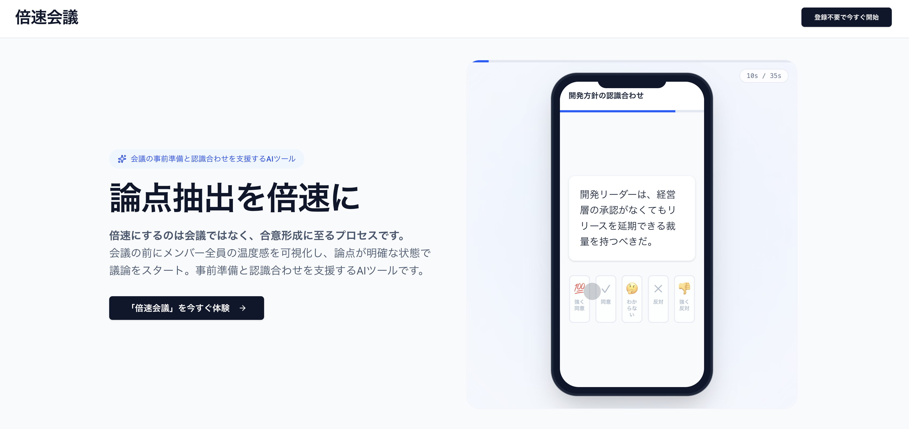

従来のアンケートと1対1のヒアリングは、トレードオフの両極端にありました。アンケートは多くの人に同じ質問しかできないstatic（静的）なものであり、1対1のヒアリングはそれぞれの人や背景に合わせた質問を動的に変えられますが、時間がかかります。意思決定者からすれば、時間がかからないアンケートと、時間がかかる1対1ヒアリングはトレードオフでした。

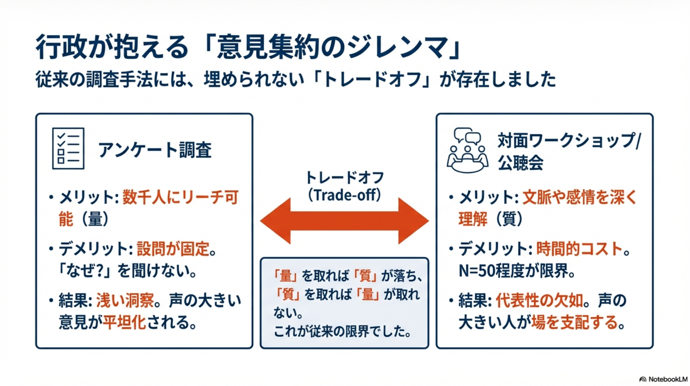

多元現実が提供する「[倍速会議](https://baisoku-kaigi.com/)」は、AIをベースにアンケートやヒアリング、認識のすり合わせを再設計することで、このトレードオフを乗り越えます。

倍速会議は、青山が「いどばた」などのオンライン対話ツールを開発してきた経験をもとに、拡張熟議を実現するために設計されたツールです。拡張熟議とは、AIの力を借りて人間の熟議プロセスを拡張し、より多くの人が深い対話に参加できるようにする試みです。

倍速会議は、以下の機能を提供するAIアンケート・AIヒアリング・AIファシリテーション支援ツールです：

- **回答者の認識をすり合わせる**：参加者間の前提知識の差を可視化し、議論の出発点を揃える
- **回答の裏側にある微妙なニュアンスを把握する**：「各論賛成・総論反対」のような複雑な状況の解像度を上げる
- **言語化を支援する**：言語化できなかった自分の考え方について、AIとの対話を通じて明確にする

使い方は以下の通りです：

1. 「何を決めたいのか」を設定する
2. それについての背景情報を入力する
3. AIが質問を生成するので、その質問にそれぞれが回答する
4. AIが回答傾向をベースに、質問内容をそれぞれの意見を深掘りするべく変化させる
5. それぞれの回答者の認識をレポートとして表示する（合意点・相違点・誰もわかっていない点が含まれる）

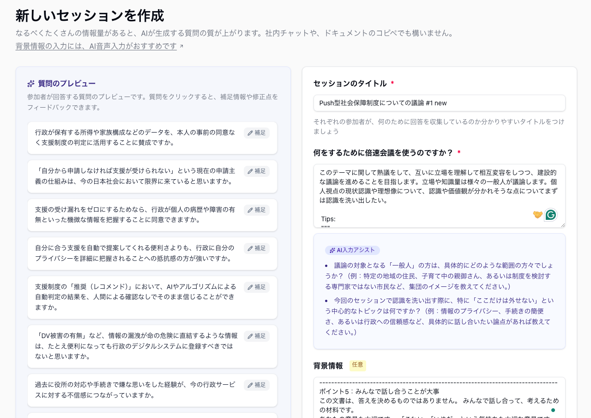

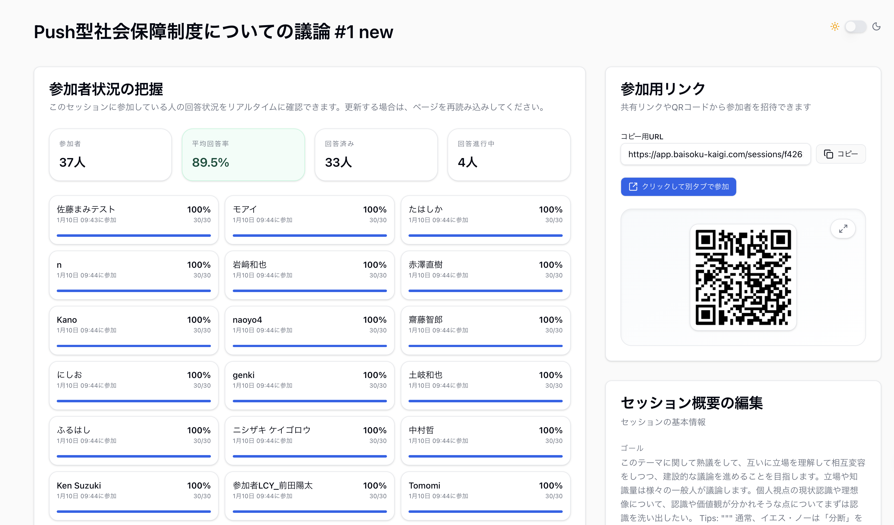

このレポートをもとに意思決定者が判断することもできますし、認識の齟齬があれば参加者間で議論することも可能です。つまり、倍速会議はブロードリスニングそのものを実現するプラットフォームなのです。

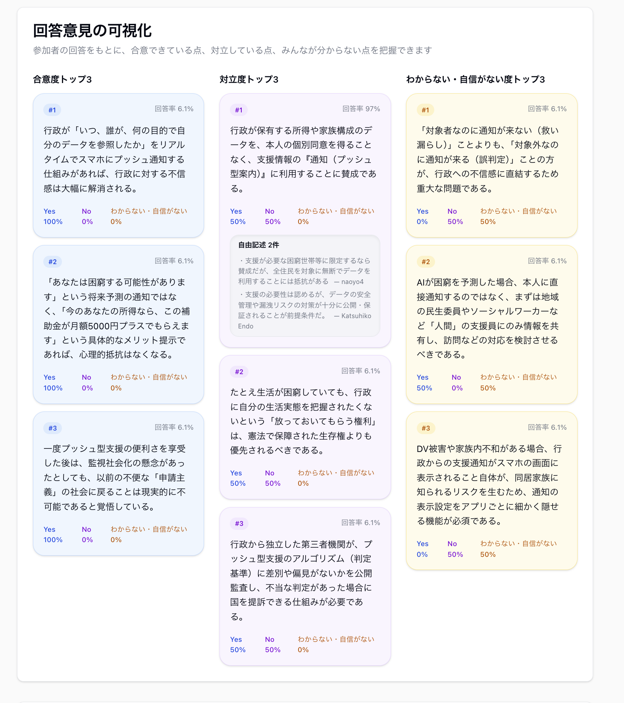

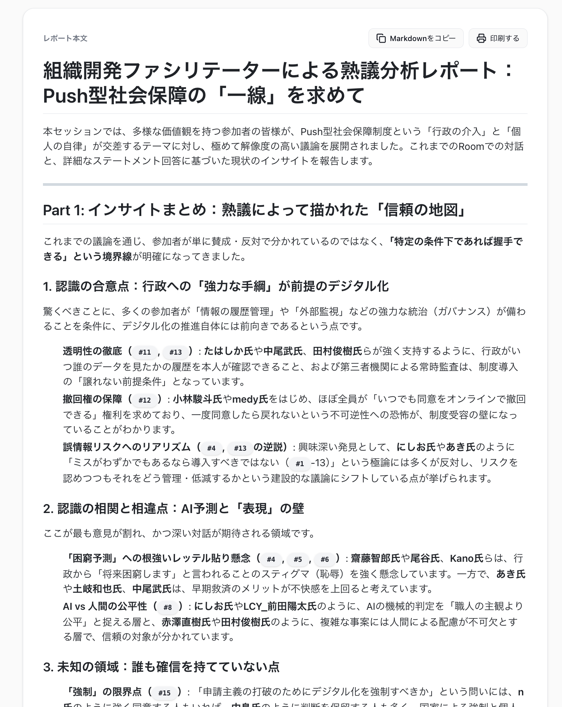

## 支援事例

### 構想日本との協働：無作為抽出会議の課題解決

多元現実のパートナー企業の一つに「構想日本」という会社があります。「自分ごと化会議」という名前で実施している無作為抽出の住民会議は、30年以上、全国156自治体で355回以上実施され、参加した住民はのべ1万2千人を超えます。
<!-- TODO: 数値（年数・自治体数・回数・参加者数）の出典を追記し、対象時点（例：2024年末時点）を明記する -->

多元現実は自治体と直接取引をしているわけではなく、構想日本を通じて自治体のフィールドで倍速会議などのツールが活用されています。構想日本が主催する住民会議において技術協力を提供することで、構想日本自体の業務効率化にも貢献しています。

第2章で言及されているように、無作為抽出会議を主催するコストと情報量はトレードオフの関係にありました。多元現実は、対面会議におけるデジタル民主主義技術の活用支援により、このトレードオフを押し上げることに成功しました。

群馬県太田市における「自分ごと化会議」への倍速会議導入については、第8章で詳しく紹介しています。

#### 京都府与謝野町：総合計画策定に向けた住民会議の支援

京都府与謝野町では、令和7年度に「よさのみらい会議」が開催されました。この会議は、令和8年度で終了する「第2次与謝野町総合計画」に続く、「第3次与謝野町総合計画」の骨子を住民と共に作るための場です。人口減少や少子高齢化が進む中、行政だけで将来像を考えるのではなく、住民と正確な情報を共有し、対話を通じて10年後のまちの姿を描くことが目的でした。

参加者は、町内在住の16歳以上の住民から無作為に選ばれた5,000人に案内が送付され、応募者の中から選ばれました。会議は全4回（2025年9月〜12月）にわたって開催され、「しごとづくり」「くらしづくり」「ひとづくり」の3つのテーマに分かれて議論が行われました。構想日本が運営協力として全体の進行を担い、多元現実は技術協力としてAI支援を提供しました。

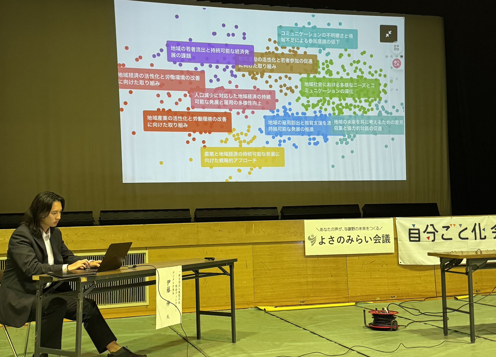

与謝野町の特徴は、議論の成果物を行政への提案書としてまとめるプロセスにおいて、倍速会議が大きな役割を果たした点です。各回の会議の文字起こしや参加者の意見提出シートを入力として、AIが提案書の素案を生成しました。これにより、住民の発言が「住民ができること」「地域ができること」「行政ができること」という構造化された提案に整理され、第3次総合計画の骨子として活用可能な形にまとめられました。

また、会議で集まった意見は広聴AIによって分析・可視化されました。2025年10月13日に開催された第2回「しごとづくり班」では、384件のコメントから415件の意見が抽出され、7つの大トピック・49のサブトピックに構造化されました。「地域活性化と多様なアプローチによる雇用促進と住民参加の推進」（97件）や「地域特性と産業構造による雇用機会と労働環境の制約」（82件）など、地域の実態に即した論点が浮かび上がりました。

#### 大阪府東大阪市：地方創生ラウンドテーブルの支援

大阪府東大阪市では、令和7年度に「ひがしおおさか地方創生ラウンドテーブル」が全4回（2025年10月〜12月）にわたって開催されました。この取り組みは、構想日本が主催する「自分ごと化会議」の枠組みで実施され、地方創生に関する住民の意見を集約するものでした。

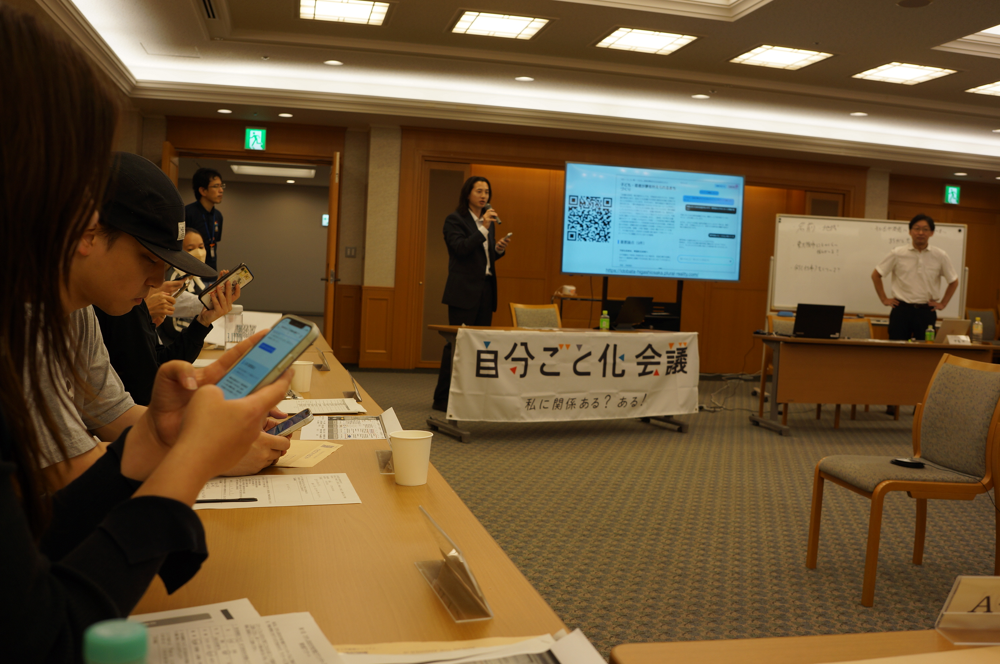

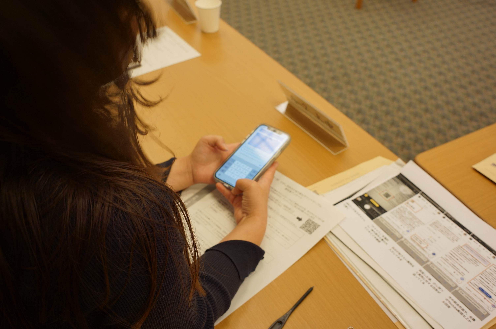

東大阪市では、倍速会議に加えて、公聴AI、いどばた（オンライン対話ツール）、NotebookLMなど、複数のAIツールを組み合わせた支援を行いました。特に「公聴AI」は、複数のグループディスカッションが同時に進行する場面で、会議の音声データを文字起こしし、AIが主要トピックを抽出・クラスタリングすることで、ファシリテーターの負担を軽減しました。

また、「いどばた」は会議後の継続的な意見収集の場として活用されました。「東大阪 自分ごと化会議 AI議論スペース」として開設されたオンラインプラットフォームでは、「子ども・若者が夢を叶えられるまちづくり」をテーマに、会議に参加できなかった市民も含めて意見を寄せることができました。

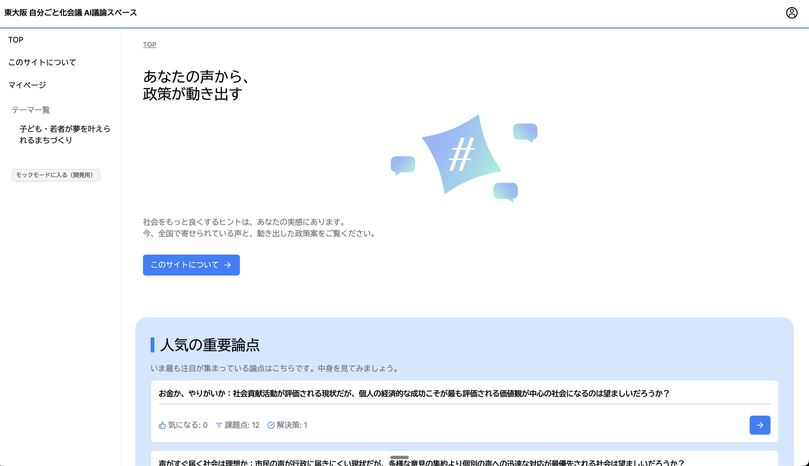

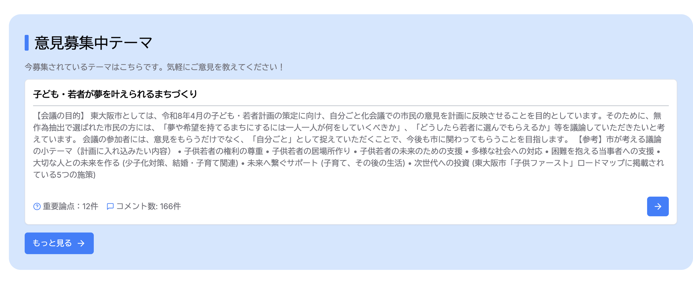

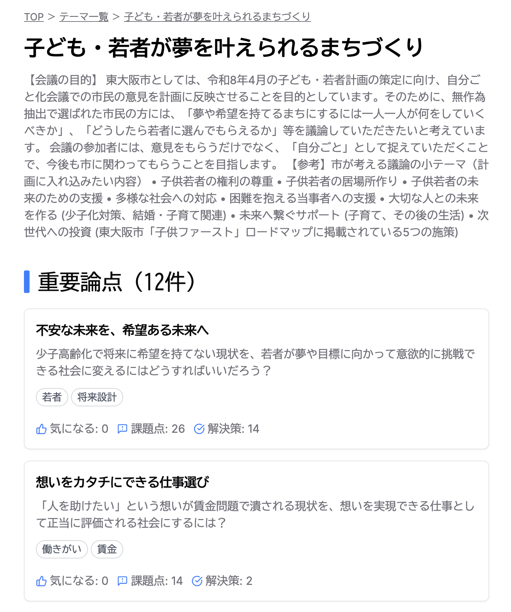

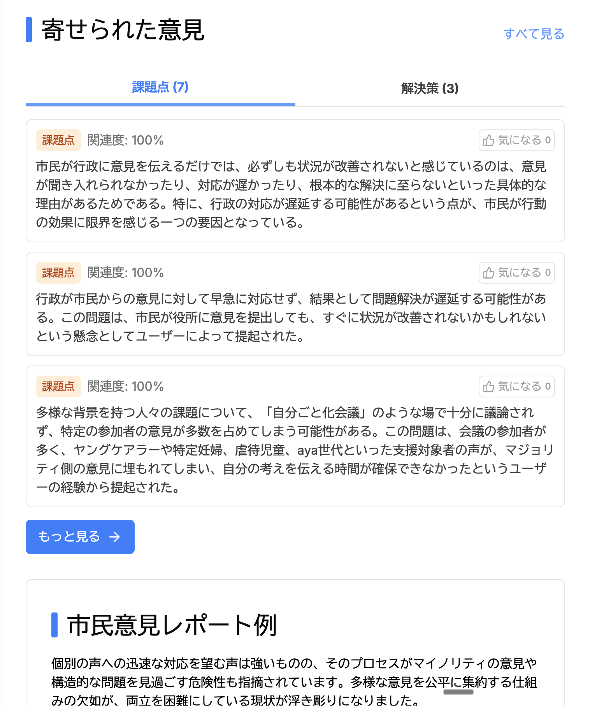

太田市での取り組みが「倍速会議による会議中のリアルタイム支援」に重点を置いたのに対し、東大阪市では「会議後のAIによる分析・集約」に加え、いどばたを通じた継続的な市民参加の場を提供するアプローチが取られました。同じ構想日本との協働でありながら、各自治体の現場の状況やニーズに応じて、提供するソリューションの組み合わせを柔軟に変えている点も、多元現実のカスタマーサクセスの特徴です。

### DD2030におけるコアループプロジェクトでの活用

多元現実の倍速会議は、自治体の住民会議だけでなく、デジタル民主主義2030（DD2030）のプロジェクト内でも活用されています。DD2030の「コアループ」プロジェクトにおいて、政策議論の場で倍速会議が導入されました。

コアループプロジェクトでは、「Push型社会保障制度」をテーマに、行政が保有するデータを活用して支援を必要とする人に能動的に通知する仕組みの是非について議論が行われました。参加者はスマートフォンから倍速会議にアクセスし、「行政が保有する所得や家族構成のデータを、本人の個別同意を得ることなく、支援情報の『通知（プッシュ型案内）』に利用することに賛成である。」といった意見に対して5段階で賛否を表明しました。

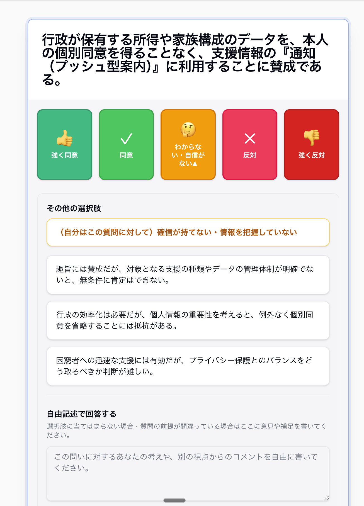

回答が完了すると、参加者一人ひとりに「じぶんレポート（熟議に向けた自己理解レポート）」が生成されます。このレポートは、自分の回答傾向を他の参加者との比較の中で位置づけ、どの論点で多数派に属し、どの論点で少数派に属するかを可視化するものです。参加者は議論に入る前に自分自身の立ち位置を客観的に把握でき、「自分がなぜそう考えるのか」を言語化する助けとなります。

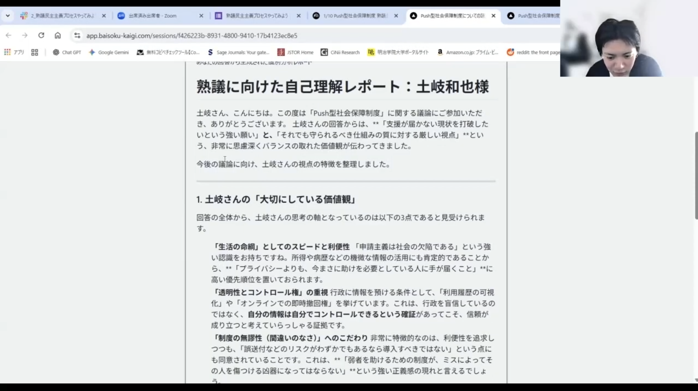

回答結果はリアルタイムに分析され、参加者間で合意が形成されている論点、対立が生じている論点、そして誰も確信を持てていない未知の領域が可視化されました。

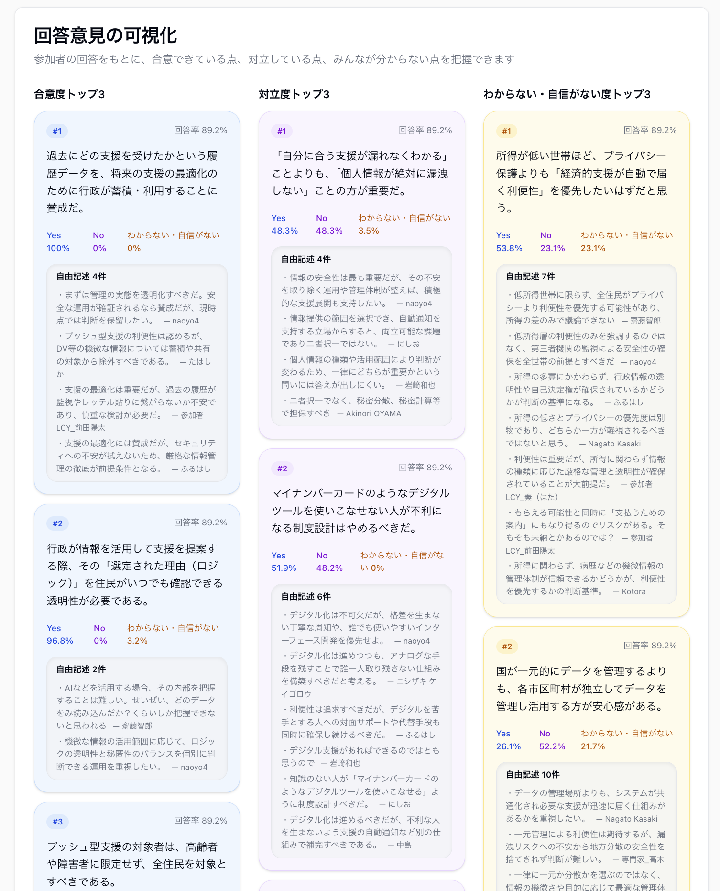

参加者からは、以下のような声が寄せられています。

> デジタル民主主義2030のプロジェクトが使った「倍速会議」のシステム、本当に感動した。本当に議論の深化のスピードが「倍速」になるのを感じた。単なるAI議事録だと、「話したことの整理」を「事後的」にやるだけになってしまうが、これはリアルタイムに動いてくれるおかげで、議論を整理・深化させるためにAIがつかえる。単なる議事メモ係の代替ではなく、ファシリも代替してくれる。

この声が示すように、倍速会議の価値は単なる議事録の自動化ではなく、議論のリアルタイムな構造化と深化にあります。AI議事録ツールが「事後的な整理」にとどまるのに対し、倍速会議は議論の最中に論点を可視化し、参加者が「今何について話しているのか」を常に把握できる環境を作ることで、議論そのものの質を引き上げています。

集まった75件の意見と1,593票の投票データは、Sensemakerによって6つの大トピックと21のサブトピックに構造化・分析されました。

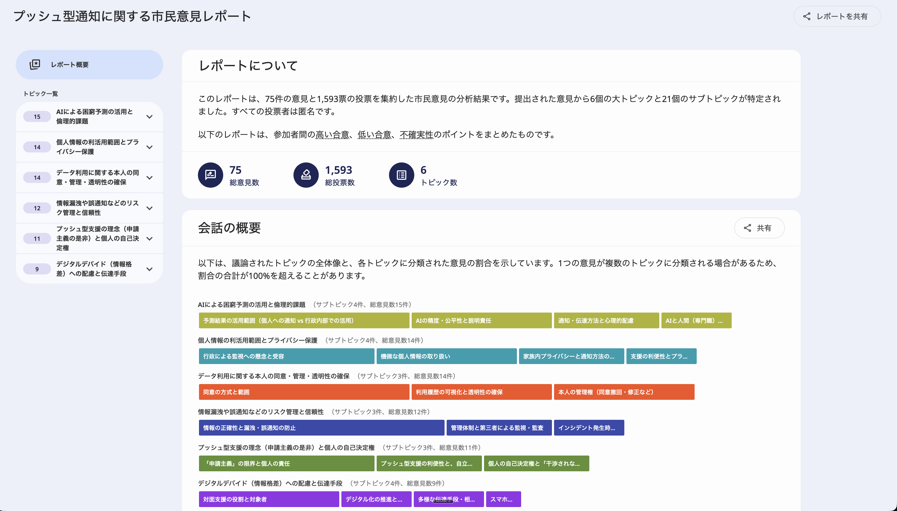

### 企業における活用：サイボウズでの「いどばた」導入

多元現実の取り組みは、自治体の住民会議にとどまりません。代表の青山が開発してきた「いどばた」は、大規模熟議ツールとして政治の分野で使われてきましたが、企業内の合意形成にも応用が広がっています。

サイボウズでは、2025年8月に「社内でのAI利用推進」をテーマに約50名が参加するワークショップが開催されました。サイボウズ・ラボの西尾泰和氏と青山が協力して社内専用環境を構築し、いどばたを企業の現場で初めて導入した事例です（詳しくは第9章を参照）。参加者は東京オフィスでの対面とオンラインのハイブリッド形式で、情報システム、カスタマー、営業、開発、人事など多様な部署から集まりました。

このワークショップは、従来型の付箋ワークの限界を体感した上で、いどばたによるAI対話を体験するという二段構成で設計されました。

まず前半では、5人グループに分かれて模造紙と付箋による従来型のワークを実施しました。参加者が「社内でのAI利用」について感じている「モヤモヤ」を付箋に書き出し、グループごとに整理を試みます。しかし、15分という制約の中で約50名分の意見を構造化することは難しく、多くのグループが結論を出せないまま時間切れとなりました。

続く後半では、いどばたによるAI対話を実施しました。参加者は各自のPCでいどばたにアクセスし、AIと1対1のチャット形式で自分の経験や不安を打ち込みます。AIが「最近の業務でAIについて、印象に残ったことを教えてほしい」といった質問を投げかけ、回答に応じて深掘りしていきます。ある参加者は「他の人から直接見られないなら書きやすいですね。AIなら気を遣わなくていいし」と語っており、対面では言いにくい本音をAIに打ち明けられることが、いどばたの大きな強みです。

わずか5分のAI対話で、約50名の意見が6つの重要論点に構造化されました。「入力基準の曖昧さと不安を解消」（課題点185件、解決策64件）、「使い方不明と学び停滞を乗り越える」（課題点267件、解決策86件）、「分散ツールで滞る業務の巡りを良く」など、社員が感じている課題の全体像が一覧化されました。

西尾氏は「いどばたシステムの大きな特徴は、発言ハードルの低さです。AIとの対話形式なので、『会場の空気』や『個人の声の大きさ』に左右されない」と評価しています。従来の会議形式で同じことを行おうとすると4時間はかかるとされ、その効率化の効果は顕著でした。青山は「企業の現場で使うのは今回がはじめて。異なる背景を持つ人同士が互いの考えを理解したり、直接コミュニケーションしたりする機会を増やしたい」と開発動機を語っています。

この事例が示すのは、ブロードリスニングの技術が「市民と行政」の間だけでなく、「社員と経営」の間でも有効であるということです。組織内の意思決定において、声の大きい人に引っ張られず、全員の本音を守ったまま論点を可視化し、議論すべきポイントに時間を集中させる。多元現実が掲げる「合意形成の再設計」は、公共政策と企業経営の双方に共通する課題に対して、同じ設計思想で応えています。

## まとめ

多元現実は、国内外のブロードリスニングに関する知見を実装し、自治体の住民会議から企業内の意思決定まで、あらゆる合意形成の現場における課題解決に取り組んでいます。

倍速会議やいどばたを中心としたAI支援により、参加者の前提知識の非対称性という課題を克服し、議論の土台を作ることに成功しました。これにより、無作為抽出がもたらす代表性を保ちながら、議論の深さも確保するという、従来のトレードオフを押し上げることが可能になりました。

今後も、合意形成という人類にとって最後の問題に対し、LLMをベースとした新たなアプローチで可能性を押し広げていきます。
