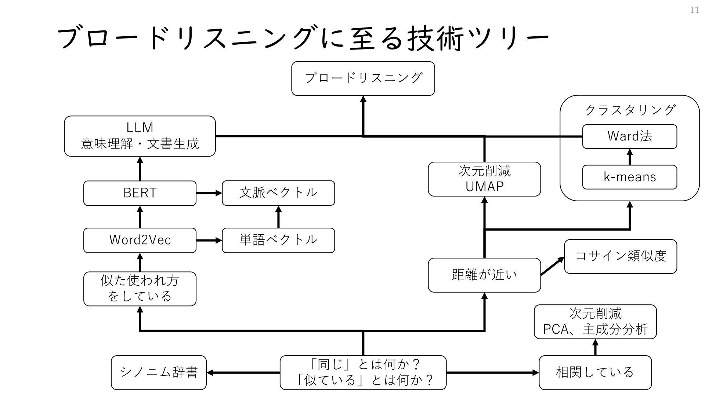
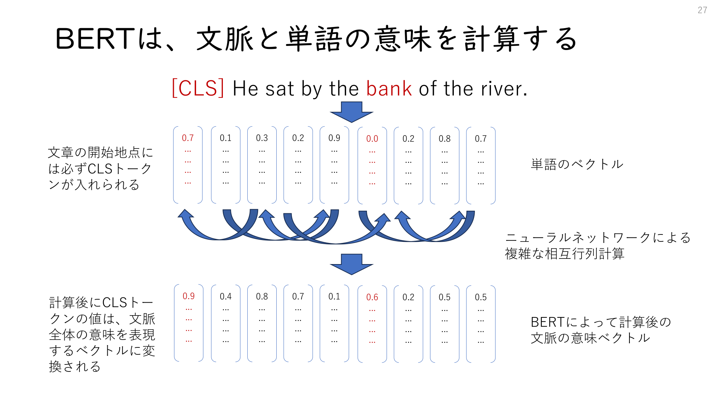
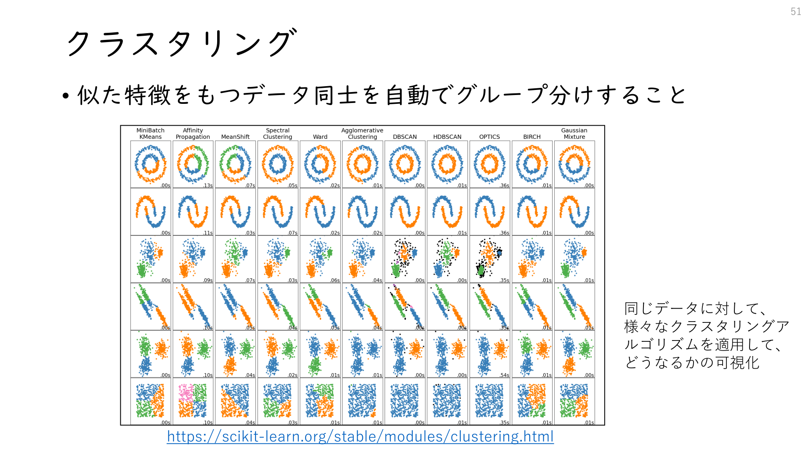
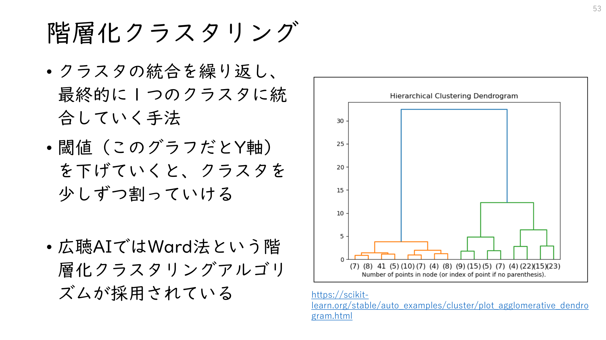
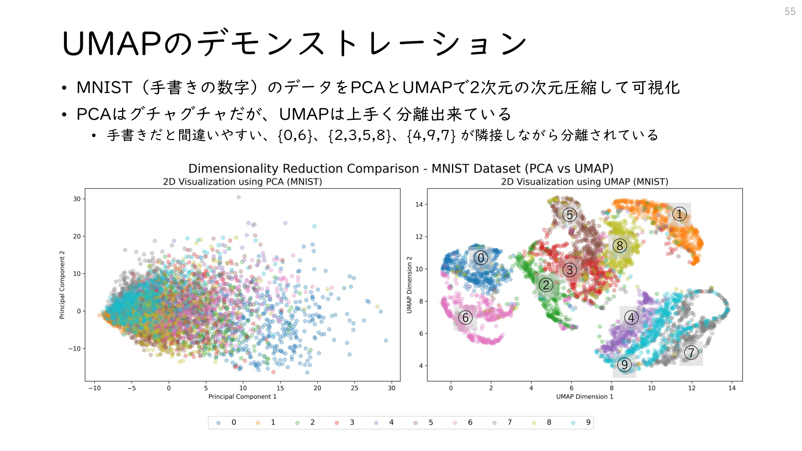

# 第11章 広聴AI要素技術解説

本章では、広聴AIを支える基盤技術について解説する。広聴AIは複数の先端技術を組み合わせることで実現されている。データサイエンスの素養がないプログラマーでも理解できるよう、各技術が「何をインプットして、どのようなアウトプットを行い、何に使えるのか」という水準で説明していく。

## 11.1 広聴AIに至る技術ツリー

広聴AIは、ここ10年ほどの間に登場した複数の技術を組み合わせることで実現されている。どれか一つが欠けても成り立たない。主要な構成技術とその登場年を見てみよう。

- **UMAP**（2018年）：高次元データを2次元に圧縮し、人間が見られる形に可視化する
- **BERT**（2018年）：文脈を考慮して、文章の「意味」をベクトル（数値の配列）に変換する
- **LLM**（2020年〜）：大規模言語モデル。GPT-3は2020年、ChatGPTは2022年11月に登場

これらの技術が出揃ったのは、ほんの数年前のことだ。つまり広聴AIは、技術的に「やっと可能になった」ばかりの新しい手法なのである。



上の図は、広聴AIに至る技術の系譜を示している。この図を見ると、一つの問いが長年にわたって追求されてきたことがわかる。その問いとは、「コンピュータに『同じ』『似ている』をどう理解させるか」である。

左側の流れを見てほしい。シノニム辞書（同義語辞書）から始まり、Word2Vec、BERTへと発展し、最終的にLLMによる意味理解・文章生成へとつながっている。これは「言葉の意味をコンピュータに理解させる」という挑戦の歴史だ。

一方、右側にはクラスタリングや次元圧縮といった統計的手法がある。これらは「似ているものを集める」「高次元のデータを人間が見られる形にする」という技術である。

この二つの流れが、コサイン類似度という「ベクトル間の距離を測る」概念を介して合流する。言葉を数値（ベクトル）に変換し、その距離を測り、近いものを集めて可視化する——これが広聴AIの基本的な仕組みである。

以降の節では、これらの技術を一つずつ解説していく。

## 11.2 コンピュータにおける「同じ」とは何か

広聴AIの技術を理解するために、まずコンピュータが「言葉」をどのように扱っているかを知る必要がある。人間にとって当たり前の「同じ意味」という概念が、コンピュータにとってはまったく自明ではないのだ。

### 文字は数値である

コンピュータの中では、文字はすべて数値として扱われている。私たちが画面上で「あ」や「A」という文字を見ているとき、コンピュータの内部ではそれらは特定の数値として処理されている。

試しにPythonで「デジタル民主主義」という文字列を数値に変換してみよう。

```python
>>> [c for c in "デジタル民主主義".encode("utf-8")]
[227, 131, 135, 227, 130, 184, 227, 130, 191, 227, 131, 171, 230, 176,
 145, 228, 184, 187, 228, 184, 187, 231, 190, 169]
```

「デジタル民主主義」という8文字の文字列が、24個の数値の配列に変換された。UTF-8というエンコーディング方式では、日本語の1文字は通常3バイト（3つの数値）で表現される。「デ」は[227, 131, 135]、「ジ」は[227, 130, 184]という具合だ。

私たちが文字として認識しているものは、コンピュータにとっては単なる数値の並びに過ぎない。この事実が、次に述べる問題の根源となる。

### 「猫」と「ねこ」問題

人間にとって「猫」と「ねこ」は同じものを指している。漢字で書こうがひらがなで書こうが、四本足でにゃーと鳴くあの動物のことだ。しかし、コンピュータにとってこれらはまったく別のものである。

```python
"猫".encode("utf-8").hex()    # => 'e78cab'
"ねこ".encode("utf-8").hex()  # => 'e381ade38193'
```

「猫」は`0xE78CAB`、「ねこ」は`0xE381ADE38193`という数値になる。この2つの数値は似ているだろうか？　まったく似ていない。コンピュータから見れば、「猫」と「ねこ」は「猫」と「机」くらい違うものなのだ。

では、どうすればコンピュータに「猫」と「ねこ」が同じものだと理解させることができるのだろうか。

この問題は日本語に限った話ではない。英語でも「color」と「colour」（アメリカ英語とイギリス英語の違い）、「organize」と「organise」のようなスペルの揺れがある。さらに厄介なのは、「car」と「automobile」のように、綴りがまったく異なるのに同じ意味を持つ単語の存在だ。

人間なら文脈から「ああ、同じことを言っているな」と理解できる。しかしコンピュータにとっては、文字列が違えば別物である。この「意味の同一性」をコンピュータにどう理解させるか——これが自然言語処理という分野が長年取り組んできた根本的な課題であり、広聴AIを実現するための出発点でもある。

### シノニム（同義語）辞書による解決とその限界

この問題に対する従来のアプローチは、同義語の対応表（シノニム辞書）を人力で整備することだった。「パソコン」と「PC」、「自動車」と「車」と「クルマ」と「カー」、「携帯電話」と「スマートフォン」と「スマホ」といった対応関係を、一つひとつ辞書に登録していく地道な作業である。

日本語の場合、漢字の開き（「猫」と「ねこ」）やカタカナ表記（「ネコ」）程度であれば機械的な変換も可能だが、意味に基づく同義語の対応は人間が判断するしかなかった。2010年頃までは、検索エンジンや自然言語処理システムの開発において、このシノニム辞書の整備が重要な作業として位置づけられていた。検索精度を上げるために、専門のチームが膨大な時間をかけて同義語を収集・登録していたのである。

しかし、人力での辞書整備には本質的な限界があった。

まず、網羅性の問題がある。新しい言葉は日々生まれている。「インスタ映え」「バズる」「推し活」といった新語、業界特有の専門用語、さらには若者言葉やネットスラングまで含めると、すべてを網羅することは現実的に不可能である。辞書を整備している間にも、新しい言葉が次々と生まれてくる。

次に、文脈を無視してしまう問題がある。「ネコ」は通常は動物を指すが、建設現場では一輪車のことを「ネコ」と呼ぶ。「Apple」は果物かもしれないし、IT企業かもしれない。「クラウド」は雲なのか、クラウドコンピューティングなのか。単純な対応表では、こうした文脈による意味の違いを捉えることができない。同義語辞書に「Apple＝りんご」と登録してしまうと、「AppleがiPhoneを発表した」という文章を正しく処理できなくなってしまう。

そして、スケーラビリティの問題がある。シノニム辞書は言語ごとに整備する必要があり、多言語対応には膨大なコストがかかる。英語、日本語、中国語、フランス語……と対応言語を増やすたびに、ゼロから辞書を構築しなければならない。しかも言語間で概念が一対一に対応するとは限らない。日本語の「木漏れ日」に相当する英単語は存在しないし、ドイツ語の「Schadenfreude（他人の不幸を喜ぶ感情）」を日本語の一語で表すことはできない。

こうした限界から、「同義語の判定を機械に任せたい」という要求が自然と生まれた。人間が一つひとつ対応関係を教えるのではなく、大量のテキストデータから機械が自動的に「似ている言葉」を学習できないか——この課題を解決するために登場したのが、次節で紹介するWord2Vecである。

## 11.3 テキストのベクトル化：Word2VecからBERTへ

### Word2Vecの登場（2013年）

Word2Vecは、「同じような前後文脈で使われ方をしている単語は、同じような意味なのだろう」という考え方に基づくアルゴリズムである。この考え方は言語学では「分布仮説（distributional hypothesis）」と呼ばれ、1950年代から提唱されていた。Word2Vecはこの仮説を大規模データと機械学習で実現したものである。標準的な実装では、対象の単語の前後5単語を参照して意味を推定する。

例えば、大量のテキストを分析すると、「○○を飼っている」「○○が膝の上で丸くなった」「○○がにゃーと鳴いた」といった文脈では、○○に「猫」「ねこ」「ネコ」のいずれも入りうることがわかる。同じような文脈で使われているなら、これらは同じ意味なのだろう——Word2Vecはこの推論を数学的に行う。

さらに、「○○を散歩に連れて行く」「○○に餌をあげる」「○○を動物病院に連れて行く」といった文脈を見ると、ここには「猫」だけでなく「犬」「うさぎ」なども入りうる。こうして「猫」「犬」「うさぎ」はペットという近い概念だと学習される。一方、「○○を運転する」「○○に乗り込む」といった文脈には「車」「バス」「タクシー」が入る。文脈パターンが異なるので、「猫」と「車」は遠い概念として配置される。

Word2Vecの画期的な点は、人間が明示的に「『猫』と『ねこ』は同じ」と教えなくても、大量のテキストデータから自動的にその関係性を学習できることだった。Googleが開発し、2013年に論文が公開されると、自然言語処理の分野に革命をもたらした。

単語の「同じ」や「近しい」を数学的に表現するにはどうしたらいいだろうか。Word2Vecのアプローチは、単語を多次元上の点だと考え、その点の間の距離を考えることである。同じような使われ方をしている単語は、近しい位置になるように自動調整される。

Word2Vecのあるモデルを使うと、「猫」という単語が300次元のベクトルに変換される。

```python
model["猫"]
# => array([-0.0938, -0.5717, -0.0722,  0.1387,  0.0142, -0.1156,  0.4258,
#           -0.4551, -0.2258,  0.5309,  0.1736, -0.1482,  0.0961,  0.1825,
#           ... (300次元分続く)
```

300次元というのは、300個の数値の組み合わせで単語の意味を表現するということである。人間には300次元の空間を直感的に理解することは難しいが、コンピュータにとっては単なる数値の配列であり、容易に計算できる。

ベクトル化することで、文字列の完全一致でなくとも、コンピュータはうまく取り扱えるようになった。「猫」に近い単語を計算することが可能になったのである。

```python
model.most_similar("猫")
# => [('ネコ', 0.7426), ('ねこ', 0.6689), ('仔猫', 0.6409),
#     ('ウサギ', 0.6322), ('子猫', 0.6317), ('犬', 0.6310), ...]
```

多次元空間において「近い」とは何だろうか。一般にはコサイン類似度を利用する。角度はベクトルの内積の定義から計算できる。

```
A・B = |A| |B| cosθ  （高校数学Bの範囲）
cosθ = A・B / |A| |B|
```

cosθは似ていれば1に近く、違うなら-1に近くなる（θ=0°のとき1、θ=180°のとき-1をとる）。わざわざcosの逆関数を使って角度を求めなくとも、cosθを求めるだけで類似性の判断はできる。

```python
cat1 = model["猫"]
cat2 = model["ネコ"]

# word2vecの類似度計算
similarity1 = model.similarity("猫", "ネコ")

# 手動での類似度計算
similarity2 = 0
for v1, v2 in zip(cat1, cat2):
    similarity2 += v1 * v2
similarity2 /= (sum(v1 ** 2 for v1 in cat1) ** 0.5)
similarity2 /= (sum(v2 ** 2 for v2 in cat2) ** 0.5)

print(similarity1, similarity2)
# => 0.74265 0.7426499817057948
```

単語が適切な分散表現に変換できれば、意味の近さは内積の計算で求まる。分散表現によって言語学の問題が、空間幾何の問題に変換されたのである。幾何の問題に帰着すれば、ベクトル計算（四則演算）に帰着する。四則演算に帰着すれば、コンピュータで計算できる。

Word2Vecには、もう一つ有名な特性がある。単語のベクトルを足し引きすることで、意味の演算ができるのである。

```python
# 「王様」から「男」を引いて「女」を足すと「女王」に近くなる
model.most_similar(positive=['王様', '女'], negative=['男'])
# => [('女王', 0.72), ...]

# 「東京」から「日本」を引いて「フランス」を足すと「パリ」に近くなる
model.most_similar(positive=['東京', 'フランス'], negative=['日本'])
# => [('パリ', 0.68), ...]
```

この現象は、Word2Vecが単なる単語の類似性だけでなく、単語間の「関係性」もベクトル空間に埋め込んでいることを示している。「王様と女王の関係」と「男と女の関係」が、ベクトル空間上で同じ方向の差分として表現されているのである。

### 日本語のトークナイズ

ここまでWord2Vecの仕組みを見てきたが、実際に日本語で使うには一つ準備が必要である。Word2Vecは「単語」を単位として学習するが、日本語には英語のように単語間のスペースがない。「私は猫が好きです」という文章を、どこで区切ればよいのだろうか。

ここで必要になるのが形態素解析である。形態素解析とは、文章を意味を持つ最小単位（形態素）に分割する処理のことだ。

```python
from janome.tokenizer import Tokenizer
tok = Tokenizer()
text = "私は猫が好きです"
tokens = tok.tokenize(text)
print(",".join([token.surface for token in tokens]))
# => 私,は,猫,が,好き,です
```

「私は猫が好きです」が「私/は/猫/が/好き/です」と6つの形態素に分割された。Word2Vecは、この分割された単位を基準にして前後の文脈を学習する。日本語でWord2Vecを使うには、まず形態素解析で文章を単語に分割し、その結果を入力として渡す必要がある。

### Word2Vecの限界とBERTの登場

「bank」は文脈によって「川岸・土手」や「銀行」になる。Word2Vecでは単語単位でしか学習できていないので、以下の2つの文章の"bank"は同じ値になってしまう。

- 文1: "He sat by the bank of the river."（川岸）
- 文2: "She deposited money in the bank."（銀行）

前後文脈によって意味が異なる単語を適切に捉えられていない。日本語の「ネコ」も実は多義的である。土木作業員が「ネコを取ってきてくれ」と言ったら、それは一輪車のことを指している。

この課題を解決したのがBERT（2018年）である。BERTは、ベクトル表現された単語の値を、前後のベクトルと共に計算を行うことで、その文脈にあった意味を持つ値になるように変換を行う。この「前後の文脈を考慮する」仕組みこそが、BERTの革新的な点である。

BERTは「Bidirectional Encoder Representations from Transformers」の略で、Googleが2018年に発表した。「Bidirectional（双方向）」という名前が示すように、ある単語の意味を理解するために、その単語の前後両方の文脈を同時に参照する。

上記の例では、riverやmoneyによってbankの意味が変化してくる。BERTの登場によって、Googleでは自然文による検索の精度が大きく改善したとされている（2019年頃の話）。

また、BERTは文章全体の意味も同時にベクトル化できる。文章のベクトル化自体は2014年頃から行われていた（doc2vec）が、性能が向上してうまく機能するようになったのはBERT以降である。

BERTの処理では、文章の開始地点には必ず[CLS]トークンが入れられる。計算後に[CLS]トークンの値は、文脈全体の意味を表現するベクトルに変換される。



### 文脈ベクトルとベクトル検索

文章をベクトル化できるようになったので、文章間の遠い、近いも計算できるようになった。以下の文章をベクトル化してコサイン類似度を観察してみよう。

**料理関連**
- トマトソースのパスタを作るのが好きです
- 私はイタリアンの料理が得意です
- スパゲッティカルボナーラは簡単においしく作れます

**天気関連**
- 今日は晴れて気持ちがいい天気です
- 明日の天気予報では雨が降るようです
- 週末は天気が良くなりそうで外出するのに最適です

**技術関連**
- 新しいスマートフォンは処理速度が速くなりました
- 最新のノートパソコンはバッテリー持ちが良いです
- ワイヤレスイヤホンの音質が向上しています

SentenceTransformerを用いて文章をベクトル化し、それぞれの文章間で相互にコサイン類似度を算出して距離行列化すると、同一ジャンルの文章はコサイン類似度が高くなっていることがわかる。同一ジャンル内でも「晴れ」と「雨」ではコサイン類似度は下がる傾向にある。

「ベクトル検索」のコアとなる技術が、この文脈ベクトルとコサイン類似度である。

従来のキーワード検索では、ユーザが入力した単語と完全一致または部分一致するドキュメントしか見つけられなかった。「犬の飼い方」で検索しても、「ペットの育て方」という文書は見つからない。しかしベクトル検索では、文章の「意味」を比較するため、表現が異なっていても意味的に近い文書を発見できる。

この技術は、RAG（Retrieval-Augmented Generation）の基盤としても使われている。LLMに回答させる際に、質問文に意味的に近いドキュメントをベクトル検索で取得し、それを参考情報としてLLMに渡すことで、より正確な回答を生成させることができる。

### エンベディング（embedding）

エンベディングとは、言葉や単語の世界にあるものを、ベクトルの世界に変換することである。機械学習によって、同じような単語は高次元空間において近しい位置に配置される。これにより単語を演算可能なベクトルの空間に変換することができる。日本語では「埋め込み」と呼ばれることもある。

エンベディングの実装例としては、以下のようなものがある。

**OpenAI Embeddings API**
```python
from openai import OpenAI
client = OpenAI()

response = client.embeddings.create(
    input="Your text string goes here",
    model="text-embedding-3-small"
)

print(response.data[0].embedding)
# => 1536次元のベクトルが返ってくる
```

**SentenceTransformers**
```python
from sentence_transformers import SentenceTransformer
model_name = "sentence-transformers/paraphrase-multilingual-mpnet"
emb_model = SentenceTransformer(model_name)
data = ["hello world"]
emb = emb_model.encode(data)
print(emb)
# => 768次元のベクトルが返ってくる
```

## 11.4 大規模言語モデル（LLM）

### GPTの仕組み：次の単語を予測するAI

BERTは文章を理解する方向性で開発された技術なので、文章生成には適していなかった。BERTは「穴埋め問題」を解くように設計されており、文章の途中にある欠けた単語を予測するのは得意だが、文章を続けて書くことは苦手だった。

GPTは単語の分散表現の列から次の単語を予測する方向に進化し、文章生成が可能になった。GPTは「Generative Pre-trained Transformer」の略で、OpenAIが開発した。名前に「Generative（生成的）」とあるように、文章を生成することを目的として設計されている。

GPTの処理では、自分よりも前のトークンのベクトルから値を更新し、最終的に次の単語の確率が得られる。例えば、"He sat by the bank of the ???"という文章に対して、次に来る単語の確率が計算される。

```
river   35%
stream  25%
creek   15%
pond     6%
lake     6%
canal    4%
...
```

過去の言葉から、次の言葉を予測することは、次の言葉を紡ぐことと同義である。処理の流れは以下の通りである。

1. 入力された文章をトークン化
2. トークンをベクトル化
3. ベクトルを計算して意味ベクトル化
4. 次のトークンを予測
5. 予測されたトークンから、ランダムに適当なものを選ぶ
6. トークンから単語に戻す

「繋がりそうな単語を繋いでいく」という、ただそれだけで、「知性」と呼んでも差し支えない能力が得られてしまった。

なぜ「次の単語を予測する」だけで知性が生まれるのだろうか。それは、正しく次の単語を予測するためには、文章の内容を「理解」している必要があるからである。

例えば、「日本の首都は」という文章の次に来る単語を正しく予測するには、「日本」という国の「首都」が「東京」であるという知識が必要になる。「ピタゴラスの定理によれば、直角三角形の斜辺の二乗は」という文章の続きを予測するには、数学的な知識が必要である。

大量のテキストで「次の単語の予測」を学習する過程で、LLMは言語のパターンだけでなく、世界についての膨大な知識を獲得した。これが「創発」と呼ばれる現象であり、単純なタスクの学習が、予期せぬ高度な能力を生み出したのである。

自然言語はそのままの形ではAIに入力できないので、内部的に数値に変換する。この変換がトークナイズである。出現頻度に応じてトークンの割り当てが行われており、英語では頻出単語は1トークンになり、複雑な単語は途中で分割される。ChatGPTのトークナイザでは日本語の文書は、1文字が約1.3トークンになる（平易な文章では1文字1.1トークン程度）。

「日本」「自由」は出現頻度が高いので1トークンにまとめられている。一方、出現頻度の低い「挙」「孫」「諸」「恵」「禍」「権」「憲」は1文字が複数のトークンに分割される。

日本語が英語に比べて推論性能が低いのは、英語では「次の単語」を予測するが、日本語では「次の文字（の一部）」を予測しているからではないかという議論もある。また、トークン数はAPI利用料金の計算基準にもなっている。同じ内容を伝える場合、日本語は英語よりも多くのトークンを消費するため、API利用コストが高くなる傾向がある。

### ChatGPTとプロンプトエンジニアリング

GPT-3のAPIは2020年9月から提供されていたが、そこまで話題にはならなかった。「次の言葉を予測させるための独り言」を入力できる人がほとんどいなかったからである。次の言葉を予測させることで課題を解決させるには、極めて特殊な構文を発明しなくてはならず、これができる人が限られていた。

一方で、プログラマ界隈では「これは新しいプログラミングの形だ、プロンプトエンジニアリングだ」と話題になった。プログラムで課題を解決するのではなく、特殊な穴埋め問題を作ることで、LLMに埋め込まれた常識を利用して課題を解決することができる。従来のプログラムが取扱いにくかった「不定形な自然文の入出力」が行えるようになった。

Instruction Tuning（対話履歴を学習）によって、自然な応答が可能になった。発話者という特殊なトークンを導入することで、対話履歴を学習することが可能になり、対話や会話履歴を通じた問題解決が可能になった。

- GPTは「次の単語を予測して生成するAI」であった
- ChatGPTはそこから発展して「次の対話を予測し、生成するAI」になった

結果として、一般人が触れるようになり爆発的に普及した。ChatGPTはGPTになかった新しい用途を切り開いた。AIに作業を依頼したり、質問に対して回答してくれたりするツールである。対話をしながら思考を深められるツールでもある。

次の単語を予測するという能力が極まった結果、AGI（汎用人工知能、どんな問題でも解けるAI）と言っても過言ではない能力を獲得してしまった。

2023年3月、OpenAIはChatGPTにGPT-4を搭載し、ChatGPT Plusで有料提供を開始した。GPT-4により、性能が飛躍的に向上した。GPT-4は司法試験に合格できるくらいのスコアを記録し、日本の医師国家試験も突破した。最近ではo3で東大入試の理IIIも突破している。様々な用途への利用が現実的なラインを超えてきた。東大に入れるAIが月20ドルで使い放題という状況なので、これを使いこなすスキルが必要である。さらにはAPI経由で「東大に入れるAI」が誰でもプログラムに組み込める状態になった。

### LLMをプログラムに組み込む

LLMをプログラムに組み込む例として、ColorGPTがある。これはChatGPTのAPIを利用した最初期のアプリで、Webブラウザからカメラを起動し、現実世界の色のRGBの値から、色の名前に変換するソフトウェアである。

```javascript
const GPT35TurboMessage = (question: string) => [
  {
    role: "system",
    content: `You're a designer give the closest base color name from hex code. Answer with short and simple name.`,
  },
  {
    role: "user",
    content: "Color name of #af6e4d ?",
  },
  {
    role: "assistant",
    content: "brown",
  },
  { role: "user", content: `Color name of ${question} ?` },
];
```

カラーコードと色の対応表を作るのは骨が折れるが、それをChatGPTを使って一発で処理している。たったこれだけの指示で、色変換を実現している。

この例では「Few-shot Learning」という手法を使っている。LLMにほんの少しの正解となる応答パターンを見せる（受け答えの履歴を捏造する）ことで、LLMに空気を読ませて、目的となる出力を行わせる手法である。特定のフォーマットへの準拠などはこれでうまくいくことが多い。

例えば、英語とフランス語の対訳表を作り、チーズの後を欠落にすることで、そこを予測させて、フランス語でのチーズを答えさせる。

```
Translate English to French:
sea otter => loutre de mer
peppermint => menthe poivrée
plush girafe => girafe peluche
cheese =>
```

### LLMの得意なことと限界

LLMは「論理的思考力」と「常識」を提供する。カラーコードと色の名前はある種の「常識」である。東大の理IIIの入試に合格できる程度の論理的思考力は持ち合わせている。

一方でLLMには「常識」はあるが「知識」はない。ハルシネーションが発生するのは「知識」を問うからである。高校までの知識程度の「常識」や、文章処理能力であれば、極めてうまく動作する。「知識」が欲しいなら、RAGを構築する必要がある。

ここでいう「常識」と「知識」の違いを明確にしておこう。

- **常識**：多くの文章に繰り返し登場するため、学習データに十分な量が含まれている情報。「太陽は東から昇る」「水は100度で沸騰する」「パリはフランスの首都」など。
- **知識**：特定のドメインや最新の情報など、学習データに十分な量が含まれていない可能性がある情報。「○○社の今期の売上」「△△市の条例の詳細」など。

LLMは学習データに十分な量が含まれていない情報を聞かれたとき、「わからない」と答える代わりに、もっともらしい（しかし事実ではない）回答を生成してしまうことがある。これがハルシネーション（幻覚）である。

コードで書くのは大変だが、常識と論理的思考力で処理できる問題であれば、極めてうまく機能する。広聴AIでは、文章分割や要約といったタスクでうまく機能している。これらは「知識」を必要とせず、文章の構造や意味を理解して処理する「常識」的なタスクだからである。

### Structured Output

2024年8月、OpenAIはAPIにStructured Output機能を搭載した。ユーザが指定したJSONフォーマットで出力させることが可能になった。

Structured Outputによって、LLMは「自然言語を入力すると、JSONが出力されるモジュール」として、システムの一部に組み込み可能になった。それまでのLLMは自然言語がそのまま出力されるため、システムに組み込みづらかった。

JSONのフォーマットを例示することで、90%くらいの確率で準拠させることは可能であったが、それでも10%はエラーが起こる。10%の確率でエラーが起こるモジュールをシステムに組み込むのは困難である。

```python
client = openai.Client()

class Character(BaseModel):
    name: str = Field(description="キャラクターの名前")
    age: int = Field(description="キャラクターの年齢")
    occupation: str = Field(description="キャラクターの職業")
    description: str = Field(description="キャラクターの説明")
    strength: int = Field(description="キャラクターの強さ")
    agility: int = Field(description="キャラクターの敏捷性")
    intelligence: int = Field(description="キャラクターの知性")

result = client.beta.chat.completions.parse(
    model="gpt-4o",
    messages=[{"role": "user", "content": "架空のキャラクターを作成して"}],
    n=1,
    response_format=Character
).choices[0].message.parsed

print(result.model_dump_json(indent=2))
# => {
#   "name": "Haru Yamada",
#   "age": 28,
#   "occupation": "Urban Explorer / Photographer",
#   ...
# }
```

JSON Schemaで型を渡すと、その型を満たすJSONを返してくれる。これにより、こちらが狙ったフォーマットでの出力を行わせることができ、プログラムに組み込みやすくなった。

Structured Outputの登場は、LLMのシステム組み込みにおける大きな転換点となった。従来は、LLMの出力をパースするための複雑なコードが必要で、エラーハンドリングも煩雑だった。Structured Outputにより、LLMは「文字列を入力すると構造化データを返す関数」として扱えるようになり、従来のプログラミングの枠組みにシームレスに統合できるようになった。

広聴AIでも、意見の抽出やラベリングの際にStructured Outputを活用している。これにより、LLMの出力を確実にJSONとして受け取り、後続の処理に渡すことができる。

## 11.5 クラスタリングと次元圧縮

### クラスタリングとは

クラスタリングとは、似た特徴をもつデータ同士を自動でグループ分けすることである。「クラスタ（cluster）」は英語で「房」や「集団」を意味し、ブドウの房のように似たものが集まっている状態をイメージするとわかりやすい。

機械学習の分類では、クラスタリングは「教師なし学習」に分類される。「教師あり学習」では正解データを用意して「この画像は猫、これは犬」と教える必要があるが、「教師なし学習」では正解を与えずに、データの特徴だけからグループを自動的に発見する。

同じデータに対して、様々なクラスタリングアルゴリズムを適用すると、それぞれ異なる結果が得られる。



代表的なクラスタリングアルゴリズムには以下のようなものがある。

- **k-means**：データをk個のグループに分割する。各グループの中心点（セントロイド）を繰り返し更新することで、データを分類する。シンプルで高速だが、kを事前に指定する必要がある。
- **階層的クラスタリング（Ward法など）**：最も近いデータ同士を順次統合していき、木構造（デンドログラム）を作成する。kを事前に決めなくてよいが、計算コストが高い。
- **DBSCAN**：密度の高い領域をクラスタとして認識する。ノイズの検出が得意だが、パラメータ調整が難しい。
- **SpectralClustering**：データ間の類似度行列を使い、グラフ理論に基づいて分割する。複雑な形状のクラスタを検出できるが、計算コストが高い。

埋め込みベクトルは数値の集合である。同じような意味の言葉や文章は、近い位置にある。コサイン類似度やユークリッド距離で、ベクトル間の距離が計測可能である。適切にクラスタリングを行うことで、同じような文脈ベクトルを集約できる。つまり、同じような意見を集約できる。これがTTTCや広聴AIの発想の根源である。

広聴AIではWard法という階層化クラスタリングアルゴリズムが採用されている。Ward法は、クラスタを統合する際に、統合後のクラスタ内分散が最小になるようにペアを選ぶ手法である。「分散が最小になる」とは、統合後のクラスタ内のデータ点ができるだけ近くに集まっている状態を選ぶということである。言い換えれば、「似たもの同士を優先的にまとめる」アルゴリズムである。



デンドログラム（樹形図）は、階層的クラスタリングの結果を視覚化したものである。下から上に向かって読むと、最初は個々のデータ点がそれぞれ独立したクラスタとして存在し、徐々に統合されていく様子がわかる。縦軸は統合された時点での距離（または分散の増加量）を表す。

閾値を設定して横に線を引くと、その時点でのクラスタ数が決まる。閾値を低く設定すれば細かいクラスタに、高く設定すれば大きなクラスタに分かれる。この柔軟性が階層的クラスタリングの利点の一つである。

### 次元圧縮とUMAP

次元圧縮とは、データの本質だけを残して余分な情報を捨て、「軸」を減らすことで、より少ない数の特徴で表現し直す技術である。広聴AIでは1536次元から2次元といった圧縮が行われている。

なぜ次元圧縮が必要なのだろうか。大きく2つの理由がある。

1. **可視化のため**：人間は3次元（奥行き、高さ、幅）までしか直感的に理解できない。1536次元のベクトル空間をそのまま見ることは不可能である。2次元に圧縮すれば、スクリーン上に散布図として表示できる。
2. **計算効率のため**：次元が高いほど計算量が増える。特にクラスタリングでは、次元の呪い（curse of dimensionality）と呼ばれる問題が発生し、高次元空間では距離の概念が意味を持たなくなる。次元を下げることで、クラスタリングの精度と効率が向上する。

データの相関を利用した一番基本的なアルゴリズムは主成分分析（PCA）である。相関のある軸を中心にグラフ全体を回転させて、有効な軸を残す手法である。次元数が少なく、軸間の相関が強い場合にうまく機能する。

UMAP（Uniform Manifold Approximation and Projection）は、局所的な距離構造を維持したまま、データをより低次元に写しかえる手法である。曲がったゴムシートを空間に押し付けて、低次元に写しかえるイメージである。TTTCや広聴AIはこのアルゴリズムを利用している。

UMAPの「局所的な距離構造を維持する」という特性は、広聴AIにとって重要である。グローバルな構造（全体的な配置）よりもローカルな構造（近くにあるもの同士の関係）を優先して保存するため、「似ている意見は近くに配置される」という直感的な可視化が可能になる。

UMAPは2018年にLeland McInnesらによって発表された。t-SNEという先行手法と比較して、計算が高速で、グローバルな構造もある程度保存できるという利点がある。

MNIST（手書きの数字）のデータをPCAとUMAPで2次元に次元圧縮して可視化すると、その違いがよくわかる。PCAでは混在した状態になるが、UMAPではうまく分離できている。手書きだと間違いやすい{0,6}、{2,3,5,8}、{4,9,7}が隣接しながら分離されている。これは、UMAPが局所的な構造を保存しながら次元削減を行うためである。



## 11.6 本章のまとめ

本章では、広聴AIを支える基盤技術について解説した。

1. **文字と数値の関係**：コンピュータにとって「猫」と「ねこ」は異なる数値であり、同じものと��て扱うには工夫が必要である
2. **Word2Vec**：同じような文脈で使われる単語は同じような意味を持つという考えに基づき、単語をベクトル化する
3. **BERT**：文脈を考慮した単語・文章のベクトル化を実現した
4. **LLMとChatGPT**：次の単語・対話を予測することで、知性と呼べる能力を獲得した
5. **Structured Output**：LLMをシステムに組み込み可能にする技術である
6. **クラスタリング**：似た意見を自動でグループ分けする
7. **次元圧縮**：高次元データを人間が理解できる2次元に変換する

これらの技術を組み合わせることで、大量の意見を分析、集約、要約する広聴AIが実現されている。次章では、これらの技術が広聴AIでどのように組み合わされているかを詳しく見ていく。
