# 第13章 ブロードリスニングの要素技術

## 13.1 本章の学習目標

本章では、広聴AIを支える基盤技術について、データサイエンスの専門知識がなくても理解できるように解説します。

本章を読み終えると、以下のことが理解できるようになります。

- コンピュータが「言葉の意味」をどのように扱っているか
- テキストを数値（ベクトル）に変換する技術の発展の歴史
- 大規模言語モデル（LLM）がなぜ「知性」のように振る舞えるのか
- 大量のデータを整理・可視化するための技術
- これらの技術が広聴AIでどのように組み合わされているか

各技術について「何をインプットして、どのようなアウトプットを行い、何に使えるのか」という視点で説明していきます。

---

## 13.2 技術の全体像

広聴AIで使われている技術は、「同じ」とは何か？「似ている」とは何か？という、哲学的な問いに根ざしています。

人間は「猫」と「ねこ」が同じものを指すことを直感的に理解できます。「犬」と「猫」は違うけれど、どちらも「ペット」として似ている、ということもわかります。しかしコンピュータにとって、これらはまったく異なる文字列にすぎません。この「意味の同一性」や「類似性」をコンピュータにどう理解させるか。コンピュータサイエンスにおける様々な技術は、この問いへの挑戦から生まれてきました。

この問いに対して、コンピュータサイエンスは3つの異なるアプローチで迫ってきました。下の図は、本章で解説する技術の全体像を示しています。

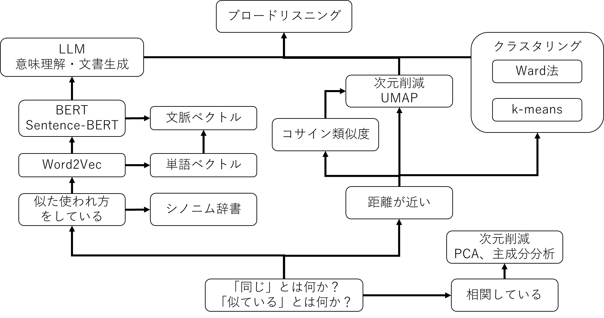

図の左側は**「似た使われ方をしているものは、似た意味を持つ」**というアプローチです。「猫」という単語がどのような文脈で使われているかを大量のテキストから学習すれば、「ねこ」や「ネコ」が同じような文脈で使われていることがわかります。かつては人手でシノニム辞書（同義語辞書）を作成し、「猫＝ねこ＝ネコ」といった対応関係を登録していました。しかしこの発想を発展させ、Word2Vecが前後の文脈から単語ベクトルを自動獲得できるようになり、BERTが文脈を考慮した単語ベクトル（同じ単語でも文脈によって異なるベクトル）を実現し、Sentence-BERTが文全体の文脈ベクトル化を可能にし、さらにGPT（LLM）がテキスト生成へと発展しました。

図の右側は**「距離が近いものは、似ている」**というアプローチです。データを数値（ベクトル）で表現し、その距離を測ることでデータ間の類似性を判断します。コサイン類似度で近さを数値化し、Ward法やk-meansで近いものをグループ化し、UMAPで高次元データを人間が見られる2次元に落とし込みます。

少し横道に逸れたところには**「相関している値は、似ている」**というアプローチがあります。PCA（主成分分析）は、データが最も広がっている方向（＝相関が強い方向）を見つけて次元を圧縮します。

広聴AIは、これらのアプローチを組み合わせることで実現しています。まず左側の技術であるLLMで入力テキストをクレンジング（文書成形）し、Sentence-BERTで言葉をベクトルに変換する。次に右側の技術（コサイン類似度、クラスタリング、UMAP）でその距離を測り、近いものを集め、可視化する。そしてまた左側に戻りLLMでラベル付けする。これが広聴AIの基本的な仕組みです。

UMAPは2018年、Sentence-BERTは2019年、LLMの実用化は2023年以降です。広聴AIを構成するこれらの技術が出揃ったのは、ほんの数年前のことです。つまり広聴AIは、技術的に「やっと可能になった」ばかりの新しい手法なのです。

---

## 13.3 言葉の意味をベクトル化する：Word2VecからSentence-BERTへ

### 13.3.1 文字は数値である

コンピュータの中では、文字はすべて数値として扱われています。私たちが画面上で「あ」や「A」という文字を見ているとき、コンピュータの内部ではそれらは特定の数値として処理されています。

試しにPythonで「デジタル民主主義」という文字列を数値に変換してみましょう。

```python
>>> [c for c in "デジタル民主主義".encode("utf-8")]
[227, 131, 135, 227, 130, 184, 227, 130, 191, 227, 131, 171,
 230, 176, 145, 228, 184, 187, 228, 184, 187, 231, 190, 169]
```

「デジタル民主主義」という8文字の文字列が、24個の数値の配列に変換されました。UTF-8というエンコーディング方式では、日本語の1文字は通常3バイト（3つの数値）で表現されます。

私たちが文字として認識しているものは、コンピュータにとっては単なる数値の並びに過ぎません。

### 13.3.2 「猫」と「ねこ」問題

人間にとって「猫」と「ねこ」は同じものを指しています。漢字で書こうがひらがなで書こうが、四本足でにゃーと鳴くあの動物のことです。しかし、コンピュータにとってこれらはまったく別のものです。

```python
"猫".encode("utf-8").hex()    # => 'e78cab'
"ねこ".encode("utf-8").hex()  # => 'e381ade38193'
```

「猫」は`0xE78CAB`、「ねこ」は`0xE381ADE38193`という数値になります。この2つの数値は似ているでしょうか？まったく似ていません。コンピュータから見れば、「猫」と「ねこ」は「猫」と「机」くらい違うものなのです。

そして、コンピュータは四則演算（足し算、引き算、割り算、掛け算）と比較演算（等しい、より大きい、より小さい）しかできません。したがって、コンピュータは「猫」と「ねこ」が同じものだと理解できないのです。

では、どうすればコンピュータに「猫」と「ねこ」が同じものだと理解させることができるのでしょうか。

### 13.3.3 シノニム辞書による解決とその限界

この問題に対する従来のアプローチは、同義語の対応表（シノニム辞書）を人力で整備することでした。

- 「パソコン」=「PC」=「パーソナルコンピュータ」
- 「自動車」=「車」=「クルマ」=「カー」=「自家用車」
- 「携帯電話」=「スマートフォン」=「スマホ」=「ケータイ」
- 「子ども」=「子供」=「こども」=「お子さん」
- 「お店」=「店舗」=「ショップ」=「店」
- 「コンビニエンスストア」=「コンビニ」
- 「お手洗い」=「トイレ」=「化粧室」=「WC」=「御不浄」
- 「亡くなる」=「死亡する」=「逝去する」=「他界する」=「永眠する」= ...

このような対応関係を、一つひとつ辞書に登録していく地道な作業です。2010年頃までは、検索エンジンや自然言語処理システムの開発において、このシノニム辞書の整備が重要な作業として位置づけられていました。

しかし、人力での辞書整備には本質的な限界がありました。

| 限界 | 説明 |
|------|------|
| 網羅性の問題 | 新語（「インスタ映え」「推し活」など）が日々生まれ、すべてを網羅することは不可能 |
| 文脈の問題 | 「ネコ」は動物だが、建設現場では一輪車のこと。「Apple」は果物かIT企業か |
| スケーラビリティの問題 | 言語ごとに辞書整備が必要。多言語対応には膨大なコスト |

こうした限界から、「同義語の判定を機械に任せたい」という要求が自然と生まれました。

### 13.3.4 Word2Vecの革新（2013年）

Word2Vecは、Googleが2013年に発表したアルゴリズムで、自然言語処理の分野に革命をもたらしました。

Word2Vecの基本的な考え方は、「同じような前後文脈で使われる単語は、同じような意味を持つだろう」というものです。この考え方は言語学では「分布仮説」と呼ばれ、1950年代から提唱されていました。Word2Vecはこの仮説を大規模データと機械学習で実現したものです。

では、具体的にどのように学習するのでしょうか。大量のテキストを分析すると、以下のようなパターンが見えてきます。

- 「○○を飼っている」「○○が膝の上で丸くなった」→ ○○には「猫」「ねこ」「ネコ」が入る
- 「○○を散歩に連れて行く」「○○に餌をあげる」→ ○○には「猫」「犬」「うさぎ」が入る
- 「○○を運転する」「○○に乗り込む」→ ○○には「車」「バス」「タクシー」が入る

Word2Vecは、このような文脈パターンから「猫」「ねこ」「ネコ」が同じ意味だと学習し、「猫」と「犬」は近い概念（ペット）、「猫」と「車」は遠い概念だと自動的に学習します。

この手法の画期的な点は、人間が明示的に「『猫』と『ねこ』は同じ」と教えなくても、大量のテキストデータから自動的にその関係性を学習できるようになったことです。

### 13.3.5 単語をベクトルで表現する

Word2Vecは、単語を多次元空間上の点（ベクトル）として表現します。同じような使われ方をしている単語は、近しい位置に配置されます。

```python
model["猫"]
# => array([-0.0938, -0.5717, -0.0722, 0.1387, 0.0142, ...])
# 300個の数値で「猫」の意味を表現
```

300次元というのは、300個の数値の組み合わせで単語の意味を表現するということです。人間には300次元の空間を直感的に理解することは難しいですが、コンピュータにとっては単なる数値の配列であり、容易に計算できます。

「猫」に近い単語を計算すると、以下のような結果が得られます。

```python
model.most_similar("猫")
# => [('ネコ', 0.74), ('ねこ', 0.67), ('仔猫', 0.64),
#     ('ウサギ', 0.63), ('子猫', 0.63), ('犬', 0.63), ...]
```

「猫」「ねこ」「ネコ」が近い位置にあり、さらにペットの仲間である「ウサギ」「犬」も近くに配置されていることがわかります。

### 13.3.6 コサイン類似度：ベクトル間の「近さ」を測る

多次元空間において「近い」とは何でしょうか。図13-3は、「猫」「ねこ」「東京」の3つの単語をベクトルとして表現したものです。

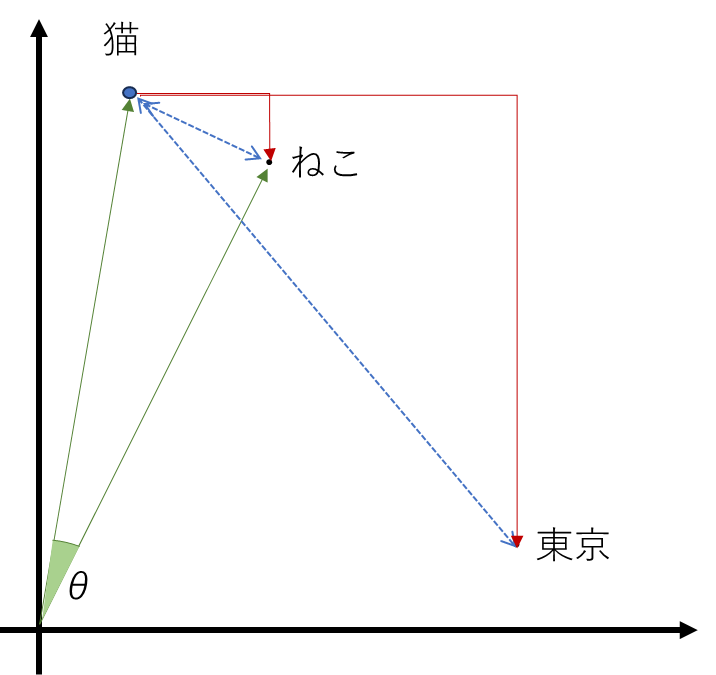
*図13-3：ベクトル間の距離の測り方*

「近さ」を測る方法はいくつかあります。

**マンハッタン距離**（図の赤線）は、各軸方向の差の絶対値を足し合わせたものです。名前の由来は、碁盤目状のマンハッタンの街路を歩くときの距離です。斜めには進めず、縦と横に移動した距離の合計になります。「猫」から「ねこ」へのマンハッタン距離は短く、「猫」から「東京」へのマンハッタン距離は長くなります。

**ユークリッド距離**（図の青点線）は、2点間を直線で結んだ長さです。私たちが日常で「距離」と呼ぶものです。三平方の定理（ピタゴラスの定理）で計算できます。

しかし、単語ベクトルの類似度を測る場合は、一般に**コサイン類似度**が使われます。これは2つのベクトルがなす角度θに基づく指標です。

なぜ距離ではなく角度を使うのでしょうか。単語ベクトルでは、ベクトルの「長さ」よりも「方向」が重要だからです。同じ単語でも、出現頻度や学習データによってベクトルの長さが変わることがありますが、方向は比較的安定しています。角度は長さに依存しないため、より頑健な類似度指標となります。

角度θには直感的な意味があります。2つの単語が似ていればθは0°に近づきます（同じ方向を向いている）。単語同士に関連がなければθは90°に近づきます（直交している）。そして、正反対の意味を持つ単語ではθが180°に近づきます（反対方向を向いている）。すなわち、θが求まれば、数値的に「似ている・似ていない」を判断できるのです。

角度θはベクトルの内積から計算できます（高校数学Bの範囲）。

**A・B = |A| |B| cos θ**

この式を変形すると：

**cos θ = A・B / (|A| |B|)**

ここからさらにcos⁻¹（アークコサイン）を使えば角度θそのものを求めることもできます。

**θ = cos⁻¹(A・B / (|A| |B|))**

しかし実用上は、あえてcos θの値で止めておきます。cos θは角度が小さいほど1に近く、角度が大きいほど-1に近くなるため、「似ている・似ていない」の判断には十分です。わざわざ逆関数を使って角度を求める必要はありません。このcos θの値を**コサイン類似度**と呼び、-1から1の範囲の値を取ります。

| Cosθ | θ | 意味 |
|----|------|------|
| 1に近い | θ ≈ 0° | 同じ方向を向いている（意味が似ている） |
| 0に近い | θ ≈ 90° | 直交している（関連がない） |
| -1に近い | θ ≈ 180° | 反対方向を向いている（意味が反対） |

word2vecのライブラリでは、コサイン類似度は簡単に計算できるのでやってみましょう。

```python
# TODO import文から書く
# word2vecの類似度計算
model.similarity("猫", "ネコ")  # => 0.74265
model.similarity("猫", "東京")  # TODO: 実際に計算を行う！！！
```

図13-3では、「猫」と「ねこ」のなす角度は小さく（コサイン類似度が高く）、「猫」と「東京」のなす角度は大きい（コサイン類似度が低い）ことがわかります。

ここで重要なのは、意味ベクトルを用いることで、言語学の問題が空間幾何の問題に変換されたということです。幾何の問題はベクトル計算で解けます。ベクトル計算は四則演算の組み合わせなので、コンピュータで計算できます。

---

**【コラム】ベクトル演算の不思議「王様 − 男 + 女 = 女王」**

Word2Vecには、驚くべき特性があります。単語のベクトルを足し引きすることで、意味の演算ができるのです。

```python
# 「王様」から「男」を引いて「女」を足すと「女王」に近くなる
model.most_similar(positive=['王様', '女'], negative=['男'])
# => [('女王', 0.72), ...]

# 「東京」から「日本」を引いて「フランス」を足すと「パリ」に近くなる
model.most_similar(positive=['東京', 'フランス'], negative=['日本'])
# => [('パリ', 0.68), ...]
```

この現象は、Word2Vecが単なる単語の類似性だけでなく、単語間の「関係性」もベクトル空間に埋め込んでいることを示しています。

「王様と女王の関係」と「男と女の関係」が、ベクトル空間上で同じ方向の差分として表現されているのです。これは人間が明示的に教えたわけではなく、大量のテキストから自動的に学習された結果です。

---

### 13.3.7 Word2Vecの限界とBERTの登場（2018年）

Word2Vecは画期的な技術でしたが、一つ大きな限界がありました。同じ単語は常に同じベクトルになるため、文脈によって意味が変わる多義語を適切に扱えないのです。

例えば英語の「bank」という単語は、文脈によって意味が変わります。

- 文1: "He sat by the bank of the river."（川岸）
- 文2: "She deposited money in the bank."（銀行）

日本語にも多義語は多くあります。「甘い」は、「このケーキは甘い」では味覚を、「審査が甘い」では基準の緩さを、「見通しが甘い」では判断の楽観性を意味します。「頭」も、「頭が痛い」では身体の部位を、「組織の頭」ではリーダーを、「頭がいい」では知性を指します。「金」も、「金を稼ぐ」ではお金を、「金メダル」では金属を、「金曜日」では曜日を意味します。

しかしWord2Vecでは、これらの異なる意味の「bank」も「甘い」も「頭」も「金」も、同じ言葉であれば、すべて同じベクトルになってしまいます。このような簡単な単語でさえ文脈を無視してしまうのでは、実用的な自然言語処理には限界があります。

この問題を解決したのがBERTです。BERT（Bidirectional Encoder Representations from Transformers）は、2018年にGoogleが発表しました。「Bidirectional（双方向）」という名前が示すように、ある単語の意味を理解するために、その単語の前後両方の文脈を同時に参照し、単語ベクトルの値を文脈に沿って更新します。

- "river"という単語が近くにあれば → "bank"は「川岸」を意味するベクトルに
- "money"や"deposited"が近くにあれば → "bank"は「銀行」を意味するのベクトルに

BERTの登場によって、Googleでは自然文による検索の精度が大きく改善したとされています（2019年頃）。

### 13.3.8 単語から文章へ：Sentence-BERTの登場（2019年）

BERTは文脈を考慮した単語ベクトルを生成できますが、文章全体を1つのベクトルとして効率的に表現することには向いていませんでした。2つの文章の類似度を計算するには、両方の文章をBERTに同時に入力する必要があり、大量の文章を比較するには計算コストが膨大になります。

この問題を解決したのがSentence-BERT（S-BERT）です。2019年に発表されたこの手法は、BERTを改良して文章全体を1つのベクトルとして効率的に表現できるようにしました。これにより、事前に各文章のベクトルを計算しておけば、類似度の計算はベクトル同士の比較だけで済むようになりました。

以下の9つの文章をベクトル化して、相互にコサイン類似度を計算してみましょう（図13-4）。

| カテゴリ | 文章 |
|---------|------|
| 料理 | トマトソースのパスタを作るのが好きです |
| 料理 | 私はイタリアンの料理が得意です |
| 料理 | スパゲッティカルボナーラは簡単においしく作れます |
| 天気 | 今日は晴れて気持ちがいい天気です |
| 天気 | 明日の天気予報では雨が降るようです |
| 天気 | 週末は天気が良くなりそうで外出するのに最適です |
| 技術 | 新しいスマートフォンは処理速度が速くなりました |
| 技術 | 最新のノートパソコンはバッテリー持ちが良いです |
| 技術 | ワイヤレスイヤホンの音質が向上しています |

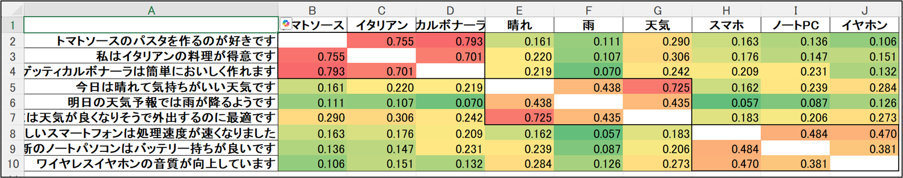
*図13-4：Sentence-BERTによる文章の類似度計算*

図13-4は、9つの文章すべてのペアについてコサイン類似度を計算し、行列形式で表示したものです。対角線上は自分自身との類似度なので1.00になっていますが、見やすさのために消しています。色は類似度の高さを示し、赤〜オレンジは高い類似度、緑〜黄色は低い類似度を表します。

同じカテゴリ内の文章同士（たとえば料理の3文間）は0.45〜0.73程度の比較的高い類似度を示しています。一方、異なるカテゴリ間（たとえば料理と技術）は0.06〜0.29程度と低い値になっています。「トマトソースのパスタ」と「イタリアンの料理」は直接的な単語の一致がなくても、Sentence-BERTは意味的な関連性を捉えて高い類似度を算出しています。

余談ですが、この「文脈ベクトル」と「コサイン類似度」の組み合わせは、ベクトル検索のコアとなる技術でもあります。従来のキーワード検索では見つからなかった「意味的に近い文書」を発見できるようになりました。

---

**【コラム】エンベディング（embedding）とは何か**

エンベディング（embedding）は「埋め込む」という意味の英語で、日本語では「埋め込み」と呼ばれることもあります。では、何を何に埋め込むのでしょうか。

一言でいえば、**言葉の世界にあるものを、ベクトルの世界に無理やり持っていくこと**です。

言葉は本来、離散的な記号です。「猫」「犬」「東京」という単語は、それぞれ独立した記号であり、その間に「距離」や「方向」といった概念はありません。「猫」と「犬」の間に「猫.5」のような中間は存在しません。

一方、ベクトルの世界は連続的です。座標(1,1)と(2,2)の間には(1.5, 1.5)があり、その間にも無限の点が存在します。(1,1)と(2,2)の距離は√2≈1.41と計算できます。ベクトルの世界では、距離も方向も角度も、すべて四則演算で計算できるのです。

エンベディングは、機械学習によって、**似ている単語や文章は高次元空間において近い位置に配置されるように**変換します。「猫」という記号を[0.23, -0.15, 0.87, ...]という数百次元のベクトルに変換することで、「猫」と「犬」の間の距離を測ったり、「猫」と「ネコ」が近いことを数値で確認したりできるようになります。

この変換によって、言葉は計算可能になります。足し算、引き算、距離の測定、クラスタリング、可視化。これらすべてが、エンベディングによって可能になるのです。

なお、この概念を指す用語には揺れがあります。「エンベディング」「埋め込み」「エンベディングベクトル」「文脈ベクトル」「文脈エンベディングベクトル」「文脈埋め込みベクトル」など、文献や技術者によって様々な表現が使われますが、いずれも本質的には同じものを指しています。本書では文脈に応じてこれらを使い分けていますが、混乱しないようにしてください。

---

### 13.3.9 エンベディングAPIの実践

現在、エンベディングは様々なAPIやライブラリとして簡単に利用できます。

OpenAI Embeddings APIを使った例を見てみましょう。

```python
from openai import OpenAI
client = OpenAI()

response = client.embeddings.create(
    input="今日は美味しいラーメンを食べました",
    model="text-embedding-3-small"
)

print(response.data[0].embedding)
# => 1536次元のベクトルが返ってくる
```

オープンソースのSentenceTransformersライブラリでも同様のことができます。

```python
from sentence_transformers import SentenceTransformer
model = SentenceTransformer("sentence-transformers/paraphrase-multilingual-mpnet")
emb = model.encode(["今日は美味しいラーメンを食べました"])
# => 768次元のベクトルが返ってくる
```

ここで注意すべき点があります。**エンベディングは、学習したモデルごとに独立であり、異なるモデル間で互換性がありません**。OpenAIのモデルで生成した1536次元のベクトルと、SentenceTransformersで生成した768次元のベクトルは、次元数が違うだけでなく、各次元の意味も異なります。同じ「猫」という単語でも、モデルが違えばまったく別のベクトルになります。したがって、コサイン類似度を計算したりクラスタリングを行う際は、すべてのデータを同一のモデルでエンベディングする必要があります。

広聴AIでは、OpenAIのEmbeddings APIと、SentenceTransformersを切り替えて使えるようにしています。ただし、一度選択したモデルは分析の最後まで統一して使用します。

---

## 13.4 テキストを理解・生成する：大規模言語モデル（LLM）

### 13.4.1 BERTからGPTへ

BERTは文章を「理解する」ことに優れていますが、文章を「生成する」ことは苦手でした。一方、GPT（Generative Pre-trained Transformer）は「生成」を目的として設計されています。OpenAIが開発し、名前に「Generative（生成的）」とあるように、文章を生成することができます。

GPTの処理は、驚くほどシンプルな原理に基づいています。

> **入力されたテキストに基づいて、「次に来る単語」の確率を計算する**

例えば、"He sat by the bank of the ???"という文章に対して：

| 単語 | 確率 |
|------|------|
| river | 35% |
| stream | 25% |
| creek | 15% |
| pond | 6% |
| lake | 6% |
| ... | ... |

この確率に基づいて次の単語を選択し、選択した単語を追加して、また次の単語を予測する。これを繰り返すことで文章が生成されます。

「次の単語を予測する」だけで、なぜ「知性」と呼べるような能力が生まれるのでしょうか。それは、正しく次の単語を予測するためには、文章の内容を「理解」している必要があるからです。「日本の首都は」→「東京」を予測するには地理の知識が、「ピタゴラスの定理によれば」→ 数学の知識が必要です。大量のテキストで「次の単語の予測」を学習する過程で、LLMは言語のパターンだけでなく、世界についての膨大な知識を獲得しました。

「次の単語を予測する」という能力が極まった結果、知性と呼んでも差し支えがないような振る舞いが現れたのです。現在のLLMの知性は、このシンプルな仕組みによって支えられています。

### 13.4.2 Few-shot学習：穴埋め問題で様々なタスクを解く

GPTは「次の単語を予測する」というシンプルな仕組みで動いていますが、この仕組みを使って翻訳や分類などの様々なタスクを解くことができます。2020年に発表されたGPT-3の論文では、Few-shot学習という手法が紹介されました。

Few-shotの「Few」は「少数の」という意味です。具体例を数個見せるだけで、LLMは新しいタスクを学習できます。以下はGPT-3の論文に掲載された英語からフランス語への翻訳の例です。

```
Translate English to French:

sea otter => loutre de mer
peppermint => menthe poivrée
plush giraffe => girafe peluche
cheese =>
```

GPTにとって、これは翻訳問題ではありません。「cheese =>」の次に来る単語を予測する穴埋め問題です。3つの例から「英語 => フランス語」というパターンを学習し、「cheese」の次には「fromage」が来ると予測します。

この発見は画期的でした。専用の翻訳モデルを作らなくても、例を見せるだけで翻訳ができる。分類問題も、要約も、質問応答も、すべて「適切な例を見せて穴埋め問題に変換する」ことで解けるのです。

言語モデルはインターネット上のありとあらゆる文章から学習しているため、幅広い知識を活用でき、ある種の「常識を持っている」といっても過言ではありません。そのため、「常識」で解ける範囲の課題であれば、プロンプトエンジニアリングによって解決できる可能性があります。今回のチーズの翻訳もその一例です。英語とフランス語の文献はインターネット上に大量に存在するため、それらを学習したGPT-3にとっては「常識」の範囲内です。

ただし、ここで言う「常識」とは、インターネット上に大量に存在する情報から学習されたパターンのことです。一方、学習データに含まれていない情報、たとえば「○○社の今期売上」「△△市の条例詳細」「昨日のニュース」などは「知識」と呼ぶべきもので、LLMはこれらを持っていません。LLMは「常識」はあるが「知識」が足りないのです。この区別は、LLMを活用する上で非常に重要になります（詳しくは13.4.5節で解説します）。

例を1つだけ示す場合はOne-shot、例を示さずに指示だけで依頼する場合はZero-shotと呼びます。GPT-3論文のタイトルは「Language Models are Few-Shot Learners（言語モデルはFew-Shot学習者である）」でした。

他の例も見てみましょう。

```
以下の意見を分類してください:

「公園を増やしてほしい」=> 環境
「保育園の待機児童を減らして」=> 子育て
「道路の渋滞がひどい」=> 交通
「高齢者向けの施設を充実させて」=>
```

例として示したカテゴリが「環境」「子育て」「交通」のようにシンプルな一言なので、GPTもそれに従って「福祉」のような一言で出力します。もし例のカテゴリを「環境・緑化政策」「子育て支援制度」のように詳しく書けば、出力も同様に詳しくなります。その場合は「福祉・高齢者支援制度」のように出力するでしょう。Few-shot学習では、例の形式が出力の形式を決めるのです。

### 13.4.3 プロンプトエンジニアリングの誕生

Few-shot学習の発見は、ソフトウェア開発のあり方を根本から変えました。従来、新しい課題を解くには専用のプログラムを開発する必要がありました。翻訳には翻訳エンジン、感情分析には感情分析モデル、分類には分類器と、それぞれ専門のエンジニアが何ヶ月もかけて開発していたのです。

しかしFew-shot学習により、プロンプト（指示文）を書くだけで課題が解けるようになりました。翻訳も、感情分析も、分類も、適切な例を数個見せるだけで実現できます。専用のプログラムを開発する必要がなくなったのです。

この「プロンプトを工夫することで課題を解く」という新しいアプローチは、**プロンプトエンジニアリング**と呼ばれるようになりました。どのような例を見せるか、どのような順序で並べるか、どのような言葉で指示を書くか。これらの工夫によって、同じモデルでも出力の品質が劇的に変わります。

広聴AIでも、クラスタのラベリングにおいてFew-shot学習を活用しています。「良いラベルの例」を示すことで、抽象的すぎず具体的すぎない、適切な粒度のラベルを生成させています。

### 13.4.4 GPTからChatGPTへ：対話型AIの誕生

GPT-3のAPIは2020年から提供されていましたが、使いこなすにはプログラミングの知識とプロンプトエンジニアリングの技術が必要でした。Few-shot学習で適切な例を設計し、APIを呼び出すコードを書く必要があったのです。

先のフランス語の翻訳の例を思い返してみてください。こんなヘンテコな指示文を書ける人は、この手のパズルが大好きな技術者だけだったのです。そのため、GPT-3は一部の技術者の間で話題になりましたが、一般にはあまり知られていませんでした。

そして、2022年11月、OpenAIはChatGPTを公開しました。普通の言葉で質問すれば、普通の言葉で回答が返ってくる。この違いは決定的でした。

ChatGPTを実現した技術的なブレイクスルーは、Instruction Tuning（対話チューニング）です。GPT-3は「次の単語を予測する」ように訓練されていましたが、ChatGPTは「人間との対話応答を生成する」ように追加で訓練されています。

これにより、文脈を踏まえた自然な会話が可能になりました。Few-shotで例を見せなくても、「〇〇してください」と言うだけでタスクを実行できるようになったのです。

2023年3月にはGPT-4が登場し、司法試験に合格できるレベルのスコアを記録しました。日本の医師国家試験も突破し、2025年初頭にはo3というモデルで東大理系入試で理Ⅲ合格ラインも突破しています。その後も、GPT-5が登場する等、LLMの進化は止まらず、2026年初頭の現在も苛烈な競争が続いています。

### 13.4.5 LLMの得意なことと限界、ハルシネーションとは何か？

LLMの能力は万能ではありません。得意なことと苦手なことが明確に分かれています。

得意なのは「常識」を使うタスクです。文章の要約・言い換え、翻訳、分類、論理的な推論、コード生成などがこれに当たります。一方、苦手なのは「知識」が必要なタスクです。最新のニュース、特定企業の内部情報、専門的なドメイン知識など、学習データに含まれていない情報は扱えません。

| 常識 | 知識 |
|------|------|
| 学習データに十分含まれている情報 | 学習データに含まれていない情報 |
| 「太陽は東から昇る」「水は100度で沸騰する」 | 「○○社の今期売上」「△△市の条例詳細」 |

この「常識」と「知識」の区別は、LLMと検索エンジンの違いを理解する上でも役立ちます。両者は表裏の関係にあり、得意・不得意が正反対なのです。

|  | LLM | 検索エンジン |
|------|------|------|
| **得意** | 「常識」を使うタスク（要約、翻訳、分類、推論） | 「知識」を見つけるタスク（最新ニュース、専門情報、固有名詞） |
| **苦手** | 「知識」が必要なタスク（最新情報、ローカル情報、専門知識） | 「常識」が必要なタスク（文脈理解、要約、意図の解釈） |
| **更新頻度** | 数ヶ月に一度（モデルの再学習が必要） | 数時間〜数日（クローラーが自動で巡回） |

検索エンジンの時代、私たちは「誰かがウェブに公開した情報」にたどり着くことができました。検索エンジン自体は「知識」を持っていませんが、知識が書かれた場所への道案内をしてくれます。そのため、あたかも検索エンジンが何でも知っているかのように感じられました。

しかしLLMは道案内ではなく、自ら回答を生成します。問題は、「知識」を持っていないにもかかわらず、質問されれば何かしらの回答を返してしまうことです。検索エンジンと同じ感覚で「○○について教えて」と質問すると、もっともらしいが事実ではない回答が返ってくることがあります。これがハルシネーション（幻覚）と呼ばれる現象です。

LLMは「わからない」と答える代わりに、それらしい回答を生成してしまう。この特性を理解せずにLLMを使うと、誤った情報を信じてしまう危険があります。

余談ですが、最新のモデルではハルシネーションの問題が改善されつつあります。GPT-5系のモデルでは、ハルシネーションを減らすためのアライメント（調整）が行われました。技術的には、従来の「正解」「不正解」の2択で学習していた仕組みに「棄権（回答しない）」という選択肢を加え、確信が持てない質問に対しては回答を控えるよう訓練されています。

その結果、「わからない」「この情報だけでは回答できない」と答える傾向が強くなりました。以前のモデルでは「とにかく何か答える」という振る舞いが目立ちましたが、推論能力を強化したモデルほど、自分の限界を認識して不確実性を表明するようになってきました。

https://openai.com/ja-JP/index/why-language-models-hallucinate/

とはいえ、ハルシネーションが完全になくなったわけではありません。LLMを使う際には、事実確認が必要な情報については一次情報源を参照する習慣が引き続き重要です。

### 13.4.6 RAG：外部知識でLLMを補強する

ハルシネーション問題への対策として、RAG（Retrieval-Augmented Generation、検索拡張生成）があります。

RAGの仕組みはシンプルです。ユーザーの質問に関連する情報をデータベースやウェブから検索し、その情報をLLMに渡して回答を生成させます。LLM自身が知らない情報でも、検索で取得した情報をもとに回答できるようになります。

現在の主要なLLMサービス（ChatGPT、Claude、Geminiなど）はすべて検索エンジンと連携しており、最新情報を含む回答を生成できます。Microsoft CopilotがビジネスユーザーのLLM市場で大きなシェアを獲得しているのは、SharePointに蓄積された社内文書を検索できるからです。「自社の過去の提案書を参照して回答する」「社内規定を踏まえてアドバイスする」といった、企業固有の知識を活用した回答が可能になります。

ただし、検索で取得した情報が誤っていれば、LLMもその誤りを反映した回答を生成します。LLMの回答を鵜呑みにせず、情報源を確認する姿勢が重要です。

### 13.4.7 Structured Output：LLMをシステムに組み込む

2024年8月、OpenAIはAPIにStructured Output機能を搭載しました。ユーザが指定したJSONフォーマットで出力させることが可能になったのです。

なぜこれが重要なのでしょうか。プログラムは自然言語を直接処理できないからです。

「公園を増やしてほしい」という文字列を受け取っても、プログラムはそれが環境に関する意見なのか、福祉に関する意見なのか判断できません。「if 意見 == 環境」のような条件分岐も書けませんし、「環境に関する意見は何件あったか」という集計もできません。自然言語のままでは、プログラムにとっては単なる文字の並びにすぎないのです。

一方、構造化データなら処理できます。`{"category": "環境", "sentiment": "賛成"}`というJSONであれば、カテゴリごとの集計、賛否の分析、条件による振り分けなど、あらゆる処理が可能になります。LLMをシステムに組み込むには、LLMの出力を構造化データに変換する必要があるのです。

しかし従来は、LLMの出力は自然言語（文字列）であり、JSONで出力することを指示しても90%程度しかフォーマットに準拠しませんでした。10%の確率でエラーが起きるモジュールはシステムに組み込めません。

Structured Outputはこの問題を解決しました。以下のようなコードで、確実に構造化データを取得できます。

```python
from pydantic import BaseModel, Field
import openai

class Character(BaseModel):
    name: str = Field(description="キャラクターの名前")
    age: int = Field(description="キャラクターの年齢")
    occupation: str = Field(description="キャラクターの職業")

client = openai.Client()
result = client.beta.chat.completions.parse(
    model="gpt-4o",
    messages=[{"role": "user", "content": "架空のキャラクターを作成して"}],
    response_format=Character
).choices[0].message.parsed

print(result.model_dump_json(indent=2))
# => {
#   "name": "Haru Yamada",
#   "age": 28,
#   "occupation": "Urban Explorer"
# }
```

これにより、LLMは「自然文を入力すると、決められたフォーマットの構造化データ（JSON）を返す関数」として扱えるようになりました。

この変化をプログラマの視点で考えてみましょう。従来、自然言語から構造化データを取り出すには、正規表現、形態素解析、構文解析、ルールベースの抽出器など、複雑な処理を組み合わせる必要がありました。それでも「公園を増やしてほしい」と「もっと公園がほしいです」が同じ意味だと認識させるのは困難でした。

Structured Outputは、この問題を根本から解決します。「プロンプトと型を定義するだけ」で、自然言語から構造化データを取り出せるようになったのです。

```python
class Opinion(BaseModel):
    category: str = Field(description="意見のカテゴリ（環境/福祉/経済/教育/その他）")
    sentiment: str = Field(description="賛成/反対/中立")
    summary: str = Field(description="意見の要約（20文字以内）")

# これだけで、自然言語の意見を構造化できる
def parse_opinion(text: str) -> Opinion:
    return client.beta.chat.completions.parse(
        model="gpt-4o",
        messages=[{
            "role": "user",
            "content": f"以下の市民意見を分析してください：\n\n{text}"
        }],
        response_format=Opinion
    ).choices[0].message.parsed
```

プログラミングの歴史において、これは大きな転換点です。従来は「データ構造を定義し、それを埋めるロジックを書く」必要がありました。Structured Outputでは「プロンプトとデータ構造を定義するだけ」で、LLMが自動的にデータを埋めてくれます。処理ロジックを書く必要がなくなったのです。

2025年現在、Structured OutputはOpenAI、Anthropic（Claude）、Google（Gemini）など主要なLLMプロバイダーがすべてサポートしています。

広聴AIでも、意見の抽出やラベリングの際にStructured Outputを活用しています。数千件の自由記述を、カテゴリ・感情・要約といった構造化データに変換する処理は、Structured Outputなしには実現できませんでした。

---

## 13.5 データを整理・可視化する：クラスタリングと次元圧縮

13.3節で見たように、Sentence-BERTはテキストを数百次元のベクトル（数値の配列）に変換します。ここにエンベディングのすさまじい力があります。

人間の言葉は本来、コンピュータにとって扱いにくいものです。「経済政策を重視」と「財政運営が大切」は文字列としては全く異なりますが、意味は近い。逆に「銀行の金利」と「金利の話が面白い」は「金利」という同じ単語を含みますが、文脈が異なります。文字列の比較だけでは、こうした意味の近さを捉えられません。

しかし、エンベディングによってテキストが数値ベクトルになると、状況は一変します。数値であれば、足し算や引き算ができます。2つのベクトルの距離や角度を計算できます。そして何より、**似た意味のテキストは近い座標に、異なる意味のテキストは遠い座標に配置される**のです。

これこそが、テキストデータに対してクラスタリングを適用できる理由です。数万件の意見があっても、それぞれを数百次元空間上の点として表現できれば、あとは「近い点をグループ化する」という純粋に数学的な問題になります。言葉の意味という曖昧なものを、座標という明確なものに変換する。このエンベディングの力があってこそ、大規模な意見の自動分類が可能になるのです。

さらに、数値ベクトルであれば次元圧縮も可能です。数百次元の空間を人間が直接見ることはできませんが、2次元に圧縮すれば散布図として可視化できます。「似た意見が近くに集まる」地図を作れるのも、エンベディングが数値だからこそです。本節では、このクラスタリングと次元圧縮の両方について解説します。

### 13.5.1 クラスタリングとは

クラスタリングとは、似たものを自動でグループ分けする技術です。まず、シンプルな例から見てみましょう。

図13-1は、200個の点を平面上にプロットしたものです。


*図13-1：2つの集団に分かれたデータ*

この図を見て、あなたはおそらく「左上のかたまり」と「右下のかたまり」という2つのグループを認識したのではないでしょうか。人間の目には、データが自然と2つに分かれているように見えます。

では、どこで分けるのが「自然」でしょうか？ 図13-2のように、それぞれのかたまりを円で囲むのが妥当に思えます。

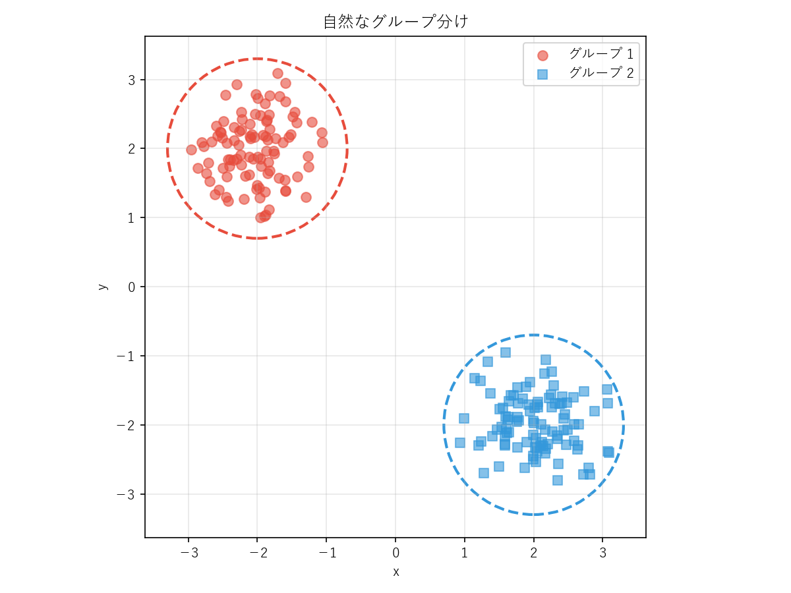
*図13-2：自然なグループ分け*

クラスタリングとは、この「人間が直感的に認識するグループ分け」をコンピュータに自動で行わせる技術です。「クラスタ（cluster）」は英語で「房」や「集団」を意味し、ブドウの房のように似たものが集まっている状態をイメージするとわかりやすいでしょう。

### 13.5.2 データの形状とアルゴリズムの選択

先ほどの例は、2つの丸い塊が離れている単純なケースでした。しかし、現実のデータはもっと複雑な形をしていることがあります。

図13-3は、4種類のデータ構造に対して、3種類のクラスタリングアルゴリズム（K-means、Ward法、DBSCAN）を適用した結果です。

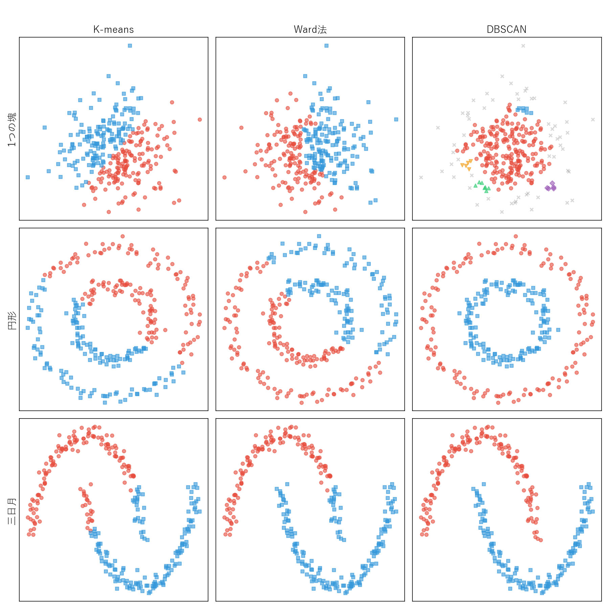
*図13-3：データ構造とアルゴリズムによるクラスタリング結果の違い（scikit-learn公式ドキュメントを参考に作成）*

この図から、いくつかの重要な点がわかります。

| データ構造 | K-means | Ward法 | DBSCAN |
|-----------|---------|--------|--------|
| 1つの塊 | 無理やり2つに分割 | 無理やり2つに分割 | ほぼ1つのクラスタとして認識（周縁部に外れ値が出る場合あり） |
| 円形 | うまく分けられない | うまく分けられない | きれいに分けられる |
| 三日月形 | うまく分けられない | うまく分けられない | きれいに分けられる |
| 3つの塊 | 2つが1つにまとめられる | 2つが1つにまとめられる（きれいに3つに分けることもできる） | きれいに3つに分けられる |

注目すべきは「1つの塊」と「3つの塊」の行です。K-meansとWard法は「2つに分けろ」と指示されれば、たとえ1つの塊であっても無理やり分割し、3つの塊があっても2つにまとめてしまいます。一方、DBSCANは「密度の高い領域をクラスタとする」ため、データの自然な構造を認識できます。ただし、DBSCANはパラメータ（密度の閾値）の設定次第で、周縁部の点が外れ値として分類されたり、飛び地的な小さなクラスタが生まれたりすることがあります。

つまり、**万能なアルゴリズムは存在しません**。データの形状に合ったアルゴリズムを選ぶ必要があります。広聴AIで扱う意見データは、ベクトル空間上で「塊状」に分布する傾向があるため、K-meansやWard法が適しています。

### 13.5.3 K-meansのアルゴリズム

K-meansは、最も広く使われているクラスタリング手法です。「K」はグループの数を表し、事前に「何グループに分けたいか」を指定します。

アルゴリズムの動作を図13-4で見てみましょう。

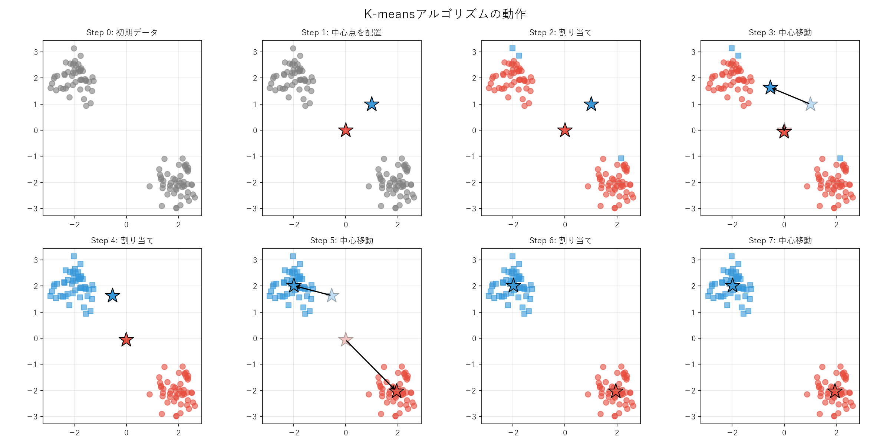
*図13-4：K-meansアルゴリズムの動作*

1. **Step 0**: 初期データがあります
2. **Step 1**: 2つの「中心点」（★）をランダムに配置します
3. **Step 2**: 各点を、最も近い中心点のグループに割り当てます
4. **Step 3**: 各グループの重心に中心点を移動します
5. **Step 4-7**: 「割り当て→中心移動」を繰り返します。中心点が動かなくなったら終了です

K-meansの特徴は、シンプルで高速なことです。ただし、最初に「何グループに分けるか」を決める必要があります。もう1つの重要な特徴は、**1つの塊を無理やり複数に分割できる**ことです。図13-3の「1つの塊」データをK-meansで「K=2」に分けた場合、塊が強制的に2つに切断されていました。これは一見デメリットに見えますが、後述する広聴AIのアルゴリズムでは、この特徴を活用してデータを細かく分割してから階層的に統合する手法をとっています。

### 13.5.4 階層的クラスタリング（Ward法）

Ward法は、階層的クラスタリングの一種です。K-meansとは異なり、グループ数を事前に決める必要がありません。

アルゴリズムの動作を図13-5で見てみましょう。

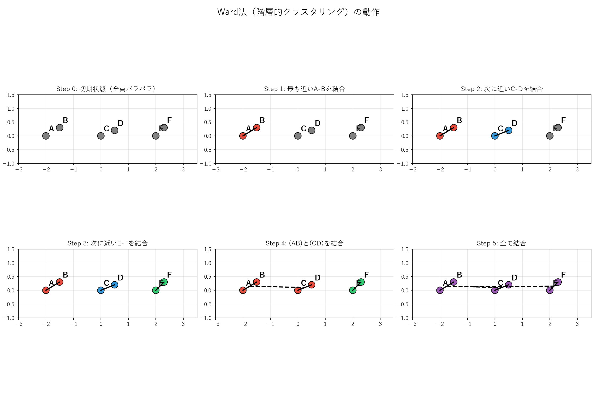
*図13-5：Ward法（階層的クラスタリング）の動作*

1. **Step 0**: 最初は全員がバラバラです
2. **Step 1**: 最も近い2点（AとB）を結合します
3. **Step 2-3**: 次に近いペアを順次結合していきます
4. **Step 4-5**: グループ同士も結合していき、最終的に全員が1つになります

この過程を「デンドログラム（樹形図）」として表現できます（図13-6）。

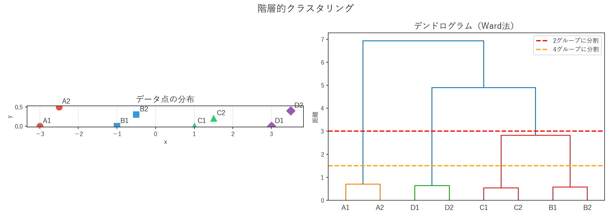
*図13-6：階層的クラスタリングとデンドログラム*

デンドログラムの重要な特徴は、**どこで切るかによってグループ数が変わる**ことです。

- 赤い線（距離=3）で切ると → 2グループ
- オレンジの線（距離=1.5）で切ると → 4グループ

つまり、一度クラスタリングを実行すれば、後から「もっと細かく分けたい」「もっと大きくまとめたい」という調整ができます。これが階層的クラスタリングの大きな利点です。

### 13.5.5 次元圧縮とは

広聴AIでは、1536次元のベクトルを2次元に圧縮して可視化しています。私たち人間が直感的に理解できるのは3次元までなので、高次元データをそのまま見ることは不可能です。次元を2次元まで減らすことで、初めて散布図として可視化できるようになります。

この「高次元から低次元への写し取り」を、身近な例で考えてみましょう（図13-7）。


*図13-7：次元圧縮の比喩 - 魚拓と地図* ChatGPTが生成

魚拓は、複雑な曲面を持つ魚の形を紙（2次元）に写し取る技術です。実物の魚はすぐに腐ってしまいますが、魚拓なら何年でも残せますし、並べて比較することもできます。厚みや立体感は失われますが、長さは維持できるので、釣果を自慢することには使えます。

地図も同様です。地球儀を持ち歩くことはできませんが、地図なら折りたたんでポケットに入れられます。壁に貼って一目で全体を見渡すこともできます。しかし、この便利さと引き換えに何かが犠牲になります。メルカトル図法では角度は正確ですが、面積が歪み、グリーンランドがアフリカ大陸より大きく見えてしまいます。また、ヨーロッパを中心とした地図では、ベーリング海峡を挟んで本来隣り合っているアラスカとロシア極東が、左端と右端に引き離されてしまいます。

次元圧縮とは、このように何かを犠牲にしながらも、できるだけ本質的な構造を保存する技術です。

### 13.5.6 PCAによる次元圧縮

次元圧縮の基本的な考え方を、シンプルな例で見てみましょう。図13-8は、2次元のデータを1次元に圧縮する過程を示しています。


*図13-8：PCAによる次元削減（2次元→1次元）*

左の図は、斜め方向に伸びた2次元のデータです。このデータには「斜め方向の広がり」と「それに直交する方向の広がり」がありますが、斜め方向の広がりの方がはるかに大きいことがわかります。

中央の図では、データが最も広がっている方向（赤い線＝第1主成分軸）を見つけ、すべての点をこの軸に投影しています。灰色の線は、各点から軸への投影を示しています。

右の図は、投影後の1次元データです。元々2次元だったデータが、1本の数直線上の点になりました。

この手法はPCA（主成分分析、Principal Component Analysis）と呼ばれます。「データが最も広がっている方向」を見つけて、その方向に投影することで次元を減らします。2次元を1次元に減らすと、直交方向の情報は失われますが、主要な構造は保たれています。

PCAは1901年に統計学者のカール・ピアソンによって考案された古典的な手法で、100年以上の歴史があります。統計学、心理学、経済学、生物学、画像処理など、非常に幅広い分野で使われてきました。たとえば、心理学では多数の質問項目から「外向性」「神経症傾向」といった性格因子を抽出するのに使われますし、経済学では複数の経済指標から「景気動向指数」のような総合指標を作成するのに活用されています。

PCAがこれほど広く使われている理由は、現実世界のデータでは異なる変数間に強い相関があることが多いからです。たとえば、身長と体重は強く相関しています。身長が高い人は体重も重い傾向があり、その逆もまた然りです。同様に、学校の成績でも算数が得意な生徒は国語も得意であることが多く、両者には正の相関があります。このような相関関係があるデータでは、見かけ上は多くの変数があっても、実質的な情報の「広がり」は限られた方向に集中しています。PCAはこの性質を利用して、少数の主成分で元のデータの大部分の情報を表現できるのです。

情報量を減らすことで、意思決定も容易になります。100の変数を見て判断するより、2〜3の主成分で傾向を掴む方が、人間にとってはるかに理解しやすくなります。

ただし、次元圧縮には情報損失が伴います。「大部分の情報」を保存するということは、「一部の情報」は失われるということです。全体の傾向から外れた例外的なケースは、次元圧縮によって見えにくくなります。たとえば、身長は低いが体重が重い人（力士など）は、身長と体重の相関という「主成分」では捉えきれません。このような例外を切り落としてしまう点は、次元圧縮の限界として意識しておく必要があります。

### 13.5.7 UMAPによる次元圧縮

PCAは直線的な相関関係を捉えるのに適していますが、複雑な構造を持つデータには限界があります。PCAは「データ全体の分散が最大になる方向」を見つけますが、「似ているものを近くに配置する」という目的には必ずしも適していません。

UMAP（Uniform Manifold Approximation and Projection）は2018年に発表された手法で、「近くにあるもの同士の関係」を優先して保存します。高次元空間で近かった点は、2次元に圧縮しても近くに配置されます。これにより、「似ている意見は近くに配置される」という直感的な可視化が可能になります。広聴AIの散布図で、同じ話題の意見が固まって表示されるのは、UMAPのおかげです。

UMAPのアルゴリズムを比喩的に説明しましょう。各データ点から、高次元空間で近い数点に**ゴム紐**をつけます。近い点同士は引き合う力で結ばれます。同時に、ランダムに選んだ遠い点との間には**反発する磁石**のような斥力が働きます。この引力と斥力のバランスで、近いものは近くに、遠いものは離れた位置に自然と配置されます。厳密には物理シミュレーションではないのですが、直感的にはこのイメージで理解できます。

では、PCAとUMAPの違いを具体例で確認してみましょう。MNISTという手書き数字のデータセットを使ってみます。

MNISTは、0から9までの手書き数字を集めたデータセットで、機械学習の研究で広く使われています。図13-9にサンプルを示します。


*図13-9：MNIST手書き数字データセット*

各画像は28×28ピクセルのグレースケール画像です。つまり、1枚の画像は784個の数値（各ピクセルの明るさ）で表現されます。これが「784次元のデータ」という意味です。同じ数字でも、書く人によって形が異なることがわかります。

図13-10は、この784次元のデータを2次元に圧縮した結果を、PCAとUMAPで比較したものです。

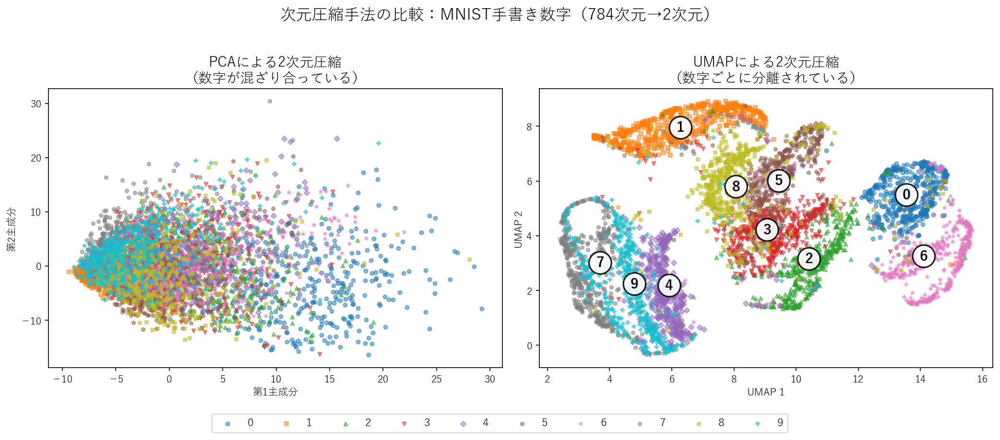
*図13-10：PCAとUMAPの比較（MNIST手書き数字データ）*

左のPCAによる圧縮では、0から9までの数字が混ざり合っており、どの数字がどこにあるのか判別が困難です。PCAは「最も分散が大きい方向」に投影するだけなので、「同じ数字は近くに配置する」という意味的な構造を捉えることができません。

右のUMAPによる圧縮では、同じ数字同士がまとまって配置され、異なる数字は離れた位置に配置されています。たとえば「1」と「0」は明確に分離されています。

さらに興味深いのは、**人間が手書きで間違えやすい数字同士が隣接している**点です。

- **0と6**: ともに丸い形状を持ち、書き方によっては似てしまう
- **2、3、5、8**: 曲線を主体とした数字で、崩れると互いに似る
- **4、9、7**: 縦線と斜め線で構成され、手書きでは混同しやすい

これは偶然ではありません。UMAPは784次元の画像データ（28×28ピクセル）の類似性を捉えて配置しているため、「画像として似ている数字」が自然と近くに配置されるのです。人間の直感的な類似性判断と、ピクセルデータに基づく数学的な類似性には、一定の対応関係があることをこの可視化は示唆しています。

図13-11は、4と9が混在する境界付近を拡大したものです。各点に実際の手書き画像を表示しています。

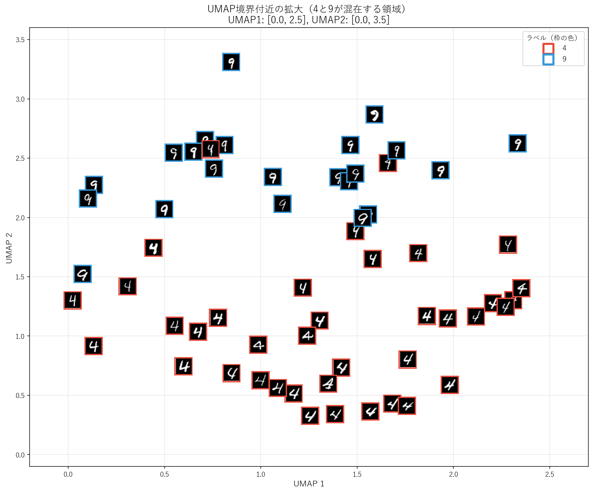
*図13-11：4と9が混在するUMAP境界領域の拡大*

下部には4（赤枠）が多く、上部には9（青枠）が多いことがわかります。その中間領域では、両者が混在しています。画像を見ると、上部が閉じた4は9に似ており、下部が開いた9は4に似ていることがわかります。UMAPは、このような「どちらにも見える」サンプルを、適切に境界付近に配置しているのです。

重要なのは、**このような曖昧なデータに対しては、そもそも正解が曖昧である**という点です。広聴AIでも同様に、複数の話題にまたがる意見や、解釈が分かれる意見は、クラスタの境界付近に配置されます。

ただし、UMAPの結果を解釈する際には注意が必要です。UMAPは「近いもの同士を近くに配置する」ことを優先するため、**近くにある点同士は「似ている」と解釈できますが、離れた点同士の距離には意味がありません**。たとえば、図13-10で「1」のクラスタと「0」のクラスタが離れていますが、その距離が「1と0は4と9より違う」ことを意味するわけではありません。

また、**UMAPの軸1・軸2には特定の意味がありません**。軸の向きや回転は任意であり、「右にあるほど○○」といった解釈はできません。UMAPが提供するのは、あくまで「似ているものが近くに集まる」という相対的な配置情報です。

#### UMAPの具体例：都道府県データ

UMAPの動作をより具体的に理解するため、47都道府県の統計データを使った例を見てみましょう。

図13-12は、政府統計（e-Stat）の都道府県別データを参考に作成したサンプルデータを使って、47都道府県をUMAPで2次元に配置した結果です。人口密度、産業構造、高齢化率など約50の統計指標を入力しています。


*図13-12：統計指標に基づく都道府県の類似性*

ここで重要なのは、**本来比較できないはずのデータを比較可能にしている**点です。人口密度（人/km²）、高齢化率（%）、製造品出荷額（億円）といった指標は、単位も桁数もバラバラです。しかも50もの指標を同時に見て「どの県とどの県が似ているか」を人間が判断することは困難です。UMAPは、これらの異なる指標を総合的に考慮して、**地理的に離れていても、統計的に似ている都道府県を近くに配置**します。

- **右上のエリア（大都市圏）**: 東京・大阪・神奈川などの大都市圏と、沖縄が近くに配置されています。第三次産業比率が高い（80%以上）、人口密度が高い、自動車保有率が低い、大卒比率が高いといった特徴を共有しています
- **中央のエリア（ベッドタウン）**: 埼玉・千葉・兵庫・奈良などが集まっています。人口密度は大都市より低いが地方より高い、第三次産業比率が高い（77%程度）、1人当たり所得は大都市より低い（300万円程度）といった、大都市と地方の中間的な特徴を持ちます
- **左上のエリア（工業県）**: 静岡・群馬・栃木・愛知など、製造業が盛んな県が集まっています。第二次産業比率が高い（35〜40%）、製造品出荷額が高い、有効求人倍率が高いといった特徴があります
- **左下のエリア（農業県・高齢化県）**: 北海道・鹿児島などの農業県と、秋田・高知・島根などの高齢化が進んだ県が近くに配置されています。第一次産業比率が高い、人口密度が低い（150人/km²以下）、高齢化率が高い（32〜36%）、農業産出額が高いといった特徴を共有しています

このように、UMAPは「多くの指標で似ている」ものを近くに配置します。意見データでも同様に、「多くの観点で似ている意見」が近くに集まることで、直感的な可視化が実現されています。

#### UMAPの具体例：単語ベクトル

13.3節でWord2Vecを紹介しました。単語を300次元程度のベクトルで表現し、「猫」と「ネコ」が近い位置に、「犬」や「ウサギ」も近くに配置される技術です。この**高次元の意味ベクトルを、UMAPで2次元に可視化**してみましょう。

図13-13は、動物名20個、地名20個、料理名20個の合計60単語を、GloVe（Word2Vecの発展形）で100次元ベクトルに変換し、UMAPで2次元に配置した結果です。

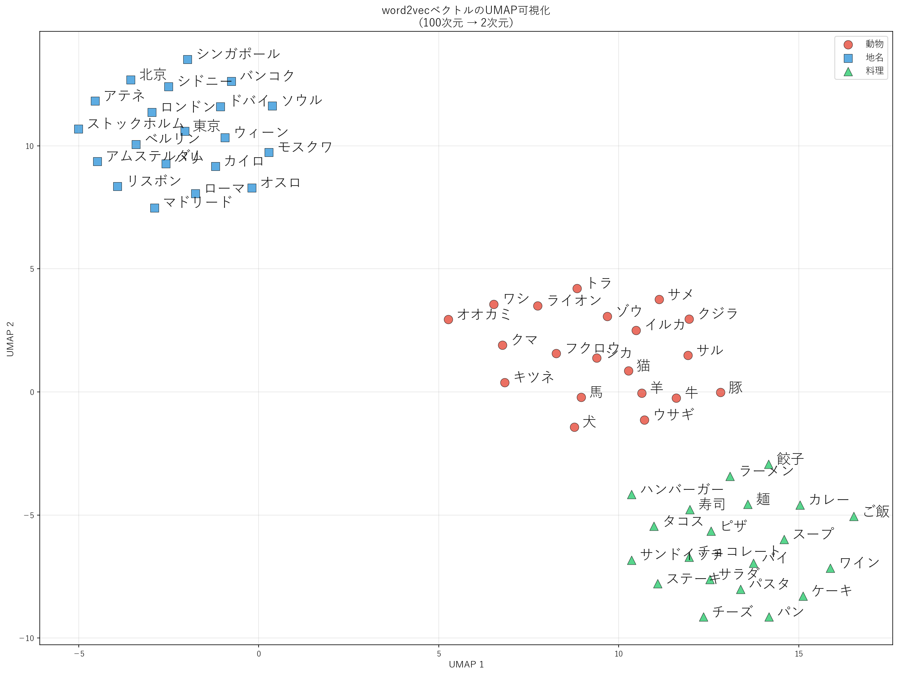
*図13-13：単語ベクトル（GloVe 100次元）のUMAP可視化*

動物（赤）、地名（青）、料理（緑）がそれぞれ明確なクラスタを形成しています。13.3節では「猫」と「ネコ」が近いことを数値で確認しましたが、ここでは60個の単語がカテゴリごとにまとまっている様子を、一目で把握できます。

ここで重要なのは、13.3.6節で紹介した**コサイン類似度がUMAPの内部で使われている**点です。UMAPは、ベクトル間のコサイン類似度に基づいて「近いもの同士を近くに配置する」ため、意味的に似た単語が自然とまとまって表示されます。Word2Vecで学習された意味の近さが、UMAPによって可視化されているのです。

広聴AIでも同様のアプローチが使われています。各意見を高次元のエンベディングベクトルに変換し、UMAPで2次元に圧縮することで、意味的に似た意見が近くに配置される散布図が生成されます。

---

本章では、広聴AIを支える要素技術を解説してきました。次章では、これらの技術が広聴AIの中でどのように組み合わされ、一つのパイプラインとして機能しているかを、実装レベルで詳しく見ていきます。
