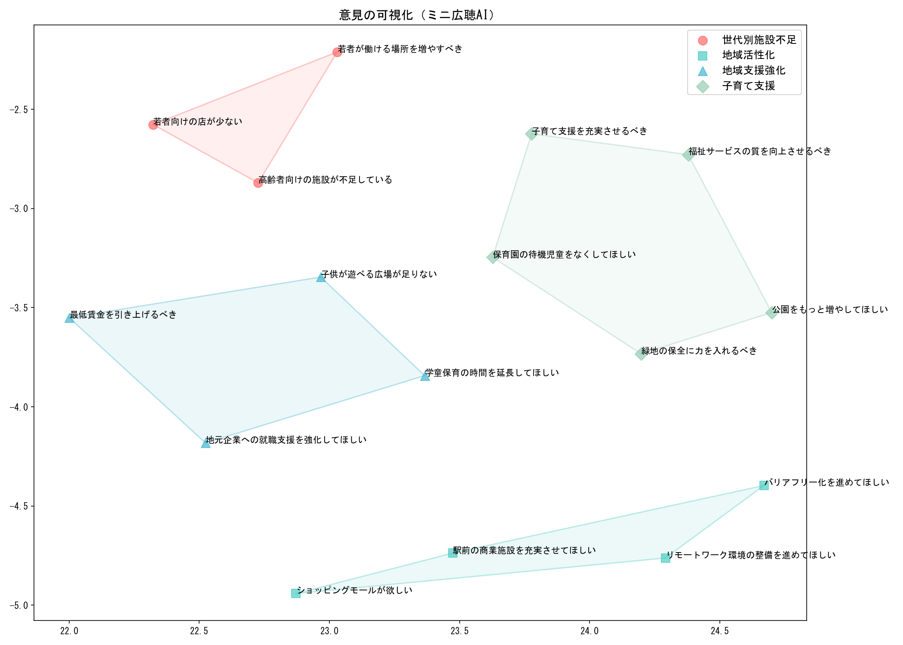

# 第14章 広聴AIの実装を読み解く

## 14.1 本章の学習目標

前章では、広聴AIを支える基盤技術について概念的に解説しました。本章では、それらの技術が実際にどのように組み合わされ、一つのシステムとして機能しているかを理解していきます。

本章を読み終えると、以下のことができるようになります。

- 広聴AIの処理パイプラインの全体像を理解する
- 各処理ステップの目的と役割を把握する
- 設計上のトレードオフ（精度 vs 説明容易性）を理解する
- 自分でミニ広聴AIを実装できる基礎知識を得る

本章は「プログラマー向け」の内容ですが、コードが読めなくても処理の流れは理解できるように構成しています。

---

## 14.2 処理パイプライン詳解

広聴AIの処理は、大きく分けて以下のステップで構成されています。


1. **抽出（Extraction）**: LLMで生の意見を個別の論点に分割・整形
2. **埋め込み（Embedding）**: 各意見を文脈ベクトルに変換（13章参照）
3. **次元圧縮**: UMAPで2次元に圧縮（13章参照）
4. **クラスタリング（Clustering）**: k-means + Ward法で階層的にグループ化（13章参照）
5. **初期ラベリング**: LLMで細分化されたクラスタに名前を付ける
6. **統合ラベリング**: LLMで統合されたクラスタに名前を付ける
7. **要約文の作成**: 全体概要の生成

以下、各ステップの詳細を見ていきましょう。

---

### 14.2.1 ① 抽出（Extraction）

このステップでは、LLMを使って入力テキストから意見を抽出し、ひと固まりの意見に分割します。

パブリックコメントなどで集まる生の意見は、そのままでは処理が困難です。以下は、典型的な「生の意見」の例です（ChatGPTで生成）。

> 私たち地域住民は、いつまで行政の曖昧な姿勢に振り回され続けなければならないのでしょうか。川沿いの貴重な緑地を守り、鳥や昆虫が戻る環境を取り戻してほしいという切実な声が上がっているのに、その一方で駅前には「にぎわい創出」と称して商業施設を誘致し、若者の雇用を増やしてほしいという要望も山積みです。さらに、保育園の待機児童ゼロ、学童保育の延長など、子育て支援を充実させろという悲痛な叫びが毎日のように届いている――にもかかわらず、あなた方は具体的な計画も示さず、ただ場当たり的な言い訳を並べ立てるばかりではありませんか！

人は、人の心を動かすために感情を込めた文章を書きます。しかし、こういった「心を動かす」文章は、読む側の人間の心も動かし、疲弊させ、最終的には心をへし折ります。住民や顧客の生の意見というものは、往々にしてこのような感情的な文章です。自治体の広聴担当者やカスタマーサポート担当者が精神的に疲弊しやすいのは、こうした文章を毎日大量に読まなければならないからです。

LLMに意見を分割させると、感情的な表現が取り除かれ、以下のように整理されます。

- 「川沿いの貴重な緑地を守り、鳥や昆虫が戻る環境を取り戻すべき」
- 「駅前に商業施設を誘致して若者の雇用を増やすべき」
- 「保育園の待機児童をゼロにすべき」
- 「学童保育の延長など子育て支援を充実させるべき」

意見分割の重要な効果は、「複数の人で共通している意見」を発見しやすくなることです。たとえば、ある人が「意見A、B、C」を含む文章を投稿し、別の人が「意見C、B、D」を含む文章を投稿したとします。元の文章同士を比較しても共通点は見えにくいですが、それぞれを{A, B, C}と{C, B, D}に分割すれば、「BとCは複数の人が主張している」ことがわかります。

それでは、LLMにどのような入力を行うことで、意見を分割・整形できるのでしょうか。広聴AIで使用されるプロンプトの例を以下に示します。

```
あなたは専門的なリサーチアシスタントです。与えられたテキストから、
意見を抽出して整理してください。

# 指示
* 入出力の例に記載したような形式で文字列のリストを返してください
  * 必要な場合は2つの別個の意見に分割してください。
  * 多くの場合は1つの議論にまとめる方が望ましいです。
* 整理した意見は日本語で出力してください

## 入出力の例
/human
AIの能力、限界、倫理的考慮事項について、市民を教育する必要がある。
また、教育できる人材を養成する必要がある。

/ai
{
  "extractedOpinionList": [
    "AIの能力、限界、倫理的考慮事項について、市民を教育すべき",
    "AIに関する教育をできる人材を養成すべき"
  ]
}
```

「多くの場合は1つの議論にまとめる方が望ましい」という指示が重要です。これがないと、LLMは意見を過度に細分化してしまう傾向があります。

出力形式がJSONになっている点にも注目してください。13章で解説したStructured Outputを利用しています。LLMの出力をプログラムで処理するには、自然文ではなく構造化されたデータが必要です。JSONフォーマットで出力例を示すことで、LLMは同じ形式で結果を返してくれます。

なお、プロンプト中の「意見」という言葉は、目的に応じて「不満」「要望」「提案」などに変更できます。こうすることで、特定の性質のテキストだけを抽出することも可能です。


---

### 14.2.2 ② 埋め込み（Embedding）

このステップでは、分割された意見をベクトル（数値の配列）に変換します。エンベディングの技術的な詳細は13章で解説しました。広聴AIでは、OpenAIのEmbeddings APIやオープンソースのSentence-BERTを使用しています。

前のステップで意見を分割・整形しておくことで、エンベディングの品質が大きく向上します。その理由は2つあります。

1つ目は、エンベディングの安定化です。1つの文章に1つの意見だけが含まれるようになるため、ベクトルが意見の意味を正確に表現できるようになります。複数の意見が混ざった文章をそのままベクトル化すると、埋め込みベクトルも混ざって不明瞭になり、後続のクラスタリングで正しくグループ化できなくなります。

2つ目は、ノイズの除去です。LLMによる整形で口調が統一され、誤字脱字も修正されます。人間は感情によって意見を補強しようとする傾向があるため、生の文章にはノイズが多く含まれています。前節の例でいえば、「にもかかわらず、あなた方は具体的な計画も示さず、ただ場当たり的な言い訳を並べ立てるばかりではありませんか！」といった攻撃的な文言が消え、建設的な意見だけが残ります。

このように、LLMによる意見分割と整形を挟むことで、エンベディングを理想的な状態で運用できるようになります。

ただし、懸念点もあります。LLMのハルシネーションによって、元のテキストに含まれていない内容が抽出される可能性があります。この問題に対しては、抽出結果を元のテキストと突き合わせて検証する仕組みを設けるなどの対策が考えられます。

---

### 14.2.3 ③ 次元圧縮

このステップでは、高次元のエンベディングベクトルを2次元に圧縮します。13章で解説したUMAPを使用しています。

前のステップで生成されるエンベディングは、OpenAIのEmbeddings APIで約1500次元、Sentence Transformerで約700次元という高次元のベクトルです。次元圧縮を行う理由は2つあります。1つは可視化のためです。人間が直感的に理解できるのは2〜3次元までなので、散布図として表示するには次元を落とす必要があります。もう1つは、後続のクラスタリング処理の精度向上のためです。

広聴AIでは、UMAPの距離関数にコサイン距離を指定しています。13章で解説したように、エンベディングベクトルの類似度はコサイン類似度で測るのが一般的です。UMAPはデフォルトではユークリッド距離を使いますが、`metric='cosine'`を指定することで、ベクトルの「方向」の近さに基づいて次元圧縮を行います。これにより、意味的に似た意見が2次元空間上でも近くに配置されるようになります。

---

### 14.2.4 ④ クラスタリング（Clustering）

このステップでは、似た意見を自動でグループ分けします。13章で解説したk-meansとWard法を組み合わせて使用しています。

処理の流れは以下のようになります。

1. k-meansで細かくクラスタリング（下位クラスタの生成）
2. Ward法で階層的に統合（上位クラスタの生成）

広聴AIでは、利用者が**下位クラスタの数**と**上位クラスタの数**を指定できます。下位クラスタの数はk-meansのクラスタ数（k）に対応し、上位クラスタの数はWard法のデンドログラムをどこで切るかに対応します。たとえば、下位クラスタ数を20、上位クラスタ数を5に設定すると、まずk-meansで意見を20の細かいグループに分け、次にWard法でそれらを5つの大きなグループに統合します。この組み合わせにより、「大カテゴリ（5つ） → 小カテゴリ（20個）」という階層構造を持ったグループ分けが実現できます。

なぜこの組み合わせなのでしょうか。「最初からWard法で階層的クラスタリングすればよいのでは？」と思うかもしれません。しかし、Ward法は標準的な実装では計算量がO(n²log n)であり、意見が数万件になると実用的な時間で処理できません。そこで、まず計算量がO(nk)と小さいk-meansで意見を下位クラスタに分け、各クラスタの中心点を求めます。次に、その中心点だけをWard法で統合することで、計算量を大幅に削減しています。

k-meansを選んだ理由は2つあります。1つは、各クラスタがだいたい同じ大きさになることです。クラスタのサイズが極端に偏ると、後続のラベリングや可視化で扱いにくくなります。もう1つは、飛び地ができにくいことです。

飛び地の問題は、実際のプロジェクトでも発生しています。以下の図は、日本テレビの2024年衆議院選挙特番でTalk to the Cityを活用した際の例です。この時はSpectral Clustering（スペクトラルクラスタリング）を使用していましたが、視覚的に離れた位置にある点が同じクラスタに属する「飛び地」が発生しています。


広聴AIでは、クラスタリング精度と説明容易性のトレードオフにおいて、説明容易性を優先した実装を選択しています。広聴AIの利用者は一般市民や政治家であり、「クラスタリングアルゴリズムの特性」を理解しているわけではありません。「近くにある意見は似ている」という直感的な理解ができることが重要です。そもそも2次元にマッピングしているのも、説明容易性を重視しているからです。

なお、クラスタリングはUMAPで2次元に次元圧縮した後のデータに対して行います。次元圧縮の時点で元の高次元空間が持っていた情報の多くは失われています。情報が失われた世界で高度なクラスタリングアルゴリズムを使っても、得られる精度向上はわずかです。シンプルなk-meansで十分な結果が得られると判断して、k-meansを採用しています。


---

### 14.2.5 ⑤ 初期ラベリング

このステップでは、最も細かい粒度のクラスタに名前を付けます。

具体的な処理としては、各クラスタからランダムに数個の意見を取得し、それらをLLMに渡してラベルと説明文を生成させます。LLMは複数の意見に共通する概念を抽出し、クラスタ全体を代表するラベルを付けてくれます。

使用されるプロンプトの特徴的な部分を見てみましょう。

```
あなたはKJ法が得意なデータ分析者です。userのinputはグループに集まった
ラベルです。なぜそのラベルが一つのグループであるか解説し、表札（label）
をつけてください。

表札については、グループ内の具体的な論点や特徴を反映した、
具体性の高い名称を考案してください。
```

ここでのポイントは「KJ法」「表札」という専門用語を使っていることです。

KJ法は、文化人類学者の川喜田二郎が考案した発想法で、バラバラの情報をグループ化し、グループに「表札」（ラベル）をつけて整理する手法です。LLMは日本語の学術文献を学習しているため、この用語を使うだけで適切な抽象化レベルでラベルを生成してくれます。

専門用語を使うことの効果は大きいです。たとえば「しりとり」というゲームのルールを、「しりとり」という言葉を使わずに説明しようとすると数百文字が必要になります。しかし「しりとり」の4文字で済ませれば、日本語話者なら誰でも即座に理解できます。LLMも同様で、専門用語を使えば短い指示で意図を正確に伝えられます。専門知識を持っている人ほどLLMを効果的に使えるのは、こうした理由によります。

---

### 14.2.6 ⑥ 統合ラベリング

このステップでは、階層的に統合された上位クラスタに名前を付けます。
下位層で付けられたラベル名と説明文、およびそれらのクラスタに属するテキストのサンプルをLLMに渡し、上位層のクラスタ名と説明文を生成させます。

```
あなたはデータ分析のエキスパートです。
現在、テキストデータの階層クラスタリングを行っています。
下層のクラスタ（意見グループ）のタイトルと説明、およびそれらのクラスタが所属する上層のクラスタのテキストのサンプルを与えるので、上層のクラスタのタイトルと説明を作成してください。

# 指示
- 統合後のクラスタ名は、統合前のクラスタ名称をそのまま引用せず、内容に基づいた新たな名称にしてください。
- タイトルには、具体的な事象・行動（例：地域ごとの迅速対応、復興計画の着実な進展、効果的な情報共有・地域協力など）を含めてください
  - 可能な限り具体的な表現を用いるようにし、抽象的な表現は避けてください
    - 「多様な意見」などの抽象的な表現は避けてください
- 出力例に示したJSON形式で出力してください
```

---

### 14.2.7 ⑦ 要約文の作成

最後のステップでは、分析結果全体の概要を生成します。

要約生成のプロンプトでは、簡潔さを強制しています。

```
要約は非常に簡潔に（最大で1段落、最大4文）まとめ、
無意味な言葉を避けてください。
```

「最大4文」という制約を設けているのは、要約が長くなりすぎると、レポートを開いた人が全体像を把握するのに時間がかかるためです。

広聴AIでは、処理結果をJSONファイルに統合し、静的Webページとして生成しています。静的コンテンツとして配信することで、サーバ負荷の軽減、高速な表示、セキュリティの向上、コスト削減といったメリットが得られます。

---

## 14.3 設計思想：精度 vs 説明容易性

広聴AIでは、精度よりも説明容易性を優先した設計になっています。

| 観点 | 精度重視 | 説明容易性重視（広聴AI） |
|------|---------|----------------------|
| クラスタリング | 密度ベースの高度なアルゴリズム | k-means + Ward法 |
| 長所 | データの粗密に基づく正確な分割 | 視覚的に直感的 |
| 短所 | 飛び地ができることがある | 「真の」境界を見逃す可能性 |

なぜ説明容易性を選んだのでしょうか。それは、広聴AIの利用者は一般市民および政治家であり、「クラスタリングアルゴリズムの特性」を理解しているわけではないからです。

- 2次元にマッピングしているのは説明容易性のため
- 「近くにある意見は似ている」が直感的に理解できることが重要
- 専門家向けの分析ツールではなく、民主主義のインフラとして設計

高度なアルゴリズムを使うと、視覚的には離れた位置にある点が同じクラスタに属したり（飛び地）、直感に反するグルーピングが発生することがあります。

「なぜこの意見がここにあるのか」を直感的に理解できること、これがブロードリスニングのツールとしては重要なのです。

---

## 14.4 ハンズオン：ミニ広聴AIを作る

ここからは、広聴AIのコアアルゴリズムを自分で実装してみましょう。13章で学んだ技術を組み合わせれば、本質的な処理は100行程度のコードで実現できます。

### 14.4.1 環境構築

まず必要なライブラリをインストールします。

```bash
pip install openai pandas numpy scikit-learn umap-learn matplotlib
```

OpenAI APIキーを取得しておいてください（https://platform.openai.com/api-keys）。コードの中で直接指定します。

### 14.4.2 ミニ広聴AIの実装

以下が、意見のクラスタリングと可視化を行う最小限のコードです。このミニ実装は、14.2節で解説したパイプラインのうち、**②埋め込み → ③次元圧縮 → ④クラスタリング（k-meansのみ） → ⑤初期ラベリング** を実装しています。一方、**①抽出（LLMによる意見分割・整形）**、**④クラスタリングのWard法による階層統合**、**⑥統合ラベリング**、**⑦要約文の作成** は省略しています。

```python
"""
ミニ広聴AI - 意見のクラスタリングと可視化
"""
import pandas as pd
import numpy as np
import umap
from sklearn.cluster import KMeans
import matplotlib.pyplot as plt
from openai import OpenAI

# OpenAIの初期化とフォントの設定
client = OpenAI(api_key="sk-ここにAPIキーを貼り付ける")
plt.rcParams['font.family'] = 'MS Gothic'  # Windows用。Macは'Hiragino Sans'

# 1. データ準備
opinions = [
    "公園をもっと増やしてほしい",
    "緑地の保全に力を入れるべき",
    "子供が遊べる広場が足りない",
    "駅前の商業施設を充実させてほしい",
    "ショッピングモールが欲しい",
    "若者向けの店が少ない",
    "保育園の待機児童をなくしてほしい",
    "学童保育の時間を延長してほしい",
    "子育て支援を充実させるべき",
    "高齢者向けの施設が不足している",
    "バリアフリー化を進めてほしい",
    "福祉サービスの質を向上させるべき",
    "地元企業への就職支援を強化してほしい",
    "若者が働ける場所を増やすべき",
    "リモートワーク環境の整備を進めてほしい",
    "最低賃金を引き上げるべき",
]
df = pd.DataFrame({"opinion": opinions})

# 2. エンベディング取得、1536次元ベクトル化
response = client.embeddings.create(
    input=df["opinion"].tolist(),
    model="text-embedding-3-small"
)
embeddings = np.array([item.embedding for item in response.data])

# 3. 次元圧縮 & クラスタリング
coords_2d = umap.UMAP(n_components=2, metric='cosine', random_state=42).fit_transform(embeddings)
df["cluster"] = KMeans(n_clusters=4, random_state=42).fit_predict(coords_2d)
df["x"], df["y"] = coords_2d[:, 0], coords_2d[:, 1]

# 4. LLMでラベリング
cluster_labels = {}
for cluster_id in sorted(df["cluster"].unique()):
    opinions_in_cluster = df[df["cluster"] == cluster_id]["opinion"].tolist()
    opinions_text = "\n".join([f"- {op}" for op in opinions_in_cluster])

    response = client.chat.completions.create(
        model="gpt-5-mini",
        messages=[{
            "role": "system",
            "content": "あなたはKJ法が得意なデータ分析者です。与えられた意見グループに具体的で簡潔なラベル（10文字以内）を付けてください。ラベルのみを出力してください。"
        }, {
            "role": "user",
            "content": f"以下の意見グループにラベルを付けてください：\n\n{opinions_text}"
        }]
    )
    label = response.choices[0].message.content.strip()
    cluster_labels[cluster_id] = label
    print(f"クラスタ {cluster_id}: {label}")

# 5. 可視化
from scipy.spatial import ConvexHull

fig, ax = plt.subplots(figsize=(14, 10))
colors = ['#FF6B6B', '#4ECDC4', '#45B7D1', '#96CEB4']
markers = ['o', 's', '^', 'D']  # 丸、四角、三角、ひし形
for cluster_id in range(4):
    mask = df["cluster"] == cluster_id
    points = df.loc[mask, ["x", "y"]].values
    ax.scatter(points[:, 0], points[:, 1],
               c=colors[cluster_id], marker=markers[cluster_id],
               label=cluster_labels[cluster_id], s=100, alpha=0.7)
    # 凸包で囲む
    if len(points) >= 3:
        hull = ConvexHull(points)
        for simplex in hull.simplices:
            ax.plot(points[simplex, 0], points[simplex, 1], c=colors[cluster_id], alpha=0.3)
        ax.fill(points[hull.vertices, 0], points[hull.vertices, 1],
                c=colors[cluster_id], alpha=0.1)
    for _, row in df[mask].iterrows():
        ax.annotate(row["opinion"], (row["x"], row["y"]), fontsize=10)

ax.legend(fontsize=12)
ax.set_title("意見の可視化（ミニ広聴AI）", fontsize=14)
plt.tight_layout()
plt.savefig("mini_kouchou_ai.png", dpi=150)
plt.show()
```

このコードは以下の処理を行っています。

1. **データ準備**: サンプルの意見データを用意
2. **エンベディング**: OpenAI APIで各意見を1536次元のベクトルに変換
3. **次元圧縮 & クラスタリング**: UMAPで2次元に圧縮し、k-meansで4グループに分類
4. **ラベリング**: LLMで各クラスタに名前を付ける
5. **可視化**: 散布図として表示

実行すると、以下のような出力が得られます。

```
クラスタ 0: 世代別施設不足
クラスタ 1: 地域活性化
クラスタ 2: 地域支援強化
クラスタ 3: 子育て支援
```



この基本的な処理を拡張していくことで、広聴AIのような本格的なシステムを構築できます。

### 14.4.3 実行コスト

広聴AIの実行コストについて触れておきましょう。UMAP・k-means・Ward法などのローカル処理にはAPI料金がかかりません。コストが発生するのはOpenAI APIを呼び出すステップです。

ここでは、1万件の意見を処理する場合のコストをざっくり試算してみます。モデルはgpt-5-mini（入力 $0.25/100万トークン、出力 $2.00/100万トークン）、為替は$1＝150円、日本語1文字≒1.5トークンと仮定します。

最もコストがかかるのは①抽出です。1件あたり約500文字のテキストを入力し、約100文字の整形された意見が2個出力されると仮定すると、以下のようになります。

- **入力トークン**: （システムプロンプト約150トークン ＋ 生テキスト500文字×1.5＝750トークン）× 1万件 ＝ 900万トークン
- **出力トークン**: （JSON構造約50トークン ＋ 抽出意見2個×100文字×1.5＝300トークン）× 1万件 ＝ 350万トークン
- **コスト**: 
  - 入力コスト 900万 × $0.25/100万 ＝ $2.25（338円）
  - 出力コスト 350万 × $2.00/100万 ＝ $7.0（1,050円）
  - 入力コスト ＋ 出力コスト ＝ **約1,400円**

一方、②埋め込み（text-embedding-3-small: $0.02/100万トークン）は、抽出後の意見2万件 × 150トークン ＝ 300万トークンで、わずか**約9円**です。⑤⑥ラベリングと⑦要約は呼び出し回数がクラスタ数（数十回）に比例するだけなので、合わせても**数十円程度**です。

| ステップ | 入力トークン | 出力トークン | 概算コスト |
|---------|------------|------------|-----------|
| ①抽出（1万回） | 900万 | 350万 | 約1,400円 |
| ②埋め込み（2万回） | 300万 | — | 約9円 |
| ⑤⑥⑦ラベリング・要約（計60回程度） | 数万 | 数万 | 約30円 |
| **合計** | | | **約1,440円** |

コストの大部分（約97%）を①抽出が占めており、その中でも出力トークンのコストが支配的です。抽出はすべての意見を1件ずつLLMに通す必要があるため、意見数に比例してコストが増加します。一方、埋め込みはトークン単価が桁違いに安く、ラベリング・要約はクラスタ数に比例するだけなので、意見が増えてもコストはほとんど変わりません。

つまり、1万件の市民意見を自動で分類・可視化するコストは約1,440円です。ただし、この試算は多めに見積もった数字です。実際には、500文字をフルに使い切る意見は少なく、短い意見も多く含まれます。また、日本語1文字≒1.5トークンという換算も余裕を持った見積もりです。平易な文章であれば、1文字あたり1.2トークン程度です。そのため実運用では分析1回あたり数百円程度に収まることも珍しくありません。

いずれにせよ、従来同様の作業を人手で行えば数十人日の工数が必要でした。この圧倒的なコスト差こそが、広聴AIが実現する「ブロードリスニング」の本質的な価値です。

なお、LLMのAPI料金は年々下がる傾向にあり、本書の出版時点ではさらに安くなっている可能性があります。また、広聴AIはローカルLLMにも対応しています。LM StudioやOllamaといったツールを使えば、自分のマシン上でLLMを動かせるため、API料金をゼロにすることも可能です。GPUを搭載したPCが必要になりますが、処理速度を気にしなければCPUのみでも動作します。

---

## 14.5 発展：カスタマイズのヒント

### 14.5.1 プロンプトの調整

ラベリングの質は、プロンプトに大きく依存します。調整のポイントを以下に示します。

| ポイント | 例 |
|---------|-----|
| 専門用語の活用 | 「KJ法」「表札」などLLMが理解できる用語を使う |
| 具体性の強制 | 「抽象的な表現は避けてください」を明示 |
| 文字数制限 | 「10文字以内」など具体的な制約を設ける |
| Few-shot学習 | 良い例と悪い例を数個示す |

### 14.5.2 クラスタ数の最適化

クラスタ数は結果に大きく影響します。

経験則としては、意見数が100件以下なら3〜5クラスタ、100〜500件なら5〜10クラスタ、500件以上なら10〜20クラスタが目安となります。

クラスタ数を自動的に決定する方法もあります。エルボー法はクラスタ内分散の減少率が緩やかになる点を探す手法で、シルエット係数はクラスタの分離度を評価する手法です。

### 14.5.3 他ドメインへの応用例

広聴AIのアーキテクチャは、「大量のテキストを理解する」というタスク全般に応用できます。

| ドメイン | 入力 | 活用方法 |
|---------|------|---------|
| カスタマーサポート | 問い合わせ履歴 | 頻出する問題の発見、FAQ自動生成 |
| 学術研究 | 論文のアブストラクト | 研究トレンドの可視化 |
| マーケティング | SNS投稿 | ブランドに対する意見の分析 |
| 社内調査 | 従業員アンケート | 組織課題の発見 |

---

## 本章のまとめ

本章では、広聴AIの処理パイプラインと設計思想について解説しました。

処理パイプラインは以下の流れで構成されています。

1. **抽出**: LLMによる意見の分割・整形
2. **埋め込み**: エンベディングによるベクトル化
3. **次元圧縮**: UMAPで2次元に圧縮
4. **クラスタリング**: k-means + Ward法で階層的にグループ化
5. **初期ラベリング**: LLMで細分化されたクラスタに名前付け
6. **統合ラベリング**: LLMで上位クラスタに名前付け
7. **要約文の作成**: 全体概要の生成

設計思想としては、精度より説明容易性を優先し、「近くにある意見は似ている」が直感的に理解できることを重視しています。民主主義のインフラとして、専門知識がなくても使えることを目指した設計です。

13章で学んだ技術（エンベディング、UMAP、k-means、LLM）を組み合わせれば、100行程度のコードで本質的な処理を実装できます。広聴AIのソースコードはすべてオープンソースで公開されていますので、本章で解説した処理の流れを理解すれば、自分なりのカスタマイズや拡張も可能です。
