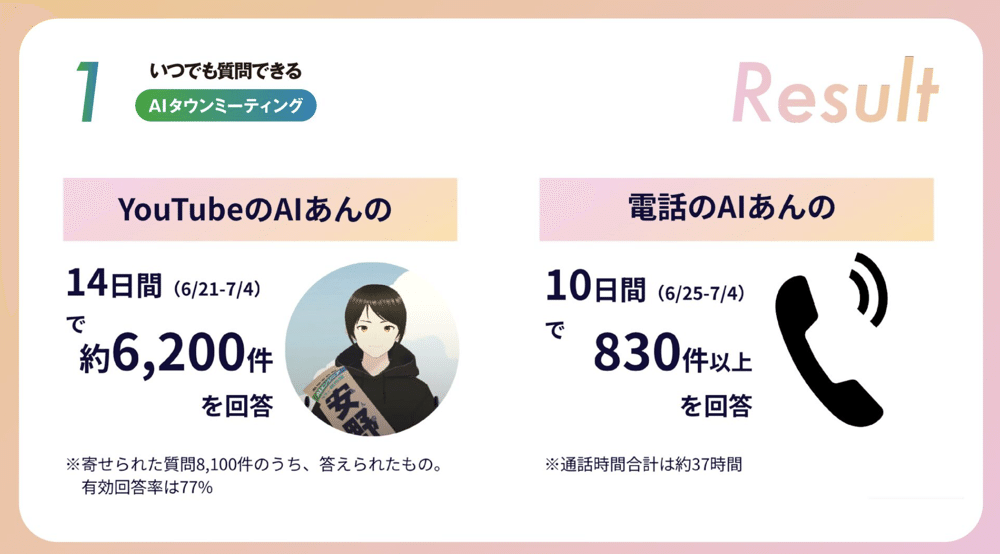
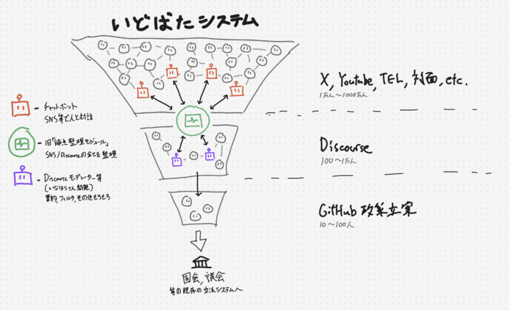
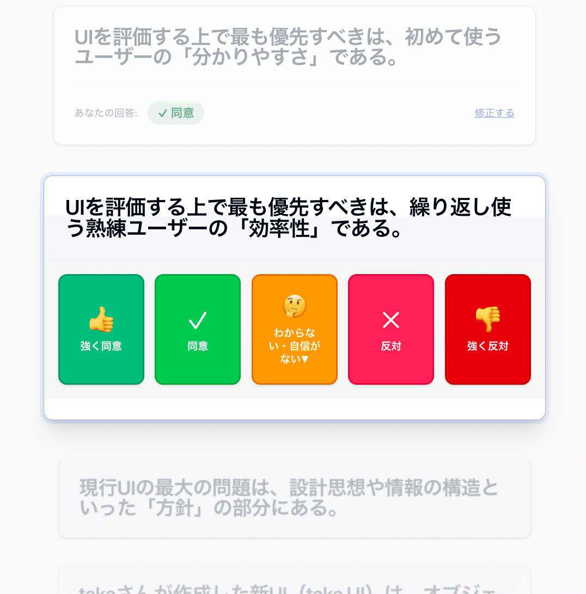
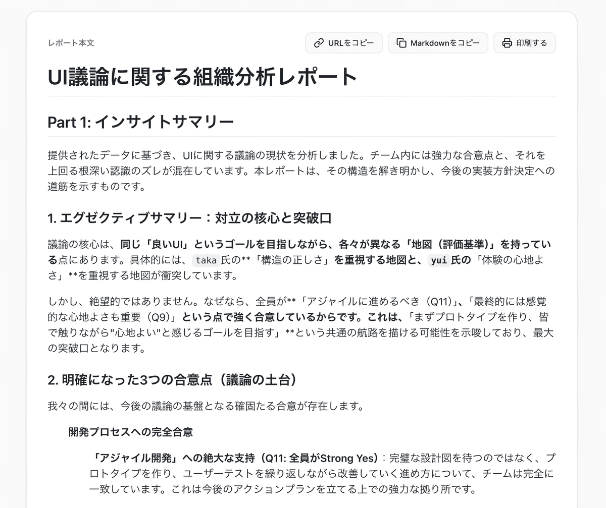

## 1万件の声を集めて気づいたこと

青山柊太朗（[合同会社多元現実](https://www.plural-reality.com/) 共同代表 / コロンビア大学 Computer Science & Political Science）

2024年7月、僕は安野貴博さんの都知事選を手伝っていた。エンジニアチームの一員として「AIあんの」の開発に関わり、YouTube Liveのチャットや電話で有権者の質問に24時間応答し続けるAIアバターを作った。

寄せられた質問は約8,100件、うち有効回答率は77%。一人の候補者が直接聞くことは物理的に不可能な量の声を、AIを介して受け止めた。手応えがあった。

都知事選の後、安野さんが「[チームみらい](https://team-mir.ai/)」を立ち上げ、2025年の参院選に挑むことになった。僕は[DD2030](https://github.com/digitaldemocracy2030)のコミュニティで「いどばた」という熟議プラットフォームの開発に携わった。コンセプトは「1億人、日本国民全員で議論できる仕組みを作ろう」というものだった。

さらに市民がチャットで政策への変更提案を出せる「しゃべれるマニフェスト」の仕組みづくりにも関わった。参院選期間の17日間で9,688件の変更提案が寄せられ、346件が実際にマニフェストに反映された。妊娠希望者のパートナー向け風しん抗体検査の助成追加、男性へのHPVワクチン公費助成の追加、障害児の「18歳の壁」対策の更新。市民の声が政策文書を書き換えていく。「声を届ける」仕組みとしては、確実に機能していた。

### 「声を届ける」のその先

でも、ある疑問がずっと残っていた。

9,688件の提案を集めた。1万件近い質問に答えた。それらが政治的意思決定の根幹にある利害調整の材料になったかと問われれば、正直に言えばなっていなかった。

「こういう声がありました」という分布図はできる。でも「じゃあどうするか」を決めるための材料にはなっていなかった。集まったものの多くは「断片的な立場表明」にとどまっていたからだ。一人ひとりが、自分は何を大事にしていて、何が譲れなくて、何になら妥協できるのかを十分に掘り下げないまま意見を出している。だから数千件集まっても、それぞれが「なんとなくこう思う」の域を出ない。

「声を届ける」と「意思決定に繋げる」の間に大きなギャップがある。そして「熟議を1億人にスケールアップさせよう」という発想だけでは、このギャップは埋まらなかった。

### たった3人の議論が動かなかった日

このことに気づいたきっかけは、意外にも自分たちの3人の会社の中にあった。

高木俊輔と西村惟と一緒に「[多元現実](https://www.plural-reality.com/)」を立ち上げた後のことだ。プロダクトの管理画面UIについて意見が割れた。一人は設計思想としての正しさを主張し、もう一人は初見ユーザーの体験を重視し、僕はプロトタイプ先行を考えていた。3人とも筋は通っているのに、議論が前に進まない。

観察して気づいたのは、そもそも全員が「自分が何を求めているのか」を言語化できていなかったことだった。同じ「方針」という言葉で、まったく違うレイヤーの話をしていた。「情報量が多い」という指摘にしても、ある人にとっては「不要な情報はない、全部必要だ」で、別の人にとっては「画面に出しすぎ」。対立の原因は意見の不一致ではなく、自己理解の不足だった。

試しに、自分たちが作っている「倍速会議」を自社の議論に使ってみた。AIが出す質問にそれぞれが答えていく。

すると面白いことが起きた。各自が自分の考えを言語化した段階で、論点の構造が見えたのだ。

全員が「アジャイルに進めるべき」「ファーストビューはシンプルにすべき」と思っていた。対立しているようで、土台は一致していた。一方で「わかりやすさと効率性のどちらを優先するか」ではきれいに割れた。この構造が見えた瞬間から、議論が動き始めた。この一点さえ決めれば、あとは合意の上に積んでいけるとわかったからだ。

合意形成の問題は、スケールじゃなかった。たった3人ですら、自分が何を望んでいるかを言語化できていなかった。

### 自己理解というボトルネック

コロンビア大学で「[人間と人間の間にAIを挟むことで対話の質がどう変わるか](https://arxiv.org/abs/2502.18201)」を研究してきた。その研究で扱っていたのは、まさにこの問題だった。

AIが人間の代わりに話すのではなく、AIとの対話を通じて自分の考えを掘り下げる。「なんとなく給食の質が気になる」という漠然とした感覚を、「無償化によるコスト圧縮が品質に影響しているのではないか。事実なら一部有償化してでも質を上げるべきだ」というところまで言語化する。ここまで来て初めて、他者との対話が成立する。

つまり、合意形成のパイプラインの最上流にあるのは「自己理解」だ。本人が自分の立場を理解し、言語化できない限り、その先の論点整理も、心理的安全性の向上も、第三の案の探索も、全部滞る。逆に、一人ひとりが「自分は何を大事にしていて、何が譲れなくて、何になら妥協できるのか」をある程度持てていれば、下流のプロセスは比較的スムーズに回る。

[ソニーコンピュータサイエンス研究所のCybernetic Humanityチーム](https://cybernetichumanity.com/)で研究しているテーマとも地続きだ。コンピューターによって人間の行動が拡張されたとき、どこまで「これは自分の行動だ」という主体感を保てるのか。AIが代わりに意見をまとめてくれるのは便利だが、それが自分の意見だという実感を失わせてしまっては意味がない。自己理解の支援と主体感の保持。この二つを両立させる設計が、この領域で一番大事な問いだと思っている。

### スケールアップからスケールアウトへ

だから僕たちの戦略は変わった。

「スケールアップ」は一度に大人数を巻き込むことだ。1億人の意見を集める、数万件の提案を処理する。いどばたやしゃべれるマニフェストが目指した方向はこちらだった。

「スケールアウト」は同じ品質の対話を、多くの現場で同時に発生させることだ。一人の名ファシリテーターに頼るのではなく、AIの支援によって、どの現場でも一定水準の議論ができる状態を作る。

太田市の自分ごと化会議でその手応えを得た。会議前にAIとの対話で自分の立場を掘り下げた参加者たちは、開始直後から共通認識を共有し、「事実か印象か」を問い合えるほどの深い議論に到達した。20人の住民が、知らない人同士で、初回からそこまでいけたのだ。太田市での取り組みの詳細は、11章「多元現実」で紹介している。

[多元現実](https://www.plural-reality.com/)を立ち上げたのは、この仮説を現場で検証し続けるためだ。DD2030やチームみらいで「声を届ける」仕組みを作ったことは、今の仕事の土台になっている。でも、届けた声を意思決定に繋げるには、一人ひとりの自己理解を支援するプロセスが不可欠だった。当事者としてブロードリスニングの現場に立ち続けたからこそ、見えてきたボトルネックだと思う。

僕はもともと「対立はなくならない」という前提に立っている。政治哲学者シャンタル・ムフの闘技民主主義に近い考え方だ。目指しているのは「正しい答えに辿り着くこと」ではなく、対立のコストを下げることだ。違いをそのままぶつけて、そこからより良い答えを引き出す。そのプロセスで、無駄に消耗しない。

一言でいえば「喧嘩がもう少し気楽にできる世界」を作りたい。そのために一番効く打ち手が、個人の自己理解だというのが、いまの僕の仮説だ。
