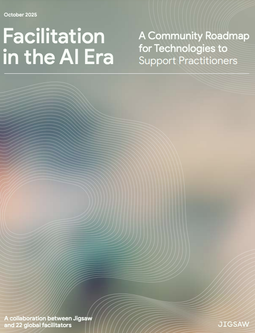

## AI時代のファシリテーション

Googleの技術インキュベーターである[Jigsaw（ジグソー）](https://jigsaw.google/)が、2025年に「[Facilitation in the AI Era（AI時代のファシリテーション）](https://services.google.com/fh/files/blogs/jigsaw_facilitation_in_the_ai_era.pdf)」と題するレポートを公開しました。

Jigsawは2011年にGoogle Ideasとして設立され、オープンな社会への脅威に対して技術で立ち向かうことを使命としています。検閲を回避するVPNツール「Outline」は月間3,000万人以上に利用され、DDoS攻撃から独立メディアを守る「Project Shield」、オンラインの有害コメントを検出する「Perspective API」は18言語で一日あたり約20億回利用されるなど、市民社会を支えるツールを数多く開発・公開してきました。

そのJigsawが近年、力を入れているのが「市民対話」と「AI」の交差点です。数千人、数万人の声をどうやって聴き、構造化し、意思決定に接続するか。この問いに正面から取り組んだのが本レポートであり、同時に公開されたオープンソースツール群です。

### レポートが示した5つの機会領域

「Facilitation in the AI Era」は、Jigsawの研究者が世界各地の22人のプロのファシリテーターと共同で作成したものです。単なる技術レポートではなく、現場で市民対話を進行してきたファシリテーターたちの声を丁寧に拾い上げた実践的な文書として設計されています。

レポートの核心にあるメッセージは明快です。AIはファシリテーターを「置き換える」ものではなく、人々のstructural agency（構造的主体性）を強化するものだということ。つまり、「自分の声が社会に届く」という実感を、より多くの人に届けるための技術としてAIを位置づけています。

レポートでは、ファシリテーションのプロセスを「会議前（BEFORE）」「会議中（DURING）」「会議後（AFTER）」の3段階に分け、AIが支援できる5つの機会領域が提示されました。

**会議前（BEFORE）**

1. **Scaled Access（スケーラブルなアクセス）**：多言語対応やターゲットに合わせたアウトリーチにより、より多様な参加者を対話に招き入れる
2. **Dynamic Learning（ダイナミックラーニング）**：マルチモーダルなツールを活用し、参加者がエビデンスを発見・学習できる環境を整える

**会議中（DURING）**

3. **Live Sensemaking（ライブセンスメーキング）**：対話のリアルタイム分析と可視化を行い、議論の構造を即座に把握する

**会議後（AFTER）**

4. **Futurecasting（フューチャーキャスティング）**：シナリオプランニングと外挿により、議論の結果を将来の計画に接続する
5. **Sensemaking For The People（市民のためのセンスメーキング）**：インタラクティブな公開分析とレポーティングで、結果を市民に還元する

いずれにも共通するのは、「AIがデータを整理し、人間が文脈の中で解釈する」という役割分担の原則です。AIは効率的にデータを分類・整理する一方、人間のファシリテーターが社会的・地理的な文脈の中でそのデータを解釈し、最終的な判断を下す。この分業こそが、レポート全体を貫く設計思想です。

### Sensemakerとオープンソースへのコミットメント

Jigsawは理念を語るだけではありません。それを実現するツールをオープンソースで公開しています。その代表が**Sensemaker**（センスメーカー）です。

Sensemakerは、大規模なオンライン対話を構造化・要約するためのツールキットで、Apache-2.0ライセンスのもとGitHubで公開されています（[github.com/Jigsaw-Code/sensemaking-tools](https://github.com/Jigsaw-Code/sensemaking-tools)）。[ドキュメントサイト](https://jigsaw-code.github.io/sensemaking-tools/)も整備されており、内部では3つの処理段階があります。

第一に、**トピックの抽出**です。大量の意見文から主要な論点を自動的に発見します。トップレベルのトピックだけを抽出することも、サブトピックやテーマまで掘り下げることもでき、分析の粒度は自由に設定できます。

第二に、**意見の分類**です。各意見文をトピックに振り分けます。一つの意見が複数のトピックにまたがる場合にも対応しており、意見の多面性を損なわない設計になっています。

第三に、**要約の生成**です。意見と投票データを分析し、合意が得られている領域と対立が残る領域を明示した要約レポートを出力します。投票数が少ない意見を過大評価しないよう、最低投票数によるフィルタリングも組み込まれています。

AIモデルはGoogle Geminiを中心に、Llama、Claudeなど複数のモデルに対応しており、独自モデルの組み込みも可能な拡張性を持っています。

Sensemakerの設計で特筆すべきは、市民対話プラットフォーム**Polis**との連携を前提としている点です。Polisで収集された意見と投票データをCSVでエクスポートし、Sensemakerに入力することで、数千件の意見を構造化された分析レポートに変換できます。Polisの共同創設者であるChris Smallは、Jigsawのソフトウェアエンジニアでもあり、両プロジェクトは人的にも技術的にも深くつながっています。

### ボーリンググリーン：7,890人のデジタルタウンホール

Jigsawのアプローチが大規模に実証されたのが、ケンタッキー州ボーリンググリーンで2025年に実施された「[BG 2050](https://report.whatcouldbgbe.com/)」プロジェクトです。

2050年までに人口20万人を超えると予測されるこの地域で、「What Could BG Be?（ボーリンググリーンはどうなれるか？）」をテーマに、33日間にわたるオンライン対話が実施されました。Polisを使って住民がアイデアを自由に投稿し、互いの提案に投票する仕組みです。

結果は目覚ましいものでした。**7,890人**の住民が参加し、**3,940件**の独自のアイデアが提出され、**100万票**を超える投票が行われました。Sensemakerがこれらを12のトピック、70のサブトピックに自動分類し、2,370件のアイデアが80%以上の合意率を記録しました。地域の戦略計画に通常関与するリーダーは100人程度でしたが、AIを活用することでその約80倍の住民を対話に巻き込むことに成功したのです。

各トピックを選択すると、個々のアイデアが合意率順にドットチャートで可視化され、AIが生成した要約が表示されます。以下は「Community Pride & Image（地域への誇りとイメージ）」トピックの例です。

さらに、合意が高いアイデアと低いアイデアが並べて表示され、住民の間で「何に合意できていて、何が分かれているのか」が一目でわかります。

従来であれば、これだけの意見を人間が整理するには数百時間を要していたでしょう。Sensemakerの導入により、平均28日分の作業工数が削減されたと報告されています。

しかし重要なのは、AIが分析を完了した後の工程です。地域のリーダーたちはSensemakerの出力を受け取り、ボーリンググリーン固有の社会的・地理的文脈の中で解釈しました。そして、テーマごとに10〜12人の実行チーム（pillar groups）を組成し、具体的な計画策定に移行しました。「AIがデータを整理し、人間が文脈の中で解釈する」というレポートの原則が、そのまま実践されたのです。

### ファシリテーションの民主化

従来のファシリテーションは「10人の会話を促進する技術」でした。優れたファシリテーターの技量に依存し、参加者が増えればスケールしないという宿命を持っていました。

AIは、この限界を突破します。Polisで意見を収集し、Sensemakerで構造化し、人間のファシリテーターが文脈を読んで意思決定に接続する。ボーリンググリーンの7,890人が示したのは、このワークフローが実際に機能するということです。

日本でも同様の実践が始まっています。合同会社多元現実は、JigsawのSensemakerを活用しながら、群馬県太田市の住民会議や京都府与謝野町の総合計画策定など、自治体の現場でAIファシリテーション支援を展開しています。詳しくは11章「多元現実」で紹介しています。

Jigsawの言葉を借りれば、それは「[誰もが自分を取り巻く世界に対して、より大きな主体性を持てる未来を築くこと](https://jigsaw.google/building-for-agency-ai-era/)（Building a future where everyone has more agency in the world around them）」です。AIがファシリテーションを変えるのではありません。AIが「聴く能力」を民主化するのです。
